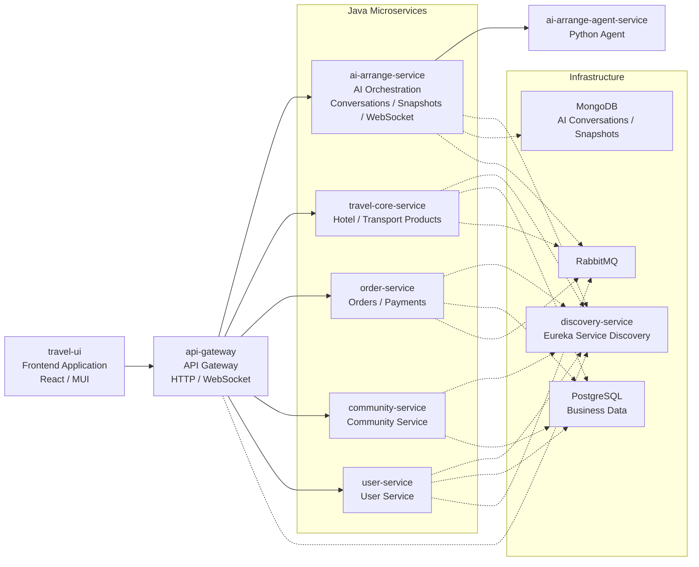

# TravelOn: A One-Stop Travel Platform Powered by Microservices

[简体中文](README.md) | **English**

To meet users’ growing demand for travel and vacation bookings, TravelOn needs to build a comprehensive travel platform that integrates flight bookings, hotel accommodations, vacation packages, and train ticket purchases. The platform offers a wide selection of travel products, intelligent itinerary planning tools, transparent pricing information, and a convenient booking process, covering the entire travel journey—from pre-trip planning to in-trip services to post-trip sharing.

## Demo Video

https://github.com/user-attachments/assets/ad9d7145-eee1-4f2c-bebe-2cd7702a3f3a

---

## Table of Contents

- [Overview](#overview)
- [Tech Stack](#tech-stack)
- [Project Structure](#project-structure)
- [Prerequisites](#prerequisites)
- [Toolchain Management (mise)](#toolchain-management-mise)
  - [Part 1 — Environment Setup](#part-1--environment-setup-one-time)
  - [Part 2 — Everyday Commands](#part-2--everyday-commands)
- [Environment Variables](#environment-variables)
- [Built-in Admin Accounts](#built-in-admin-accounts)
- [Quick Start](#quick-start)
- [Development Mode (Debug)](#development-mode-debug)
- [Production Mode (Build and Serve)](#production-mode-build-and-serve)
- [FAQ](#faq)

---

## Overview

This repository includes:

- Backend service: `travel-api`
- Frontend app: `travel-ui`

AI-related features are supported (API keys required), while community features can run independently.

---

## Tech Stack

Main technologies include Java, TypeScript, Python, PL/pgSQL, and Docker.

---

## Project Structure



```text
travel-on-2026NULLptr/
├─ travel-api/      # Backend services
└─ travel-ui/       # Frontend application
```

---

## Prerequisites

Only the following tools need to be installed manually:

```text
Git
Docker Desktop / Docker Engine (including Docker Compose V2)
mise
```

Java, Python, Node.js, and Yarn do not need to be installed beforehand. `mise install` downloads and pins Java 21, Python 3.12, and Node.js 22.22.3 from the repository configuration; Corepack provides Yarn 4.2.2 according to `travel-ui/package.json`. From the repository root:

```bash
mise trust
mise install
mise run doctor
```

`mise run doctor` checks:

```text
git --version
docker --version
docker compose version
Java 21 / Python 3.12 / Node.js 22.22.3 / Yarn 4.2.2
```

---

## Toolchain Management (mise)

The repository's [`mise.toml`](mise.toml) manages more than test tooling: it provides common entry points for development, builds, tests, and deployment while pinning Java 21, Python 3.12, and Node.js 22.22.3. `travel-ui/package.json` and Corepack pin Yarn 4.2.2. `tests/run_tests.py` validates those versions again and aborts on a mismatch. Install Docker separately; each module's `mvnw` pins Maven. The Agent and model-stub containers intentionally run Python 3.13.

### Part 1 — Environment Setup (one-time)

#### 1. Install mise

Windows:

```
winget install jdx.mise
```

macOS / Linux:

```
curl https://mise.run | sh
```

#### 2. Put mise on PATH

Open a new terminal first and verify (existing terminals cannot see a new PATH):

```powershell
Get-Command mise
```

If it is missing, add it through the GUI: `Win + R` → `sysdm.cpl` → Advanced → Environment Variables → user `Path` → New → directory of mise, then **reopen the terminal**.

#### 3. Trust and install

```bash
mise trust
mise install
```

#### 4. Install project dependencies

```bash
mise run setup        # Python + frontend dependencies
mise run setup:e2e    # add for e2e runs: Playwright Chromium
```

#### 5. Verify

```bash
mise run doctor
```

Prints the java / node / yarn / python / docker versions mise actually provides; check them against [Prerequisites](#prerequisites).

```bash
mise run verify
```

Runs the smallest single module (about 3 seconds) to confirm the whole chain works: preflight passes, the Maven wrapper executes, and reports are written to `artifacts/test-results/`. A trailing "全部通过" (all passed) means success.

### Part 2 — Everyday Commands

> If your IDE terminal activated the virtual environment automatically (the prompt shows `(.venv)`), run `deactivate` before the commands below. While it is active `VIRTUAL_ENV` is already set, so mise skips its own venv activation and resolves to the wrong interpreter.

`mise run <task>` injects this project's tool versions first; `mise tasks` lists them all:

#### 1. Frontend

| Task | Contents |
| --- | --- |
| `mise run setup:ui` | Install frontend dependencies |
| `mise run ui:dev` | Start the frontend development server with hot reload |
| `mise run ui:build` | Build the frontend production bundle |
| `mise run ui:serve` | Preview the built frontend bundle |

#### 2. Backend

| Task | Contents |
| --- | --- |
| `mise run build` | Build every Java module, check Agent Python sources, and build the frontend |
| `mise run services:up` | Start the backend using existing images |
| `mise run services:up_build` | Build images and start the backend |
| `mise run services:status` | Show backend service status |
| `mise run services:stop` | Stop the backend while retaining containers |
| `mise run services:down` | Stop and remove backend service containers |

#### 3. Tests

| Task | Contents | Services |
| --- | --- | --- |
| `mise run setup` | Install Python and frontend test dependencies | No |
| `mise run setup:py` | Install only the Python test dependencies | No |
| `mise run setup:e2e` | Install frontend dependencies and Playwright Chromium | No |
| `mise run test:pre` | Preflight guards: seed data, migration scripts, classpath resources, MQ and gateway config; about 20 seconds | No |
| `mise run test:unit` | Unit tests and the coverage gate, about 50 seconds | No |
| `mise run test:migration` | Cross-platform PostgreSQL legacy-database migration regression test | Throwaway PostgreSQL container |
| `mise run test:integration` | Java `*IT`, Agent integration, API tests; model calls use a deterministic stub; resilience cases run in their own pass | Yes |
| `mise run test:e2e` | Playwright, Chromium | Yes |
| `mise run test:ci` | The complete CI-equivalent automated test chain, stopping at the first failure | Yes |
| `mise run verify` | A single minimal module, to confirm the test chain works | No |
| `mise run doctor` | Check Git, Java, Node, Yarn, Python, Docker, and Compose versions | No |

#### 4. Deployment

| Task | Contents |
| --- | --- |
| `mise run deploy:images <tag>` | Verify that all K3s deployment images build |
| `mise run deploy:k3s <sha-* tag>` | Deploy built images on the deployment host |

#### Output and reports

Reports land in `artifacts/test-results/` (not committed):

| File/directory | Contents |
| --- | --- |
| `summary.json` | Machine-readable results, case counts, coverage and environment versions |
| `latest.md` | Summary table (per-task case counts plus per-module coverage) |
| `pre/` `unit/` `integration/` `e2e/` | JUnit, API request/response evidence, Playwright reports and failure screenshots/video/traces |
| `coverage/{java,java-it,python,ui}/` | Copies of the JaCoCo, pytest-cov and Jest coverage reports |

Playwright report: run `corepack yarn test:e2e:report` inside `travel-ui`.

---

## Environment Variables

Both `.env` files must be in place before starting either mode.

- `travel-api/.env`: not committed to the repository — create it locally.
- `travel-ui/.env`: **committed to the repository**, so it works right after cloning. See the note in the [Frontend](#frontend-travel-uienv) section below for why.

> Note: use `#` for comments in `.env`, not `;`.

### Backend: `travel-api/.env`

```env
AI_BASE_URL=https://api.deepseek.com
AI_CHAT_COMPLETIONS_PATH=/chat/completions
AI_API_KEY=
AI_MODEL=deepseek-v4-pro
AI_THINKING_TYPE=omit
AI_JSON_MODE=true
AI_TEMPERATURE=0.6
AI_MAX_TOKENS=12000
AI_MODEL_TIMEOUT_SECONDS=90
AI_SLOW_RESPONSE_WARNING_MS=60000
AMAP_API_KEY=
```

| Variable | Description |
| --- | --- |
| `AI_BASE_URL` | Base URL of the OpenAI-compatible model service |
| `AI_CHAT_COMPLETIONS_PATH` | Chat Completions path |
| `AI_API_KEY` | Model service API key, required for AI features |
| `AI_MODEL` | Model name to invoke |
| `AI_THINKING_TYPE` | Optional thinking parameter; use `omit` when unsupported |
| `AI_JSON_MODE` | Whether to send `response_format=json_object`; set to `false` when unsupported |
| `AI_TEMPERATURE` | Sampling temperature |
| `AI_MAX_TOKENS` | Maximum token count |
| `AI_MODEL_TIMEOUT_SECONDS` | Model request timeout in seconds |
| `AI_RETRY_COUNT` | Number of model request retries |
| `AI_RETRY_BACKOFF_SECONDS` | Retry backoff in seconds |
| `AI_SLOW_RESPONSE_WARNING_MS` | Slow response warning threshold in milliseconds |
| `AMAP_API_KEY` | AMap key for backend POI/route enrichment |

AI features require keys; leave them empty if you only need non-AI features such as the community pages.

### Backend port overrides (optional)

Every port in `docker-compose.yml` has a default. Override them in the same `.env` if a port is already taken:

| Variable | Default |
| --- | --- |
| `GATEWAY_HOST_PORT` | `58082` |
| `DISCOVERY_HOST_PORT` | `58010` |
| `POSTGRES_HOST_PORT` | `55432` |
| `RABBITMQ_HOST_PORT` | `55672` |
| `RABBITMQ_MANAGEMENT_HOST_PORT` | `55673` |
| `MONGO_HOST_PORT` | `57017` |
| `POSTGRES_USER` / `POSTGRES_PASSWORD` | `admin` / `admin` |

### Frontend: `travel-ui/.env`

```env
REACT_APP_API_HOSTNAME=localhost
PORT=53000
REACT_APP_API_PORT=58082
REACT_APP_AMAP_JS_API_KEY=
REACT_APP_AMAP_SECURITY_JS_CODE=
```

| Variable | Description |
| --- | --- |
| `REACT_APP_API_HOSTNAME` | Backend hostname (usually `localhost`) |
| `REACT_APP_API_PORT` | Backend gateway port (default `58082`, must match `GATEWAY_HOST_PORT`) |
| `PORT` | Dev server port (default `53000`, applies to `mise run ui:dev` only) |
| `REACT_APP_AMAP_JS_API_KEY` | AMap JS key for browser map rendering |
| `REACT_APP_AMAP_SECURITY_JS_CODE` | AMap JS security code |

> **Why the AMap key is committed to Git**
>
> Obtaining an AMap (Gaode) key requires real-name verification and application review, which is a slow process. To make the project easy to review and try out after cloning, `travel-ui/.env` — including `REACT_APP_AMAP_JS_API_KEY` and `REACT_APP_AMAP_SECURITY_JS_CODE` — is **committed to Git for now**, so the map works without applying for your own key.
>
> This is a deliberate convenience trade-off for testing, not a recommended practice:
>
> - The key is for this project's demo only; please do not use it elsewhere.
> - Its quota is shared across everyone who clones the repo. If the map fails to load or reports a quota error, apply for your own key and replace it.
> - Before any real deployment, remove `travel-ui/.env` from version control (add it to `.gitignore`) and rotate the key.

**Important:** `REACT_APP_*` variables are inlined at build time.

- In development mode, restart `mise run ui:dev` after editing `.env`.
- In production mode, you must re-run `mise run ui:build` after editing `.env` — restarting `mise run ui:serve` alone has no effect.

---

## Built-in Admin Accounts

The project ships with three admin accounts for demonstrating the back-office features. The addresses and plaintext passwords are listed in [`admin_account.txt`](admin_account.txt) at the repository root, and are written into the database on startup by `AdminAccountBootstrap` in user-service.

> **⚠️ These passwords are public in this repository, purely for course review and local testing**
>
> Like the AMap key above, this is a deliberate convenience trade-off so anyone can clone the repo, log in as an admin, and try the full feature set without extra setup. **It must never reach a real deployment.**
>
> When deploying it yourself:
>
> 1. Delete `admin_account.txt` from the repository root.
> 2. Edit the hardcoded `ADMIN_ACCOUNTS` list in `travel-api/user-service/src/main/java/org/microarchitecturovisco/userservice/bootstrap/AdminAccountBootstrap.java` and replace the addresses and passwords with your own strong credentials (reading them from environment variables is recommended).
> 3. Rebuild the user-service image and reset the database before starting.
>
> Note: **deleting `admin_account.txt` alone is not enough.** The same passwords are hardcoded in `AdminAccountBootstrap`, which **resets these three accounts back to the source values on every startup** — so even if you change a password through the UI, a restart will overwrite it. Editing the source is what actually takes effect.

---

## Quick Start

### 1) Clone the repository

```cmd
git clone <your-repository-url>
cd travel-on-2026NULLptr
```

### 2) Prepare environment variables

Create `travel-api/.env` and `travel-ui/.env` as described in [Environment Variables](#environment-variables).

### 3) Install project dependencies

```bash
mise trust
mise install
mise run setup
```

### 4) Build and start the backend

```bash
mise run services:up_build
mise run services:status
```

### 5) Pick a startup mode

- Everyday development with hot reload and debugging → [Development Mode (Debug)](#development-mode-debug)
- Demos, acceptance testing, production-like performance → [Production Mode (Build and Serve)](#production-mode-build-and-serve)

---

## Development Mode (Debug)

For everyday development: hot reload on save, source maps included, and TypeScript sources can be breakpointed directly in browser DevTools.

### Backend

```bash
mise run services:up
mise run services:stop
```

### Frontend (hot reload)

```bash
mise run ui:dev
# stop: Ctrl + C
```

URL:

```text
http://localhost:53000
```

### Debugging notes

- Frontend changes reload automatically; no restart needed.
- After editing `travel-ui/.env`, stop with `Ctrl + C` and run `mise run ui:dev` again.
- After changing backend code or `docker-compose.yml`, rebuild the images:

  ```bash
  mise run services:up_build
  ```

---

## Production Mode (Build and Serve)

For demos and acceptance testing: minified static assets served by a static file server, with no hot reload and no source maps, behaving close to a real deployment.

### 1) Build the frontend

```bash
mise run ui:build
```

Output goes to `travel-ui/build/`. The build bakes the current `REACT_APP_*` values into the bundle, so make sure `.env` is correct before building.

### 2) Serve the build

```bash
mise run ui:serve
```

This runs `serve -s build -l 53000`. The port is fixed at `53000` and does not read `PORT` from `.env`.

URL:

```text
http://localhost:53000
```

### 3) Backend

The backend runs in containers in both modes, with the same command:

```bash
mise run services:up_build
```

For a full deployment using prebuilt images (frontend container included), see `travel-api/docker-compose-deploy.yml`.

### Stop

Static server:

```cmd
Ctrl + C
```

Backend:

```bash
mise run services:stop
```

---

## FAQ

### Q1: Can I run it without AI keys?

**A:** Yes. Non-AI features (e.g., community pages) can run without AI keys; AI features require proper keys.

### Q2: What is the difference between `AMAP_API_KEY` and `REACT_APP_AMAP_JS_API_KEY`?

**A:**
- `AMAP_API_KEY`: used by backend services (POI/route enrichment)
- `REACT_APP_AMAP_JS_API_KEY`: used by frontend browser map rendering

### Q3: Do I need to restart after updating `.env`?

**A:**
- Frontend, development mode: restart `mise run ui:dev`
- Frontend, production mode: re-run `mise run ui:build`, then `mise run ui:serve`
- Backend: re-run `mise run services:up_build`

### Q4: Which mode should I use?

**A:** Use development mode while writing code (hot reload + breakpoints); use production mode for demos, acceptance testing, and realistic load performance.
