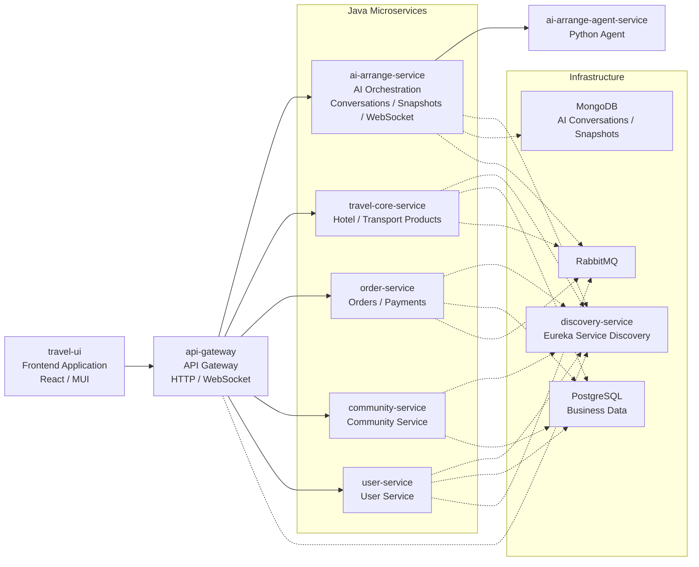

# TravelOn: A One-Stop Travel Platform Powered by Microservices

[简体中文](README.md) | **English**

To meet users’ growing demand for travel and vacation bookings, TravelOn needs to build a comprehensive travel platform that integrates flight bookings, hotel accommodations, vacation packages, and train ticket purchases. The platform offers a wide selection of travel products, intelligent itinerary planning tools, transparent pricing information, and a convenient booking process, covering the entire travel journey—from pre-trip planning to in-trip services to post-trip sharing.

## Demo Video

https://github.com/user-attachments/assets/ad9d7145-eee1-4f2c-bebe-2cd7702a3f3a

---

## Table of Contents

- [Overview](#overview)
- [Tech Stack](#tech-stack)
- [Project Structure](#project-structure)
- [Prerequisites](#prerequisites)
- [Environment Variables](#environment-variables)
- [Built-in Admin Accounts](#built-in-admin-accounts)
- [Quick Start](#quick-start)
- [Development Mode (Debug)](#development-mode-debug)
- [Production Mode (Build and Serve)](#production-mode-build-and-serve)
- [Toolchain Management (mise)](#toolchain-management-mise)
  - [Part 1 — Environment Setup](#part-1--environment-setup-one-time)
  - [Part 2 — Everyday Test Commands](#part-2--everyday-test-commands)
- [Runtime Extension of Flight and Train Ticket Dates](#runtime-extension-of-flight-and-train-ticket-dates)
- [Mode Comparison](#mode-comparison)
- [Troubleshooting](#troubleshooting)
- [FAQ](#faq)

---

## Overview

This repository includes:

- Backend service: `travel-api`
- Frontend app: `travel-ui`

AI-related features are supported (API keys required), while community features can run independently.

---

## Tech Stack

Main technologies include Java, TypeScript, Python, PL/pgSQL, and Docker.

---

## Project Structure



```text
travel-on-2026NULLptr/
├─ travel-api/      # Backend services
└─ travel-ui/       # Frontend application
```

---

## Prerequisites

Install the following tools first:

```text
Git
Docker Desktop / Docker Engine
Java 21
Python 3.12
Node.js 22.22.3
Yarn 4.2.2 (via Corepack)
```

Verify versions:

```cmd
git --version
docker --version
docker compose version
node --version
corepack --version
```

Enable Yarn (Corepack):

```cmd
corepack enable
```

> Note: the test scripts always use the `corepack yarn ...` subcommand form and do **not** depend on `corepack enable`. If that command fails with `EPERM` because it tries to write into a system-wide Node installation directory, you can skip it.

Using mise to install and pin the Java/Node.js/Python versions above is recommended; see [Toolchain Management (mise)](#toolchain-management-mise).

---

## Environment Variables

Both `.env` files must be in place before starting either mode.

- `travel-api/.env`: not committed to the repository — create it locally.
- `travel-ui/.env`: **committed to the repository**, so it works right after cloning. See the note in the [Frontend](#frontend-travel-uienv) section below for why.

> Note: use `#` for comments in `.env`, not `;`.

### Backend: `travel-api/.env`

```env
AI_BASE_URL=https://api.deepseek.com
AI_CHAT_COMPLETIONS_PATH=/chat/completions
AI_API_KEY=
AI_MODEL=deepseek-v4-pro
AI_THINKING_TYPE=omit
AI_JSON_MODE=true
AI_TEMPERATURE=0.6
AI_MAX_TOKENS=12000
AI_MODEL_TIMEOUT_SECONDS=90
AI_SLOW_RESPONSE_WARNING_MS=60000
AMAP_API_KEY=
```

| Variable | Description |
| --- | --- |
| `AI_BASE_URL` | Base URL of the OpenAI-compatible model service |
| `AI_CHAT_COMPLETIONS_PATH` | Chat Completions path |
| `AI_API_KEY` | Model service API key, required for AI features |
| `AI_MODEL` | Model name to invoke |
| `AI_THINKING_TYPE` | Optional thinking parameter; use `omit` when unsupported |
| `AI_JSON_MODE` | Whether to send `response_format=json_object`; set to `false` when unsupported |
| `AI_TEMPERATURE` | Sampling temperature |
| `AI_MAX_TOKENS` | Maximum token count |
| `AI_MODEL_TIMEOUT_SECONDS` | Model request timeout in seconds |
| `AI_RETRY_COUNT` | Number of model request retries |
| `AI_RETRY_BACKOFF_SECONDS` | Retry backoff in seconds |
| `AI_SLOW_RESPONSE_WARNING_MS` | Slow response warning threshold in milliseconds |
| `AMAP_API_KEY` | AMap key for backend POI/route enrichment |

AI features require keys; leave them empty if you only need non-AI features such as the community pages.

### Backend port overrides (optional)

Every port in `docker-compose.yml` has a default. Override them in the same `.env` if a port is already taken:

| Variable | Default |
| --- | --- |
| `GATEWAY_HOST_PORT` | `58082` |
| `DISCOVERY_HOST_PORT` | `58010` |
| `POSTGRES_HOST_PORT` | `55432` |
| `RABBITMQ_HOST_PORT` | `55672` |
| `RABBITMQ_MANAGEMENT_HOST_PORT` | `55673` |
| `MONGO_HOST_PORT` | `57017` |
| `POSTGRES_USER` / `POSTGRES_PASSWORD` | `admin` / `admin` |

### Frontend: `travel-ui/.env`

```env
REACT_APP_API_HOSTNAME=localhost
PORT=53000
REACT_APP_API_PORT=58082
REACT_APP_AMAP_JS_API_KEY=
REACT_APP_AMAP_SECURITY_JS_CODE=
```

| Variable | Description |
| --- | --- |
| `REACT_APP_API_HOSTNAME` | Backend hostname (usually `localhost`) |
| `REACT_APP_API_PORT` | Backend gateway port (default `58082`, must match `GATEWAY_HOST_PORT`) |
| `PORT` | Dev server port (default `53000`, applies to `yarn start` only) |
| `REACT_APP_AMAP_JS_API_KEY` | AMap JS key for browser map rendering |
| `REACT_APP_AMAP_SECURITY_JS_CODE` | AMap JS security code |

> **Why the AMap key is committed to Git**
>
> Obtaining an AMap (Gaode) key requires real-name verification and application review, which is a slow process. To make the project easy to review and try out after cloning, `travel-ui/.env` — including `REACT_APP_AMAP_JS_API_KEY` and `REACT_APP_AMAP_SECURITY_JS_CODE` — is **committed to Git for now**, so the map works without applying for your own key.
>
> This is a deliberate convenience trade-off for testing, not a recommended practice:
>
> - The key is for this project's demo only; please do not use it elsewhere.
> - Its quota is shared across everyone who clones the repo. If the map fails to load or reports a quota error, apply for your own key and replace it.
> - Before any real deployment, remove `travel-ui/.env` from version control (add it to `.gitignore`) and rotate the key.

**Important:** `REACT_APP_*` variables are inlined at build time.

- In development mode, restart `yarn start` after editing `.env`.
- In production mode, you must re-run `yarn build` after editing `.env` — restarting `yarn serve` alone has no effect.

---

## Built-in Admin Accounts

The project ships with three admin accounts for demonstrating the back-office features. The addresses and plaintext passwords are listed in [`admin_account.txt`](admin_account.txt) at the repository root, and are written into the database on startup by `AdminAccountBootstrap` in user-service.

> **⚠️ These passwords are public in this repository, purely for course review and local testing**
>
> Like the AMap key above, this is a deliberate convenience trade-off so anyone can clone the repo, log in as an admin, and try the full feature set without extra setup. **It must never reach a real deployment.**
>
> When deploying it yourself:
>
> 1. Delete `admin_account.txt` from the repository root.
> 2. Edit the hardcoded `ADMIN_ACCOUNTS` list in `travel-api/user-service/src/main/java/org/microarchitecturovisco/userservice/bootstrap/AdminAccountBootstrap.java` and replace the addresses and passwords with your own strong credentials (reading them from environment variables is recommended).
> 3. Rebuild the user-service image and reset the database before starting.
>
> Note: **deleting `admin_account.txt` alone is not enough.** The same passwords are hardcoded in `AdminAccountBootstrap`, which **resets these three accounts back to the source values on every startup** — so even if you change a password through the UI, a restart will overwrite it. Editing the source is what actually takes effect.

---

## Quick Start

### 1) Clone the repository

```cmd
git clone <your-repository-url>
cd travel-on-2026NULLptr
```

### 2) Prepare environment variables

Create `travel-api/.env` and `travel-ui/.env` as described in [Environment Variables](#environment-variables).

### 3) Start backend

```cmd
cd travel-api
docker compose up -d --build
docker compose ps
```

### Local cleanup after service consolidation

After the microservice consolidation, deleted services may still remain locally because
of previous Maven build output. After confirming that these directories contain no
personal files, run the following command from the repository root. It only removes
local leftovers and does not affect the current services in Git:

```powershell
Remove-Item -Recurse -Force `
  .\travel-api\offer-provider-service, `
  .\travel-api\hotel-service, `
  .\travel-api\transport-service, `
  .\travel-api\reservation-service, `
  .\travel-api\payment-service `
  -ErrorAction SilentlyContinue
```

Gateway URL:

```text
http://localhost:58082
```

> The first start initializes the database and imports seed data, which takes a while. Seeing postgres as `starting` in `docker compose ps` is expected — wait for it to turn `healthy`.

### 4) Install frontend dependencies

```cmd
cd ..\travel-ui
yarn install
```

### 5) Pick a startup mode

- Everyday development with hot reload and debugging → [Development Mode (Debug)](#development-mode-debug)
- Demos, acceptance testing, production-like performance → [Production Mode (Build and Serve)](#production-mode-build-and-serve)

---

## Development Mode (Debug)

For everyday development: hot reload on save, source maps included, and TypeScript sources can be breakpointed directly in browser DevTools.

### Backend

```cmd
cd travel-api

:: start
docker compose up -d

:: stop
docker compose stop
```

### Frontend (hot reload)

```cmd
cd travel-ui

:: start
yarn start

:: stop
Ctrl + C
```

URL:

```text
http://localhost:53000
```

### Debugging notes

- Frontend changes reload automatically; no restart needed.
- After editing `travel-ui/.env`, stop with `Ctrl + C` and run `yarn start` again.
- After changing backend code or `docker-compose.yml`, rebuild the images:

  ```cmd
  cd travel-api
  docker compose up -d --build
  ```

---

## Production Mode (Build and Serve)

For demos and acceptance testing: minified static assets served by a static file server, with no hot reload and no source maps, behaving close to a real deployment.

### 1) Build the frontend

```cmd
cd travel-ui
yarn build
```

Output goes to `travel-ui/build/`. The build bakes the current `REACT_APP_*` values into the bundle, so make sure `.env` is correct before building.

### 2) Serve the build

```cmd
yarn serve
```

This runs `serve -s build -l 53000`. The port is fixed at `53000` and does not read `PORT` from `.env`.

URL:

```text
http://localhost:53000
```

### 3) Backend

The backend runs in containers in both modes, with the same command:

```cmd
cd travel-api
docker compose up -d --build
```

For a full deployment using prebuilt images (frontend container included), see `travel-api/docker-compose-deploy.yml`.

### Stop

Static server:

```cmd
Ctrl + C
```

Backend:

```cmd
cd travel-api
docker compose stop
```

---

## Toolchain Management (mise)

`tests/run_tests.py` strictly validates Java 21, Python 3.12, Node.js 22.22.3, and Yarn 4.2.2, aborting on any mismatch. The repository's [`mise.toml`](mise.toml) pins those versions with [mise](https://mise.jdx.dev) and collapses the test commands into tasks. Install Docker yourself; Maven comes from each module's `mvnw`.

### Part 1 — Environment Setup (one-time)

| Requirement | `unit` | `integration` | `e2e` | `full` |
| --- | :-: | :-: | :-: | :-: |
| Toolchain (Java / Node / Yarn / Python) | ✓ | ✓ | ✓ | ✓ |
| Python test dependencies | ✓ | ✓ | ✓ | ✓ |
| Frontend dependencies | ✓ | — | ✓ | ✓ |
| Playwright browsers | — | — | ✓ | ✓ (all three) |
| Docker Compose V2 running | — | ✓ | ✓ | ✓ |
| Backend images built | — | ✓ | ✓ | ✓ |
| `travel-api/.env` | — | ✓ | ✓ | ✓ |
| `travel-ui/.env` | ✓ | — | ✓ | ✓ |
| Valid `AI_API_KEY` + admin credentials | — | — | — | ✓ |

`.env` fields are documented under [Environment Variables](#environment-variables).

#### 1. Install mise

Windows:

```
winget install jdx.mise
```

macOS / Linux: 

```
curl https://mise.run | sh
```

#### 2. Put mise on PATH

Open a new terminal first and verify (existing terminals cannot see a new PATH):

```powershell
Get-Command mise
```

If it is missing, add it through the GUI: `Win + R` → `sysdm.cpl` → Advanced → Environment Variables → user `Path` → New → `C:\Program Files\mise`, then **reopen the terminal**.

> Prefer the GUI for PATH edits on Windows. `setx PATH "...;%PATH%"` copies the system PATH into your user PATH and silently truncates past 1024 characters; `[Environment]::SetEnvironmentVariable` expands any `%USERPROFILE%` in the existing value and downgrades the registry type from `REG_EXPAND_SZ` to `REG_SZ`.

#### 3. Trust and install

```bash
mise trust
mise install
```

`mise.toml` contains executable content, so it needs a one-time trust recorded per absolute path; repeat it on another machine or clone directory. `mise install` downloads JDK 21 / Node 22.22.3 / Python 3.12 (about 485 MB into `%LOCALAPPDATA%\mise\installs`) and creates `.venv` at the repository root.

#### 4. Install test dependencies

```bash
mise run setup        # Python + frontend dependencies
mise run setup:e2e    # add for e2e runs: Playwright Chromium
```

`setup:py` / `setup:ui` run them separately. All three browsers: `mise exec -- corepack yarn --cwd travel-ui playwright install`.

#### 5. Verify

```bash
mise run doctor
```

Prints the java / node / yarn / python / docker versions mise actually provides; check them against [Prerequisites](#prerequisites).

```bash
mise run verify
```

Runs the smallest single module (about 3 seconds) to confirm the whole chain works: preflight passes, the Maven wrapper executes, and reports are written to `artifacts/test-results/`. A trailing "全部通过" (all passed) means success.

### Part 2 — Everyday Test Commands

#### mise tasks

> If your IDE terminal activated the virtual environment automatically (the prompt shows `(.venv)`), run `deactivate` before the commands below. While it is active `VIRTUAL_ENV` is already set, so mise skips its own venv activation and resolves to the wrong interpreter.

`mise run <task>` injects this project's tool versions first; `mise tasks` lists them all:

| Task | Contents | Services |
| --- | --- | --- |
| `mise run test:unit` | All unit tests and coverage, about a minute | No |
| `mise run test:integration` | Java `*IT`, Agent integration, API tests; skips real DeepSeek and community downtime | Yes |
| `mise run test:e2e` | Playwright, Chromium | Yes |
| `mise run test:all` | `unit + integration + Chromium E2E` | Yes |
| `mise run test:full` | `all` plus the configured model, WebSocket, community stop/recovery, and three-browser E2E; needs a valid `AI_API_KEY` and admin credentials | Yes |
| `mise run verify` | A single minimal module, to confirm the chain works | No |
| `mise run doctor` | Prints java/node/yarn/python/docker versions | No |

Tasks that need services run `docker compose up -d --build`, poll the Gateway until ready, and on exit stop only what they started, leaving your existing containers alone.

For per-module filtering, skipping the image build, custom URLs and ports, or running a single module outside the runner, see [tests/README.md](tests/README.md).

#### Output and reports

The runner shows preflight, progress, and a summary; subprocess output goes only to log files. Failures are highlighted with their log path. Reports land in `artifacts/test-results/` (not committed):

| File/directory | Contents |
| --- | --- |
| `summary.json` | Machine-readable results and environment versions |
| `latest.md` | Summary table |
| `unit/` `integration/` `e2e/` | JUnit, coverage, API request/response evidence, Playwright reports and failure screenshots/video/traces |

Playwright report: run `corepack yarn test:e2e:report` inside `travel-ui`.

### Troubleshooting

| Symptom | Fix |
| --- | --- |
| `mise` not recognized | The terminal predates the PATH change; reopen it |
| `mise WARN ... is not trusted` | Run `mise trust`; repeat after `mise.toml` changes |
| Repeated `mise-shim.exe not found` | `mise settings set windows_shim_mode file` |
| `chpwd functionality requires PowerShell 7` | PowerShell 5.1 has no directory-change event; behaviour is unaffected, silence with `$env:MISE_PWSH_CHPWD_WARNING=0` |
| `EPERM ... C:\Program Files\nodejs\` installing Node | `corepack enable` cannot write the system directory; this project does not need it |
| Preflight version mismatch | mise is not in effect; check with `mise run doctor` |
| pytest / httpx missing | `mise run setup:py`. Do not install into mise's global interpreter (`installs\python\...`) — `.venv` does not inherit from it |
| `docker compose` fails mentioning `auth.docker.io` | Docker Hub unreachable; configure a mirror or use `--no-build` |
| Results contradict the source | Usually `--no-build` on stale images; drop it and rebuild |
| Timeout waiting for the Gateway | `docker compose -f travel-api/docker-compose.yml logs` |
| `full` reports missing admin credentials | Set `ADMIN_EMAIL` / `ADMIN_PASSWORD` or confirm `admin_account.txt` exists |
| `.venv` suddenly cannot find the standard library | Its base interpreter is gone; delete `.venv` and rerun `mise run setup:py` (close anything holding it first) |

mise is optional: install the same versions manually per [Prerequisites](#prerequisites); the underlying commands are documented in [tests/README.md](tests/README.md).

---

## Runtime Extension of Flight and Train Ticket Dates

The dated ticket data is generated by
`travel-api/scripts/generate_dated_ticket_offers.py` from these templates:

- `travel-api/seed-data/transport/train/ticket_offers.csv`
- `travel-api/seed-data/transport/plane/ticket_offers.csv`

The files actually imported into PostgreSQL are the corresponding
`generated_ticket_offers.csv` files. To extend the ticket dates to
**2026-10-15**, for example:

1. Edit `travel-api/scripts/generate_dated_ticket_offers.py`:

   ```python
   END_DATE = datetime(2026, 10, 15)
   ```

2. Regenerate the flight and train data:

   ```powershell
   cd .\travel-api\scripts
   python .\generate_dated_ticket_offers.py
   cd ..
   ```

3. If Docker Compose is already running, import the data into the existing
   transport database:

   ```powershell
   docker compose exec -T postgres psql -U admin -d travel_core_db -f /database/seed/transport_seed.sql
   docker compose restart travel-core
   ```

   Replace `admin` or `travel_core_db` if they were changed in `.env`. The seed
   script uses deterministic IDs and `ON CONFLICT (id) DO NOTHING`, preserving
   existing data while adding the new dates.

`docker compose up -d --build` only rebuilds the images. If
`travel-api/data/postgres` already contains a database, it does not
automatically regenerate or re-import the ticket CSV files; database
initialization scripts run automatically only when that directory is empty.
After changing the CSV files, explicitly run the `psql` import command above.

To verify the imported date range:

```powershell
cd .\travel-api
docker compose exec postgres psql -U admin -d travel_core_db -c "SELECT type, MIN(departure_date_time), MAX(departure_date_time), COUNT(*) FROM ticket_offer_templates GROUP BY type;"
```

An overnight train departing on October 15 and arriving on October 16 is
expected.

---

## Mode Comparison

| | Development (Debug) | Production (Build and Serve) |
| --- | --- | --- |
| Frontend command | `yarn start` | `yarn build` + `yarn serve` |
| Hot reload | Yes | No |
| Source maps / breakpoints | Yes | No |
| Minification | No | Yes |
| Port | `PORT` from `.env` (default `53000`) | Fixed `53000` |
| After editing `.env` | Restart `yarn start` | Re-run `yarn build` |
| Use case | Everyday development | Demos, acceptance, performance checks |

---

## Troubleshooting

### 1) Docker services failed to start

```cmd
docker compose ps
docker compose logs
```

Ensure Docker is running and ports are not occupied. Port clashes can be resolved via [Backend port overrides](#backend-port-overrides-optional).

### 2) Frontend cannot reach backend

Check:

- `REACT_APP_API_HOSTNAME`
- `REACT_APP_API_PORT` matches the backend gateway port
- Backend container status (`docker compose ps` in `travel-api`)

In production mode, confirm you re-ran `yarn build` after editing `.env`.

### 3) Map is not displayed

Check frontend AMap variables:

- `REACT_APP_AMAP_JS_API_KEY`
- `REACT_APP_AMAP_SECURITY_JS_CODE`

### 4) AI features unavailable

Check backend AI variables:

- `AI_API_KEY`
- `AI_MODEL`

Restart backend services after `.env` updates.

---

## FAQ

### Q1: Can I run it without AI keys?

**A:** Yes. Non-AI features (e.g., community pages) can run without AI keys; AI features require proper keys.

### Q2: What is the difference between `AMAP_API_KEY` and `REACT_APP_AMAP_JS_API_KEY`?

**A:**
- `AMAP_API_KEY`: used by backend services (POI/route enrichment)
- `REACT_APP_AMAP_JS_API_KEY`: used by frontend browser map rendering

### Q3: Do I need to restart after updating `.env`?

**A:**
- Frontend, development mode: restart `yarn start`
- Frontend, production mode: re-run `yarn build`, then `yarn serve`
- Backend: re-run `docker compose up -d --build`

### Q4: Which mode should I use?

**A:** Use development mode while writing code (hot reload + breakpoints); use production mode for demos, acceptance testing, and realistic load performance. See [Mode Comparison](#mode-comparison).
