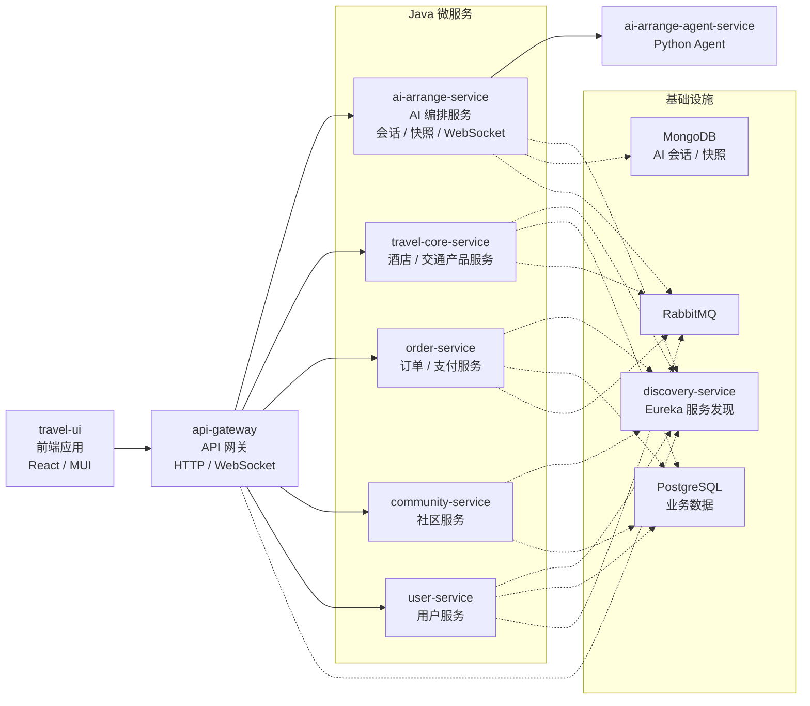

# TravelOn：微服务驱动的一站式旅游平台

**简体中文** | [English](README.en.md)

为满足用户日益增长的出行与旅游预订需求，TravelOn 需要建设一款集机票预订、酒店住宿、旅游度假、火车票购买于一体的综合出行旅游平台。平台提供丰富的出行产品选择、智能的行程规划工具、透明的价格信息与便捷的预订流程，覆盖用户“行前规划 - 行中服务 - 行后分享”的全旅程场景。

## 演示视频

https://github.com/user-attachments/assets/ad9d7145-eee1-4f2c-bebe-2cd7702a3f3a

---

## 目录

- [项目简介](#项目简介)
- [技术栈](#技术栈)
- [项目结构](#项目结构)
- [环境要求](#环境要求)
- [环境变量配置](#环境变量配置)
- [内置管理员账号](#内置管理员账号)
- [快速开始](#快速开始)
- [开发模式 Debug](#开发模式-debug)
- [生产模式 Build 与 Serve](#生产模式-build-与-serve)
- [工具链管理（mise）](#工具链管理mise)
  - [一、环境配置（一次性）](#一环境配置一次性)
  - [二、日常测试命令](#二日常测试命令)
- [运行时扩展机票和火车票日期](#运行时扩展机票和火车票日期)
- [两种模式对比](#两种模式对比)
- [常见问题排查](#常见问题排查)
- [FAQ](#faq)

---

## 项目简介

本仓库包含：

- 后端服务：`travel-api`
- 前端应用：`travel-ui`

项目支持 AI 相关功能（需配置 Key），社区功能可独立运行。

---

## 技术栈

主要语言与技术包括 Java、TypeScript、Python、PL/pgSQL、Docker。

---

## 项目结构



```text
travel-on-2026NULLptr/
├─ travel-api/      # 后端服务
└─ travel-ui/       # 前端应用
```

---

## 环境要求

请先安装以下工具：

```text
Git
Docker Desktop / Docker Engine
Java 21
Python 3.12
Node.js 22.22.3
Yarn 4.2.2（通过 Corepack）
```

检查版本：

```cmd
git --version
docker --version
docker compose version
node --version
corepack --version
```

启用 Yarn（Corepack）：

```cmd
corepack enable
```

> 提示：本项目的测试脚本一律使用 `corepack yarn ...` 子命令形式，**不依赖** `corepack enable`。若该命令因写入系统 Node 安装目录而报 `EPERM`，可直接跳过。

推荐使用 mise 自动安装并锁定上述 Java/Node.js/Python 版本，见[工具链管理（mise）](#工具链管理mise)。

---

## 环境变量配置

启动任何模式之前，都需要先准备好两个 `.env` 文件。

- `travel-api/.env`：不会提交到仓库，请在本地自行创建。
- `travel-ui/.env`：**已随仓库同步**，克隆后即可直接使用，原因见下方[前端](#前端travel-uienv)一节的说明。

> 注意：`.env` 的注释请使用 `#`，不要用 `;`。

### 后端：`travel-api/.env`

```env
DEEPSEEK_API_KEY=
AMAP_API_KEY=
DEEPSEEK_MODEL=
DEEPSEEK_FLASH_MODEL=deepseek-v4-flash
DEEPSEEK_PRO_MODEL=deepseek-v4-pro
DEEPSEEK_THINKING_TYPE=disabled
DEEPSEEK_MAX_TOKENS=12000
DEEPSEEK_SLOW_RESPONSE_WARNING_MS=60000
```

| 变量 | 说明 |
| --- | --- |
| `DEEPSEEK_API_KEY` | DeepSeek API Key，AI 功能必填 |
| `AMAP_API_KEY` | 后端 POI / 路线增强使用的高德 Key |
| `DEEPSEEK_MODEL` | 默认模型（可选） |
| `DEEPSEEK_FLASH_MODEL` | Flash 模型名，AI 规划页默认使用 |
| `DEEPSEEK_PRO_MODEL` | Pro 模型名，可在页面中切换 |
| `DEEPSEEK_THINKING_TYPE` | 思考模式开关 |
| `DEEPSEEK_MAX_TOKENS` | 最大 token 数 |
| `DEEPSEEK_SLOW_RESPONSE_WARNING_MS` | 慢响应告警阈值（毫秒） |

AI 功能需要配置 Key；只跑社区等非 AI 功能时可以留空。

### 后端端口覆盖（可选）

`docker-compose.yml` 中的端口都有默认值，端口冲突时可在同一个 `.env` 里覆盖：

| 变量 | 默认值 |
| --- | --- |
| `GATEWAY_HOST_PORT` | `58082` |
| `DISCOVERY_HOST_PORT` | `58010` |
| `POSTGRES_HOST_PORT` | `55432` |
| `RABBITMQ_HOST_PORT` | `55672` |
| `RABBITMQ_MANAGEMENT_HOST_PORT` | `55673` |
| `MONGO_HOST_PORT` | `57017` |
| `POSTGRES_USER` / `POSTGRES_PASSWORD` | `admin` / `admin` |

### 前端：`travel-ui/.env`

```env
REACT_APP_API_HOSTNAME=localhost
PORT=53000
REACT_APP_API_PORT=58082
REACT_APP_AMAP_JS_API_KEY=
REACT_APP_AMAP_SECURITY_JS_CODE=
```

| 变量 | 说明 |
| --- | --- |
| `REACT_APP_API_HOSTNAME` | 后端主机名（通常 `localhost`） |
| `REACT_APP_API_PORT` | 后端网关端口（默认 `58082`，需与 `GATEWAY_HOST_PORT` 一致） |
| `PORT` | 开发服务器端口（默认 `53000`，仅对 `yarn start` 生效） |
| `REACT_APP_AMAP_JS_API_KEY` | 浏览器端地图渲染 Key |
| `REACT_APP_AMAP_SECURITY_JS_CODE` | 高德 JS 安全码 |

> **关于高德 Key 随仓库同步的说明**
>
> 高德开放平台的 Key 申请需要实名认证与应用审核，流程较为繁琐。为了方便课程评审与他人克隆后直接试用，`travel-ui/.env`（含 `REACT_APP_AMAP_JS_API_KEY` 与 `REACT_APP_AMAP_SECURITY_JS_CODE`）**暂时随 Git 一起同步**，无需自行申请即可看到地图效果。
>
> 这是为便于测试而做的临时取舍，并非推荐做法：
>
> - 该 Key 仅供本项目演示使用，请勿用于其他用途；
> - 配额由本项目共享，如遇地图加载失败或提示超限，请自行申请 Key 后替换；
> - 正式部署前应将 `travel-ui/.env` 移出版本库（加入 `.gitignore`）并轮换 Key。

**重要：** `REACT_APP_*` 变量是编译期注入的。

- 开发模式下改完 `.env` 需要重启 `yarn start`；
- 生产模式下改完 `.env` 必须重新 `yarn build`，只重启 `yarn serve` 不会生效。

---

## 内置管理员账号

项目内置了三个管理员账号，用于演示后台管理相关功能。账号与明文口令记录在仓库根目录的 [`admin_account.txt`](admin_account.txt) 中，并在 user-service 启动时由 `AdminAccountBootstrap` 自动写入数据库。

> **⚠️ 这些口令随仓库公开，仅为方便课程评审与本地试用**
>
> 与高德 Key 同理，这是为了让任何人克隆后无需额外配置即可登录管理员、体验完整功能而做的临时取舍，**绝不能带到真实部署中**。
>
> 自行部署时请务必：
>
> 1. 删除仓库根目录的 `admin_account.txt`；
> 2. 修改 `travel-api/user-service/src/main/java/org/microarchitecturovisco/userservice/bootstrap/AdminAccountBootstrap.java` 中 `ADMIN_ACCOUNTS` 里硬编码的邮箱与口令（建议改为从环境变量读取），换成自己的强口令；
> 3. 重新构建 user-service 镜像并重置数据库后再启动。
>
> 注意：**只删 `admin_account.txt` 是不够的**。口令同时硬编码在 `AdminAccountBootstrap` 里，且每次服务启动都会强制把这三个账号的口令**重置回源码中的值**——即使你在页面上改过密码，重启后也会被覆盖。必须改源码才真正生效。

---

## 快速开始

### 1) 拉取项目

```cmd
git clone <你的仓库地址>
cd travel-on-2026NULLptr
```

### 2) 准备环境变量

按 [环境变量配置](#环境变量配置) 创建 `travel-api/.env` 与 `travel-ui/.env`。

### 3) 启动后端

```cmd
cd travel-api
docker compose up -d --build
docker compose ps
```

网关地址：

```text
http://localhost:58082
```

> 首次启动会初始化数据库并导入种子数据，耗时较长，`docker compose ps` 中 postgres 显示 `starting` 属于正常现象，等待其变为 `healthy` 即可。

### 4) 安装前端依赖

```cmd
cd ..\travel-ui
yarn install
```

### 5) 选择启动方式

- 日常开发、需要热更新与调试 → [开发模式 Debug](#开发模式-debug)
- 演示、验收、性能接近线上 → [生产模式 Build 与 Serve](#生产模式-build-与-serve)

---

## 开发模式 Debug

用于日常开发：代码保存即热更新，带 source map，可在浏览器 DevTools 中直接断点调试 TypeScript 源码。

### 后端

```cmd
cd travel-api

:: 启动
docker compose up -d

:: 关闭
docker compose stop
```

### 前端（热更新）

```cmd
cd travel-ui

:: 启动
yarn start

:: 停止
Ctrl + C
```

访问地址：

```text
http://localhost:53000
```

### 调试要点

- 前端源码修改后自动刷新，无需重启。
- 修改 `travel-ui/.env` 后必须 `Ctrl + C` 停止再重新 `yarn start`。
- 修改后端代码或 `docker-compose.yml` 后需要重建镜像：

  ```cmd
  cd travel-api
  docker compose up -d --build
  ```

---

## 生产模式 Build 与 Serve

用于演示与验收：产出压缩后的静态资源，由静态服务器托管，无热更新、无 source map，运行表现接近线上。

### 1) 构建前端

```cmd
cd travel-ui
yarn build
```

产物输出到 `travel-ui/build/`。构建会把当前 `.env` 中的 `REACT_APP_*` 值写死进产物，因此请确认 `.env` 已经配置正确再构建。

### 2) 启动静态服务

```cmd
yarn serve
```

等价于 `serve -s build -l 53000`，端口固定为 `53000`，不读取 `.env` 中的 `PORT`。

访问地址：

```text
http://localhost:53000
```

### 3) 后端

后端在两种模式下都以容器方式运行，命令相同：

```cmd
cd travel-api
docker compose up -d --build
```

若要使用预构建镜像整体部署（含前端容器），可参考 `travel-api/docker-compose-deploy.yml`。

### 停止

静态服务：

```cmd
Ctrl + C
```

后端：

```cmd
cd travel-api
docker compose stop
```

---

## 工具链管理（mise）

`tests/run_tests.py` 会校验 Java 21、Python 3.12、Node.js 22.22.3、Yarn 4.2.2，不符即报错退出。仓库根目录的 [`mise.toml`](mise.toml) 用 [mise](https://mise.jdx.dev) 锁定这些版本，Docker 需自行安装，Maven 由各模块的 `mvnw` 提供。

### 一、环境配置（一次性）

| 配置项 | `unit` | `integration` | `e2e` | `full` |
| --- | :-: | :-: | :-: | :-: |
| 工具链（Java / Node / Yarn / Python） | ✓ | ✓ | ✓ | ✓ |
| Python 测试依赖 | ✓ | ✓ | ✓ | ✓ |
| 前端依赖 | ✓ | — | ✓ | ✓ |
| Playwright 浏览器 | — | — | ✓ | ✓（三浏览器） |
| Docker Compose V2 运行中 | — | ✓ | ✓ | ✓ |
| 后端镜像已构建 | — | ✓ | ✓ | ✓ |
| `travel-api/.env` | — | ✓ | ✓ | ✓ |
| `travel-ui/.env` | ✓ | — | ✓ | ✓ |
| 有效 `DEEPSEEK_API_KEY` + 管理员凭据 | — | — | — | ✓ |

`.env` 字段见[环境变量配置](#环境变量配置)。

#### 1. 安装 mise

Windows:

```
winget install jdx.mise
```

macOS / Linux: 

```
curl https://mise.run | sh
```

#### 2. 加入 PATH

先新开一个终端验证（已打开的终端读不到新 PATH）：

```powershell
Get-Command mise
```

找不到则手动加入用户级 PATH：`Win + R` → `sysdm.cpl` → 高级 → 环境变量 → 用户变量 `Path` → 新建 → 填入 `C:\Program Files\mise`，然后**重开终端**。

> Windows 上改 PATH 建议用图形界面。`setx PATH "...;%PATH%"` 会把系统 PATH 复制进用户 PATH，且超过 1024 字符静默截断；`[Environment]::SetEnvironmentVariable` 会展开原值里的 `%USERPROFILE%` 并把注册表类型从 `REG_EXPAND_SZ` 降级为 `REG_SZ`。

#### 3. 授信并安装

```bash
mise trust
mise install
```

`mise.toml` 含可执行内容，需按绝对路径授信一次；换机器或换目录要重做。`mise install` 下载 JDK 21 / Node 22.22.3 / Python 3.12（约 485 MB，装到 `%LOCALAPPDATA%\mise\installs`），并在仓库根目录创建 `.venv`。

#### 4. 安装测试依赖

```bash
mise run setup        # Python + 前端依赖
mise run setup:e2e    # 跑 e2e 时追加：Playwright Chromium
```

可拆分执行 `setup:py` / `setup:ui`。三浏览器：`mise exec -- corepack yarn --cwd travel-ui playwright install`。

#### 5. 验证

```bash
mise run doctor
```

打印 mise 实际提供的 java / node / yarn / python / docker 版本，与[环境要求](#环境要求)逐条核对。

```bash
mise run verify
```

跑单个最小模块（约 3 秒），确认整条链路可用：预检通过 → Maven wrapper 能执行 → 报告写入 `artifacts/test-results/`。输出末尾为「结果：全部通过」即成功。

### 二、日常测试命令

#### mise 任务

> 若 IDE 终端自动激活了虚拟环境（提示符带 `(.venv)`），先执行 `deactivate` 退出再跑下面的命令。已激活状态下 `VIRTUAL_ENV` 已被预设，mise 会跳过自身的 venv 激活，导致解析到错误的解释器。

`mise run <任务>` 执行前自动注入本项目的工具版本，`mise tasks` 列出全部：

| 任务 | 内容 | 需要服务 |
| --- | --- | --- |
| `mise run test:unit` | 全部单元测试与覆盖率，约 1 分钟 | 否 |
| `mise run test:integration` | Java `*IT`、Agent 集成、API 测试；跳过真实 DeepSeek 与社区停机 | 是 |
| `mise run test:e2e` | Playwright，Chromium | 是 |
| `mise run test:all` | `unit + integration + Chromium E2E` | 是 |
| `mise run test:full` | `all` 之外追加真实 DeepSeek、WebSocket、社区停机恢复、三浏览器 E2E；需有效 `DEEPSEEK_API_KEY` 与管理员凭据 | 是 |
| `mise run verify` | 单个最小模块，确认链路可用 | 否 |
| `mise run doctor` | 打印 java/node/yarn/python/docker 版本 | 否 |

带服务的任务会自动执行 `docker compose up -d --build`，轮询 Gateway 直到就绪，结束时只停止本次新启动的服务，不影响你原有的容器。

需要按模块筛选、跳过镜像构建、自定义地址端口，或想绕过运行器单独调试某个模块时，见 [tests/README.md](tests/README.md)。

#### 输出与报告

运行器显示预检、进度条和汇总，子进程输出只写日志文件。失败项标红并附日志路径。报告位于 `artifacts/test-results/`（不入库）：

| 文件/目录 | 内容 |
| --- | --- |
| `summary.json` | 机器可读结果与环境版本 |
| `latest.md` | 汇总表格 |
| `unit/` `integration/` `e2e/` | JUnit、覆盖率、API 请求响应证据、Playwright 报告与失败截图/视频/trace |

Playwright 报告：在 `travel-ui` 执行 `corepack yarn test:e2e:report`。

### 常见问题与排错

| 现象 | 处理 |
| --- | --- |
| 找不到 `mise` 命令 | 终端早于 PATH 配置打开，重开终端 |
| `mise WARN ... is not trusted` | 执行 `mise trust`；`mise.toml` 改动后需重做 |
| `mise-shim.exe not found` 刷屏 | `mise settings set windows_shim_mode file` |
| `chpwd functionality requires PowerShell 7` | PowerShell 5.1 无目录切换事件，功能不受影响；设 `$env:MISE_PWSH_CHPWD_WARNING=0` 可消除 |
| 装 Node 报 `EPERM ... C:\Program Files\nodejs\` | `corepack enable` 写系统目录失败，本项目不需要该步骤，可忽略 |
| 预检报版本不符 | mise 未生效，`mise run doctor` 核对 |
| 缺少 pytest / httpx | `mise run setup:py`。注意别把包装进 mise 全局解释器（`installs\python\...`），`.venv` 不会继承它 |
| `docker compose` 失败并提示 `auth.docker.io` | Docker Hub 不可达，配置加速器或本轮用 `--no-build` |
| 测试结果与源码不符 | 多半是 `--no-build` 跑在旧镜像上，去掉重建 |
| 等待 Gateway 超时 | `docker compose -f travel-api/docker-compose.yml logs` 查看具体服务 |
| `full` 报缺少管理员凭据 | 设 `ADMIN_EMAIL` / `ADMIN_PASSWORD` 或确认 `admin_account.txt` 存在 |
| `.venv` 突然找不到标准库 | 基础解释器已被移除；删除 `.venv` 后重跑 `mise run setup:py`（先关闭占用进程） |

不用 mise 也可以：按[环境要求](#环境要求)手动装同版本工具，底层命令见 [tests/README.md](tests/README.md)。

---

## 运行时扩展机票和火车票日期

当前日期票务数据由 `travel-api/scripts/generate_dated_ticket_offers.py`
根据以下模板生成：

- `travel-api/seed-data/transport/train/ticket_offers.csv`
- `travel-api/seed-data/transport/plane/ticket_offers.csv`

实际导入 PostgreSQL 的文件是对应目录下的 `generated_ticket_offers.csv`。

如需修改数据：

1. 修改 `travel-api/scripts/generate_dated_ticket_offers.py`：

   ```python
   START_DATE = datetime(year, month, day)
   END_DATE = datetime(year, month, day)
   ```

2. 重新生成机票和火车票数据：

   ```powershell
   python generate_dated_ticket_offers.py
   ```
   
3. 如果 Docker Compose 已在运行，导入现有旅行产品数据库：

   ```powershell
   docker compose exec -T postgres psql -U admin -d travel_core_db -f /database/seed/transport_seed.sql
   docker compose restart travel-core
   ```

   如果 `.env` 修改过数据库用户名或 `TRAVEL_CORE_DB_NAME`，请替换 `admin` 和 `travel_core_db`。导入脚本使用确定性 ID 和 `ON CONFLICT (id) DO NOTHING`，会保留已有数据并补充新日期。

`docker compose up -d --build` 只会重新构建镜像。若 `travel-api/data/postgres` 已有数据库，它不会自动重新生成或重新导入票务
CSV；数据库初始化脚本只会在该目录为空时执行。修改 CSV 后仍建议显式执行上面的 `psql` 导入命令。

---

## 两种模式对比

| | 开发模式 Debug | 生产模式 Build 与 Serve |
| --- | --- | --- |
| 前端命令 | `yarn start` | `yarn build` + `yarn serve` |
| 热更新 | 有 | 无 |
| Source map / 断点调试 | 有 | 无 |
| 代码压缩 | 无 | 有 |
| 端口 | `.env` 中的 `PORT`（默认 `53000`） | 固定 `53000` |
| 改 `.env` 后 | 重启 `yarn start` | 重新 `yarn build` |
| 适用场景 | 日常开发 | 演示、验收、性能测试 |

---

## 常见问题排查

### 1) Docker 服务未正常启动

```cmd
docker compose ps
docker compose logs
```

确认 Docker 已启动、端口未冲突。端口冲突可通过 [后端端口覆盖](#后端端口覆盖可选) 调整。

### 2) 前端无法连接后端

检查：

- `REACT_APP_API_HOSTNAME`
- `REACT_APP_API_PORT` 是否与后端网关端口一致
- 后端容器状态（`travel-api` 下执行 `docker compose ps`）

若是生产模式，确认改完 `.env` 后重新执行过 `yarn build`。

### 3) 地图不显示

检查前端高德配置：

- `REACT_APP_AMAP_JS_API_KEY`
- `REACT_APP_AMAP_SECURITY_JS_CODE`

### 4) AI 功能不可用

检查后端 AI 配置：

- `DEEPSEEK_API_KEY`
- `DEEPSEEK_FLASH_MODEL` / `DEEPSEEK_PRO_MODEL`

并在修改 `.env` 后重启后端服务。

---

## FAQ

### Q1: 不配置 AI Key 可以运行吗？

**A:** 可以运行社区等非 AI 功能；AI 功能需要正确配置 Key。

### Q2: `AMAP_API_KEY` 和 `REACT_APP_AMAP_JS_API_KEY` 有什么区别？

**A:**
- `AMAP_API_KEY`：后端调用高德服务（POI/路线增强）
- `REACT_APP_AMAP_JS_API_KEY`：前端浏览器地图渲染

### Q3: 修改 `.env` 后是否需要重启？

**A:**
- 前端开发模式：重启 `yarn start`
- 前端生产模式：重新 `yarn build`，再 `yarn serve`
- 后端：重新 `docker compose up -d --build`

### Q4: 该用开发模式还是生产模式？

**A:** 写代码用开发模式（热更新 + 断点调试）；演示、验收、看真实加载性能用生产模式。参见 [两种模式对比](#两种模式对比)。
