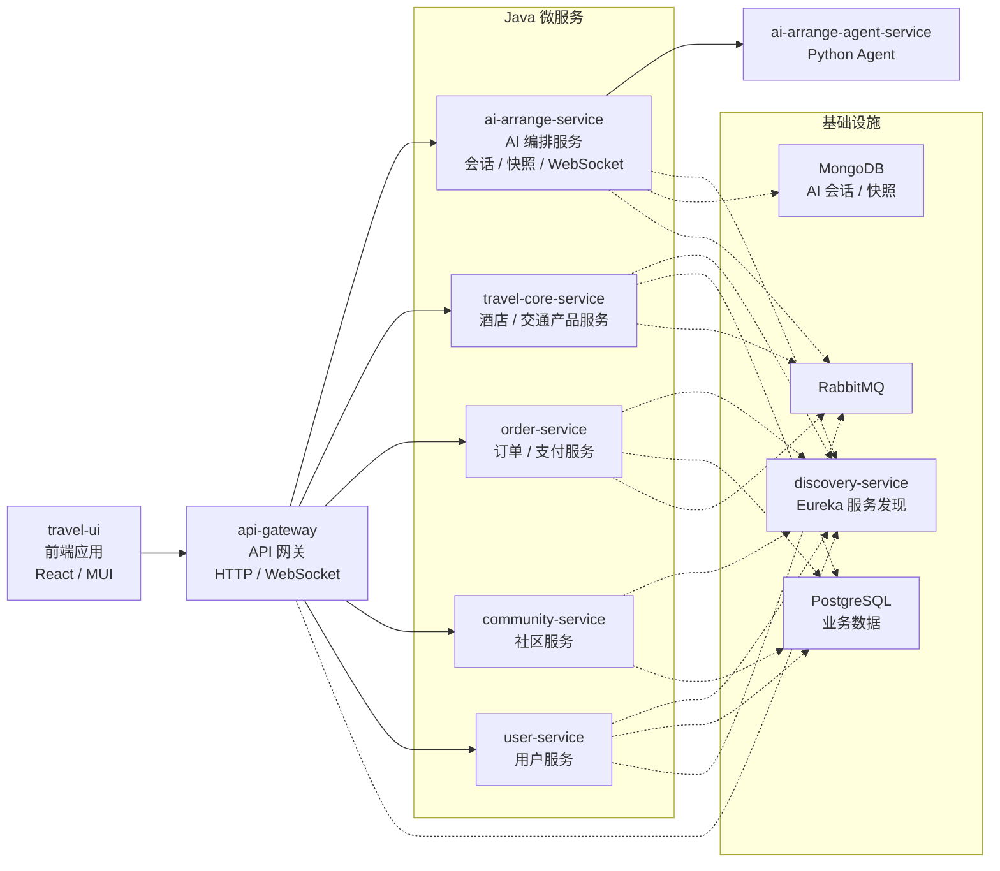

# TravelOn：微服务驱动的一站式旅游平台

**简体中文** | [English](README.en.md)

为满足用户日益增长的出行与旅游预订需求，TravelOn 需要建设一款集机票预订、酒店住宿、旅游度假、火车票购买于一体的综合出行旅游平台。平台提供丰富的出行产品选择、智能的行程规划工具、透明的价格信息与便捷的预订流程，覆盖用户“行前规划 - 行中服务 - 行后分享”的全旅程场景。

## 演示视频

https://github.com/user-attachments/assets/ad9d7145-eee1-4f2c-bebe-2cd7702a3f3a

---

## 目录

- [项目简介](#项目简介)
- [技术栈](#技术栈)
- [项目结构](#项目结构)
- [环境要求](#环境要求)
- [工具链管理（mise）](#工具链管理mise)
  - [一、环境配置（一次性）](#一环境配置一次性)
  - [二、日常命令](#二日常命令)
- [环境变量配置](#环境变量配置)
- [内置管理员账号](#内置管理员账号)
- [快速开始](#快速开始)
- [开发模式 Debug](#开发模式-debug)
- [生产模式 Build 与 Serve](#生产模式-build-与-serve)
- [FAQ](#faq)

---

## 项目简介

本仓库包含：

- 后端服务：`travel-api`
- 前端应用：`travel-ui`

项目支持 AI 相关功能（需配置 Key），社区功能可独立运行。

---

## 技术栈

主要语言与技术包括 Java、TypeScript、Python、PL/pgSQL、Docker。

---

## 项目结构



```text
travel-on-2026NULLptr/
├─ travel-api/      # 后端服务
└─ travel-ui/       # 前端应用
```

---

## 环境要求

本机只需要手动安装以下工具：

```text
Git
Docker Desktop / Docker Engine（含 Docker Compose V2）
```

可能需要执行如下指令来获得 Docker 权限：

```shell
sudo usermod -aG docker "$USER" # 永久获取权限，但是需要重启生效
newgrp docker # 立即在当前会话生效
```

## 工具链管理（mise）

仓库根目录的 [`mise.toml`](mise.toml) 不只管理测试工具，也统一开发、构建、测试和部署入口：它锁定 Java 21、Python 3.12、Node.js 22.22.3，并通过 `travel-ui/package.json` 与 Corepack 固定 Yarn 4.2.2。`tests/run_tests.py` 会再次校验这些版本，不符即报错退出。Docker 需自行安装，Maven 版本由各模块的 `mvnw` 锁定；Agent 与模型桩的运行容器有意使用 Python 3.13。

### 一、环境配置（一次性）

#### 1. 安装 mise

Windows:

```
winget install jdx.mise
```

macOS / Linux:

```shell
curl https://mise.run | sh
# 手动添加环境变量
```

#### 2. 加入 PATH (Windows)

先新开一个终端验证（已打开的终端读不到新 PATH）：

```powershell
Get-Command mise
```

找不到则手动加入用户级 PATH：`Win + R` → `sysdm.cpl` → 高级 → 环境变量 → 用户变量 `Path` → 新建 → 填入 mise 安装位置，然后**重开终端**。

#### 3. 授信并安装

```bash
mise trust
mise install
```

#### 4. 安装项目依赖

```bash
mise run setup        # Python + 前端依赖
mise run setup:e2e    # 跑 e2e 时追加：Playwright Chromium
```

#### 5. 验证

```bash
mise run doctor
```

打印 mise 实际提供的 java / node / yarn / python / docker 版本，与[环境要求](#环境要求)逐条核对。

```bash
mise run verify
```

跑单个最小模块（约 3 秒），确认整条链路可用：预检通过 → Maven wrapper 能执行 → 报告写入 `artifacts/test-results/`。输出末尾为「结果：全部通过」即成功。

### 二、日常命令

> 若 IDE 终端自动激活了虚拟环境（提示符带 `(.venv)`），先执行 `deactivate` 退出再跑下面的命令。已激活状态下 `VIRTUAL_ENV` 已被预设，mise 会跳过自身的 venv 激活，导致解析到错误的解释器。

`mise run <任务>` 执行前自动注入本项目的工具版本，`mise tasks` 列出全部：

#### 1. 前端

| 任务 | 内容 |
| --- | --- |
| `mise run setup:ui` | 安装前端依赖 |
| `mise run ui:dev` | 启动前端开发服务器（热更新） |
| `mise run ui:build` | 构建前端生产产物 |
| `mise run ui:serve` | 预览已构建的前端产物 |

#### 2. 后端

| 任务 | 内容 |
| --- | --- |
| `mise run build` | 构建全部 Java 模块、检查 Agent Python 源码并构建前端 |
| `mise run services:up` | 使用已有镜像启动后端 |
| `mise run services:up_build` | 构建镜像并启动后端 |
| `mise run services:status` | 查看后端服务状态 |
| `mise run services:stop` | 停止后端并保留容器 |
| `mise run services:down` | 停止并删除后端服务容器 |

#### 3. 测试

| 任务 | 内容 | 需要服务 |
| --- | --- | --- |
| `mise run setup` | 安装 Python 与前端测试依赖 | 否 |
| `mise run setup:py` | 只安装 Python 测试依赖 | 否 |
| `mise run setup:e2e` | 安装前端依赖与 Playwright Chromium | 否 |
| `mise run test:pre` | 前置守卫：种子数据、迁移脚本、classpath 资源、MQ 与网关配置，约 20 秒 | 否 |
| `mise run test:unit` | 单元测试与覆盖率门禁，约 50 秒 | 否 |
| `mise run test:migration` | 跨平台 PostgreSQL 旧数据库迁移回归测试 | 临时 PostgreSQL 容器 |
| `mise run test:integration` | Java `*IT`、Agent 集成、API 测试；模型调用使用固定响应桩；resilience 用例另起一段 | 是 |
| `mise run test:e2e` | Playwright，Chromium | 是 |
| `mise run test:ci` | 与 CI 相同的完整自动化测试链路，失败立即停止 | 是 |
| `mise run verify` | 单个最小模块，确认测试链路可用 | 否 |
| `mise run doctor` | 检查 Git、Java、Node、Yarn、Python、Docker 与 Compose 版本 | 否 |

#### 4. 部署

| 任务 | 内容 |
| --- | --- |
| `mise run deploy:images <标签>` | 验证全部 K3s 部署镜像可构建 |
| `mise run deploy:k3s <sha-* 标签>` | 在部署主机部署已构建镜像 |

#### 输出与报告

报告位于 `artifacts/test-results/`（不入库）：

| 文件/目录 | 内容 |
| --- | --- |
| `summary.json` | 机器可读结果、用例数、覆盖率与环境版本 |
| `latest.md` | 汇总表格（每个任务的用例数 + 各模块覆盖率） |
| `pre/` `unit/` `integration/` `e2e/` | JUnit、API 请求响应证据、Playwright 报告与失败截图/视频/trace |
| `coverage/{java,java-it,python,ui}/` | JaCoCo、pytest-cov、Jest 覆盖率报告的副本 |

Playwright 报告：在 `travel-ui` 执行 `corepack yarn test:e2e:report`。

---


## 环境变量配置

启动任何模式之前，都需要先准备好两个 `.env` 文件。

- `travel-api/.env`：不会提交到仓库，请在本地自行创建。
- `travel-ui/.env`：**已随仓库同步**，克隆后即可直接使用，原因见下方[前端](#前端travel-uienv)一节的说明。

> 注意：`.env` 的注释请使用 `#`，不要用 `;`。

### 后端：`travel-api/.env`

```env
AI_BASE_URL=https://api.deepseek.com
AI_CHAT_COMPLETIONS_PATH=/chat/completions
AI_API_KEY=
AI_MODEL=deepseek-v4-pro
AI_THINKING_TYPE=omit
AI_JSON_MODE=true
AI_TEMPERATURE=0.6
AI_MAX_TOKENS=12000
AI_MODEL_TIMEOUT_SECONDS=90
AI_SLOW_RESPONSE_WARNING_MS=60000
AMAP_API_KEY=
```

| 变量 | 说明 |
| --- | --- |
| `AI_BASE_URL` | OpenAI 兼容模型服务的基础 URL；服务必须实现 Chat Completions |
| `AI_CHAT_COMPLETIONS_PATH` | Chat Completions 路径 |
| `AI_API_KEY` | 模型服务 API Key，AI 功能必填 |
| `AI_MODEL` | 要调用的模型名称 |
| `AI_THINKING_TYPE` | 可选 thinking 参数；不支持时使用 `omit` |
| `AI_JSON_MODE` | 是否发送 `response_format=json_object`，不支持时设为 `false` |
| `AI_TEMPERATURE` | 采样温度 |
| `AI_MAX_TOKENS` | 最大 token 数 |
| `AI_MODEL_TIMEOUT_SECONDS` | 模型请求超时时间（秒） |
| `AI_RETRY_COUNT` | 模型请求重试次数 |
| `AI_RETRY_BACKOFF_SECONDS` | 重试退避时间（秒） |
| `AI_SLOW_RESPONSE_WARNING_MS` | 慢响应告警阈值（毫秒） |
| `AMAP_API_KEY` | 后端 POI / 路线增强使用的高德 Key |

AI 功能需要配置 Key；只跑社区等非 AI 功能时可以留空。

### 后端端口覆盖（可选）

`docker-compose.yml` 中的端口都有默认值，端口冲突时可在同一个 `.env` 里覆盖：

| 变量 | 默认值 |
| --- | --- |
| `GATEWAY_HOST_PORT` | `58082` |
| `DISCOVERY_HOST_PORT` | `58010` |
| `POSTGRES_HOST_PORT` | `55432` |
| `RABBITMQ_HOST_PORT` | `55672` |
| `RABBITMQ_MANAGEMENT_HOST_PORT` | `55673` |
| `MONGO_HOST_PORT` | `57017` |
| `POSTGRES_USER` / `POSTGRES_PASSWORD` | `admin` / `admin` |

### 前端：`travel-ui/.env`

```env
REACT_APP_API_HOSTNAME=localhost
PORT=53000
REACT_APP_API_PORT=58082
REACT_APP_AMAP_JS_API_KEY=
REACT_APP_AMAP_SECURITY_JS_CODE=
```

| 变量 | 说明 |
| --- | --- |
| `REACT_APP_API_HOSTNAME` | 后端主机名（通常 `localhost`） |
| `REACT_APP_API_PORT` | 后端网关端口（默认 `58082`，需与 `GATEWAY_HOST_PORT` 一致） |
| `PORT` | 开发服务器端口（默认 `53000`，仅对 `mise run ui:dev` 生效） |
| `REACT_APP_AMAP_JS_API_KEY` | 浏览器端地图渲染 Key |
| `REACT_APP_AMAP_SECURITY_JS_CODE` | 高德 JS 安全码 |

> **关于高德 Key 随仓库同步的说明**
>
> 高德开放平台的 Key 申请需要实名认证与应用审核，流程较为繁琐。为了方便课程评审与他人克隆后直接试用，`travel-ui/.env`（含 `REACT_APP_AMAP_JS_API_KEY` 与 `REACT_APP_AMAP_SECURITY_JS_CODE`）**暂时随 Git 一起同步**，无需自行申请即可看到地图效果。
>
> 这是为便于测试而做的临时取舍，并非推荐做法：
>
> - 该 Key 仅供本项目演示使用，请勿用于其他用途；
> - 配额由本项目共享，如遇地图加载失败或提示超限，请自行申请 Key 后替换；
> - 正式部署前应将 `travel-ui/.env` 移出版本库（加入 `.gitignore`）并轮换 Key。

**重要：** `REACT_APP_*` 变量是编译期注入的。

- 开发模式下改完 `.env` 需要重启 `mise run ui:dev`；
- 生产模式下改完 `.env` 必须重新执行 `mise run ui:build`，只重启 `mise run ui:serve` 不会生效。

---

## 内置管理员账号

项目内置了三个管理员账号，用于演示后台管理相关功能。账号与明文口令记录在仓库根目录的 [`admin_account.txt`](admin_account.txt) 中，并在 user-service 启动时由 `AdminAccountBootstrap` 自动写入数据库。

> **⚠️ 这些口令随仓库公开，仅为方便课程评审与本地试用**
>
> 与高德 Key 同理，这是为了让任何人克隆后无需额外配置即可登录管理员、体验完整功能而做的临时取舍，**绝不能带到真实部署中**。
>
> 自行部署时请务必：
>
> 1. 删除仓库根目录的 `admin_account.txt`；
> 2. 修改 `travel-api/user-service/src/main/java/org/microarchitecturovisco/userservice/bootstrap/AdminAccountBootstrap.java` 中 `ADMIN_ACCOUNTS` 里硬编码的邮箱与口令（建议改为从环境变量读取），换成自己的强口令；
> 3. 重新构建 user-service 镜像并重置数据库后再启动。
>
> 注意：**只删 `admin_account.txt` 是不够的**。口令同时硬编码在 `AdminAccountBootstrap` 里，且每次服务启动都会强制把这三个账号的口令**重置回源码中的值**——即使你在页面上改过密码，重启后也会被覆盖。必须改源码才真正生效。

---

## 快速开始

### 1) 拉取项目

```cmd
git clone <你的仓库地址>
cd travel-on-2026NULLptr
```

### 2) 准备环境变量

按 [环境变量配置](#环境变量配置) 创建 `travel-api/.env` 与 `travel-ui/.env`。

### 3) 安装项目依赖

```bash
mise trust
mise install
mise run setup
```

### 4) 构建并启动后端

```bash
mise run services:up_build
mise run services:status
```

### 5) 选择启动方式

- 日常开发、需要热更新与调试 → [开发模式 Debug](#开发模式-debug)
- 演示、验收、性能接近线上 → [生产模式 Build 与 Serve](#生产模式-build-与-serve)

---

## 开发模式 Debug

用于日常开发：代码保存即热更新，带 source map，可在浏览器 DevTools 中直接断点调试 TypeScript 源码。

### 后端

```bash
mise run services:up
mise run services:stop
```

### 前端（热更新）

```bash
mise run ui:dev
# 停止：Ctrl + C
```

访问地址：

```text
http://localhost:53000
```

### 调试要点

- 前端源码修改后自动刷新，无需重启。
- 修改 `travel-ui/.env` 后必须 `Ctrl + C` 停止再重新执行 `mise run ui:dev`。
- 修改后端代码或 `docker-compose.yml` 后需要重建镜像：

  ```bash
  mise run services:up_build
  ```

---

## 生产模式 Build 与 Serve

用于演示与验收：产出压缩后的静态资源，由静态服务器托管，无热更新、无 source map，运行表现接近线上。

### 1) 构建前端

```bash
mise run ui:build
```

产物输出到 `travel-ui/build/`。构建会把当前 `.env` 中的 `REACT_APP_*` 值写死进产物，因此请确认 `.env` 已经配置正确再构建。

### 2) 启动静态服务

```bash
mise run ui:serve
```

等价于 `serve -s build -l 53000`，端口固定为 `53000`，不读取 `.env` 中的 `PORT`。

访问地址：

```text
http://localhost:53000
```

### 3) 后端

后端在两种模式下都以容器方式运行，命令相同：

```bash
mise run services:up_build
```

若要使用预构建镜像整体部署（含前端容器），可参考 `travel-api/docker-compose-deploy.yml`。

### 停止

静态服务：

```cmd
Ctrl + C
```

后端：

```bash
mise run services:stop
```

---

## FAQ

### Q1: 不配置 AI Key 可以运行吗？

**A:** 可以运行社区等非 AI 功能；AI 功能需要正确配置 Key。

### Q2: `AMAP_API_KEY` 和 `REACT_APP_AMAP_JS_API_KEY` 有什么区别？

**A:**
- `AMAP_API_KEY`：后端调用高德服务（POI/路线增强）
- `REACT_APP_AMAP_JS_API_KEY`：前端浏览器地图渲染

### Q3: 修改 `.env` 后是否需要重启？

**A:**
- 前端开发模式：重启 `mise run ui:dev`
- 前端生产模式：重新执行 `mise run ui:build`，再执行 `mise run ui:serve`
- 后端：重新执行 `mise run services:up_build`

### Q4: 该用开发模式还是生产模式？

**A:** 写代码用开发模式（热更新 + 断点调试）；演示、验收、看真实加载性能用生产模式。
