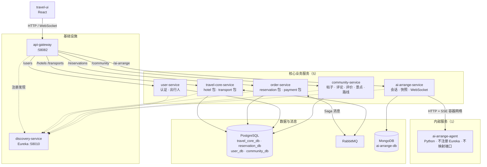

# TravelOn 微服务划分图

**版本：** V2.1（按代码核实修订）
**日期：** 2026-08-28
**事实来源：** [代码核实基线](./verified-baseline.md)

---

## 1. 目标架构



---

## 2. 变更对照

```
现状（11 个应用容器）              目标（8 个应用容器）
─────────────────────              ─────────────────────
hotel-service           ─┐
transport-service       ─┴────→    travel-core-service
offer-provider-service  ──✗        删除（空壳，无业务逻辑）

reservation-service     ─┐
payment-service         ─┴────→    order-service

user-service            ──────→    user-service        不变
community-service       ──────→    community-service   不变
ai-arrange-service      ──────→    ai-arrange-service  不变
ai-arrange-agent        ──────→    ai-arrange-agent    不变
api-gateway             ──────→    api-gateway         不变
discovery-service       ──────→    discovery-service   保留
```

| 指标 | 现状 | 目标 |
|------|------|------|
| 应用容器 | 11 | 8 |
| 其中业务服务 | 9 | 5 |
| PostgreSQL 库 | 6（含 1 空库） | 4 |
| 含基础设施的容器总数 | 14 | 11 |

---

## 3. 服务边界依据

| 服务 | 保持独立 / 合并的理由 |
|------|---------------------|
| `travel-core-service` | 酒店与交通同属可售库存，消费方均为订单服务；`city` 参考数据同源，合并后天然去重 |
| `order-service` | payment 无 HTTP 端点、无数据库，支付表本就在 `reservation_db`；合并后订单与支付进入同一本地事务边界 |
| `user-service` | 认证（`X-User-Token`）是其余所有服务的横向依赖，独立部署便于统一收敛 |
| `community-service` | 单 Controller 约 34 个端点，规模超过任一其他服务，与订单/产品无耦合 |
| `ai-arrange-service` | 对外 REST + WebSocket、会话与快照持久化，边界清晰 |
| `ai-arrange-agent` | 运行时（Python）、依赖与伸缩方式均不同；作为内部容器可替换实现而不影响前端协议 |
| `api-gateway` | 客户端唯一入口 |
| `discovery-service` | 按评审决定保留，用于展示服务发现 |
| ~~`offer-provider-service`~~ | **删除。** 所有方法返回空值或占位符，无数据库、无 MQ 流量、无 WebSocket handler |

---

## 4. 关键调用链

**产品查询（同步）**

```
travel-ui → gateway → travel-core-service → PostgreSQL
```

酒店与交通在同一进程内，查询互不经过网络。

**下单（Saga，异步 + 本地调用）**

```
travel-ui → gateway → order-service
                        │
                        ├─ 查酒店可用性  ──RabbitMQ RPC──→ travel-core-service
                        ├─ 查交通可用性  ──RabbitMQ RPC──→ travel-core-service
                        ├─ 锁定资源      ──RabbitMQ fanout─→ travel-core-service
                        ├─ 支付校验      ──本地方法调用──→ payment 包
                        └─ 失败时补偿    ──RabbitMQ fanout─→ travel-core-service（释放资源）
```

合并前后，主链路上减少的网络往返是**支付校验这一次**。酒店与交通之间本就没有互调——它们各自独立响应订单服务的请求。

**AI 规划（流式）**

```
travel-ui ──WebSocket──→ gateway ──lb:ws──→ ai-arrange-service
                                                  │ HTTP + SSE（容器网络）
                                                  ▼
                                            ai-arrange-agent
```

---

## 5. 网络与端口

| 组件 | 宿主机端口 | 容器端口 | Eureka |
|------|-----------|---------|--------|
| api-gateway | 58082 | 8082 | 注册 |
| discovery-service | 58010 | 8010 | 自身 |
| postgres | 55432 | 5432 | — |
| rabbitmq | 55672 / 55673 | 5672 / 15672 | — |
| mongo | 57017 | 27017 | — |
| travel-core-service | 无 | 随机（`server.port=0`） | 注册 |
| order-service | 无 | 随机 | 注册 |
| user-service | 无 | 随机 | 注册 |
| community-service | 无 | 随机 | 注册 |
| ai-arrange-service | 无 | 随机 | 注册 |
| ai-arrange-agent | **无** | 8090（仅 `expose`） | **不注册** |

业务服务使用 `server.port=0` 随机端口，由 Eureka 注册实例地址、Gateway 通过 `lb://` 解析——这也是服务发现在本项目中的实际作用。
