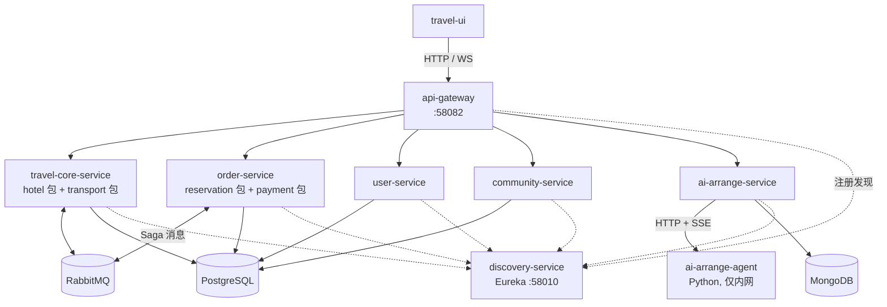

# TravelOn 微服务合并重构方案

**版本：** V2.1（按代码核实修订）
**日期：** 2026-08-28
**状态：** 待评审
**事实来源：** [代码核实基线](./verified-baseline.md)

> **V2.1 修订说明：** V2.0 的服务清单、队列名、接口路径与表结构多为推断。逐一核对源码后，其中两项前提被推翻并改变了重构动作本身（见 §1.2）。本版据实重写。

---

## 1. 执行摘要

### 1.1 目标

在保留微服务架构的前提下，把 11 个应用容器降到 8 个，并消除已经失效的服务与配置。

```
现状（11 个应用容器）                目标（8 个应用容器）
├── hotel                ─┐
├── transport            ─┼──────→  travel-core-service
├── offer-provider       ─┘  删除（空壳）
├── reservation          ─┐
├── payment              ─┴──────→  order-service
├── user                 ────────→  user-service        （不变）
├── community            ────────→  community-service   （不变）
├── ai-arrange           ────────→  ai-arrange-service   （不变）
├── ai-arrange-agent     ────────→  ai-arrange-agent     （不变）
├── gateway              ────────→  gateway             （不变）
└── discovery            ────────→  discovery           （保留）
```

业务服务从 9 个降到 5 个，减少 4 个部署单元。

### 1.2 核实推翻的两个前提

**其一：offer-provider 应当删除，而不是合并。**

评审意见认为「offer-provider 主要在通过 RabbitMQ 组合前两者的数据」。这在历史上成立，但当前代码中该逻辑已被移除：`OffersService` 的三个方法分别返回 `List.of()`、硬编码占位对象（`hotelName = "旅游产品功能重构中"`、`price = -1.00`）和 `-1.00`；服务无数据库、无 `rabbitTemplate` 调用、WebSocket 配置未注册任何 handler。

它是一个防止前端 404 的兼容壳，**没有可合并的逻辑**。原方案的「阶段 1 合并三个服务」实际是「合并两个服务 + 删除一个空壳」。

**其二：reservation + payment 合并不需要迁移数据。**

`payment_transaction` 与 `refund_record` 已经在 `reservation_db` 中，由 reservation-service 直接读写。payment-service 无 Entity、无 Repository、无数据源，`payment_db` 是建库后从未应用 schema 的空库。

这项合并的实际工作量只有：把一次 `convertSendAndReceive` 改成本地方法调用，删掉一个队列和一条死路由。

### 1.3 顺带修复的既有缺陷

核实中发现三处与重构无关、但应一并处理的问题：

| 问题 | 位置 |
|------|------|
| Gateway 的 `/payments/**` 指向一个无 HTTP 端点的服务，是死路由 | [api-gateway/application.yml](../../travel-api/api-gateway/src/main/resources/application.yml) |
| reservation 的 WebSocket `/reservations/ws/offerBought` 在 Gateway 中没有 `lb:ws://` 路由 | 同上 |
| `payment_db` 建库后从未应用 schema | [database/init/001-create-service-databases.sql](../../travel-api/database/init/001-create-service-databases.sql) |

### 1.4 明确不做的事

- **不改对外 HTTP 路径。** `/reservations/**` 保持不变，不改名为 `/orders/**`。理由见[接口清单 §2](./service-interface-inventory.md)。
- **不改队列名、exchange 名和 routing key。** 改名会同时牵动收发两侧，风险远大于收益。
- **不新增 `resource_locks`、`saga_execution_log`、`compensation_records` 等表。** 这些是功能改造，不属于服务合并。
- **不引入 Outbox、分布式追踪、熔断、监控告警。** 同上。
- **不改 ai-arrange 与 Python Agent。** 网络隔离目标已经达成（见 §4.4）。
- **不删除 `discovery-service`。** 按评审决定保留。

---

## 2. 目标架构



`ai-arrange-agent` 不接入 Eureka，也不映射宿主机端口，只能由 `ai-arrange-service` 通过容器网络访问。

### 2.1 服务清单

| 服务 | 构成 | 数据库 | Eureka | 宿主机端口 |
|------|------|--------|--------|-----------|
| `travel-core-service` | hotel + transport | `travel_core_db`（新建） | 是 | 无 |
| `order-service` | reservation + payment | `reservation_db`（不改名） | 是 | 无 |
| `user-service` | 不变 | `user_db` | 是 | 无 |
| `community-service` | 不变 | `community_db` | 是 | 无 |
| `ai-arrange-service` | 不变 | MongoDB | 是 | 无 |
| `ai-arrange-agent-service` | 不变 | 无 | **否** | **无** |
| `api-gateway` | 不变 | 无 | 是 | 58082 |
| `discovery-service` | 不变 | 无 | 自身 | 58010 |

---

## 3. travel-core-service

### 3.1 为什么合并

| 依据 | 说明 |
|------|------|
| 领域相关 | 酒店与交通同属"可售卖库存"，被订单流程以相同方式消费 |
| 消费方相同 | 两者的全部 MQ 消息都来自 reservation-service，无第三方消费者 |
| 参考数据同源 | `city` 表 DDL 相同、seed 同源，合并后天然去重 |
| 无独立伸缩需求 | 当前规模下两者流量特征一致 |

### 3.2 包结构

```
travel-core-service/src/main/java/org/microarchitecturovisco/travelcore/
├── TravelCoreServiceApplication.java
├── hotel/          ← hotel-service 全量迁入，保持内部结构
│   ├── controllers/  model/  services/  repositories/  queues/  utils/
├── transport/      ← transport-service 全量迁入
│   ├── controllers/  model/  services/  repositories/  queues/  utils/
└── common/         ← 仅放确需共享的内容（如 city 只读访问）
```

两个子包各自保留 `utils/JsonReader` 与 `utils/JsonConverter`。它们类名相同、包名不同，**不要**提升到 `common`——合并它们需要比对两套手写 JSON 逻辑，属于额外风险。

### 3.3 对外契约

HTTP 路径 `/hotels/**` 与 `/transports/**` 完全不变，队列名、exchange、routing key 全部不变。完整清单见[接口清单 §3](./service-interface-inventory.md)。

Eureka 服务名从 `hotel-service` / `transport-service` 变为 `travel-core-service`，Gateway 的 `uri` 随之改为 `lb://travel-core-service`，`predicates` 不动。

### 3.4 必须注意的四点

1. **保留两条 routing key 绑定。** `hotels.requests.checkAvailabilityByQuery.queue` 被 hotel 侧（用队列名作 key）和 reservation 侧（用 `...routingKey`）分别绑定到同一 topic exchange。合并时两条都要保留，只删其一会导致可用性 RPC 超时。transport 侧同理。
2. **继承 seed-data 挂载。** transport 的 `CityCatalog` 在运行时读取 `/seed-data/common/`，对应的 volume 与 `APP_SEED_DATA_COMMON_BASE_PATH` 必须迁移到新服务。
3. **合并 Flyway `R__seed.sql`，只保留一份 `city` 载入。**
4. **fanout 队列数量会减半。** `hotels.events.*.queue.{uuid}` 与 `transports.*.queue.{uuid}` 是每实例创建的排他队列，进程数从 2 变 1 后数量随之减少，属预期行为。

### 3.5 数据库

新建 `travel_core_db`，不复用 `hotel_db`。seed 由 Flyway 从 CSV 重建，**不需要 `pg_dump` 导数据**。详见[数据表归属方案 §2.2](./database-ownership-plan.md)。

---

## 4. order-service

### 4.1 为什么合并

payment-service 是一个无状态消息处理器：无 HTTP 端点、无数据库、只有一个 `@RabbitListener`，唯一的调用方是 reservation-service，而支付数据本就存在 `reservation_db`。它满足"独立部署零收益"的全部特征。

### 4.2 包结构

```
order-service/src/main/java/org/microarchitecturovisco/order/
├── OrderServiceApplication.java
├── reservation/    ← reservation-service 全量迁入（含 saga/、websockets/）
└── payment/        ← payment-service 迁入，仅保留 services/ 与 models/
```

payment 包中的 `controllers/`、`rabbitmq/config/`、`Bootstrap.java` 在合并后不再需要。

### 4.3 唯一的实质代码改动

```java
// 改前 —— ReservationService:517
String responseMessage = (String) rabbitTemplate.convertSendAndReceive(
        "payments.requests.handle", "payments.handlePayment", transportMessageJson);
if (responseMessage != null) { /* 解析 JSON */ }

// 改后
HandlePaymentResponseDto response = paymentService.verifyTransaction(requestDto);
```

改动带来的两点后果：

- **JSON 序列化环节消失。** 原本 DTO → JSON → 队列 → JSON → DTO，现在直接传对象。`JsonConverter` / `JsonReader` 在这条路径上不再需要，但**不要删除类本身**，其他调用点仍在使用。
- **超时分支不再可达，但异常处理必须保留。** 原代码处理 `responseMessage == null`（RPC 超时）；本地调用不会超时，该分支可删。但 `verifyTransaction` 仍可能抛异常，`InvalidPaymentHandler` 的补偿路径**必须原样保留**——这是支付失败时释放酒店和交通资源的唯一途径。

### 4.4 保持不变的部分

- 对外路径 `/reservations/**`
- WebSocket `/reservations/ws/offerBought`
- 三条自发自收的 `reservations.events.*` fanout 消息（合并后仍在同一进程内，本次不改为方法调用，避免一次动两处）
- 发往 travel-core 的六条 Saga 消息
- 数据库 `reservation_db`

### 4.5 清理项

- 删除 `payments.requests.handle` 队列声明与 `@RabbitListener`
- 删除 Gateway 的 `/payments/**` 路由
- 补上 Gateway 的 `/reservations/ws/**` → `lb:ws://order-service` 路由
- `POST /reservations/reservation`（已停用的旧套餐预订）建议随 offer-provider 一并删除

---

## 5. offer-provider-service：删除

### 5.1 依据

服务内所有对外能力均为占位实现，详见[基线 §3.3](./verified-baseline.md)。删除它不会使任何功能退化，因为它当前不提供任何功能。

### 5.2 唯一需要确认的事项

`travel-ui` 是否仍在调用 `GET /offers/`。

| 情况 | 处理 |
|------|------|
| 前端未调用 | 删服务、删 Gateway 路由 |
| 前端仍调用但可改 | 前端先移除调用，再删服务 |
| 前端短期无法改 | 在 travel-core-service 中保留一个返回 `[]` 的 `GET /offers/` 兼容端点，并注明待删 |

这是本方案中**唯一可能影响前端的变更**，需在实施前确认。

---

## 6. 配置变更

### 6.1 docker-compose.yml

移除 `hotel`、`transport`、`offer-provider`、`reservation`、`payment` 五个 service 块，新增两个：

```yaml
  travel-core:
    build: ./travel-core-service
    volumes:
      - ./logs/travel-core:/logs
      - ./seed-data/common:/seed-data/common:ro   # CityCatalog 运行时依赖
    environment:
      SPRING_DATASOURCE_URL: jdbc:postgresql://postgres:5432/${TRAVEL_CORE_DB_NAME:-travel_core_db}
      SPRING_DATASOURCE_USERNAME: ${POSTGRES_USER:-admin}
      SPRING_DATASOURCE_PASSWORD: ${POSTGRES_PASSWORD:-admin}
      APP_SEED_DATA_COMMON_BASE_PATH: file:/seed-data/common/
    depends_on:
      postgres: { condition: service_healthy }
      rabbitmq: { condition: service_started }
      discovery: { condition: service_started }
      gateway:  { condition: service_started }
    networks: [backend]

  order:
    build: ./order-service
    volumes:
      - ./logs/order:/logs
    environment:
      SPRING_DATASOURCE_URL: jdbc:postgresql://postgres:5432/${ORDER_DB_NAME:-reservation_db}
      SPRING_DATASOURCE_USERNAME: ${POSTGRES_USER:-admin}
      SPRING_DATASOURCE_PASSWORD: ${POSTGRES_PASSWORD:-admin}
    depends_on:
      postgres: { condition: service_healthy }
      rabbitmq: { condition: service_started }
      discovery: { condition: service_started }
      gateway:  { condition: service_started }
    networks: [backend]
```

`ai-arrange-agent` **不需要改动**——它已经是 `expose: "8090"`、无 `ports`、无 `depends_on: discovery`。

### 6.2 Gateway 路由

只改 `uri`，不改 `predicates`。完整改动：

| 动作 | 路由 |
|------|------|
| 改 uri | `/hotels/**` → `lb://travel-core-service` |
| 改 uri | `/transports/**` → `lb://travel-core-service` |
| 改 uri | `/reservations/**` → `lb://order-service` |
| **新增** | `/reservations/ws/**` → `lb:ws://order-service`，须置于 `/reservations/**` **之前** |
| 删除 | `/payments/**`（死路由） |
| 删除 | `/offers/**`（待 §5.2 确认） |
| 不动 | `/users/**`、`/community/**`、`/ai-arrange/ws/**`、`/ai-arrange/**` |

**路由顺序是硬约束：** WebSocket 路由必须排在同前缀的 HTTP 路由之前，否则会被后者抢先匹配。现有的 `ai-arrange-websocket` 已遵循该顺序，新增的 reservation WebSocket 路由同理。

---

## 7. 实施计划

按串行推进，每阶段独立可验收、可回滚。

| 阶段 | 内容 | 预估 | 关键风险 |
|------|------|------|---------|
| 0 | 分支、备份、确认前端是否依赖 `/offers/` | 0.5 天 | — |
| 1 | 删除 offer-provider + 清理死路由 | 0.5 天 | 前端依赖未确认 |
| 2 | 合并 order-service | 1.5 天 | 补偿路径被误删 |
| 3 | 合并 travel-core-service | 3 天 | 队列绑定、seed 合并 |
| 4 | compose 与 Gateway 收尾 | 0.5 天 | 路由顺序 |
| 5 | 集成测试 | 1.5 天 | — |
| 6 | 文档更新 | 0.5 天 | — |

**合计：约 8 天。**

### 7.1 为什么先做 order-service

V2.0 把 travel-core 排在第一位。调整为先做 order-service，理由：

- order-service 的合并**不涉及数据库变更**，是纯代码改动，风险最低
- 它能最快验证"合并后 Saga 仍然正确"这一核心假设
- travel-core 涉及新建库与 seed 合并，把它放在团队已经熟悉合并流程之后更稳妥

先删 offer-provider 则是因为它风险最低且能立即减少一个容器。

### 7.2 各阶段验收标准

| 阶段 | 验收 |
|------|------|
| 1 | 全栈启动正常；前端各页面无因 `/offers` 产生的报错 |
| 2 | 下单 → 支付成功 → 订单变 PAID；支付失败 → 酒店与交通资源被释放、订单取消 |
| 3 | 酒店搜索/详情/管理、交通查询/票务管理均正常；可用性 RPC 不超时；`travel_core_db` 行数校验通过 |
| 4 | `docker compose ps` 全部正常；Eureka 中恰好 5 个业务服务 + gateway；WebSocket 可连接 |
| 5 | 见 §8 |

---

## 8. 集成测试要点

功能回归必须覆盖以下路径，其中前两条是本次重构的直接风险面：

| # | 场景 | 为什么必测 |
|---|------|-----------|
| 1 | 支付失败 → 资源释放 → 订单取消 | payment 由消息改为本地调用，补偿路径是最易被破坏的部分 |
| 2 | 酒店/交通可用性查询 | 依赖两条 routing key 绑定同时存在 |
| 3 | 下单成功全流程 | 端到端主干 |
| 4 | 酒店搜索与详情（含 `destinationId` 参数） | 合并后 city 关联是否正常 |
| 5 | 交通票务查询 | 同上，验证 `city(city_id)` 外键 |
| 6 | 订单 WebSocket 推送 | 新增 Gateway ws 路由是否生效 |
| 7 | AI 规划 WebSocket + SSE | 验证未被路由改动波及 |
| 8 | 管理员接口（酒店/交通 CRUD） | 验证 `X-User-Token` 鉴权在合并后仍生效 |

性能对比不作为验收门槛。合并确实会减少进程间跳数，但当前主链路上被移除的网络调用只有一次（payment RPC），酒店与交通之间本就没有互调——V2.0 中「报价查询提升 50%」的估算建立在 offer-provider 会做组合查询的错误前提上，不成立。

---

## 9. 风险与回滚

| 风险 | 概率 | 影响 | 应对 |
|------|------|------|------|
| 队列绑定遗漏导致 RPC 超时 | 中 | 高 | 合并后逐条比对 RabbitMQ 管理界面的 binding 列表 |
| 补偿路径被误删 | 低 | 高 | 阶段 2 强制 Code Review + 场景 1 测试 |
| `city` seed 重复导致行数翻倍 | 低 | 中 | 行数校验（见[数据表归属方案 §5.2](./database-ownership-plan.md)） |
| 前端依赖 `/offers/` 未发现 | 中 | 中 | 阶段 0 先确认 |
| Gateway 路由顺序错误致 WS 失败 | 中 | 中 | 场景 6、7 测试 |
| 已有数据卷不执行 init 脚本 | 高 | 中 | 开发环境重建数据卷；生产路径手工建库 |

### 9.1 回滚

各阶段均可独立回滚，且**不涉及数据恢复**——旧库在验收期内不删除、不修改：

| 阶段 | 回滚动作 |
|------|---------|
| 1 | 恢复 offer-provider 的 compose 块与 Gateway 路由 |
| 2 | Gateway 改回 `lb://reservation-service`，重启 reservation + payment |
| 3 | Gateway 改回 `lb://hotel-service` 与 `lb://transport-service`，重启两容器 |

`hotel_db`、`transport_db`、`payment_db` 的删除推迟到全部验收通过并稳定运行之后。

---

## 10. 评审确认项

| # | 事项 | 需要的决定 |
|---|------|-----------|
| 1 | offer-provider 由"合并"改为"删除" | 确认 |
| 2 | `/reservations/**` 不改名为 `/orders/**` | 确认 |
| 3 | order-service 沿用 `reservation_db` 库名 | 确认 |
| 4 | travel-core 新建 `travel_core_db` 并重建数据卷 | 确认，或指定手工建库路径 |
| 5 | 前端是否依赖 `GET /offers/` | **需前端确认** |
| 6 | 实施顺序改为 offer-provider → order → travel-core | 确认 |
| 7 | 不新增锁表、Saga 日志表、追踪与监控 | 确认范围 |

第 5 项是唯一的外部依赖，建议在阶段 0 完成确认。
