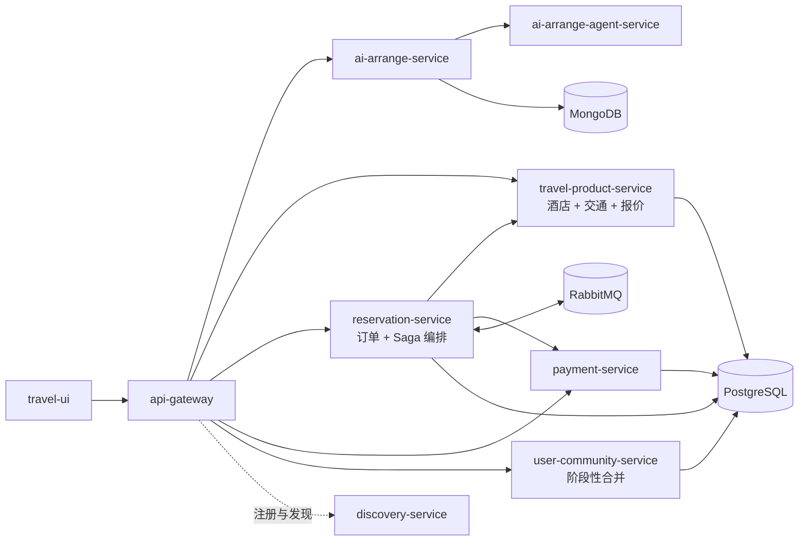

# 微服务迭代方案

> 版本：V1.0
> 编制日期：2026-08-20
> 适用范围：`travel-api` 后端微服务架构优化
> 文档状态：迭代方案，目标架构尚未全部实施

## 1. 文档目的

本方案用于在满足课程“必须使用微服务”要求的前提下，优化当前项目的服务拆分方式，降低过度拆分带来的开发、部署、调试和一致性维护成本。

本方案不追求服务数量最大化，而是按照业务边界、数据归属、独立部署能力和独立扩展需求重新确定服务粒度。

## 2. 当前现状

当前仓库保留了一个较完整的旅游平台微服务基座，主要模块包括：

- `api-gateway`：统一入口和请求路由；
- `discovery-service`：Eureka 服务注册与发现；
- `hotel-service`：酒店和房间资源；
- `transport-service`：飞机、火车等交通资源；
- `offer-provider-service`：组合酒店和交通信息，生成旅游报价；
- `reservation-service`：订单和预订流程编排；
- `payment-service`：支付处理，目前为模拟支付；
- `user-service`：用户相关能力；
- `community-service`：社区内容、评论、收藏等能力；
- `ai-arrange-service`：Java AI 规划接口、会话和快照管理；
- `ai-arrange-agent-service`：Python 规划 Agent；
- `data-generator`：测试数据生成或数据变化模拟任务。

基础设施包括 PostgreSQL、MongoDB、RabbitMQ、Docker Compose 和 Eureka。服务间异步通信使用 RabbitMQ，仓库中没有 Kafka 配置或依赖。

当前架构的主要问题不是“不能运行”，而是部分服务边界过细：酒店、交通和报价查询在业务上高度协作，却被拆成多个独立部署单元；数据生成器也不属于面向用户的核心业务服务。

## 3. 迭代目标

### 3.1 总体目标

保留微服务架构，同时将服务数量控制在与项目规模相匹配的范围内：

1. 保留真正具有独立业务边界或技术边界的服务；
2. 合并强耦合、独立部署收益不明显的模块；
3. 保持服务内部模块化，避免合并后形成新的大泥球；
4. 明确每个服务的数据所有权，禁止跨服务直接访问业务表；
5. 用 Saga、幂等、重试和补偿机制维护跨服务最终一致性；
6. 保留 RabbitMQ 作为订单流程和领域事件的消息基础设施。

### 3.2 非目标

本轮不做以下事情：

- 不为了增加微服务数量而继续拆分；
- 不引入 Kafka、Seata 或两阶段提交等与当前规模不匹配的基础设施；
- 不立即删除旧服务目录，先完成边界确认和接口迁移；
- 不把所有功能强行合并为一个服务；
- 不宣称目标架构已经完成，未实施部分必须在文档和演示中标明。

## 4. 目标服务架构



目标架构中的服务数量是部署粒度，不代表服务内部没有模块。推荐的部署单元如下。

### 4.1 基础设施服务

#### API Gateway

继续作为客户端唯一入口，负责路由、统一跨域处理、鉴权入口和 WebSocket 转发。客户端不直接依赖各业务服务的内部地址。

#### Discovery Service

继续使用 Eureka 完成服务注册与发现。它是基础设施，不应被当作业务服务数量的一部分进行拆分优化。

### 4.2 AI 规划服务

`ai-arrange-service` 和 `ai-arrange-agent-service` 保持独立。

Java 服务负责对外 REST/WebSocket 接口、会话管理、规划快照、版本号和幂等保存；Python 服务负责模型调用、工具编排、规划算法和 SSE 流式输出。

该拆分具有明确的技术边界：运行时不同、依赖不同、扩缩容方式不同，并且未来可以替换 Agent 实现而不改变前端协议。因此这不是为了拆分而拆分，而是合理的独立服务边界。

### 4.3 旅游产品服务

将以下模块合并为一个部署单元 `travel-product-service`：

```text
travel-product-service
├── hotel       酒店、房间和酒店资源
├── transport   飞机、火车和交通资源
└── offer       产品组合、报价和查询
```

合并原因：

- 报价查询必须同时获取酒店和交通信息；
- 三者共同构成旅游产品和资源领域；
- 当前规模下没有明显的独立部署、独立扩容和独立发布需求；
- 服务之间频繁通信会增加网络失败、消息重试和联调成本；
- 合并后可以在服务内部使用本地事务，减少不必要的跨服务一致性问题。

合并只改变部署边界，不取消代码边界。酒店、交通和报价仍应保持独立的包结构、领域对象、Repository 和应用服务，禁止通过共享静态变量或无边界的公共 Service 互相调用。

### 4.4 订单与预订服务

`reservation-service` 继续独立，负责订单生命周期和跨服务流程编排：

- 创建订单；
- 锁定酒店和交通资源；
- 发起支付；
- 接收支付结果；
- 成功确认订单；
- 失败时执行资源释放和订单取消。

它是流程协调者，不直接访问产品服务的酒店表或交通表。资源的锁定、确认和释放必须通过产品服务提供的接口或消息完成。

### 4.5 支付服务

`payment-service` 继续独立。支付具备安全、失败重试、第三方接入和独立扩展等特点，即使当前使用模拟实现，也适合作为独立服务保留。

支付服务只负责支付状态和支付结果，不负责修改订单状态。订单状态由 `reservation-service` 根据支付事件推进。

### 4.6 用户与社区服务

在社区功能规模较小的阶段，可以将 `user-service` 和 `community-service` 合并为一个 `user-community-service`，内部保留 `user`、`post`、`comment`、`favorite` 等模块。

如果后续出现独立的权限体系、社区内容审核、推荐或高并发访问需求，再将社区拆为独立服务。当前不建议为了展示服务数量提前拆分。

### 4.7 数据生成器

`data-generator` 改为批处理任务、定时任务或独立测试工具，不作为核心业务服务注册到 Eureka，也不进入正式业务请求链路。

## 5. 服务边界与数据原则

每个服务应拥有自己的数据访问边界。即使多个服务使用同一个 PostgreSQL 实例，也应至少使用独立数据库或独立 Schema，并通过接口或消息通信，不允许跨服务直接查询和修改业务表。

推荐的数据归属如下：

| 服务 | 数据归属 |
|---|---|
| `travel-product-service` | 酒店、房间、交通班次、资源库存、报价查询模型 |
| `reservation-service` | 订单、订单状态、Saga 执行记录、补偿记录 |
| `payment-service` | 支付单、支付状态、支付请求和结果 |
| `user-community-service` | 用户、帖子、评论、收藏和社区关系 |
| `ai-arrange-service` | 会话、规划快照、版本信息和幂等记录 |
| `ai-arrange-agent-service` | 规划执行过程，不直接写业务数据库 |

MongoDB 继续用于 AI 规划快照。Python Agent 不直接写 MongoDB，由 Java 服务统一负责快照持久化和版本控制。

## 6. 服务间通信方案

### 6.1 同步调用

适合以下场景：

- 查询旅游产品和报价；
- 查询订单详情；
- AI Java 服务调用 Python Agent；
- 前端需要立即获得结果的请求。

同步接口必须设置超时、错误码和降级响应，不能无限等待下游服务。

### 6.2 RabbitMQ 异步消息

RabbitMQ 用于订单流程和领域事件，例如：

- `ResourceReserveRequested`：请求锁定资源；
- `ResourceReserved`：资源锁定成功；
- `ResourceReleased`：资源释放完成；
- `PaymentRequested`：请求支付；
- `PaymentSucceeded`：支付成功；
- `PaymentFailed`：支付失败；
- `OrderCancelled`：订单取消。

消息体至少应包含 `eventId`、`orderId`、`eventType`、`occurredAt` 和业务数据。消费者不能依赖消息恰好只投递一次，必须支持重复消费。

## 7. 一致性维护方案

### 7.1 服务内部一致性

同一服务内的相关数据使用本地数据库事务。例如，产品服务内部更新资源锁定状态和锁定记录时，可以使用同一个本地事务。

### 7.2 服务之间最终一致性

订单流程采用 Saga，不使用跨服务两阶段提交：

```text
创建订单
  -> 锁定酒店资源
  -> 锁定交通资源
  -> 发起支付
  -> 支付成功：订单完成
  -> 任一步骤失败：执行补偿并取消订单
```

必须补充以下控制：

- 使用 `orderId` 作为流程主键；
- 使用 `eventId` 或 `orderId + eventType` 实现消费幂等；
- 订单采用显式状态机，禁止通过多个布尔字段推断最终状态；
- 消息发送失败时使用 Outbox 或可靠消息表重试；
- 消费失败时进行有限次数重试，超过次数进入死信队列；
- 补偿操作本身也必须幂等；
- 通过日志记录 `orderId`、`eventId` 和状态变化，支持问题追踪。

这里的一致性目标是“最终一致”，而不是所有服务在同一时刻强一致。用户界面应展示处理中、支付中或取消中的中间状态。

## 8. 迭代实施步骤

### M0：架构基线确认

目标：明确现有代码和目标架构的差异。

- 盘点每个服务的接口、数据库表和 RabbitMQ 队列；
- 标记当前仍在主链路中的服务；
- 为酒店、交通、报价、预订和支付接口补充调用关系图；
- 明确本方案中的目标服务名和数据归属；
- 保留旧服务作为迁移参考，不直接删除。

验收标准：文档、Docker Compose 和服务 README 对“当前架构”描述一致。

### M1：合并旅游产品服务

目标：将酒店、交通和报价模块合并为一个部署单元。

- 保留三类模块的内部包边界；
- 统一服务注册名和配置；
- 对外保留兼容接口，减少前端改动；
- 将报价查询改为服务内部模块调用；
- 统一产品服务的错误码、超时和日志格式；
- 更新 Gateway 路由和 Compose 配置。

验收标准：酒店查询、交通查询、报价查询和详情查询可以通过一个产品服务完成，且不再依赖三个独立业务进程。

### M2：稳定订单 Saga

目标：使订单服务成为唯一的跨服务流程协调者。

- 明确订单状态机；
- 统一资源锁定、确认和释放接口；
- 增加消息幂等表或消费记录；
- 增加失败重试和死信队列；
- 补充支付失败、资源不足和重复消息场景；
- 记录 Saga 步骤和补偿结果。

验收标准：酒店成功、交通失败、支付失败、消息重复和服务重启等场景下，订单最终状态和资源状态可恢复且可解释。

### M3：明确支付和用户社区边界

目标：保留支付独立性，并避免用户和社区过早拆分。

- 支付服务只维护支付数据和支付结果；
- 订单服务根据支付事件更新订单；
- 评估用户和社区是否需要独立部署；
- 若没有独立扩展需求，将两者部署合并但保持内部模块隔离；
- 补充权限和用户标识传递规则。

验收标准：支付实现可以替换而不修改订单核心流程，社区模块不会直接修改订单或产品数据。

### M4：清理运行链路和文档

目标：让架构设计、实际启动方式和演示材料一致。

- 将 `data-generator` 从正式服务链路移出；
- 删除无效的服务依赖和旧路由；
- 更新 Docker Compose、部署文档、概要设计和测试文档；
- 增加一键启动和 smoke test；
- 保留旧模块迁移记录和兼容接口说明。

验收标准：新成员只阅读当前文档即可启动目标架构，不会误以为所有历史服务都必须同时运行。

## 9. 验收指标

### 架构验收

- 业务服务具有明确的数据所有权；
- 酒店、交通和报价已作为一个产品服务部署；
- 订单服务独立负责 Saga 编排；
- 支付服务保持独立；
- AI Java 服务和 Python Agent 通过明确协议通信；
- 数据生成器不进入生产业务链路。

### 功能验收

- 可以完成产品搜索和报价查询；
- 可以完成订单创建、资源锁定和支付；
- 支付失败能够触发资源释放；
- 重复消息不会重复扣款或重复锁定资源；
- 服务短暂不可用时，订单会进入可恢复的中间状态；
- AI 规划和快照保存链路不受产品服务合并影响。

### 工程验收

- 每个服务有独立 README、配置和健康检查；
- 关键请求具有统一的 `traceId`、`orderId` 或 `conversationId`；
- RabbitMQ 队列、重试和死信策略有文档说明；
- Docker Compose、Gateway 路由和服务发现配置保持一致；
- 关键 Saga 场景有集成测试或可重复的 smoke test。

## 10. 取舍结论

如果不受课程约束，当前规模使用模块化单体可能具有更低的综合成本。但本项目需要展示微服务，因此采用“适度微服务化”更合适：保留 AI、订单、支付等真正具有独立边界的服务，合并酒店、交通和报价等强耦合模块，并通过服务内部模块化保持代码清晰。

微服务的重点不是把每个目录都部署成一个进程，而是让不同业务边界能够独立演进、独立拥有数据，并通过稳定接口和消息协作。服务拆分必须能够解释清楚收益，否则就应优先考虑合并。
