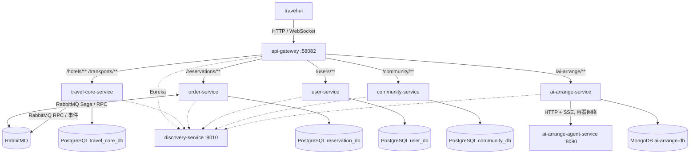

# TravelOn 微服务划分图

**基线：** 当前 `main`（2026-09-01）
**证据：** `travel-api/docker-compose.yml`、Gateway `application.yml`、各服务启动配置

## 部署与调用关系

## 服务边界

| 部署单元 | 内部模块/职责 | 对外入口 | 数据归属 |
|---|---|---|---|
| `travel-core-service` | hotel + transport；库存、酒店和交通查询/管理 | `/hotels/**`、`/transports/**` | `travel_core_db` |
| `order-service` | reservation + payment；订单生命周期、Saga、模拟支付 | `/reservations/**` | `reservation_db` |
| `user-service` | 登录、令牌、账户身份、银行卡、出行人 | `/users/**` | `user_db` |
| `community-service` | 帖子、评论、点赞、评价、景点、路线、图片 | `/community/**` | `community_db` |
| `ai-arrange-service` | 规划会话、快照、REST/WebSocket | `/ai-arrange/**` | MongoDB |
| `ai-arrange-agent-service` | Python 规划执行和 SSE；不注册 Eureka、不映射宿主端口 | 仅容器内 `8090` | 无 |

`offer-provider-service` 已从 Compose、Gateway 和源码中移除；它不是现行部署单元。

## 规模

基础设施为 PostgreSQL、RabbitMQ、MongoDB、Eureka 和 Gateway；业务部署单元为 5 个 Java 服务，另有 1 个内部 Python Agent。客户端路径保持兼容，合并只改变服务发现名称和部署边界。
