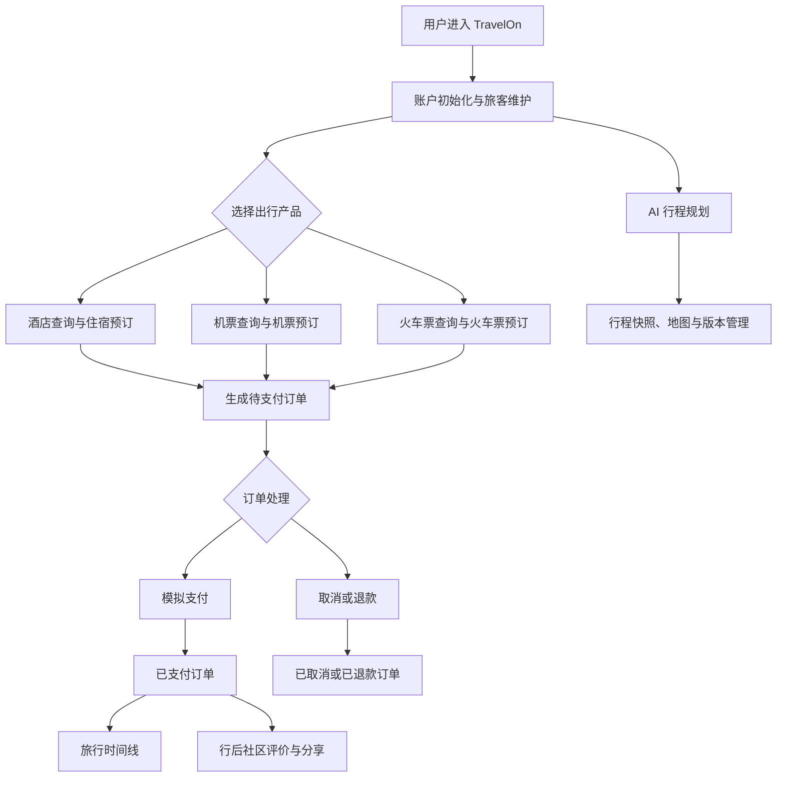

# TravelOn 业务场景说明

> 文档版本：V1.0  
> 编写日期：2026-08-25  
> 编写依据：当前仓库中的 `travel-ui` 前端页面、`travel-api` 后端服务以及现有用户手册、需求规格说明书。

## 1. 文档目的

本文档用于描述 TravelOn 当前实现中可以独立完成、能够产生明确业务结果的业务场景（用例）。
业务场景强调“参与者为了完成一个业务目标而执行的一组连续操作”，不把单个页面、按钮、
接口或数据库操作直接当作独立业务场景。

### 1.1 业务场景与非独立用例

| 业务场景（用例）示例 | 不单独算一个业务场景（用例） |
|---|---|
| 用户完成一次酒店查询、选择房型、填写入住人并创建订单，获得待支付订单；用户完成一次机票或火车票查询、选票、填写乘客并创建订单；用户对订单完成支付或取消退款，并得到最终状态。 | 只有登录、注册、查看一张表、打开一个页面、点击一个按钮、调用一个接口或执行一次数据库操作。 |
| 用户完成一次社区内容浏览、发布或互动，最终看到帖子、评论、点赞、收藏或评价结果。 | 仅查询帖子列表、仅切换一个筛选条件、仅上传一张图片等局部步骤。 |
| 用户输入目的地、日期、人数和偏好，运行 AI 规划并查看、编辑或恢复一份行程快照。 | 只创建规划会话、只发送一条消息、只查看一张地图或只保存一个 Markdown 快照。 |

## 2. 系统角色与边界

### 2.1 参与者

| 参与者 | 职责 |
|---|---|
| 游客 | 浏览首页、查询酒店和交通信息；创建订单、支付、社区发布和其他受限操作需要登录。 |
| 注册用户 | 管理个人资料和常用旅客，选择产品、创建订单、支付、取消或申请退款，参与社区和 AI 行程规划。 |
| TravelOn 前端 | 收集输入、进行表单校验、展示查询结果、发起业务请求和反馈操作结果。 |
| TravelOn 网关及业务服务 | 转发请求，查询酒店/交通资源，创建订单，处理支付、退款、社区内容和 AI 规划数据。 |
| 模拟支付服务 | 模拟银联卡支付结果，并产生支付流水。 |
| AI 规划服务及外部模型 | 保存规划会话和快照，生成行程内容；外部模型或地图配置不可用时可能返回错误或降级结果。 |

### 2.2 当前实现边界

- 机票和火车票使用系统中的票务数据进行查询与预订演示，不直接对接真实航司或 12306。
- 支付为模拟支付，当前版本仅支持银联卡演示流程；钱包余额支付已移除。
- 酒店筛选使用酒店评分（0 至 5 分），支持最低评分和评分优先排序，不按酒店星级作为当前主要筛选条件。
- 机票和火车票查询页默认优先使用“北京 → 上海”作为出发地和到达地。
- 机票按经济舱、商务舱、头等舱分舱位售卖，火车票按二等座、一等座、商务座等席别售卖；同一班次的不同舱位/席别在结果中合并为一张卡片。
- 演示票价按班次和日期浮动，同一航班不同日期的价格不同；票价仅用于演示，不代表真实售价。
- 火车查询支持车次类型筛选：`G/C`、`D`、`T`、`K`、`Z`、`其他`，并支持按车次号或车次片段筛选。
- 旧版旅游套餐接口目前仅保留兼容入口，接口会提示套餐预订正在重建，不作为当前可验收的独立业务场景。
- 管理员后台不在当前前端主流程中，本文档不把后台产品管理、后台订单管理作为已实现业务场景。

## 3. 业务场景总览

| 编号 | 业务场景 | 主要参与者 | 触发条件 | 业务结果 |
|---|---|---|---|---|
| BS-01 | 账户初始化与出行人维护 | 游客、注册用户 | 用户需要保存个人信息或为本人/他人预订 | 用户资料和常用旅客信息可用于后续预订 |
| BS-02 | 酒店查询与住宿预订 | 注册用户、酒店服务、订单服务 | 用户确定目的地、住宿日期和人数 | 生成酒店待支付订单并进入订单详情 |
| BS-03 | 机票查询与机票预订 | 注册用户、交通服务、订单服务 | 用户确定航线、日期和乘客 | 生成机票待支付订单并进入订单详情 |
| BS-04 | 火车票查询与火车票预订 | 注册用户、交通服务、订单服务 | 用户确定出发地、目的地、日期和车次偏好 | 生成火车票待支付订单并进入订单详情 |
| BS-05 | 订单支付与售后处理 | 注册用户、订单服务、模拟支付服务 | 用户打开待支付或可取消订单 | 订单变为已支付、已取消、退款处理中或已退款 |
| BS-06 | 统一订单与旅行时间线管理 | 注册用户、订单服务 | 用户需要集中查看或整理已购行程 | 用户查看订单状态、支付流水、退款信息和有效行程 |
| BS-07 | 社区内容分享与互动 | 注册用户、社区服务 | 用户希望浏览攻略、分享经历或评价目的地 | 帖子、评论、点赞、收藏、路线或评价完成发布和展示 |
| BS-08 | AI 行程规划与版本管理 | 注册用户、AI 规划服务、外部模型 | 用户输入目的地和出行偏好并开始规划 | 生成可查看、编辑、对比和恢复的行程规划快照 |

## 4. 业务场景详细说明

## BS-01 账户初始化与出行人维护

### 目标

用户完成账户使用准备，维护个人资料和常用旅客，为酒店、机票和火车票预订提供可复用的出行人信息。

### 前置条件

- 用户可以从首页进入账户中心。
- 修改资料、管理旅客和提交预订等需要身份信息的操作要求用户登录。

### 主成功场景

1. 用户进入 `/account`。
2. 用户注册新账户，或使用已有账户登录。
3. 系统展示用户资料。
4. 用户补充或修改昵称、手机号、邮箱等个人资料。
5. 用户新增常用旅客，填写姓名、证件类型、证件号码、手机号和旅客类型。
6. 系统保存旅客信息，并在账户中心展示最新列表。
7. 用户后续进入酒店、机票或火车票预订流程时选择已保存旅客。

### 异常与替代流程

- 注册信息不完整或格式错误：前端阻止提交并提示错误。
- 账号或密码错误：登录失败并展示中文提示。
- 未登录用户尝试提交订单：系统提示先登录。
- 旅客证件信息不符合对应票种规则：系统阻止提交并要求修改。

### 完成结果

用户拥有可用的账户资料和常用旅客信息，后续预订可以减少重复填写。

### 相关页面

`/`、`/account`

## BS-02 酒店查询与住宿预订

### 目标

用户按目的地、日期、人数和住宿偏好筛选酒店，查看详情和房型，创建一笔待支付酒店订单。

### 前置条件

- 酒店服务可用并能够返回目的地和酒店数据。
- 入住日期不能早于当前日期，离店日期必须晚于入住日期。
- 提交订单时用户已登录，并至少选择一位入住人。

### 主成功场景

1. 用户进入 `/reservations/hotels`。
2. 系统加载酒店目的地，默认优先选择北京。
3. 用户选择目的地、入住日期、离店日期和入住人。
4. 用户输入酒店名称或设置价格区间。
5. 用户按最低评分筛选酒店，或选择酒店类型、房型和排序方式。
6. 系统展示符合条件的酒店列表，显示价格、评分、图片和可预订入口。
7. 用户查看酒店详情，检查酒店位置、描述、评分、社区评价和可订房型。
8. 用户选择房型，并在订单区域选择入住人。
9. 用户查看入住日期、离店日期、晚数、房型和应付金额。
10. 用户在确认弹窗中确认订单规则并提交。
11. 系统创建酒店待支付订单。
12. 页面提示“订单提交成功”，弹窗或提示中提供“查看订单”按钮，并自动跳转到订单详情和支付倒计时位置。

### 业务规则

- 酒店筛选依据当前展示的评分，最低评分范围为 0 至 5 分。
- 酒店列表支持低价优先、评分优先和高价优先排序。
- 酒店订单价格根据房型参考单价、入住人数和入住晚数计算。
- 订单创建后进入待支付状态，用户需要在规定时间内完成支付。

### 异常与替代流程

- 目的地、日期或价格条件无效：页面提示修改条件。
- 没有符合条件的酒店：展示空状态，并允许更换城市或放宽评分、价格条件。
- 没有可用房型：用户需要更换日期或减少入住人数。
- 用户未登录或未选择入住人：系统阻止提交。
- 创建订单失败：页面保留当前查询结果，并提示稍后重试。

### 完成结果

系统生成一笔酒店待支付订单，订单可在 `/reservations/:reservationId` 中继续支付、取消或查看状态。

### 相关页面

`/reservations/hotels`、`/reservations/hotels/:hotelId`、`/reservations/:reservationId`

## BS-03 机票查询与机票预订

### 目标

用户查询航班或机票方案，选择舱位和乘机人，创建一笔待支付机票订单。

### 前置条件

- 交通服务可用并返回机票票务数据。
- 出发地、到达地和出发日期有效。
- 提交订单时用户已登录，并至少选择一位乘机人。

### 主成功场景

1. 用户进入 `/reservations/flights`。
2. 系统加载可用出发地和到达地。
3. 系统默认优先填入“北京 → 上海”。
4. 用户选择或修改出发地、到达地、出发日期和乘客人数。
5. 用户设置价格区间、仅看有票和排序方式。
6. 系统按航班聚合舱位，展示航班时间、机场、航班号、当前舱位、价格和余票。
7. 用户在同一航班下切换经济舱、商务舱、头等舱等舱位，价格与余票随之更新。
8. 用户选择一个舱位。
9. 用户在填写订单区域选择乘机人。
10. 用户确认票价、行程、舱位和退改提示。
11. 用户提交订单。
12. 系统生成机票待支付订单，并提示查看订单。
13. 系统自动进入订单详情，用户可以继续支付。

### 异常与替代流程

- 出发地与到达地相同：系统阻止查询或要求更换地点。
- 没有符合条件的航班：展示空状态和可尝试的目的地。
- 航班距离起飞时间过近：系统隐藏不可售航班并给出提示。
- 并非所有航班都提供全部舱位：只有经济舱的航班不展示舱位切换区域。
- 余票不足：预订按钮不可用。
- 未登录、未选择乘机人或乘客规则校验失败：系统阻止提交。

### 完成结果

系统生成机票待支付订单，订单详情中保存航班、舱位、乘客和金额快照。

### 相关页面

`/reservations/flights`、`/reservations/:reservationId`

## BS-04 火车票查询与火车票预订

### 目标

用户按线路、日期、价格、余票、车次类型和车次号筛选列车，选择席别和乘车人，创建火车票订单。

### 前置条件

- 交通服务可用并返回火车票数据。
- 出发地、到达地和出发日期有效。
- 提交订单时用户已登录，并至少选择一位乘车人。

### 主成功场景

1. 用户进入 `/reservations/trains`。
2. 系统加载出发城市、到达城市和车站选项。
3. 系统默认优先填入“北京 → 上海”。
4. 用户选择或修改出发城市、到达城市和日期。
5. 用户设置价格区间、仅看有票、出发站和到达站条件。
6. 用户在“车次类型”区域选择一个或多个类型：
   - `G/C`
   - `D`
   - `T`
   - `K`
   - `Z`
   - `其他`
7. 用户在“按车次筛选”输入车次号或片段，例如 `G101`、`D` 或 `K`。
8. 系统根据车次类型和车次号过滤结果，并按车次聚合席别。
9. 用户在同一车次下切换商务座、特等座、一等座、二等座等席别。
10. 用户查看出发时间、到达时间、耗时、车次、席别、价格和余票。
11. 用户选择一个席别并选择乘车人。
12. 用户确认订单信息后提交。
13. 系统创建火车票待支付订单，提示查看订单并自动进入订单详情。

### 业务规则

- “全选”可一次选中全部车次类型；取消部分类型后只展示选中的类型。
- 车次号筛选不区分大小写，输入内容会转换为大写后匹配。
- 同车次的不同席别合并展示，用户可以在车次卡片内切换席别。
- 发车前一段时间内停止售票，过近的车次不会允许继续预订。

### 异常与替代流程

- 没有符合条件的车次：展示空状态，并允许调整线路、日期或筛选条件。
- 输入车次号后没有匹配结果：提示放宽车次号或车次类型条件。
- 车次无余票：预订按钮不可用。
- 用户未登录、未选乘车人或乘客规则校验失败：系统阻止提交。
- 创建订单失败：保留查询条件和筛选结果，提示稍后重试。

### 完成结果

系统生成火车票待支付订单，订单详情中保存车次、席别、乘客和金额快照。

### 相关页面

`/reservations/trains`、`/reservations/:reservationId`

## BS-05 订单支付与售后处理

### 目标

用户对待支付订单完成支付，或对未支付/已支付订单执行取消和退款操作，获得明确的最终订单状态。

### 前置条件

- 系统中存在当前用户可访问的订单。
- 支付操作要求订单处于待支付状态。
- 取消或退款操作必须符合当前订单状态和业务规则。

### 主成功场景一：支付订单

1. 用户从订单创建成功提示点击“查看订单”，或进入 `/reservations` 后打开订单详情。
2. 用户确认订单金额、产品信息和支付截止时间。
3. 用户选择银联卡支付。
4. 用户补充付款人实名信息，或使用已保存的实名信息。
5. 用户确认支付。
6. 模拟支付服务返回成功。
7. 系统更新订单为已支付，保存支付流水。
8. 用户在订单详情中看到支付成功状态，并可在旅行时间线查看行程。

### 主成功场景二：取消或退款

1. 用户打开可取消订单详情。
2. 用户点击取消订单或申请退款。
3. 用户填写取消原因并提交。
4. 未支付订单变为已取消，相关预订资源释放。
5. 已支付订单进入退款流程，系统记录退款金额、原因和时间。
6. 退款完成后订单变为已退款，并保留对应的退款流水。

### 异常与替代流程

- 银行卡号格式或付款人实名信息不合法：阻止支付并提示修改。
- 支付失败：订单保持待支付，记录失败流水和失败原因。
- 订单已超时：订单不可再支付，系统展示已超时状态。
- 订单已取消、已退款或已完成：不允许重复取消或重复退款。
- 服务请求失败：保留当前页面状态，提示刷新或稍后重试。

### 完成结果

订单和支付/退款流水状态保持一致，用户可以在订单详情中查看整个状态变化过程。

### 相关页面

`/reservations`、`/reservations/:reservationId`

## BS-06 统一订单与旅行时间线管理

### 目标

用户集中查看酒店、机票和火车票订单，并将已支付且尚未开始的有效订单汇总成旅行时间线。

### 前置条件

- 用户已有订单，或已完成至少一笔支付。
- 订单服务可以正常返回订单、支付流水和退款记录。

### 主成功场景

1. 用户进入 `/reservations`。
2. 系统加载当前用户的订单列表。
3. 用户查看订单号、产品类型、入住/出发时间、人数、金额和状态。
4. 用户进入某一订单详情，查看旅客、支付、退款和状态时间线。
5. 用户返回订单列表，或进入“我的行程”。
6. 系统从已支付且尚未开始的订单中整理交通和酒店节点。
7. 用户在 `/reservations/timeline` 按时间顺序查看出发、到达、入住等节点。
8. 用户可以从订单列表发起再次预订或对可取消订单执行取消操作。

### 异常与替代流程

- 没有订单：展示空状态和产品入口提示。
- 订单服务不可用：展示错误提示，不出现白屏。
- 订单已退款、取消、超时或行程已结束：不进入有效旅行时间线。
- 订单日期不完整：时间线使用可用信息展示，缺失节点不阻断订单列表。

### 完成结果

用户能够从统一入口了解订单状态和当前有效行程，减少在不同产品页面之间切换。

### 相关页面

`/reservations`、`/reservations/:reservationId`、`/reservations/timeline`

## BS-07 社区内容分享与互动

### 目标

用户浏览旅游内容，发布帖子或路线，对帖子、景点、路线和酒店进行评论、评分、点赞和收藏。

### 前置条件

- 社区服务可用。
- 浏览内容可以不登录；发布、评论、评价、点赞和收藏等操作需要登录。

### 主成功场景

1. 用户进入 `/community`。
2. 用户浏览帖子、景点和旅游路线。
3. 用户进入帖子、景点或路线详情。
4. 用户查看正文、图片、评分、评论和相关信息。
5. 用户登录后发布帖子，填写标题、内容、分类、目的地并上传图片。
6. 用户对帖子发表评论或点赞。
7. 用户对帖子、景点或路线进行收藏。
8. 用户对酒店、景点或路线发布评分和文字评价。
9. 用户进入 `/community/me`，查看自己的帖子、路线、评价和收藏。

### 异常与替代流程

- 未登录执行受限操作：系统提示登录。
- 内容或图片校验失败：阻止提交并提示错误。
- 图片上传失败：帖子表单保留，用户可以重试或移除图片。
- 删除评论、帖子或路线时权限不足：操作失败并提示原因。
- 社区服务不可用：页面展示错误状态，不影响酒店和交通模块。

### 完成结果

社区内容、互动关系和用户个人社区数据被保存并可再次查看。

### 相关页面

`/community`、`/community/me`、`/community/posts/:postId`、`/community/attractions/:attractionId`、`/community/routes/:routeId`

## BS-08 AI 行程规划与版本管理

### 目标

用户输入旅行基础信息和偏好，生成结构化行程，查看地图和 Markdown 结果，并对规划版本进行编辑、对比、回滚或恢复。

### 前置条件

- AI 规划页面可以访问。
- 用户至少填写目的地、出行日期、天数和人数等核心槽位。
- AI 模型和地图 Key 配置完整时可以生成增强结果；未配置时系统可能返回错误提示或降级结果。

### 主成功场景

1. 用户进入 `/ai-planner`。
2. 用户输入目的地、日期、天数、人数、预算和出行偏好。
3. 系统创建规划会话并保存核心槽位。
4. 用户点击开始规划，或在会话中继续发送自然语言需求。
5. 前端通过规划服务提交任务并接收流式进度。
6. AI 规划服务调用模型和旅行工具，生成每日行程。
7. 系统补充景点、路线、交通和地图点位信息。
8. 系统保存一份行程快照。
9. 用户查看 Markdown 行程、地图、每日计划和可用的内部预订入口。
10. 用户修改 Markdown 或规划偏好，生成新的版本。
11. 用户查看历史快照、比较版本，并回滚整份规划或恢复某一天的版本。

### 异常与替代流程

- 核心槽位缺失：系统不启动规划，提示补全目的地、日期、天数或人数。
- AI 服务连接中断：页面提示连接关闭，并尝试使用非流式或降级流程。
- 外部模型 Key 缺失或调用失败：展示依赖说明或错误提示，不影响其他业务模块。
- 快照版本冲突：提示用户重新加载最新版本后再保存。
- 地图增强失败：保留文字行程和基础地点信息。

### 完成结果

系统保存一份或多份可追溯的行程快照，用户能够继续编辑、查看历史版本或恢复规划。

### 相关页面

`/ai-planner`

## 5. 主要业务关系

## 6. 业务场景与页面对应关系

| 业务场景 | 主要前端页面 | 主要后端能力 |
|---|---|---|
| BS-01 | `/account` | 用户注册登录、资料维护、旅客管理 |
| BS-02 | `/reservations/hotels`、`/reservations/hotels/:hotelId` | 酒店目的地、酒店搜索、详情、房型和酒店订单 |
| BS-03 | `/reservations/flights` | 机票选项、票务搜索和交通订单 |
| BS-04 | `/reservations/trains` | 火车票选项、车次/席别筛选、票务搜索和交通订单 |
| BS-05 | `/reservations/:reservationId` | 支付、支付流水、取消、退款和订单状态 |
| BS-06 | `/reservations`、`/reservations/timeline` | 订单列表、订单详情和有效行程汇总 |
| BS-07 | `/community`、`/community/me` 及详情页 | 帖子、评论、点赞、评价、路线、景点、收藏和图片 |
| BS-08 | `/ai-planner` | 规划会话、WebSocket 对话、快照、Markdown 和版本管理 |

## 7. 不纳入当前独立业务场景的功能

以下内容是业务场景中的步骤、支撑能力或当前未形成完整闭环的功能，不单独列为当前业务场景：

1. 用户登录、注册、单次资料修改。
2. 查询一个目的地列表、酒店列表、航班列表或车次列表。
3. 酒店最低评分、价格区间、房型、酒店类型筛选。
4. 火车车次类型复选框、按车次号输入框、席别切换。
5. 首页的单个搜索框、日期选择器、人数选择器或热门路线按钮。
6. 订单详情页中的单个支付按钮、退款按钮、刷新按钮或倒计时组件。
7. 单个接口调用、消息队列投递、数据库写入和支付流水记录。
8. 单张图片上传、单次点赞、单条评论或单次收藏切换。
9. AI 规划中的单条消息、单个地图点、单个 Markdown 快照保存操作。
10. 旧版旅游套餐兼容接口；该接口目前返回“旅游套餐预订正在重建”提示。

## 8. 当前验收建议

建议至少按以下完整链路进行演示和验收：

1. 注册或登录用户，新增一名常用旅客。
2. 在酒店页按目的地、日期、价格和最低评分筛选，查看详情并创建酒店订单。
3. 在订单详情完成银联卡模拟支付，确认订单状态和支付流水。
4. 在机票页验证默认“北京 → 上海”，切换舱位后选择航班并创建订单。
5. 在火车票页验证默认“北京 → 上海”，验证车次类型和按车次筛选，再选择席别创建订单。
6. 在订单列表查看多个订单，并在旅行时间线查看已支付且未开始的行程。
7. 在社区浏览内容，登录后发布帖子、评论、点赞或收藏。
8. 在 AI 规划页创建会话，生成行程并查看快照或版本恢复结果。
