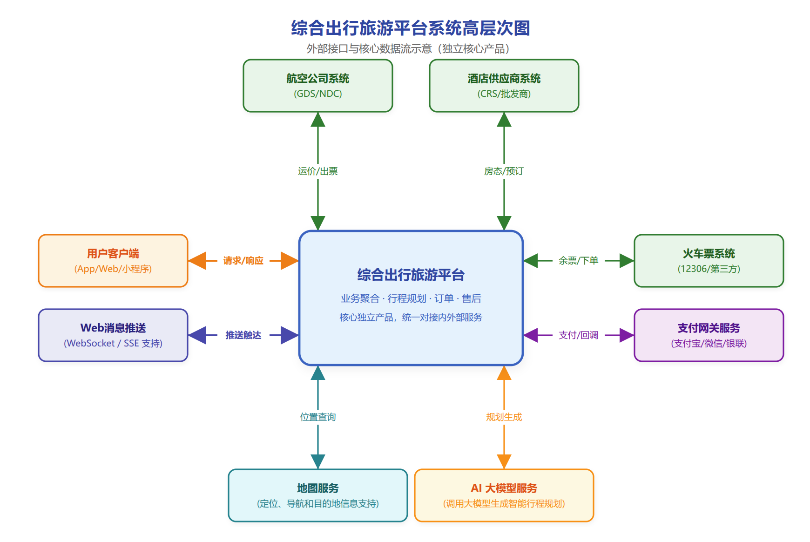
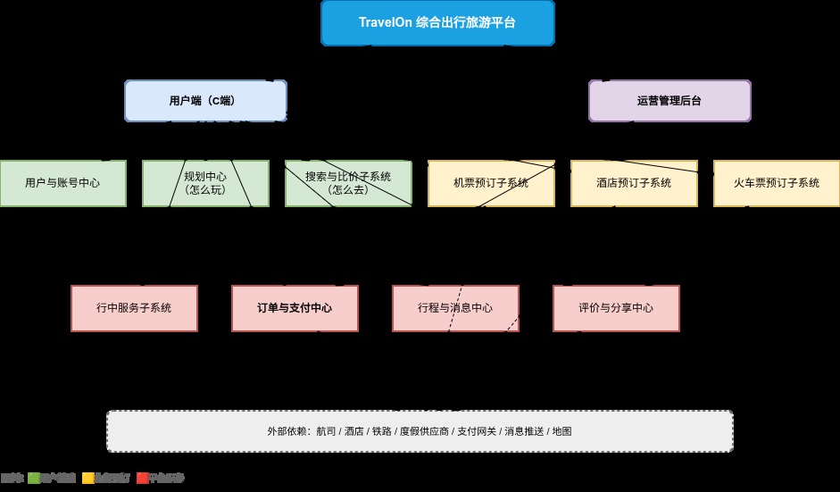
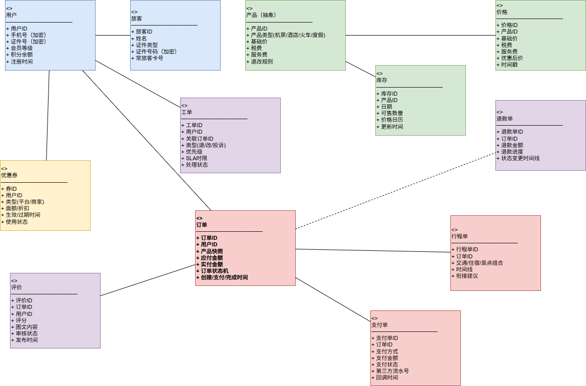
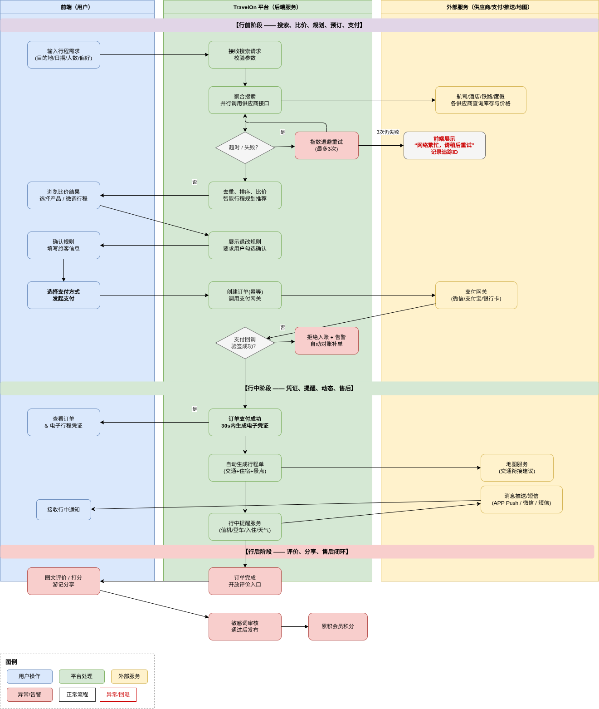
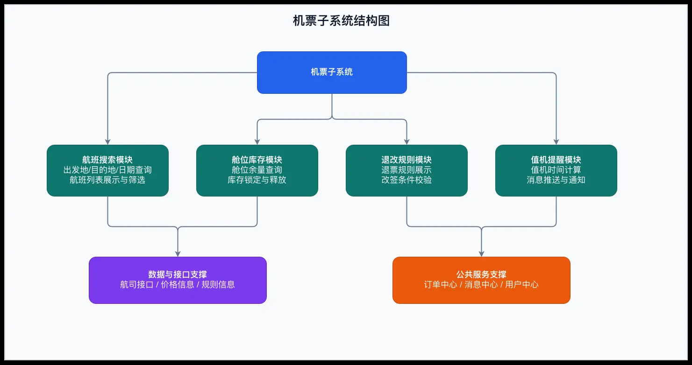
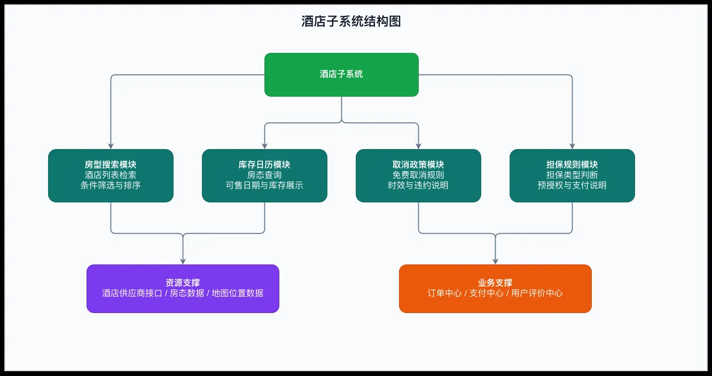
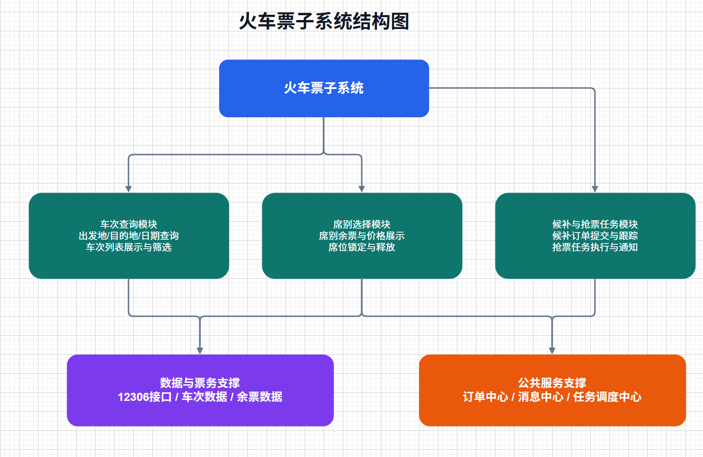
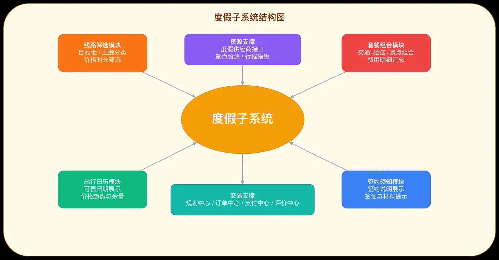
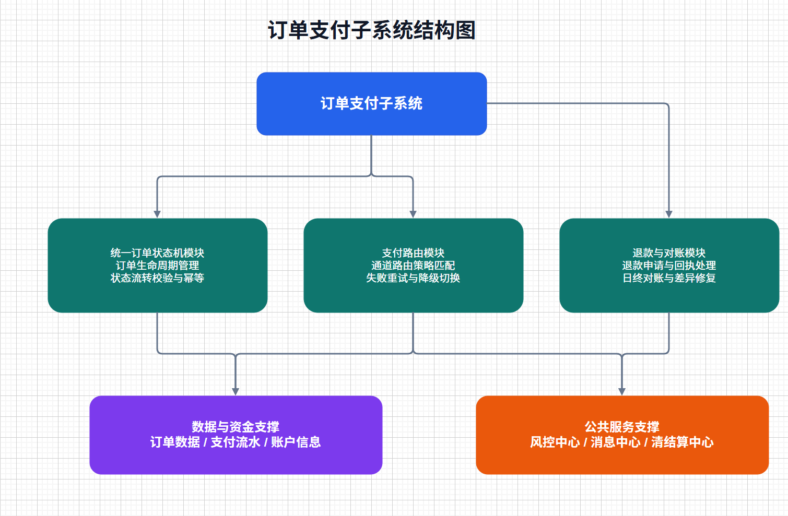
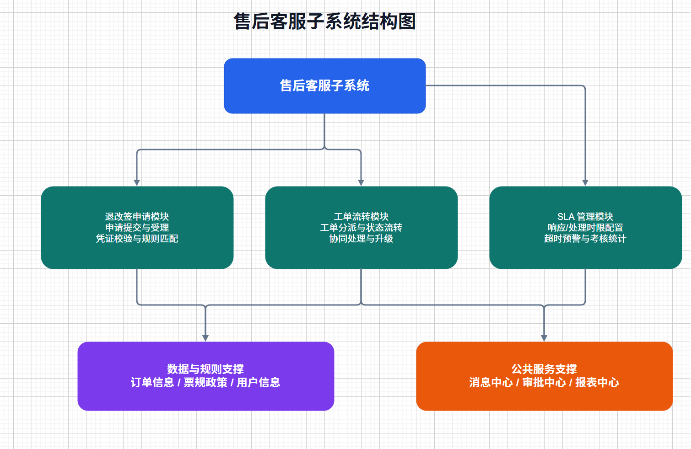

# 旧版需求规格

> 来源：`/Users/fauci/Desktop/需求规格.pdf`。本文由旧版 PDF 自动提取为 Markdown，保留原文内容为主，并按 PDF 页码顺序整理图片。

<!-- 原 PDF 第 1 页 -->
软件需求规格说明书
## 1 范围
### 1.1 标识
- 文档名称：软件需求规格说明书（SRS）
- 系统名称：TravelOn

- 系统代号：TravelOn

- 版本号：V1.0

- 发布日期：2026-05-25

- 适用范围：Web

### 1.2 系统概述
本系统用于提供机票、酒店、火车票、旅游度假的一站式搜索、比价、预订、支付、售后与分
享服务，面向 C 端用户与平台运营人员。
系统一般特性：
- 机票、火车票搜索和预订；多种出行线路的价格比较

- 酒店和民宿的搜索浏览、查看详细信息和评价、在线预订功能

- 旅游度假的智能行程规划，给出不同风格、价格和游玩时长的方案，并提供实时优惠提醒

项目相关方：
- 投资方/需方：软件工程基础课程的老师和助教

- 用户方：广大旅客、商旅客户

- 开发方：产品、研发、测试、运维团队和商务部们

- 资源提供方：第三方供应商，如航司、酒店、铁路、地图等

<!-- 原 PDF 第 2 页 -->
运行现场：
- 计划在本地服务器或者云服务器上部署，通过域名访问web页面。

### 1.3 文档概述
本文档用于明确综合出行旅游平台的业务、功能、性能、安全与验收要求，作为产品设计、研
发实现、测试验收和上线评审依据。
保密要求：无
- 文档默认内部使用，禁止未授权外传

### 1.4 基线
- 大作业要求中的简要需求描述
- 携程、同程、去哪儿网等同类产品的功能

- 法规基线：《个人信息保护法》《数据安全法》《网络安全法》。
## 2 引用文件
- 编号       名称           版本/日期                  说明
- REF-01   《个人信息保护法》    2021年8月20日通            隐私与数据处理合规
- 过，2021年11月1日           依据
- 施行，现行有效
- REF-02   《数据安全法》      2021年6月10日通            数据分类分级与安全
- 过，2021年9月1日            治理依据
- 施行，现行有效
- REF-03   《网络安全法》      2025年10月28日修           网络安全合规依据
- 订通过，2026年1月
- 1日施行，现行有效
- REF-04   携程官网         https://www.ctrip.co   竞品对标参考
- m/
- REF-05   同程官网         https://www.ly.com/    竞品对标参考
- REF-06   去哪儿网官网       https://www.qunar.c    竞品对标参考
- om/

<!-- 原 PDF 第 3 页 -->
## 3 需求
本章定义TravelOn（以下简称“本平台”）的软件需求，覆盖机票预订、酒店住宿、旅游度
假、火车票购买全链路能力，并围绕“行前规划-行中服务-行后分享”全旅程场景给出可验
证、可追踪的验收标准。
### 3.1 所需的状态和方式
本平台运行状态定义如下：
状态/方式            描述               关键要求
正常服务             用户数量不大，服务器压力     所有功能可用
- 小，全量功能开放
高峰限流             节假日和其他活动期间高并发    排队与限流生效，保证核心下
- 访问               单功能正常运行
服务降级             上游供应商异常          停止相应功能的访问
维护模式             维护软件，更新和修改现有功    暂停相关功能的访问
- 能

### 3.2 需求概述
#### 3.2.1 目标
开发意图和目标
为满足用户日益增长的出行与旅游预订需求，需开发一款集机票预订、酒店住宿、旅游度假、
火车票购买于一体的综合出行旅游平台。该平台应提供丰富的出行产品选择、智能的行程规划
工具、实时的价格比对与优惠提醒，覆盖用户“行前规划-行中服务-行后分享”的全旅程场
景。平台应注重价格信息的透明度、预订流程的便捷性以及售后服务的可靠性，让每一次出发
都轻松无忧，让每一次归来都满载美好回忆。

作用范围
- 业务范围：机票预订、酒店住宿、旅游度假行程规划、火车票购买。

- 用户范围：个人休闲出行、商务差旅、家庭旅游等多类终端用户。

<!-- 原 PDF 第 4 页 -->
- 场景范围：行前（搜索、比价、规划、预订）、行中（行程提醒、在线值机、实时变动通
- 知、客服支持）、行后（订单评价、游记分享、积分累积）。

现有产品问题及本产品解决的问题
现有出行预订工具常存在以下问题：
- 机票、酒店、度假产品分隔在不同平台或统一平台的不同位置，用户需多次搜索、反复比
价，缺乏统一入口。
- 价格信息展示不透明，附加费用隐藏，最终结算价与搜索价差异大。

- 缺乏智能行程规划，无法根据偏好自动推荐最优组合。

- 预订成功后行中服务脱节，改签、退票、酒店变更等操作复杂。

本产品针对上述问题，提供：
- 一个平台聚合机票订购、火车票订购、行程规划和管理、酒店预订四大核心业务，统一搜
索、统一订单管理。
- 价格透明显性承诺，并提供多平台实时比价和降价提醒。

- 智能行程规划引擎，根据预算、时间、偏好一键生成多方案行程。

- 全流程统一规划系统，提供便捷的行程更改功能

主要功能
1. 统一搜索与预订：支持机票、火车票、酒店、度假产品的复合条件搜索与过滤。
2. 智能行程规划：输入目的地、日期、偏好，自动组合交通+住宿+景点，生成可视化行程方
案。
3. 实时价格比对与优惠提醒：展示价格趋势，设置降价通知。
4. 用户中心与订单管理：行程大视角的订单管理，统一提供全品类订单列表、电子凭证、行程
单、发票申请，以及退改签自助服务。
5. 行中服务：火车、航班动态，值机提醒，酒店入住指引。
6. 行后评价与分享：图文评价、评分、游记发布、社交分享，积累会员积分。
7. 会员与营销体系：积分、优惠券、会员等级权益，精准推荐。

主要业务流程

<!-- 原 PDF 第 5 页 -->
输入行程需求（目的地、日期、人数等） → 系统调用各供应商接口（或搜索本地储存的数据）
进行搜索，并进行智能规划 → 结果展示（可按价格、时间、评分排序） → 选择产品 → 根据个
人偏好微调行程 → 填写个人信息并支付 → 行中的各个时间点（值机）推送提醒 → 行程结束后
可评价分享
系统高层关系（文字说明）：
- 本平台是独立产品，向上对接用户端与运营后台，向下对接航司、酒店、铁路、度假供应
商、支付网关、消息推送、地图等服务。

#### 3.2.2 运行环境
- 客户端：主流现代浏览器。
- 服务端：Linux ，容器化部署

- 数据与中间件：PostpreSQL 、Redis、消息队列

- 网络：公网 HTTPS + 内网服务

#### 3.2.3 用户的特点

<!-- 原 PDF 第 6 页 -->
- 普通用户：对价格敏感，关注价格透明；需要UI简洁清晰；希望退改便捷。
- 商旅用户：需要高频出行，关注预订和管理订单的效率，以及发票与报销合规。

- 运营人员：关注库存和活动的高效管理，需要多维度的数据查看和分析功能。

- 客服人员：关注工单响应速度和标准化售后流程。

#### 3.2.4 关键点
- 核心功能：多品类聚合搜索、实时比价、智能行程规划、统一下单与售后、行中服务、行后
分享和评价
- 关键算法：价格排序和筛选、优惠叠加计算、智能行程规划。

- 关键技术：限流和服务降级，前后端分离+微服务架构

#### 3.2.5 约束条件
- 项目周期：35天完成首期上线，校历15周前完成全量核心功能
- 合规约束：遵守《个人信息保护法》 《网络安全法》《数据安全法》及发票、支付监管要求
- 接口约束：不确保可以找到12306和各航司的真实订票接口，因此只能模拟真实服务

- 资源和环境约束：没有高性能的服务器，并发量受限

### 3.3 需求规格
#### 3.3.1 软件系统总体功能/对象结构

<!-- 原 PDF 第 7 页 -->
#### 3.3.2 软件子系统功能/对象结构
- 机票子系统：航班搜索、舱位库存、退改规则、值机提醒。

<!-- 原 PDF 第 8 页 -->
- 酒店子系统：房型搜索、库存日历、取消政策、担保规则。

- 火车票子系统：车次查询、席别选择、候补与抢票任务。

<!-- 原 PDF 第 9 页 -->
- 度假子系统：线路筛选、套餐组合、出行日历、签约须知。

- 订单支付：统一订单状态机、支付路由、退款与对账。

<!-- 原 PDF 第 10 页 -->
- 售后客服：退改签申请、工单流转、SLA 管理。

<!-- 原 PDF 第 11 页 -->
#### 3.3.3 描述约定
- 货币单位：人民币（元），保留两位小数。
- 时间标准：北京时间 UTC+8，24 小时制。

- 优惠后价格计算：

◦ 订单应付金额 = 商品总价 - 平台优惠 - 商家优惠 + 税费 + 服务费。

### 3.4 CSCI能力需求
#### 3.4.1 搜索与实时比价能力
- 输入：出发地/目的地/日期/人数/偏好；处理：聚合多供应商结果并去重排序；输出：可
预订产品列表。
- 机票/酒店/火车票搜索接口 P95 响应时间 ≤ 2.5 秒。

- 价格更新时间戳必须展示，数据延迟 ≤ 60 秒。

- 比价页必须显示“基础价、税费、服务费、优惠后价”明细。

#### 3.4.2 机票预订能力

<!-- 原 PDF 第 12 页 -->
- 支持单程/往返/多程查询与预订。
- 下单前必须展示退改签规则与行李规则；用户勾选确认后方可支付。

- 机票下单成功后 30 秒内生成订单与电子行程凭证。

#### 3.4.3 酒店预订能力
- 支持按位置、价格、星级、评分、设施筛选。
- 必须展示房型库存、取消政策、生效时限与担保要求。

- 酒店预订确认成功率（月均）≥ 99.5%。

#### 3.4.4 火车票预订能力
- 支持车次、席别、中转方案查询。
- 支持候补与抢票任务创建，并提供状态通知。

- 抢票任务状态更新延迟 ≤ 30 秒。

#### 3.4.5 旅游度假能力
- 支持跟团游/自由行/景酒套餐产品展示与预订。
- 必须展示行程日历、费用包含/不含、退订规则、签证提示。

- 支持图文详情、用户评价与问答。

#### 3.4.6 智能行程规划能力
- 支持用户导入已购订单自动生成行程单。
- 提供交通衔接建议（机场/车站到酒店）   ，含预计时间与费用区间。
- 行程推荐计算耗时 ≤ 3 秒（P95）。
#### 3.4.7 实时优惠提醒能力
- 支持价格订阅（航线、酒店、目的地）。
- 当价格波动达到用户阈值时，5 分钟内推送提醒。

- 优惠叠加规则冲突时按“用户实付最低”原则自动选择。

#### 3.4.8 订单、支付与售后能力
- 统一订单中心管理多品类订单状态。
- 支持主流支付方式（微信支付、支付宝、银行卡）。
- 支持在线退订/改签/退款申请。

<!-- 原 PDF 第 13 页 -->
- 退款进度全程可视（支持申请中、审核中、退款中、已完成、失败等状态），状态变更实时
- 通知。
#### 3.4.9 行中服务与行后分享能力
- 行中提供天气、值机、登车/入住提醒。
- 行后支持图文评价、打分、游记分享。

- 评价内容须经敏感词与违规内容审核。

### 3.5 CSCI 外部接口需求
#### 3.5.1 接口标识
- 接口标识          名称        类型        对接实体
- IF-UI-01      用户界面接口    用户接口      Web 浏览器
- IF-HW-01      终端硬件接口    硬件接口      用户设备（GPS、相
- 机）
- IF-SW-01      供应商数据接口   软件接口      模拟的航司/酒店/火
- 车票数据接口
- IF-SW-02      地图服务接口    软件接口      高德/百度地图 API
- IF-COM-01     通信接口      通信接口      HTTP/HTTPS 网络通
- 信
#### 3.5.2 接口需求
IF-UI-01：用户界面接口

<!-- 原 PDF 第 14 页 -->
需求项               说明
对接实体              Web 浏览器（Chrome、Firefox、Edge）
接口类型              图形用户界面（GUI）
界面语言              中文简体
页面适配              支持 PC 端主流分辨率（≥1366×768）
关键页面              首页、搜索页、产品列表页、订单页、用户中心
数据格式              HTML5 + CSS3 + JavaScript

IF-HW-01：终端硬件接口
需求项               说明
对接实体              用户终端设备
GPS 定位            用于"附近酒店/景点推荐"功能，仅在前端主动触发时调用浏览
- 器 Geolocation API
相机                用于用户头像上传、评价图片上传，调用浏览器 Media Capture
- API
权限要求              定位权限按需申请，用户拒绝不影响其他功能使用

IF-SW-01：供应商数据接口

<!-- 原 PDF 第 15 页 -->
需求项              说明
对接实体             模拟的供应商数据服务（小组自建或 JSON Server / Mock API）
接口协议             HTTP RESTful API，JSON 格式
数据内容             航班信息、酒店信息、火车票信息、度假产品信息
主要操作             GET 查询（搜索/筛选）、POST 提交（模拟下单）
超时设置             请求超时 3 秒
异常处理             超时或失败返回兜底数据或提示"暂无数据"

IF-SW-02：地图服务接口
需求项                      说明
对接实体                     高德地图 API 或百度地图 API
接口协议                     HTTP RESTful API，JSON 格式
用途                       酒店位置展示、景点标注、行程路线可视化
调用方式                     前端 JavaScript SDK 加载地图组件
异常处理                     地图加载失败时展示静态位置信息

IF-COM-01：通信接口

<!-- 原 PDF 第 16 页 -->
需求项                   说明
通信协议                  HTTP（开发环境）/ HTTPS（生产环境建议）
数据格式                  JSON
请求方式                  GET（查询）、POST（提交）、PUT（修改）、DELETE（取消）
字符编码                  UTF-8
跨域处理                  后端配置 CORS 允许前端跨域访问

#### 3.5.3 接口数据元素说明
接口                  主要传入数据              主要返回数据
IF-UI-01            用户点击、输入、选择操作        页面渲染、交互反馈
IF-HW-01            GPS 坐标、图片文件         定位结果、图片预览
IF-SW-01            搜索条件（目的地/日期/        机票/酒店/火车票/度假产品
- 人数）                 列表
IF-SW-02            经纬度、地址名称            地图瓦片、路线规划、POI 标记
IF-COM-01           HTTP 请求报文           HTTP 响应报文
好的，以下是精简的 3.6 CSCI 内部接口需求：

### 3.6 CSCI 内部接口需求
本平台采用前后端分离架构，内部接口指前端页面与后端 API 之间、以及后端各功能模块之间
的数据交互接口。具体接口细节留待设计阶段确定，此处仅规定基本需求。

<!-- 原 PDF 第 17 页 -->
需求项              说明
数据格式             JSON
字符编码             UTF-8
统一响应格式            { code:   状态码, data: 数据, message: 提示信息 }
鉴权方式             登录后使用 Token 或 Session 验证身份
版本管理             URL 路径带版本号，如 /api/v1/... ，后续升级新增
- /api/v2/... ，不破坏旧版

超时设置             前端请求超时默认 8 秒
错误处理             后端统一返回错误码和中文提示信息，前端统一拦截并展示提示

### 3.7 CSCI 内部数据需求
本平台需要持久化存储的数据围绕出行旅游业务的核心流程展开，涵盖从用户注册、产品搜
索、下单预订到行后评价的完整链路。所有业务数据均通过关系型数据库进行管理，数据库选
型及表结构细节留待设计阶段确定，此处仅规定数据实体的基本构成与约束要求。
平台核心数据实体共六类，具体如下：
（1）用户
存储注册用户的账户信息，包括用户ID、用户名、手机号、电子邮箱、加密密码和注册时间。
其中密码必须采用不可逆加密算法存储，禁止保存明文。
（2）旅客
存储实际出行人的身份信息，包括旅客ID、姓名、证件类型（身份证、护照等）、证件号码和
出生日期。一个用户可以关联多个旅客，方便为他人代订。
（3）产品
统一管理机票、酒店、火车票、度假四类产品的公共信息，包括产品ID、产品类型、产品名
称、产品描述、图片和上下架状态。各类产品的特有属性（如机票的航班号、酒店的房间面积）
在设计阶段通过扩展字段细化。
（4）价格
与产品关联，记录产品在特定时间点的价格明细，包括价格ID、产品ID、基础价、税费、服务
费、总价和价格获取时间戳，用于前端展示价格信息及更新时间。
（5）订单

<!-- 原 PDF 第 18 页 -->
记录每次预订的完整信息，包括订单ID、下单用户ID、产品ID、旅客ID列表、订单原始金
额、实付金额、订单状态和创建时间。订单状态由后端逻辑控制，包括待支付、已支付、已完
成、已取消。
（6）评价
与已完成订单一对一关联，存储用户的评价内容，包括评价ID、订单ID、用户ID、星级评分、
文字内容和图片地址。评价提交后默认直接展示，不涉及人工审核流程。
### 3.8 适应性需求
本平台在设计上需具备一定的灵活性和可配置能力，以适应不同运行环境下的变化需求。具体
包括以下几个方面：
（1）地域与语言适配
系统当前仅支持中文和人民币计价，架构上预留多语言和多币种扩展接口，本阶段不实现具体
功能。
（2）运行参数可配置
以下运行参数应支持通过后台管理界面或配置文件进行动态调整，无需重新部署即可生效：搜
索结果的默认排序规则和每页显示条数；热门搜索推荐的关键词列表；订单超时自动取消的时
间阈值；评价内容审核的敏感词库。
（3）数据来源切换
本平台前期使用模拟数据进行开发和演示，后续可接入真实供应商接口。产品数据和价格数据
的来源应在配置层面支持切换，从本地模拟数据切换到外部 API 时，前端展示和业务逻辑无需
大幅改动。
（4）界面布局适配
前端页面应兼容 PC 端主流分辨率，采用响应式布局或弹性布局，确保在不同屏幕宽度下页面
元素不会错位或遮挡，核心操作按钮始终可见可点击。
### 3.9 保密性需求
本平台不涉及工业控制类人身安全风险。交易安全要求如下：
- 支付、退款、改签等高风险操作必须二次校验（短信/生物识别/支付密码）。
- 风险订单命中规则后进入人工复核队列，不得自动放行。

### 3.10 保密性和私密性需求
- 全链路 HTTPS，敏感字段传输加密。

<!-- 原 PDF 第 19 页 -->
- 用户数据最小化采集，按“目的限定、最小必要”原则处理。
- 支持账号登录保护（设备识别、异常登录提醒、风控拦截）。
- 所有敏感操作记录审计日志，支持追溯与导出。

- 用户可在线查看、下载、删除其个人信息（符合法规前提）。
### 3.11 CSCI 环境需求
本平台采用前后端分离的 Web 应用架构，运行环境分为客户端环境和服务端环境两部分，具体
要求如下。
（1）客户端环境
用户通过浏览器访问本平台，前端页面基于 HTML5、CSS3 和 JavaScript 构建。支持的浏览器
包括 Chrome 90 及以上版本、Firefox 90 及以上版本、Edge 90 及以上版本等。客户端无需安
装任何插件或额外软件，仅需具备基本的网络连接能力。
（2）服务端环境
后端服务运行于 Linux 操作系统，运行时环境为 Node.js 18 及以上版本等。数据库采用关系型
数据库管理系统PostgreSQL。缓存服务可根据需要选用 Redis 7.0 及以上版本。服务端各组件
之间的具体依赖关系和安装配置细节留待设计阶段确定。
（3）开发与测试环境
开发阶段使用本地开发环境，每位开发人员在本机搭建完整的运行环境进行编码和调试。测试
环境与生产环境保持相同的操作系统、数据库和运行时版本，避免因环境差异导致的问题遗
漏。所有代码在提交前需在本地开发环境中通过基本功能验证。
（4）运行模式
本平台在正常情况下全量功能对外开放。当进行版本更新或维护操作时，前端展示维护提示页
面，暂停用户访问。系统无需支持高并发场景下的限流或降级切换，小组作业阶段仅需保证单
用户或少量并发用户的正常使用。
### 3.12 计算机资源需求
#### 3.12.1 计算机硬件需求
本平台对硬件资源的需求较低，小组无专业服务器设备，使用普通个人计算机或云服务器即可
满足开发和运行要求。
开发环境方面，每位开发人员的计算机建议具备 16GB 及以上内存、200GB 以上可用磁盘空
间，能够同时运行代码编辑器、数据库服务和浏览器进行联调测试。

<!-- 原 PDF 第 20 页 -->
部署环境方面，如使用云服务器，需要 2 核 CPU、4GB 内存、200GB SSD 磁盘，操作系统为
Linux。该配置足以支撑小组演示场景下的正常访问。如仅在本地运行演示，使用开发人员的个
人笔记本电脑即可，无需额外硬件。
#### 3.12.2 计算机硬件资源利用需求
系统资源占用较低，在普通开发设备上可流畅运行。演示期间同时在线用户数为个位数，CPU
使用率和内存使用率均不构成瓶颈，无需设定严格的资源利用率上限。开发过程中如发现内存
占用异常或响应缓慢，应排查代码中的资源泄漏或低效查询问题。
#### 3.12.3 计算机软件需求
本平台开发和运行所需的软件及其版本要求如下表所示。
软件类别            软件名称                 版本要求              用途
操作系统            Ubuntu 或 Windows     Ubuntu 20.04+ /   开发与运行环境
- 10/11                Windows 10+
运行时             Node.js              18.0 及以上          后端服务运行
数据库             MySQL                8.0 及以上           业务数据存储
缓存              Redis                7.0 及以上           热点数据缓存
Web 服务器         Nginx                1.20 及以上          反向代理与静态资源
浏览器             Chrome / Firefox /   稳定版               前端运行与测试
- Edge
代码编辑器           VS Code 或同类          稳定版               代码开发
版本管理            Git                  2.30 及以上          代码版本控制
接口测试            Postman 或 Apifox     稳定版               API 调试与测试
以上软件除浏览器和代码编辑器外，具体选型和版本可在设计阶段根据小组技术栈实际情况调
整。
#### 3.12.4 计算机通信需求
本平台为 Web 应用，所有通信基于 HTTP 协议。开发阶段前后端均运行在本地，前端通过
localhost 访问后端接口，无需外部网络连接，也可以使用端口映射打开外部访问功能。部署演

<!-- 原 PDF 第 21 页 -->
示时，前端页面和后端 API 部署在同一台服务器或同一局域网内，通过内网 IP 或域名进行通
信，不涉及复杂的网络拓扑结构。
通信数据格式统一为 JSON，字符编码为 UTF-8。单次请求的数据量较小，产品列表接口每次
返回数据量控制在 100KB 以内，图片等静态资源通过浏览器缓存减少重复传输。前端请求的超
时时间设置为 8 秒，超时后展示错误提示供用户重试。小组作业阶段无需考虑高并发流量和带
宽限制等复杂问题。
### 3.13 软件质量因素
本条定义本平台在软件质量各维度的基本要求与衡量标准，小组作业阶段重点关注功能性、易
用性和可维护性。
- 功能性：核心业务流程必须完整可走通，包括用户注册登录、机票/酒店/火车票/度假产
品的搜索与浏览、订单创建与查询、评价提交与查看。首期验收时，上述功能模块不得存在
阻断性缺陷，所有页面可正常打开且交互逻辑正确。
- 可靠性：系统在正常操作下应产生正确一致的结果。在数据未更新的情况下，同一搜索条件
应返回一致结果。订单提交应正确记录用户、产品、金额等信息，不出现数据丢失或错乱。
尽量避免因代码异常导致的服务崩溃，出现异常时应能恢复或给出提示。
- 可用性：用户需要时能够正常访问和操作。演示期间系统应保持稳定运行，页面加载和接口
响应在正常网络条件下不应出现长时间无响应。非演示时段不要求持续在线。
- 易用性：界面布局清晰直观，主要功能入口易于发现。搜索、下单等核心操作路径不超过三
步，用户无需查阅说明书即可完成基本操作。表单填写提供必要的提示和校验，错误操作有
明确的反馈信息。
- 可维护性：代码结构清晰，遵循小组约定的编码规范。关键逻辑添加必要注释，模块之间耦
合度适中。数据库表结构和接口定义有文档记录，方便后续修改和功能扩展。
- 灵活性：主要运行参数（如排序规则、页面展示数量）通过配置文件管理，调整时无需修改
业务代码。本阶段主要使用模拟数据，不涉及真实接口切换，架构上不绑定特定数据来源。
- 可测试性：订单状态流转、价格计算等关键逻辑可脱离前端进行单独测试。前端组件之间职
责清晰，单个组件的展示效果可在不依赖完整后端的情况下进行验证。
### 3.14 设计和实现的约束
本平台在设计与实现过程中需遵循以下约束条件，以确保项目可按时交付、代码可维护、后续
可扩展。
架构约束：系统采用前后端分离架构，前端与后端通过 HTTP API 进行数据交互，双方可独立
开发、独立部署。前端负责页面渲染和用户交互，后端负责业务逻辑和数据存取，前后端之间

<!-- 原 PDF 第 22 页 -->
不得出现业务逻辑耦合。数据库选型限定为关系型数据库，不允许直接使用文件系统或前端本
地存储替代业务数据存储。
技术栈约束：前端使用 HTML5、CSS3 和 JavaScript 构建，可选用 Vue、React 等主流框架，
但需小组全体成员达成一致。后端编程语言不作硬性限制，但必须支持 HTTP 服务的快速搭建
和 JSON 数据的处理。数据库使用PostgreSQL。版本控制统一使用 Git，代码托管于
GitHub。
编码规范约束：代码必须遵循小组约定的统一编码规范，包括命名规则、缩进风格、注释格式
等。每个功能模块的关键逻辑必须添加注释说明。接口定义需有文档记录，包括路径、方法、
参数和返回值的说明。提交代码时附带有意义的提交信息，避免无意义的批量提交。
数据和接口约束：所有接口返回的数据格式统一为 JSON，字符编码统一为 UTF-8，后续升级
时新增版本路径，接口设计应保持相对稳定，必要修改需同步更新文档。数据库表名和字段名
使用小写字母加下划线命名。
灵活性与可扩展性约束：系统设计上需预留扩展空间，新增产品类型（如汽车票、船票）时不
应改动已有业务模块的核心逻辑。前端页面组件化开发，相同功能模块可复用。配置类参数
（如页面标题、每页条数、超时时间）集中存放于配置文件中，修改后无需重新编译即可生
效。本阶段使用模拟数据进行开发，不涉及数据源切换。
交付与演示约束：首期交付物为一个可运行的 Web 应用系统，包含前端页面和后端服务。演示
时需能够通过浏览器访问全部核心功能，系统部署于开发人员本地或云服务器均可。不允许演
示时临时编写代码或使用截图代替实际操作。
### 3.15 数据
本平台的数据需求围绕出行旅游业务的核心流程展开，包括输入数据、输出数据以及数据管理
能力三个方面的基本要求。
- 输入数据：用户在使用本平台时输入的数据主要包括搜索条件类数据（出发地、目的地、出
行日期、人数、价格区间、星级偏好等）、用户身份类数据（用户名、手机号、登录密码、
出行人姓名、证件类型、证件号码）以及订单操作类数据（产品选择、退改申请、评价内
容）。所有输入数据在前端进行基本格式校验，后端进行二次验证后存入数据库。
- 输出数据：本平台向用户展示的输出数据主要包括产品信息类数据（航班号、起降时间、酒
店名称与星级、车次与席别、度假行程安排与费用明细）、订单信息类数据（订单编号、产
品详情、旅客信息、订单金额、订单状态、创建时间）以及通知提示类数据（操作成功确
认、错误提示信息、状态变更通知）。所有价格数据标明货币单位并保留两位小数，时间数
据标明时区。
- 数据管理能力：采用模拟数据填充，各实体预计数据量在一万条以内，覆盖各状态和各产品
类型。评价数据不超过一万条，与已完成订单一对一关联。数据库总存储量预计不超过

<!-- 原 PDF 第 23 页 -->
1GB，所有数据通过关系型数据库持久化存储，确保服务重启后不丢失。
### 3.16 操作
本平台的操作需求分为常规操作、特殊操作、初始化操作和恢复操作四类。
- 常规操作：用户打开浏览器访问平台首页，浏览推荐产品，通过搜索栏输入条件查询机票、
酒店、火车票或度假产品，查看产品详情和价格信息，选择产品后填写旅客信息并提交订
单，在订单中心查看订单状态，订单完成后进行评价。所有操作通过图形化界面完成，无需
命令行或后台干预。
- 特殊操作：用户修改个人资料和密码，取消未支付的订单，查看历史订单记录。管理员通过
后台对产品数据进行添加、编辑或下架。特殊操作设有明确的入口和操作提示，误操作时提
供撤销或二次确认。
- 初始化操作：创建数据库并执行建表脚本，导入预设的模拟数据，配置前端接口地址和后端
服务启动参数，创建管理员账号和测试用普通账号。以上操作通过脚本或 SQL 文件执行，
部署时一次性完成。
- 恢复操作：数据库损坏或数据误删时，从备份的 SQL 文件恢复数据。服务崩溃或异常退出
时，重启后端服务。配置文件丢失时，从代码仓库中重新获取。恢复操作由开发人员在本地
或服务器上手动执行。
### 3.17 故障处理
本平台运行过程中可能出现的故障分为前端故障、后端故障、数据库故障和网络故障四类，以
下分别说明各类故障的表现形式、错误信息及补救措施。
- 前端故障

前端故障的主要表现为页面无法加载、按钮点击无响应、表单校验异常等。页面无法加载时，
浏览器展示默认的网络错误页面或白屏。按钮点击无响应时，用户无任何反馈，无法继续操
作。表单校验异常时，提交按钮始终不可点击或无错误提示。
对于页面无法加载，浏览器会自动显示网络错误提示，用户可刷新页面重试。对于按钮点击无
响应和表单校验异常，前端代码应在关键操作处加入 try-catch 捕获异常，发生错误时弹出提
示"操作失败，请稍后重试"，同时将错误信息输出到浏览器控制台便于排查。用户刷新页面或
重新操作通常可恢复正常。
- 后端故障

后端故障的主要表现为接口请求长时间无响应或返回 500 状态码。前端发起请求后在 8 秒内未
收到响应则判定为超时。

<!-- 原 PDF 第 24 页 -->
超时或返回 500 错误时，前端统一拦截并展示"服务器繁忙，请稍后重试"。后端代码在关键逻
辑处捕获异常，将错误详情记录到日志文件，同时向前端返回统一的错误响应格式，包含错误
码和中文提示信息，不向前端暴露数据库或代码细节。
开发人员排查日志定位问题后，修复代码并重启服务即可恢复。用户端在服务恢复正常后刷新
页面或重新操作即可继续使用。
- 数据库故障

数据库故障的主要表现为服务无法连接数据库，所有涉及数据读写的接口返回错误。
数据库连接失败时，后端捕获异常并向日志输出数据库连接错误详情，向前端返回"数据服务异
常，请稍后重试"。开发人员检查数据库服务是否运行、连接配置是否正确，重启数据库服务或
修复连接配置后恢复。数据文件损坏时，从最近备份的 SQL 文件中恢复数据。
- 网络故障

网络故障的主要表现为前端无法访问后端接口，浏览器控制台显示网络连接失败或跨域错误。
网络不通时，前端请求抛出网络异常，浏览器控制台输出具体错误信息，页面展示"网络连接失
败，请检查网络后重试"。用户检查本地网络连接，确认后端服务地址是否正确，网络恢复后即
可正常使用。
### 3.18 算法说明
本平台涉及的主要算法包括比价排序算法、优惠计算算法和行程推荐评分算法，以下分别说明
其原理和公式。
比价排序算法
用户在搜索结果中可选择按价格、时间或评分对产品进行排序。当用户选择综合排序时，系统
采用加权评分法对每个产品计算综合得分，按得分从高到低排列。
综合评分计算公式如下：
综合评分 = 价格分 × W₁ + 时效分 × W₂ + 服务分 × W₃ + 口碑分 × W₄
其中，价格分为产品价格归一化后的分值，价格越低分值越高。时效分为行程时长或中转等待
时间的归一化分值，耗时越短分值越高。服务分为根据供应商服务指标评定的分值。口碑分为
根据用户历史评价均分计算的分值。各分项统一转换为 0–100 区间的评分（具体转换方式可采
用简单比例映射实现）。权重 W₁ 至 W₄ 通过配置文件管理，可根据运营需求动态调整，默认值
分别为 0.4、0.2、0.2、0.2。
当用户选择单一排序维度时，直接按该维度的原始值或分值升序或降序排列，不计算综合评
分。

<!-- 原 PDF 第 25 页 -->
注：服务分和口碑分可基于模拟数据或简化规则生成。
优惠计算算法
当用户持有优惠券时，订单应付金额在商品总价基础上扣减优惠。优惠规则用户选择平台优惠
券或商家优惠券。本阶段仅支持单张优惠券使用。
优惠后金额计算公式如下：
订单应付金额 = 商品总价 - 平台优惠金额 / 商家优惠金额
计算结果若为负数则按零处理，订单应付金额不低于零。
行程推荐评分算法
智能行程规划功能在生成多个行程方案后，需按推荐度排序展示给用户。每个方案的推荐评分
综合考虑用户偏好匹配度、预算合理性和行程紧凑度三个因素。
推荐评分计算公式如下：
推荐评分 = 偏好匹配分 × W₁ + 预算合理分 × W₂ + 行程紧凑分 × W₃
其中，偏好匹配分根据用户选择的偏好标签与方案中景点类型的匹配程度计算。预算合理分根
据方案总花费与用户预算上限的接近程度计算，越接近预算且不超出则分值越高。行程紧凑分
根据每天安排的景点数量和交通耗时计算，过于紧凑或过于松散均扣分。各分项归一化到 0 至
100 区间。权重 W₁ 至 W₃ 通过配置文件管理，默认值分别为 0.5、0.3、0.2。
### 3.19 有关人员需求
本平台的用户角色分为普通用户和管理员两类，以下分别说明各角色所需的人员数量、技能要
求和职责。
- 普通用户：本平台的主要使用者，数量不做限制，能够同时使用系统。无需具备专业技能，
只需掌握基本的浏览器操作和网页浏览能力，能够完成搜索、下单、填写个人信息等常见操
作。系统界面设计简洁直观，关键操作提供必要的文字提示，用户无需经过专门培训即可上
手使用。在异常情况下（如网络超时或提交失败），系统展示明确的中文错误提示，引导用
户重试或返回上一步。
- 管理员：负责平台日常运营和维护，数量为一至两人。需具备基本的计算机操作能力，熟悉
后台管理界面的各项功能。主要职责包括产品数据的添加、编辑和下架，订单状态的手动处
理，用户评价内容的审核管理。管理员需阅读后台操作手册，在上线前完成一次完整的后台
功能操作演练。
### 3.20 有关培训需求

<!-- 原 PDF 第 26 页 -->
- 提供后台操作手册、客服处理手册、应急处置手册。
- 上线前完成至少 2 轮全流程演练（含故障演练）。
### 3.21 有关后勤需求
本平台的后勤需求涉及系统维护、软件支持和文档管理三个方面，小组作业阶段以保障演示和
验收为核心目标。
- 系统维护：平台代码托管于 Git 仓库，定期提交和推送以保障代码不丢失。版本更新通过修
改代码后重新部署完成，无需复杂的上线流程。演示前进行一次全流程功能检查，确保核心
功能可用。
- 软件支持：开发工具使用 VS Code 或同类代码编辑器，版本管理使用 Git，数据库管理使用
DBeaver 或命令行工具。以上工具均为免费或社区版，不涉及额外的软件采购。
- 文档管理：项目文档统一存放于项目仓库的文档目录下。文档随代码一同进行版本管理，每
次修改后同步更新。
- 环境支持：系统部署于开发人员本地计算机或云服务器，演示时确保设备可正常联网并稳定
运行。本地演示无需额外网络设备，云服务器演示需提前配置好公网访问地址。
### 3.22 其他需求
上述章节未涉及的其他需求补充如下。
- 模拟数据真实性：平台使用的模拟数据在字段格式上应与真实数据保持一致，包括价格保留
两位小数、日期采用标准格式、航班号和车次号符合行业常见格式。保证数据格式规范，便
于系统扩展。
- 演示容错处理：演示过程中若某功能因意外情况无法正常展示，应准备备用的截图或录屏作
为补充说明材料，不影响整体验收评价。
### 3.23 包装需求
本平台的交付物包括以下内容，所有交付物以电子形式提交。
- 项目源代码：包含前端和后端的完整源代码，存放于 Git 仓库中，提交历史清晰可追溯。仓
库根目录包含 README 文件，说明项目结构、环境配置和启动步骤。
- 数据库脚本：包含建表 SQL 脚本和模拟数据导入脚本，可在新环境中一键初始化数据库。

- 项目文档：包括软件需求规格说明书、接口文档和用户操作手册，存放于仓库文档目录下。
文档版本号与项目版本号保持一致。
### 3.24 需求的优先次序和关键程度

<!-- 原 PDF 第 27 页 -->
本平台各项需求按照重要程度和交付顺序分为三个优先级，其中 P0 为最高优先级，P1 为重要
需求，在 P0 完成后实现，P2 为优化需求，视时间情况选择性完成。
P0 级需求（必须实现）
P0 级需求为平台的核心功能，缺少其中任何一项则系统无法完成基本业务流程，首期验收时必
须全部通过。
- 用户注册与登录功能

- 机票产品的搜索与浏览功能

- 酒店产品的搜索与浏览功能

- 火车票产品的搜索与浏览功能

- 度假产品的搜索与浏览功能

- 智能行程规划功能

- 订单管理功能

- 用户评价提交与查看功能

P1 级需求（应当实现）
P1 级需求在核心功能基础上提升用户体验和系统完整性，应在 P0 需求完成后实现。
- 用户个人资料修改功能

- 后台管理界面（产品管理、订单管理、评价审核）

- 游记分享与社区互动功能

P2 级需求（可选实现）
P2 级需求为锦上添花的功能，时间充裕时选择性实现，不影响核心业务的完整度。
- 价格趋势图表展示

- 对接真实的12306、航司和酒店订购的接口

关键需求
涉及用户信息安全和业务流程完整性的以下需求为关键需求，开发过程中需优先保障其正确性
和稳定性。
- 用户密码加密存储

- 订单数据的完整性和一致性

- 订单状态流转逻辑的正确性

- 前端输入数据的格式校验与后端二次校验

<!-- 原 PDF 第 28 页 -->
## 4 合格性规定
本章定义第3章各项需求的合格性方法及验收判定标准。合格性方法分为以下四类：演示
（D），指运行系统对应功能，通过前台或后台界面直接观察操作结果，无需专用测试设备或额
外数据分析；测试（T），指通过接口调用、功能测试用例执行等方式采集数据，验证功能行为
和返回结果是否符合预期；分析（A），指对测试结果、日志记录或统计数据进行处理与推断，
验证性能指标或数据一致性；审查（I），指对代码、文档、数据库记录或配置进行可视化检
查，确认是否符合规范要求。

<!-- 原 PDF 第 29 页 -->
序号   需求类别   需求内容     合格性方法   验收判定标准
1    用户功能   用户注册与登   D+T     注册后可用正确账号登录，
- 录                错误密码登录失败并有提示
- 信息
2    用户功能   用户个人资料   D+T     修改信息后刷新页面，修改
- 修改               结果正确显示
3    搜索功能   机票产品搜索   D+T     输入出发地、目的地、日期
- 与浏览              后返回对应航班列表
4    搜索功能   酒店产品搜索   D+T     按位置、星级、价格等条件
- 与浏览              筛选后结果正确
5    搜索功能   火车票产品搜   D+T     输入出发站、到达站、日期
- 索与浏览             后返回对应车次列表
6    搜索功能   度假产品搜索   D+T     按目的地或主题筛选后返回
- 与浏览              对应线路列表
7    搜索功能   搜索结果排序   D+T     切换排序方式后列表顺序正
- 确变化
8    搜索功能   价格明细展示   D+I     产品详情页正确展示基础
- 价、税费、服务费
9    订单功能   订单创建     D+T     选择产品填写信息后成功生
- 成订单，数据库有对应记录
10   订单功能   订单查询     D+T     用户中心可查看订单列表，
- 各状态订单正确显示
11   订单功能   订单状态流转   D+T     订单状态按待支付、已支
- 付、已完成正确流转，取消
- 操作后状态变为已取消
12   订单功能   订单取消     D+T     未支付订单可取消，状态更
- 新为已取消，已支付订单不
- 可随意取消
13   评价功能   评价提交     D+T     订单完成后可提交评分和文
- 字评价，评价成功后可在产
- 品详情页查看

<!-- 原 PDF 第 30 页 -->
14      评价功能     评价查看     D+T     产品详情页可查看已提交的
- 评价内容，含评分和文字
15      后台管理     产品数据管理   D+T     管理员可添加、编辑、下架
- 产品，前台页面同步更新
16      后台管理     订单管理     D+T     管理员可查看全部订单列
- 表，手动修改订单状态
17      后台管理     评价管理     D+T     管理员可查看和删除用户评
- 价
18      数据安全     密码加密存储   I       数据库中密码字段为非明
- 文，采用不可逆加密算法
19      数据校验     前端格式校验   D+T     表单输入不符合格式要求时
- 给出明确提示，阻止提交
20      数据校验     后端二次校验   T       绕过前端直接调用接口提交
- 非法数据时，后端返回错误
- 信息拒绝处理
21      异常处理     操作失败提示   D+T     网络超时或请求失败时展示
- 中文错误提示，引导用户重
- 试
22      异常处理     空数据展示    D       搜索无结果或列表为空时展
- 示友好的空状态提示，不出
- 现白屏或报错
23      页面适配     响应式布局    D       主流分辨率下页面布局正
- 常，核心元素无错位或遮挡
24      页面适配     浏览器兼容    D       Chrome、Firefox、Edge
- 最新版本下功能正常，样式
- 一致

## 5 需求可追踪性
本章建立第3章CSCI需求与系统级需求之间的双向可追踪关系，确保每项系统需求均有对应的
软件需求支撑，每项软件需求均可追溯到其来源的系统需求。
### 5.1 系统需求定义

<!-- 原 PDF 第 31 页 -->
系统需求ID           系统需求描述
SYS-01           提供机票、酒店、火车票、度假产品的一站式搜索与预订能力
SYS-02           提供价格透明展示、搜索结果排序与比价能力
SYS-03           覆盖用户行前规划、行中服务、行后评价的全旅程场景
SYS-04           保证核心业务流程的完整性与数据一致性
SYS-05           提供后台管理能力，支持产品、订单与评价的管理
SYS-06           满足用户数据安全与隐私保护的基本要求

### 5.2 正向追踪（CSCI需求到系统需求）

<!-- 原 PDF 第 32 页 -->
CSCI需求       追踪到系统需求         说明
用户注册与登录      SYS-01          用户账户是使用全部功能的前
- 提
用户个人资料修改     SYS-01          维护用户基本信息
机票产品搜索与浏览    SYS-01、SYS-02   机票品类的一站式搜索入口
酒店产品搜索与浏览    SYS-01、SYS-02   酒店品类的一站式搜索入口
火车票产品搜索与浏览   SYS-01、SYS-02   火车票品类的一站式搜索入口
度假产品搜索与浏览    SYS-01、SYS-02   度假品类的一站式搜索入口
搜索结果排序       SYS-02          按价格、时间、评分排序
价格明细展示       SYS-02          展示基础价、税费、服务费
智能行程规划       SYS-03          行前规划场景的核心功能
订单创建         SYS-01、SYS-04   多品类统一下单，数据完整记
- 录
订单查询         SYS-01、SYS-04   统一订单中心查看各品类订单
订单状态流转       SYS-04          状态流转逻辑正确，数据一致
订单取消         SYS-04          未支付订单可取消
评价提交         SYS-03          行后评价场景
评价查看         SYS-03          行后分享场景
后台产品管理       SYS-05          管理员维护产品数据
后台订单管理       SYS-05          管理员查看和处理订单
后台评价管理       SYS-05          管理员管理评价内容
密码加密存储       SYS-06          保护用户账户安全
前端格式校验       SYS-06          防止非法数据提交
后端二次校验       SYS-06          确保数据合法性和安全性
操作失败提示       SYS-04          异常情况下引导用户操作

<!-- 原 PDF 第 33 页 -->
空数据展示           SYS-04          边界情况下的友好体验
响应式布局           SYS-01          保证不同设备可用
浏览器兼容           SYS-01          保证主流浏览器可用
### 5.3 反向追踪（系统需求到CSCI需求）
系统需求ID       覆盖的CSCI需求
SYS-01       用户注册与登录、用户个人资料修改、机票产品搜索与浏览、酒店产品搜
- 索与浏览、火车票产品搜索与浏览、度假产品搜索与浏览、订单创建、订
- 单查询、响应式布局、浏览器兼容
SYS-02       机票产品搜索与浏览、酒店产品搜索与浏览、火车票产品搜索与浏览、度
- 假产品搜索与浏览、搜索结果排序、价格明细展示
SYS-03       智能行程规划、评价提交、评价查看
SYS-04       订单创建、订单查询、订单状态流转、订单取消、操作失败提示、空数据
- 展示
SYS-05       后台产品管理、后台订单管理、后台评价管理
SYS-06       密码加密存储、前端格式校验、后端二次校验

### 5.4 追踪维护说明
需求变更时需同步更新本章追踪矩阵。版本发布前检查所有系统需求是否均有对应CSCI需求覆
盖，避免出现遗漏。追踪矩阵由项目组统一维护，确保文档与实际开发内容一致。
## 6 尚未解决的问题
本阶段需求分析中仍存在以下尚未解决或待后续明确的问题。

<!-- 原 PDF 第 34 页 -->
序号       问题描述                 影响范围      计划解决阶段
1        数据库表结构的具体设计尚未完       数据层开发     设计阶段
- 成，各实体间的外键关联、索引策
- 略和字段精度等细节待定
2        第三方地图服务的具体选型未定，      前端地图展示    设计阶段
- 高德地图和百度地图的 API 存在差
- 异，需在设计阶段选择其一
3        模拟数据的具体内容和覆盖场景尚      开发与测试     开发阶段前期
- 未编写，需在开发启动前完成数据
- 填充脚本
4        前端 UI 设计稿尚未输出，页面布    前端开发      设计阶段
- 局、配色方案和交互细节待定
5        后台管理界面的权限控制粒度尚未      后台开发      设计阶段
- 明确，是否细分超级管理员和普通
- 管理员待定
6        订单搜索功能的具体实现方式待       订单模块      开发阶段
- 定，是否支持模糊搜索、按日期范
- 围筛选等细节未明确
7        用户上传图片的大小限制、存储路      评价与用户模块   设计阶段
- 径和命名规则尚未规定
8        跨浏览器兼容性测试的具体范围待      前端测试      测试阶段
- 定，是否需兼容移动端浏览器留待
- 后续确认
9        本阶段是否接入真实航司、酒店、      搜索与预订模块   设计阶段前期
- 铁路接口尚未确定，若无法获取则
- 以模拟数据替代

## 7 注解
### 7.1 术语表

<!-- 原 PDF 第 35 页 -->
- 术语                          含义
- CSCI                        计算机软件配置项
- SRS                         软件需求规格说明书

附录
附录 A 对标系统清单
- 携程：https://www.ctrip.com/
- 同程：https://www.ly.com/

- 去哪儿网：https://www.qunar.com/
