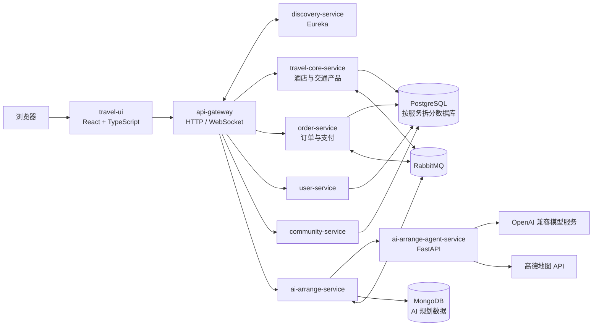
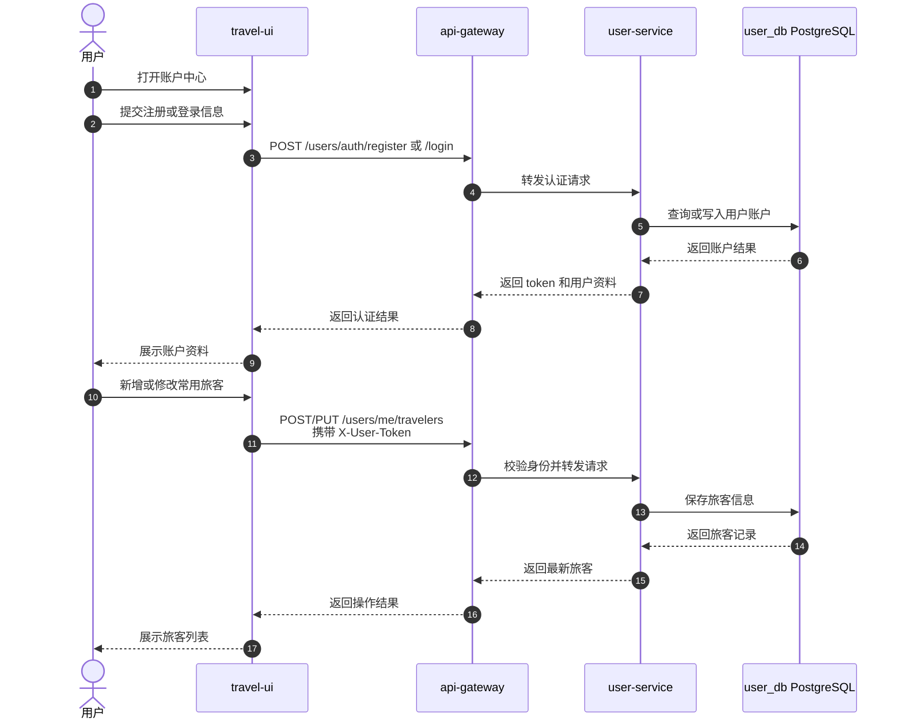
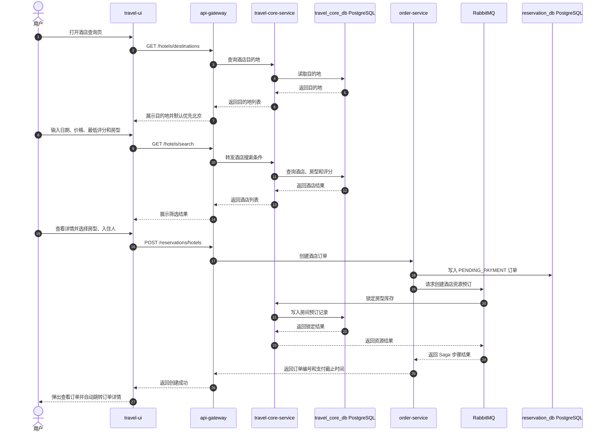
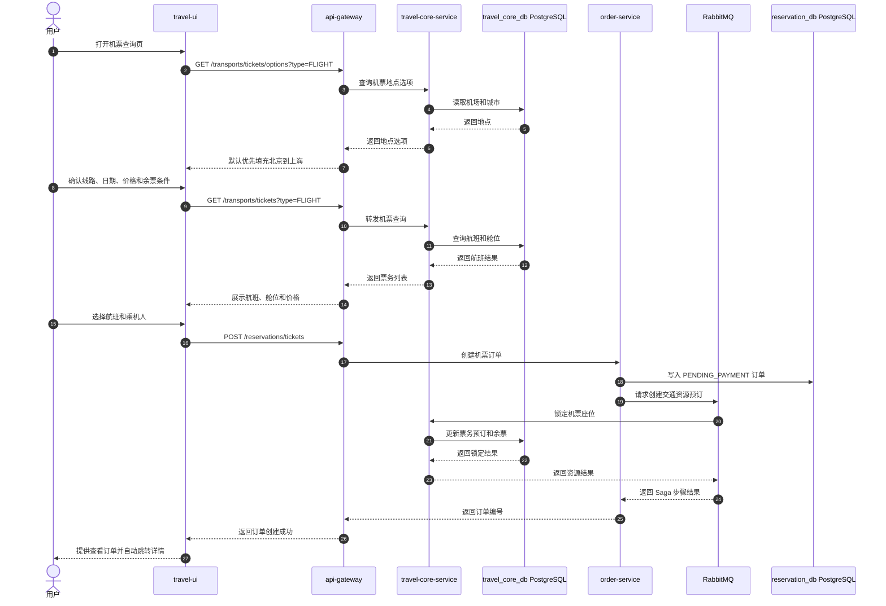
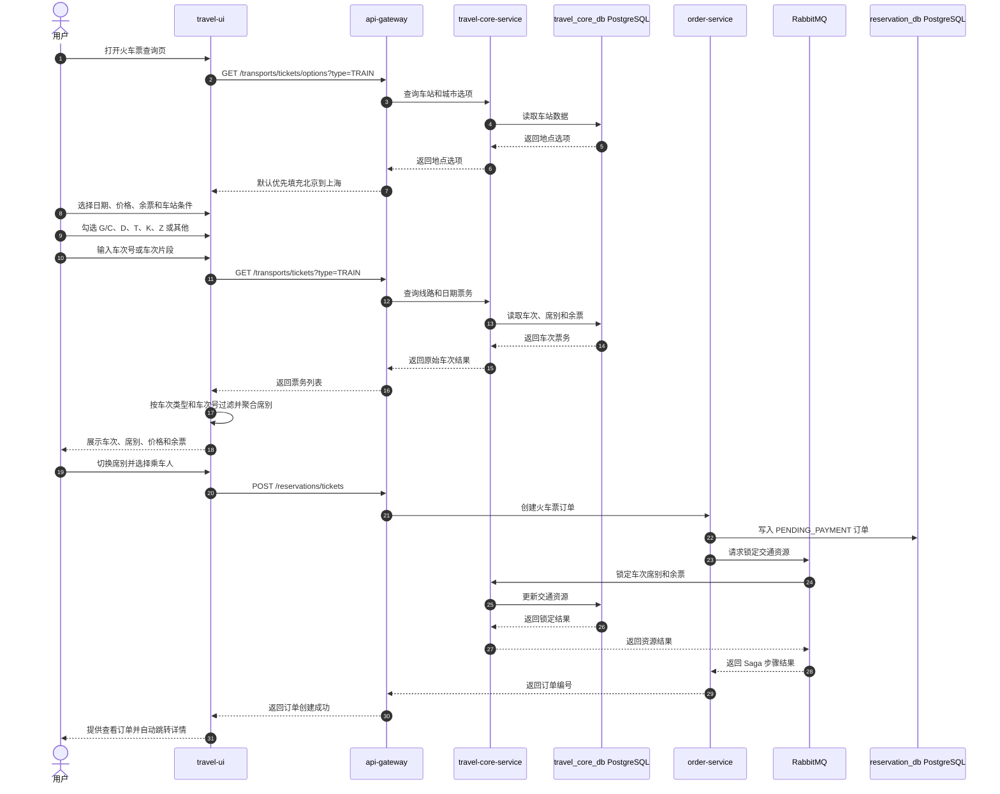
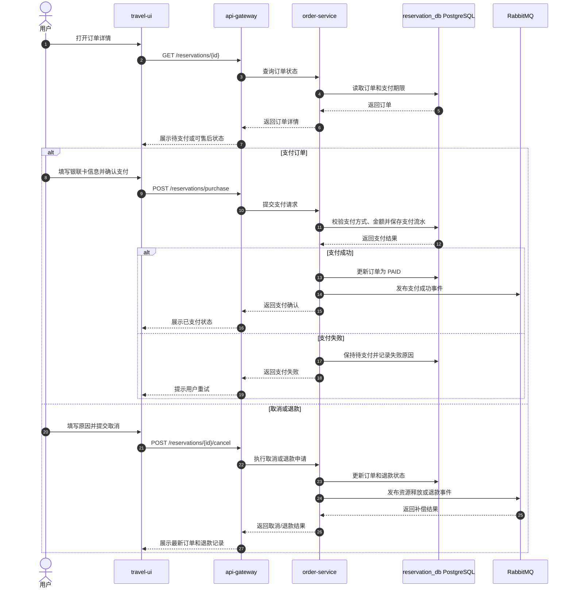
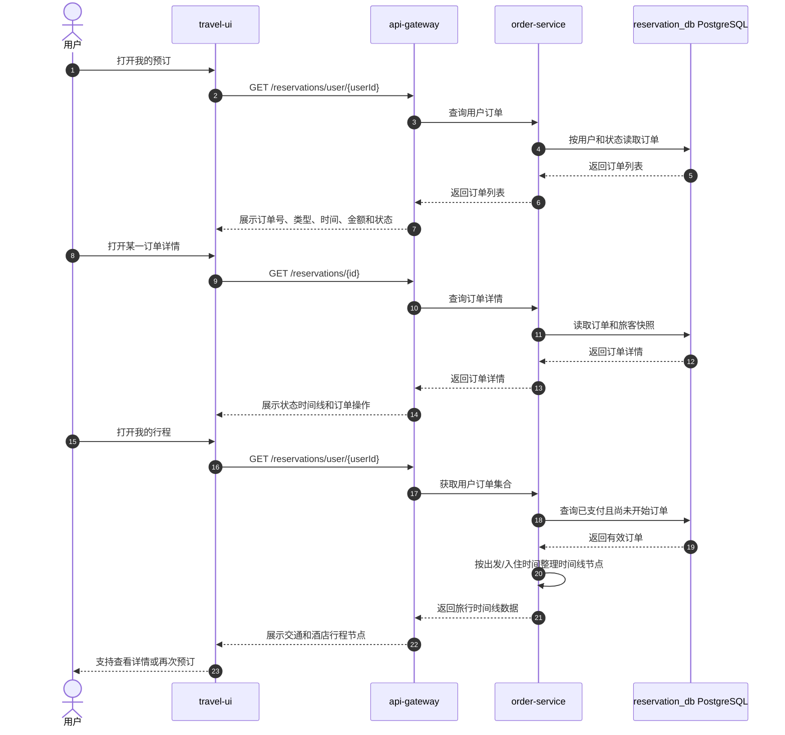
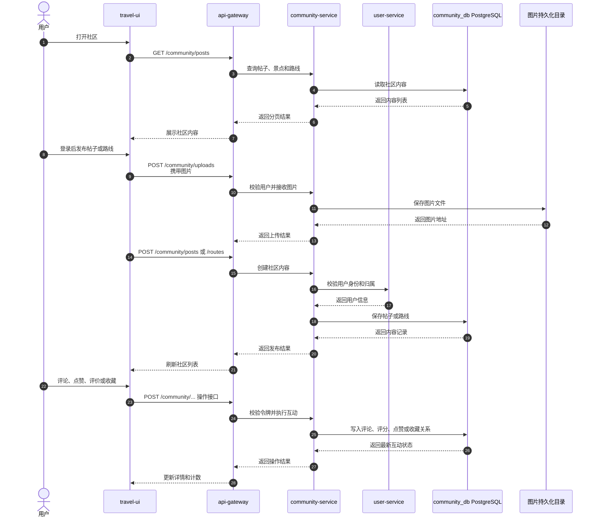
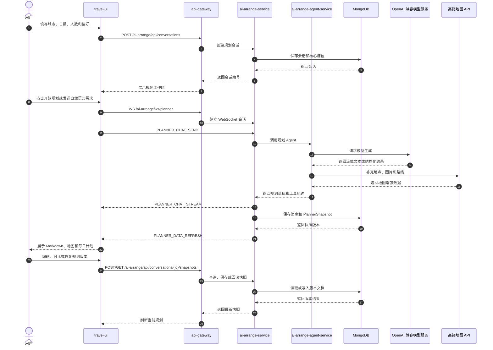

# TravelOn 软件概要设计说明书

| 项目 | 内容 |
|---|---|
| 系统名称 | TravelOn 综合出行旅游平台 |
| 项目代号 | travel-on-2026NULLptr |
| 文档名称 | 软件概要设计说明书 |
| 文档版本 | V1.0 |
| 编写日期 | 2026-08-25 |
| 适用范围 | Web 端课程演示与验收 |
| 编写依据 | 当前仓库代码、`docs/业务场景.md`、`README.md`、需求规格说明书 |

## 目录

- [1. 引言](#1-引言)
  - [1.1 编写目的](#11-编写目的)
  - [1.2 系统背景](#12-系统背景)
  - [1.3 设计范围](#13-设计范围)
  - [1.4 术语与缩写](#14-术语与缩写)
  - [1.5 参考资料](#15-参考资料)
- [2. 系统概述](#2-系统概述)
  - [2.1 业务目标](#21-业务目标)
  - [2.2 用户与参与者](#22-用户与参与者)
  - [2.3 当前功能范围](#23-当前功能范围)
  - [2.4 系统边界与约束](#24-系统边界与约束)
  - [2.5 非功能设计目标](#25-非功能设计目标)
- [3. 总体架构设计](#3-总体架构设计)
  - [3.1 架构风格](#31-架构风格)
  - [3.2 系统总体架构](#32-系统总体架构)
  - [3.3 服务职责划分](#33-服务职责划分)
  - [3.4 前端模块与页面](#34-前端模块与页面)
  - [3.5 服务间通信](#35-服务间通信)
  - [3.6 身份与访问控制](#36-身份与访问控制)
- [4. 业务场景设计与组件级图](#4-业务场景设计与组件级图)
  - [4.1 图示约定](#41-图示约定)
  - [4.2 BS-01 账户初始化与出行人维护](#42-bs-01-账户初始化与出行人维护)
  - [4.3 BS-02 酒店查询与住宿预订](#43-bs-02-酒店查询与住宿预订)
  - [4.4 BS-03 机票查询与机票预订](#44-bs-03-机票查询与机票预订)
  - [4.5 BS-04 火车票查询与火车票预订](#45-bs-04-火车票查询与火车票预订)
  - [4.6 BS-05 订单支付与售后处理](#46-bs-05-订单支付与售后处理)
  - [4.7 BS-06 统一订单与旅行时间线管理](#47-bs-06-统一订单与旅行时间线管理)
  - [4.8 BS-07 社区内容分享与互动](#48-bs-07-社区内容分享与互动)
  - [4.9 BS-08 AI 行程规划与版本管理](#49-bs-08-ai-行程规划与版本管理)
- [5. 接口设计](#5-接口设计)
  - [5.1 网关路由](#51-网关路由)
  - [5.2 核心 REST 接口](#52-核心-rest-接口)
  - [5.3 AI WebSocket 接口](#53-ai-websocket-接口)
  - [5.4 统一错误处理](#54-统一错误处理)
- [6. 数据设计](#6-数据设计)
  - [6.1 数据存储总览](#61-数据存储总览)
  - [6.2 核心业务实体](#62-核心业务实体)
  - [6.3 AI 规划数据](#63-ai-规划数据)
  - [6.4 数据一致性设计](#64-数据一致性设计)
- [7. 异常、扩展与验收](#7-异常扩展与验收)
  - [7.1 异常处理](#71-异常处理)
  - [7.2 可扩展点](#72-可扩展点)
  - [7.3 业务场景验收对应](#73-业务场景验收对应)

## 1. 引言

### 1.1 编写目的

本文档说明 TravelOn 当前实现的总体架构、服务职责、业务场景协作关系、接口、数据存储和运行方式，为开发、联调、测试、部署和课程验收提供统一设计基线。

本文档以当前仓库的可运行实现为准。历史设计中尚未实现或已经替换的内容，不作为当前验收依据。

### 1.2 系统背景

TravelOn 是一个面向旅游出行用户的综合服务平台，提供酒店、机票、火车票查询与预订，统一订单支付和售后，旅行时间线，旅游社区以及 AI 行程规划等能力。

系统采用前后端分离和微服务架构：

- 前端使用 React、TypeScript、Material UI 和 React Router。
- 后端使用 Spring Boot 微服务，通过 API Gateway 对外提供统一入口。
- PostgreSQL 保存酒店、交通、订单、支付、用户和社区业务数据。
- MongoDB 保存 AI 规划会话、消息和版本快照。
- RabbitMQ 支撑订单编排和服务间异步消息。
- AI 规划由 Java `ai-arrange-service` 和 Python `ai-arrange-agent-service` 协同完成。

### 1.3 设计范围

本文档覆盖以下当前实现范围：

1. 用户注册、登录、资料维护和常用旅客管理。
2. 酒店目的地查询、酒店搜索、评分筛选、酒店详情、房型选择和酒店订单。
3. 机票查询、价格和余票筛选、乘机人选择和机票订单。
4. 火车票查询、车次类型筛选、车次号筛选、席别切换和火车票订单。
5. 订单列表、订单详情、模拟支付、订单取消、退款和旅行时间线。
6. 社区帖子、评论、点赞、图片、酒店/景点/路线评价和收藏。
7. AI 行程会话、流式规划、Markdown 行程、地图点位和快照版本管理。

### 1.4 术语与缩写

| 术语 | 含义 |
|---|---|
| API Gateway | 统一对外入口，负责 HTTP 和 WebSocket 路由转发。 |
| Eureka | 服务注册与发现组件。 |
| Saga | 跨服务业务编排模式，通过补偿操作处理分布式流程失败。 |
| RabbitMQ | 服务间异步消息中间件。 |
| Reservation | 预订订单，统一表示酒店、机票和火车票订单。 |
| Pending Payment | 待支付状态，订单已创建但尚未完成支付。 |
| Snapshot | AI 行程快照，表示规划结果的一个可追溯版本。 |
| Core Slots | AI 规划开始前必须收集的城市、日期、人数等基础信息。 |
| Agent | Python AI 规划执行服务，负责模型调用和旅行工具编排。 |

### 1.5 参考资料

- [项目 README](../README.md)
- [业务场景说明](业务场景.md)
- [需求规格说明](需求规格.md)
- [用户手册](用户手册.md)
- [测试文档](测试文档.md)
- `travel-api/docker-compose.yml`
- `travel-api/api-gateway/src/main/resources/application.yml`
- `travel-ui/src/core/apiConfig.tsx`

## 2. 系统概述

### 2.1 业务目标

TravelOn 的业务目标如下：

1. 为用户提供统一的酒店、飞机和火车出行产品入口。
2. 通过价格、评分、余票、车次类型和车次号等条件帮助用户缩小选择范围。
3. 将查询、选择、下单、支付、取消和退款组织为连续业务闭环。
4. 将已支付订单汇总为旅行时间线，支持用户查看有效行程。
5. 提供行后内容分享和评价能力，形成“行前规划—行中管理—行后分享”链路。
6. 通过 AI 规划生成可编辑、可回溯的旅行方案。

### 2.2 用户与参与者

| 参与者 | 主要职责 |
|---|---|
| 游客 | 浏览首页和查询酒店、机票、火车票信息。 |
| 注册用户 | 管理账户和旅客，创建订单，支付、取消和退款，参与社区和 AI 规划。 |
| 前端应用 | 收集输入、执行基础校验、展示结果、保存页面状态并调用网关接口。 |
| API Gateway | 对外提供统一 REST/WebSocket 入口并转发请求。 |
| 业务微服务 | 分别处理用户、出行产品、订单、社区和 AI 规划业务；支付作为订单服务内的模块实现。 |
| PostgreSQL | 保存普通业务数据。 |
| MongoDB | 保存 AI 规划文档数据。 |
| RabbitMQ | 传递库存、预订和跨服务编排消息。 |
| 外部 AI/地图服务 | 为 AI 规划提供模型生成、地点和路线增强能力。 |

### 2.3 当前功能范围

| 模块 | 当前实现 |
|---|---|
| 账户 | 注册、登录、退出、资料修改、常用旅客增删改查 |
| 酒店 | 目的地、日期、名称、价格、评分、酒店类型、房型筛选；酒店详情、社区评分、房型选择和下单 |
| 机票 | 出发地、目的地、日期、价格、余票和排序；舱位聚合与切换；默认优先“北京 → 上海” |
| 火车票 | 线路、日期、价格、余票、车站、车次类型和车次号筛选；席别聚合与切换；默认优先“北京 → 上海” |
| 订单 | 订单列表、详情、支付、支付流水、取消、退款和再次预订 |
| 行程 | 汇总已支付且尚未开始的交通和酒店订单 |
| 社区 | 帖子、评论、点赞、图片、景点、路线、评价和收藏 |
| AI 规划 | 会话、流式对话、规划结果、地图点位、Markdown 编辑、快照、版本对比和恢复 |

### 2.4 系统边界与约束

- 机票和火车票使用本地导入或生成的演示数据，不直接对接真实航司和 12306。
- 支付为模拟支付，当前版本仅支持银联卡演示；钱包余额支付已移除。
- 酒店当前按评分筛选，不以酒店星级作为主筛选字段。
- 前端通过网关访问后端，业务服务不直接暴露给浏览器。
- 用户身份由登录令牌和 `X-User-Token` 请求头传递；部分演示页面仍保留游客模式。
- AI 规划依赖 `AI_API_KEY`（OpenAI 兼容模型服务）和可选的 `AMAP_API_KEY`；未配置时不影响非 AI 功能。
- 旧版旅游套餐聚合服务已删除，`/offers/**` 不属于当前 Gateway 路由和验收范围。
- 当前前端没有独立的管理员后台页面，产品管理、订单管理和评价审核不作为当前前台闭环。

### 2.5 非功能设计目标

| 目标 | 设计措施 |
|---|---|
| 可维护性 | 按领域拆分微服务，前端按页面和功能模块组织，接口集中定义在 `apiConfig.tsx`。 |
| 可扩展性 | 交通票种、酒店类型、社区评价目标类型和 AI 规划模式均使用枚举或可扩展字段。 |
| 一致性 | 订单服务维护订单状态，Saga 负责 travel-core 资源的创建和补偿。 |
| 可用性 | 页面统一展示加载、空数据和错误状态；AI 规划支持流式失败后的降级提示。 |
| 安全性 | 密码不以明文存储，身份令牌通过请求头传递，外部密钥通过环境变量注入。 |
| 可观测性 | 各容器按服务写入日志，订单、支付、退款和 AI 规划保存业务状态或快照。 |
| 交互性能 | 前端分页展示结果，AI 规划使用 WebSocket 流式返回，服务间使用异步消息降低耦合。 |

## 3. 总体架构设计

### 3.1 架构风格

系统采用“前端应用 + API Gateway + Spring Boot 微服务 + 消息中间件 + 多数据库”的架构风格。

- 前端只访问 Gateway，避免浏览器感知内部服务地址。
- 业务服务按领域独立部署和扩展。
- 普通业务数据按服务写入 PostgreSQL 的独立数据库。
- AI 规划数据使用 MongoDB 文档模型保存。
- 跨服务资源操作通过 RabbitMQ 和 Saga 进行协调。
- Eureka 负责服务注册和基于服务名的发现。

### 3.2 系统总体架构



### 3.3 服务职责划分

| 服务 | 主要职责 | 主要数据 |
|---|---|---|
| `api-gateway` | 统一 HTTP/WebSocket 路由、跨域配置和服务发现转发 | 无业务持久化 |
| `discovery-service` | 注册服务实例，提供 Eureka 服务发现 | 注册信息 |
| `travel-core-service` | 酒店与交通目的地、产品查询、详情、房型、余票和资源预订 | 城市、酒店、房间、房间预订、交通票务 |
| `order-service` | 创建订单、维护订单状态、模拟支付、取消、退款和旅行时间线 | 订单、旅客快照、支付流水、退款记录 |
| `user-service` | 注册、登录、资料和常用旅客管理 | 用户、旅客 |
| `community-service` | 帖子、评论、点赞、评价、路线、景点、收藏和图片元数据 | 社区内容及关系 |
| `ai-arrange-service` | AI 会话、WebSocket、快照、Markdown、版本管理和规划编排 | MongoDB 规划文档 |
| `ai-arrange-agent-service` | 调用模型、执行旅行工具、生成结构化规划结果和降级结果 | 无业务持久化 |

### 3.4 前端模块与页面

| 前端模块 | 主要页面 | 说明 |
|---|---|---|
| 首页 | `/` | 统一入口、热门路线和快捷搜索 |
| 账户 | `/account` | 登录、注册、资料和旅客管理 |
| 酒店 | `/reservations/hotels`、`/reservations/hotels/:hotelId` | 酒店搜索、评分筛选、详情和房型预订 |
| 交通 | `/reservations/flights`、`/reservations/trains` | 机票/火车票查询、筛选和下单 |
| 订单 | `/reservations`、`/reservations/:reservationId` | 订单列表、详情、支付、取消和退款 |
| 行程 | `/reservations/timeline` | 有效旅行时间线 |
| 社区 | `/community` 及详情页 | 内容浏览、发布、互动和评价 |
| AI 规划 | `/ai-planner` | 会话、规划结果、地图和版本管理 |

### 3.5 服务间通信

| 通信方式 | 使用场景 | 说明 |
|---|---|---|
| HTTP REST | 前端到 Gateway、Gateway 到业务服务 | 查询、创建、更新和删除资源 |
| WebSocket | 前端与 `ai-arrange-service` | AI 规划流式文本、结构化刷新和错误事件 |
| RabbitMQ | 订单编排、travel-core 资源创建、资源释放和订单状态事件 | 解耦服务，支持 Saga 补偿 |
| Eureka | Gateway 和业务服务发现 | 使用 `lb://service-name` 路由 |
| PostgreSQL JDBC | 普通服务访问业务数据库 | 每个服务使用独立数据库 |
| MongoDB Driver | AI 服务访问规划文档 | 会话、消息和快照按文档保存 |

### 3.6 身份与访问控制

1. 用户注册或登录成功后，前端保存认证令牌和用户资料。
2. 需要登录的请求通过 `X-User-Token` 请求头传递令牌。
3. `user-service` 对用户资料和旅客资源进行归属校验。
4. 订单创建请求携带 `userId` 和旅客快照，订单详情只允许访问对应用户订单。
5. 社区发布、评论、点赞、评价、收藏和图片上传要求登录令牌。
6. AI 会话、快照和版本操作携带 `userId`，服务端根据会话归属校验访问权限。
7. 外部 API Key 只从后端环境变量读取，不写入数据库和前端源代码。

## 4. 业务场景设计与组件级图

### 4.1 图示约定

本章依据 [业务场景说明](业务场景.md) 中的 BS-01 至 BS-08 编排。

- 每个业务场景只配置一张主图。
- 所有主图均采用 Mermaid 组件级顺序图，参与者表示页面、网关、业务服务、消息中间件或数据库等组件。
- 图中省略与场景无关的鉴权、日志和通用异常拦截细节。
- `UI` 表示 `travel-ui`，`GW` 表示 `api-gateway`。

### 4.2 BS-01 账户初始化与出行人维护

**业务目标：** 用户完成注册/登录、资料维护和常用旅客维护，为后续预订提供可复用的出行人信息。

**主要组件：** `travel-ui`、`api-gateway`、`user-service`、PostgreSQL。



**设计要点：**

- 注册和登录共用用户服务，但注册失败和密码错误必须返回明确错误。
- 旅客信息属于用户资源，增删改查均需进行用户归属校验。
- 订单提交时将旅客信息复制为订单快照，避免用户后续修改资料影响历史订单。

### 4.3 BS-02 酒店查询与住宿预订

**业务目标：** 用户按目的地、日期、价格、评分、酒店类型和房型筛选酒店，选择房型和入住人后创建待支付订单。

**主要组件：** `travel-ui`、`api-gateway`、`travel-core-service`、`order-service`、RabbitMQ、PostgreSQL。



**设计要点：**

- 当前筛选字段为酒店评分，不使用酒店星级作为主筛选条件。
- 酒店订单金额由房型参考单价、入住人数和入住晚数共同计算。
- 酒店资源锁定失败时，`order-service` 应取消订单并执行补偿。

### 4.4 BS-03 机票查询与机票预订

**业务目标：** 用户查询航班，选择舱位和乘机人，创建机票待支付订单。

**主要组件：** `travel-ui`、`api-gateway`、`travel-core-service`、`order-service`、RabbitMQ、PostgreSQL。



**设计要点：**

- 机票查询结果包含出发/到达机场、航班号、舱位、价格、余票和时刻。
- 同一航班的多个舱位合并展示，用户可以在航班卡片内切换经济舱、商务舱和头等舱；只有经济舱的航班不展示切换区域。舱位聚合与席别聚合共用同一段前端逻辑。
- 航班距离起飞时间过近或余票为零时，前端不允许继续预订。
- 订单保存航班和乘客快照，后续支付由统一订单流程处理。

### 4.5 BS-04 火车票查询与火车票预订

**业务目标：** 用户按车次类型和车次号筛选火车票，切换席别并创建火车票待支付订单。

**主要组件：** `travel-ui`、`api-gateway`、`travel-core-service`、`order-service`、RabbitMQ、PostgreSQL。



**设计要点：**

- 车次类型筛选由前端根据车次号首字母分为 `G/C`、`D`、`T`、`K`、`Z` 和其他。
- 车次号输入会规范化为大写，支持输入完整车次号或片段。
- 同一车次的多个席别合并展示，用户可以在车次卡片内切换席别。
- 发车前的停售规则由前端预订校验和后端资源可用性共同保证。

### 4.6 BS-05 订单支付与售后处理

**业务目标：** 用户完成待支付订单的支付，或取消订单并完成退款，得到可追踪的订单状态。

**主要组件：** `travel-ui`、`api-gateway`、`order-service`、RabbitMQ、PostgreSQL。



**设计要点：**

- 待支付订单可以支付；已支付订单取消后进入退款流程。
- 支付流水和退款记录独立保存，订单详情通过多个接口汇总展示。
- 订单超时、重复支付、重复取消和重复退款必须被服务端拒绝。

### 4.7 BS-06 统一订单与旅行时间线管理

**业务目标：** 用户从统一订单入口查看订单和详情，并将有效订单整理为时间线。

**主要组件：** `travel-ui`、`api-gateway`、`order-service`、reservation PostgreSQL。



**设计要点：**

- 时间线只纳入已支付、未取消、未退款且尚未开始的订单。
- 酒店节点使用入住/离店时间，交通节点使用出发/到达时间。
- 订单列表、订单详情和时间线共享订单服务数据，但展示模型不同。

### 4.8 BS-07 社区内容分享与互动

**业务目标：** 用户浏览和发布旅游内容，并完成评论、点赞、评价和收藏。

**主要组件：** `travel-ui`、`api-gateway`、`community-service`、`user-service`、PostgreSQL、上传存储。



**设计要点：**

- 浏览内容可以不登录；发布、评论、评价、点赞、收藏和图片上传需要登录。
- 图片二进制文件保存到宿主机持久化目录，数据库保存图片地址或元数据。
- 酒店详情页可以读取社区酒店评分并参与酒店展示评分。

### 4.9 BS-08 AI 行程规划与版本管理

**业务目标：** 用户创建 AI 规划会话，输入偏好并生成行程，查看 Markdown、地图和历史版本。

**主要组件：** `travel-ui`、`api-gateway`、`ai-arrange-service`、`ai-arrange-agent-service`、MongoDB、OpenAI 兼容模型服务、高德地图。



**设计要点：**

- 会话、消息和快照使用 MongoDB 文档保存，版本号用于并发控制和历史回滚。
- WebSocket 返回流式文本，快照保存完成后再推送结构化刷新事件。
- 模型或地图调用失败时，服务可返回错误提示或使用 fallback 结果，不阻断其他业务模块。

## 5. 接口设计

### 5.1 网关路由

Gateway 当前主要路由如下：

| 路径前缀 | 目标服务 | 协议 |
|---|---|---|
| `/hotels/**` | `travel-core-service` | HTTP |
| `/transports/**` | `travel-core-service` | HTTP |
| `/users/**` | `user-service` | HTTP |
| `/community/**` | `community-service` | HTTP |
| `/reservations/**` | `order-service` | HTTP |
| `/ai-arrange/**` | `ai-arrange-service` | HTTP |
| `/ai-arrange/ws/**` | `ai-arrange-service` | WebSocket |

### 5.2 核心 REST 接口

| 业务模块 | 方法 | 路径 | 作用 |
|---|---|---|---|
| 用户 | `POST` | `/users/auth/register` | 注册用户 |
| 用户 | `POST` | `/users/auth/login` | 登录并返回认证信息 |
| 用户 | `GET` | `/users/me` | 查询当前用户资料 |
| 用户 | `GET/POST/PUT/DELETE` | `/users/me/travelers` | 管理常用旅客 |
| 酒店 | `GET` | `/hotels/destinations` | 查询酒店目的地 |
| 酒店 | `GET` | `/hotels/search` | 按目的地、日期、价格、评分和房型查询 |
| 酒店 | `GET` | `/hotels/{hotelId}` | 查询酒店详情和房型 |
| 交通 | `GET` | `/transports/tickets/options` | 查询机票/火车票地点选项 |
| 交通 | `GET` | `/transports/tickets` | 查询机票或火车票 |
| 订单 | `POST` | `/reservations/hotels` | 创建酒店订单 |
| 订单 | `POST` | `/reservations/tickets` | 创建机票/火车票订单 |
| 订单 | `GET` | `/reservations/user/{userId}` | 查询用户订单 |
| 订单 | `GET` | `/reservations/{reservationId}` | 查询订单详情 |
| 订单 | `POST` | `/reservations/purchase` | 提交模拟支付 |
| 订单 | `POST` | `/reservations/{reservationId}/cancel` | 取消订单或申请退款 |
| 订单 | `GET` | `/reservations/{reservationId}/payments` | 查询支付流水 |
| 订单 | `GET` | `/reservations/{reservationId}/refunds` | 查询退款记录 |
| 社区 | `GET/POST` | `/community/posts` | 查询或发布帖子 |
| 社区 | `GET/POST` | `/community/reviews` | 查询或发布评价 |
| 社区 | `POST` | `/community/favorites/toggle` | 切换收藏 |
| AI 规划 | `POST` | `/ai-arrange/api/conversations` | 创建规划会话 |
| AI 规划 | `POST` | `/ai-arrange/api/conversations/{id}/planner/run` | 运行规划 |
| AI 规划 | `GET/POST` | `/ai-arrange/api/conversations/{id}/snapshots` | 查询或保存规划快照 |

### 5.3 AI WebSocket 接口

连接地址：

```text
ws(s)://<gateway>/ai-arrange/ws/planner?conversationId={uuid}&userId={uuid}
```

主要消息类型：

| 消息类型 | 方向 | 作用 |
|---|---|---|
| `PLANNER_CHAT_SEND` | 前端 → 服务端 | 发送自然语言规划需求 |
| `PLANNER_CHAT_STREAM` | 服务端 → 前端 | 推送模型流式文本 |
| `PLANNER_TRACE_EVENT` | 服务端 → 前端 | 推送工具、模型和 fallback 执行轨迹 |
| `PLANNER_DATA_REFRESH` | 服务端 → 前端 | 推送 Markdown、点位、路线和快照版本 |
| `PLANNER_PLACE_SELECTION` | 前端 → 服务端 | 提交地图点位选择 |
| `PLANNER_SNAPSHOT_SAVED` | 服务端 → 前端 | 通知快照保存完成 |
| `PLANNER_ERROR` | 服务端 → 前端 | 返回校验或服务错误 |

### 5.4 统一错误处理

| 错误类型 | 前端表现 | 服务端处理 |
|---|---|---|
| 参数校验失败 | 表单提示并阻止提交 | 返回 400 和中文错误信息 |
| 未登录或无权限 | 提示登录或无权操作 | 校验令牌、用户和资源归属 |
| 资源不存在 | 展示空状态或详情错误 | 返回 404 |
| 状态冲突 | 提示订单/快照状态已变化 | 返回 409，要求刷新当前状态 |
| 服务不可用 | 展示“请稍后重试” | 网关或服务返回 503，记录日志 |
| AI 外部依赖失败 | 展示依赖说明或降级结果 | Agent 记录失败阶段，返回可识别错误码 |

## 6. 数据设计

### 6.1 数据存储总览

| 服务 | 数据库 | 主要数据 | 持久化方式 |
|---|---|---|---|
| `travel-core-service` | `travel_core_db` PostgreSQL | 城市、酒店、房间、房间预订、票务模板和资源 | JPA/SQL |
| `order-service` | `reservation_db` PostgreSQL | 订单、旅客快照、支付交易、退款记录和订单投影 | JPA/SQL |
| `user-service` | `user_db` PostgreSQL | 用户、旅客、认证信息 | JPA/SQL |
| `community-service` | `community_db` PostgreSQL | 帖子、评论、评价、路线、景点、收藏、点赞 | JPA/SQL |
| `ai-arrange-service` | `ai-arrange-db` MongoDB | 规划会话、消息、快照和版本数据 | MongoDB Repository |
| `community-service` | 宿主机目录 | 社区图片文件 | Docker volume |

### 6.2 核心业务实体

| 实体 | 关键字段 | 所属服务 | 说明 |
|---|---|---|---|
| User | `id`、`email`、`name`、`phone`、`role` | user | 注册用户和角色 |
| Traveler | `id`、`userId`、`name`、`travelerType`、证件信息 | user | 用户维护的常用旅客 |
| Hotel | `hotelId`、名称、评分、位置、图片 | travel-core | 酒店基础信息 |
| Room/RoomConfiguration | 房间、可住人数、参考价格 | travel-core | 酒店可订房型 |
| TicketOffer | `id`、类型、线路、时间、车次/航班号、席别或舱位、价格、余票 | travel-core | 机票或火车票方案；同一班次的每个席别/舱位是独立一条 |
| Reservation | `id`、`userId`、类型、状态、金额、出行时间 | order | 统一订单 |
| BookingPersonSnapshot | 姓名、旅客类型、脱敏证件和手机号 | order | 下单时的旅客快照 |
| PaymentTransaction | 订单号、金额、支付方式、审批结果 | order | 支付流水 |
| RefundRecord | 订单号、金额、原因、状态、时间 | order | 退款记录 |
| CommunityPost | 标题、正文、分类、图片、作者 | community | 社区帖子 |
| CommunityReview | 目标类型、目标 ID、评分、内容、作者 | community | 酒店/景点/路线评价 |
| TravelRoute | 标题、天数、预算、风格、停靠点 | community | 用户发布的旅行路线 |

### 6.3 AI 规划数据

| MongoDB 集合 | 关键字段 | 用途 |
|---|---|---|
| `planner_conversations` | `id`、`userId`、`status`、`coreSlots`、`currentMarkdown`、`latestSnapshotVersion` | 保存规划会话当前状态 |
| `planner_messages` | `id`、`conversationId`、`userId`、`role`、`content`、`metadata`、`createdAt` | 保存用户和 AI 消息历史 |
| `planner_snapshots` | `conversationId`、`version`、`markdown`、`places`、`routes`、`selectedPlaceIds` | 保存规划结果版本 |

AI 快照中的主要嵌入结构：

- `PlannerPlaceSuggestion`：地点名称、类型、来源、坐标、图片、描述和选中状态。
- `PlannerRouteSegment`：起点、终点、交通方式、距离、预计时间和路线摘要。
- `PlannerDayPlanRef`：日期、日计划状态、日 Markdown、地点和路线。

### 6.4 数据一致性设计

1. 订单服务先写入待支付订单，再通过 RabbitMQ 请求 travel-core 服务创建酒店或交通资源预订。
2. 任一资源创建失败时，订单服务执行 Saga 补偿，释放已经创建的资源并更新订单状态。
3. 支付成功后由订单服务统一更新订单状态，并保留支付流水。
4. 已支付订单取消时保存退款记录；退款完成后更新订单退款时间和最终状态。
5. 订单中的酒店、票务和旅客信息以快照方式保存，避免源数据变化影响历史订单。
6. AI 快照使用版本号和基础版本号控制并发更新，版本冲突时要求前端重新加载。
7. 社区评分通过评价记录聚合，酒店详情可读取社区酒店评分摘要。

## 7. 异常、扩展与验收

### 7.1 异常处理

| 层次 | 典型异常 | 处理方式 |
|---|---|---|
| 前端 | 输入为空、日期非法、价格区间非法、无乘客 | 就地校验，阻止提交并展示中文提示 |
| 网关 | 路由不存在、服务未注册、请求超时 | 返回标准错误，前端展示服务不可用 |
| 业务服务 | 资源不存在、库存不足、状态不允许 | 返回明确状态码和业务消息 |
| 订单服务 | Saga 步骤失败、支付超时、重复操作 | 执行补偿、更新订单状态并保存原因 |
| 数据库 | 连接失败、表结构不一致 | 记录日志，阻止错误数据写入并提示重试 |
| AI 服务 | 模型超时、地图失败、快照冲突 | 推送错误或 fallback，保留已有快照 |

### 7.2 可扩展点

1. 接入真实航司、铁路和酒店供应商时，可在 `travel-core-service` 内按酒店、航班和铁路产品增加供应商适配层。
2. 支付服务可以替换模拟支付实现，对接真实支付网关，并保持订单服务接口不变。
3. 酒店可以继续扩展民宿、设施、取消政策和库存日历字段。
4. 火车票可以扩展中转方案、候补和抢票任务。
5. 社区可以增加敏感词审核、内容推荐和积分体系。
6. AI Agent 可以增加预算、天气、路线和内部产品匹配工具。
7. 管理员后台可以复用现有服务接口，增加产品、订单和评价审核页面。

### 7.3 业务场景验收对应

| 场景 | 关键验收点 | 对应页面 |
|---|---|---|
| BS-01 | 注册/登录成功，资料和常用旅客可维护 | `/account` |
| BS-02 | 按评分筛选酒店，选房型和入住人，创建订单并自动进入详情 | `/reservations/hotels`、酒店详情、订单详情 |
| BS-03 | 默认北京到上海，查询航班、切换舱位并创建待支付订单 | `/reservations/flights` |
| BS-04 | 默认北京到上海，车次类型和车次号筛选有效，席别可切换并下单 | `/reservations/trains` |
| BS-05 | 支付成功/失败、取消、退款和流水状态一致 | `/reservations/:reservationId` |
| BS-06 | 订单列表、详情和已支付有效行程时间线可查看 | `/reservations`、`/reservations/timeline` |
| BS-07 | 帖子发布、评论、点赞、评价、收藏和图片展示有效 | `/community` 及详情页 |
| BS-08 | AI 会话、规划结果、Markdown、地图和快照版本可查看或恢复 | `/ai-planner` |

本概要设计与业务场景文档共同构成当前系统的设计基线。业务场景的完整步骤、异常分支和边界说明以 [业务场景说明](业务场景.md) 为准。
