# 用户手册

## 1. 文档说明

本文档面向 TravelOn 旅游服务平台的普通用户和课程验收人员，说明系统入口、主要页面和核心操作流程。文档内容以当前仓库前端路由和后端接口实现为准，历史设计 PDF 仅作为业务背景参考。

课程提交时，可将本文档补充实际页面截图后导出为 PDF，命名为：

```text
X组-用户手册.pdf
```

## 2. 系统访问

本地开发访问地址：

```text
http://localhost:53000
```

远程部署访问地址：

```text
http://服务器公网IP
```

系统页面主要包括：

| 页面 | 地址 | 功能 |
|---|---|---|
| 首页 | `/` | 系统入口和导航 |
| 旅游产品 | `/offers` | 聚合产品查询 |
| 产品详情 | `/offerDetails` | 聚合产品详情 |
| 订单列表 | `/reservations` | 查看用户订单 |
| 旅行时间线 | `/reservations/timeline` | 查看已支付订单的旅行时间轴 |
| 订单详情 | `/reservations/:reservationId` | 查看订单、支付、取消、退款 |
| 机票查询 | `/reservations/flights` | 查询飞机票 |
| 火车票查询 | `/reservations/trains` | 查询火车票 |
| 酒店查询 | `/reservations/hotels` | 查询酒店 |
| 酒店详情 | `/reservations/hotels/:hotelId` | 查看酒店详情 |
| 账户中心 | `/account` | 登录、注册、个人资料、旅客信息 |
| 社区 | `/community` | 浏览帖子、评价、景点和路线 |
| 我的社区 | `/community/me` | 查看个人发布、收藏和评价 |
| 社区详情 | `/community/posts/:postId` | 查看帖子详情 |
| 景点详情 | `/community/attractions/:attractionId` | 查看景点介绍、评价和收藏 |
| 路线详情 | `/community/routes/:routeId` | 查看旅游路线、停靠点和评价 |
| AI 行程规划 | `/ai-planner` | 创建和管理 AI 行程 |

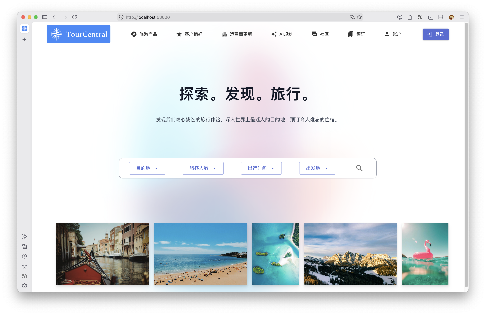

图 1：系统首页

## 3. 注册与登录

### 3.1 功能说明

用户可以通过账户中心完成注册、登录、查看个人资料和管理常用旅客。部分功能如订单、社区发布、个人资料修改需要登录后使用。

### 3.2 注册步骤

1. 打开系统首页。
2. 点击导航栏中的账户入口。
3. 切换到注册表单。
4. 输入用户名、手机号、邮箱、密码等信息。
5. 点击注册按钮。
6. 系统提示注册成功后，可使用该账号登录。

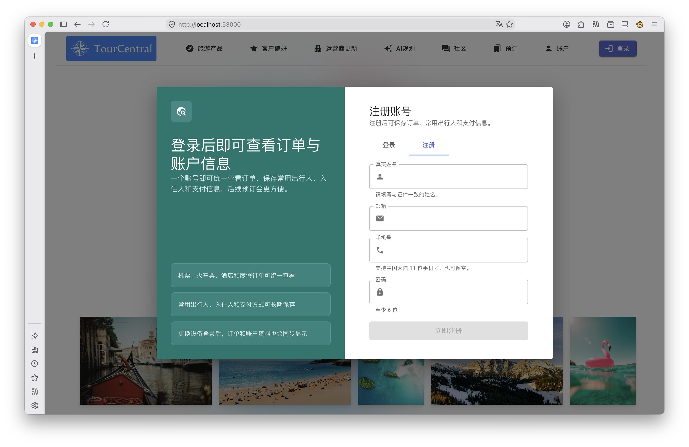

图 2：注册页面

### 3.3 登录步骤

1. 进入账户中心。
2. 输入账号和密码。
3. 点击登录按钮。
4. 登录成功后，系统显示用户资料和账户相关功能。

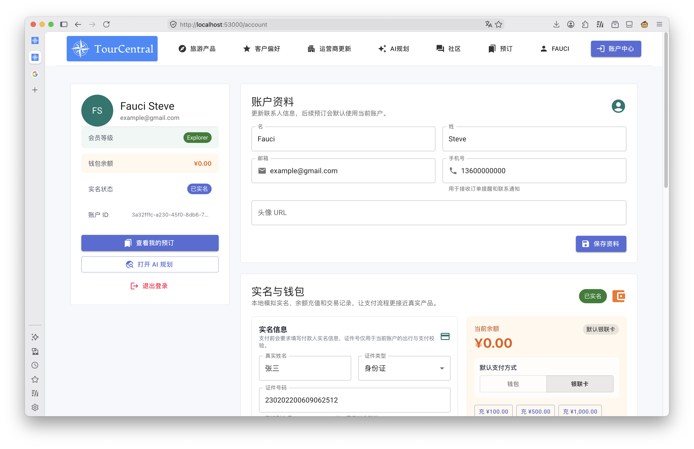

图 3：登录成功后的账户中心

## 4. 账户与旅客管理

### 4.1 查看和修改个人资料

1. 登录后进入 `/account`。
2. 查看当前用户昵称、邮箱、手机号等资料。
3. 修改资料并保存。

### 4.2 管理常用旅客

1. 在账户中心进入旅客信息区域。
2. 新增常用旅客。
3. 编辑旅客姓名、证件号、手机号等信息。
4. 删除不再使用的旅客信息。

常用旅客会在酒店或交通预订时用于快速填写出行人信息。

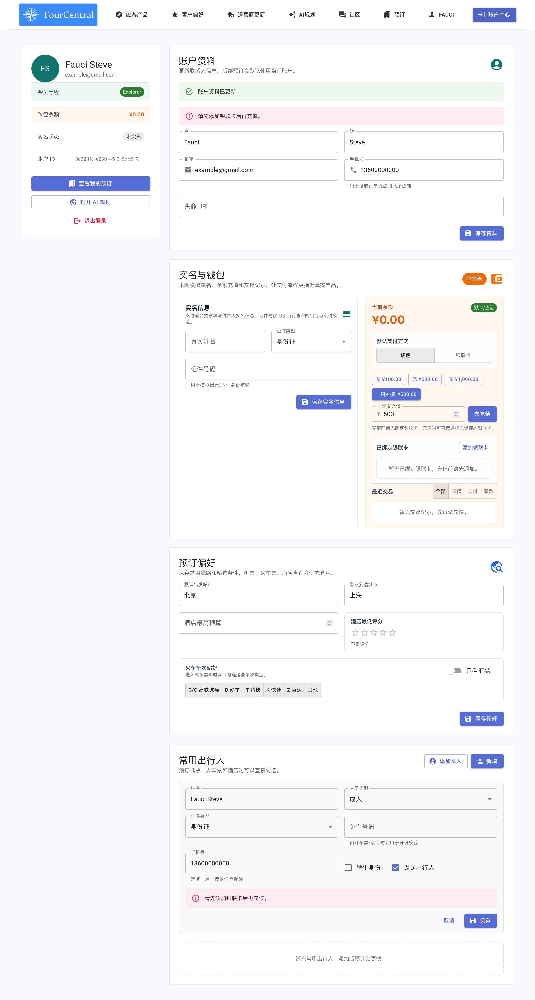

图 4：账户中心和旅客管理

## 5. 酒店查询与预订

### 5.1 查询酒店

1. 进入 `/reservations/hotels`。
2. 选择目的地。
3. 选择入住日期和离店日期。
4. 设置入住人数。
5. 点击查询。
6. 查看酒店列表。

### 5.2 查看酒店详情

1. 在酒店列表中点击酒店卡片。
2. 进入酒店详情页。
3. 查看酒店地址、评分、房间类型、价格、可订信息等。

### 5.3 创建酒店订单

1. 在酒店详情页选择房型和入住信息。
2. 选择或填写旅客信息。
3. 提交预订。
4. 系统创建订单并进入订单详情。

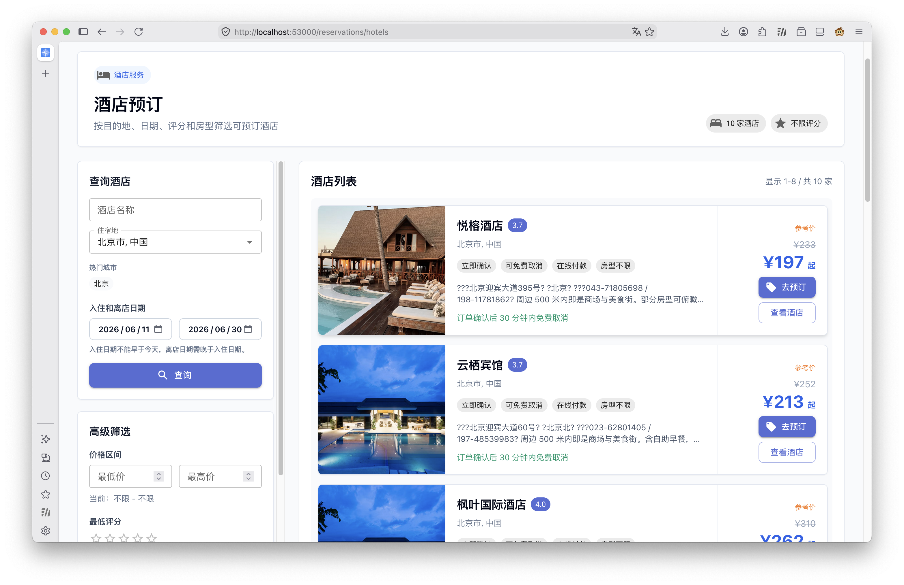

图 5：酒店查询结果

说明：酒店详情页和酒店订单页可在后续截图中补充，用于展示房型选择、入住人选择和提交订单流程。

## 6. 交通票务查询与预订

### 6.1 查询机票

1. 进入 `/reservations/flights`。
2. 选择出发地、目的地、出发日期和乘客人数。
3. 点击查询。
4. 查看航班或机票候选结果。

### 6.2 查询火车票

1. 进入 `/reservations/trains`。
2. 选择出发城市、到达城市和日期。
3. 点击查询。
4. 查看车次、出发到达时间、席别和价格信息。

### 6.3 创建交通订单

1. 从查询结果中选择合适的票务方案。
2. 填写旅客信息。
3. 确认价格和行程信息。
4. 提交订单。

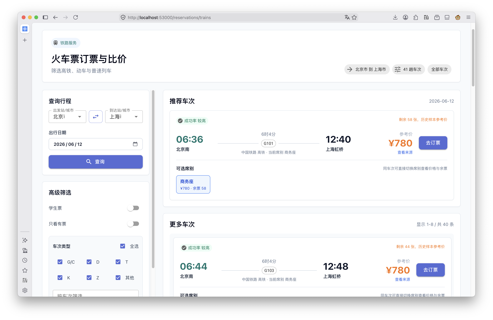

图 6：火车票查询结果

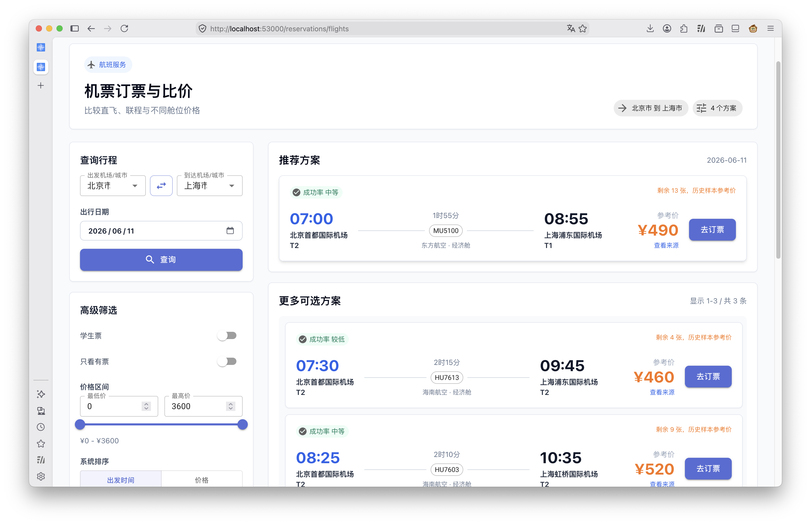

图 7：机票查询结果

## 7. 聚合旅游产品

### 7.1 功能说明

系统提供旅游产品聚合页面，将酒店和交通等要素组合为可查看的旅游方案。该能力对应旧设计文档中的“搜索 - 比价 - 预订”主流程。

### 7.2 操作步骤

1. 进入 `/offers`。
2. 输入出发地、目的地、日期和人数。
3. 点击搜索。
4. 系统展示可选产品列表。
5. 点击产品查看详情。
6. 根据详情进入购买或预订流程。

说明：当前前端主要通过酒店、机票、火车票和订单页面承载预订流程。如后续需要展示聚合旅游产品，可补充对应页面截图。

## 8. 订单管理

### 8.1 查看订单列表

1. 登录后进入 `/reservations`。
2. 查看当前用户的订单列表。
3. 根据订单状态筛选或进入详情。

### 8.2 查看订单详情

1. 在订单列表中点击订单。
2. 查看订单编号、出行信息、旅客信息、价格、支付状态和退款状态。

### 8.3 支付订单

1. 进入待支付订单详情。
2. 点击支付。
3. 系统执行模拟支付。
4. 支付成功后订单状态更新。

### 8.4 取消与退款

1. 进入可取消订单详情。
2. 点击取消订单。
3. 填写取消原因。
4. 系统更新订单状态，并可查看退款记录。

### 8.5 查看旅行时间线

1. 进入 `/reservations/timeline`。
2. 查看已支付订单对应的出行时间线。
3. 根据时间顺序查看交通、酒店入住等行程节点。

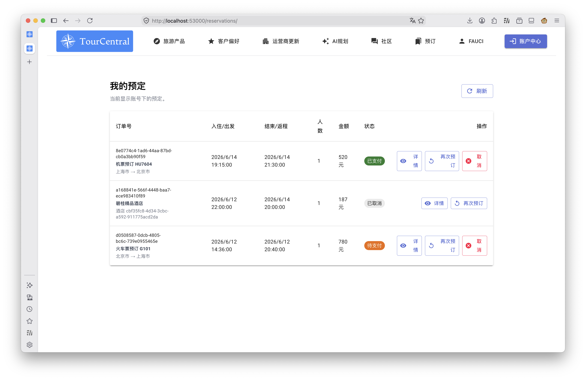

图 8：订单列表

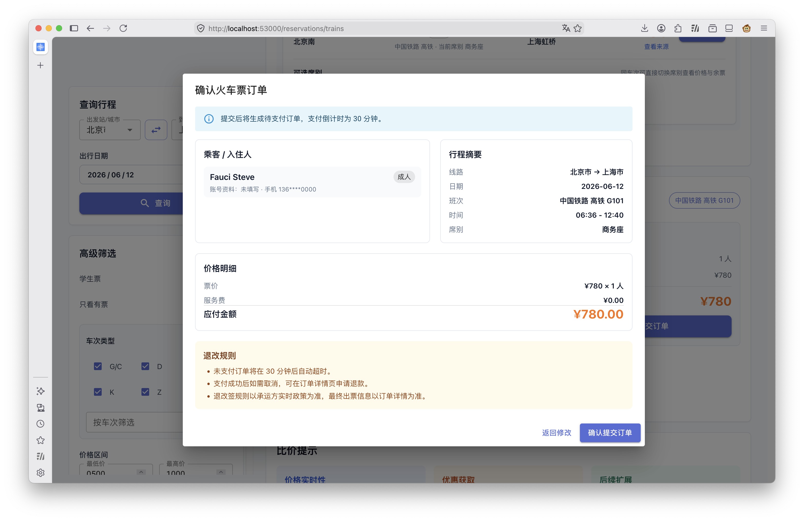

图 9：订单详情

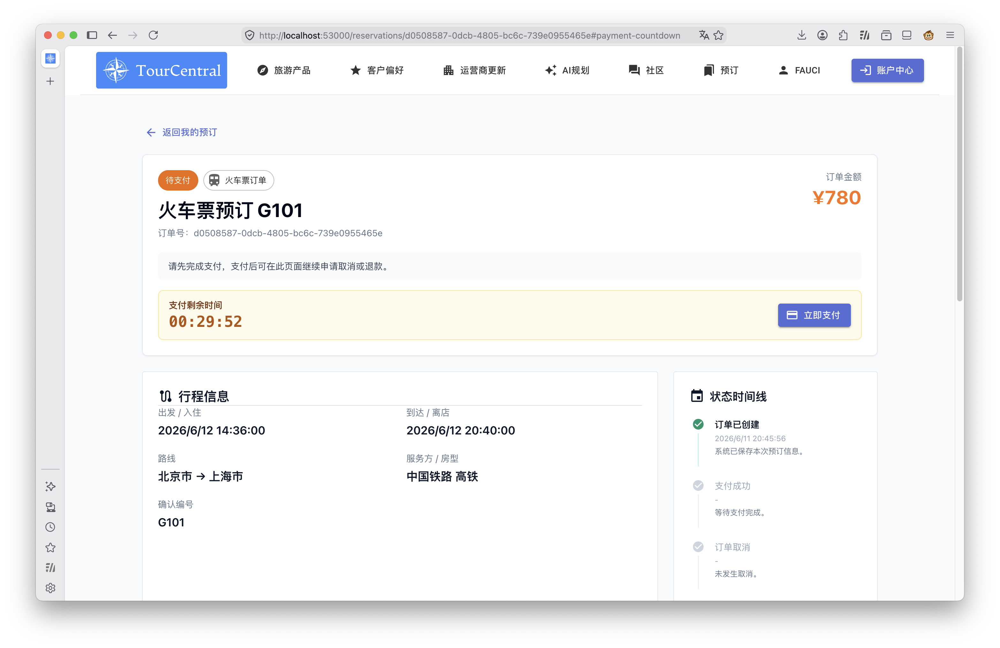

图 10：支付操作

## 9. 社区功能

### 9.1 社区功能总览

当前社区模块包含帖子、评论、酒店评价、景点评价、旅游路线、收藏、图片上传和个人社区主页等能力。

| 功能 | 页面或入口 | 说明 |
|---|---|---|
| 帖子列表 | `/community` | 浏览游记、攻略、酒店、交通等帖子 |
| 帖子详情 | `/community/posts/:postId` | 查看正文、图片、评论和点赞 |
| 发布帖子 | 社区发布入口 | 支持标题、内容、分类、目的地和图片 |
| 评论帖子 | 帖子详情页 | 对帖子进行回复 |
| 景点浏览 | 社区景点区域 | 查看景点卡片、评分和图片 |
| 景点详情 | `/community/attractions/:attractionId` | 查看景点详情、评价和收藏 |
| 路线浏览 | 社区路线区域 | 查看路线卡片、风格、天数和城市 |
| 路线详情 | `/community/routes/:routeId` | 查看路线停靠点和路线评价 |
| 收藏 | 帖子、景点、路线卡片 | 收藏或取消收藏 |
| 我的社区 | `/community/me` | 查看我的帖子、路线、评价和收藏 |

### 9.2 浏览社区

1. 进入 `/community`。
2. 查看帖子、景点、路线和评价区域。
3. 点击帖子、景点或路线进入详情页。

### 9.3 发布帖子

1. 登录后进入社区页面。
2. 点击发布入口。
3. 输入标题、内容、相关酒店或目的地信息。
4. 可上传图片。
5. 提交后帖子出现在社区列表。

### 9.4 评论、点赞和收藏

1. 在帖子卡片或详情页点击点赞。
2. 在帖子详情页发表评论。
3. 在帖子、景点或路线中点击收藏按钮。
4. 查看点赞、评论或收藏状态变化。

### 9.5 景点与路线

1. 在社区页面进入景点或路线区域。
2. 查看景点评分、图片和简介。
3. 查看旅游路线的城市、天数、风格和停靠点。
4. 登录后可发布景点评价或路线评价。

### 9.6 我的社区主页

1. 登录后进入 `/community/me`。
2. 查看自己发布的帖子、路线和评价。
3. 查看收藏的帖子、景点和路线。

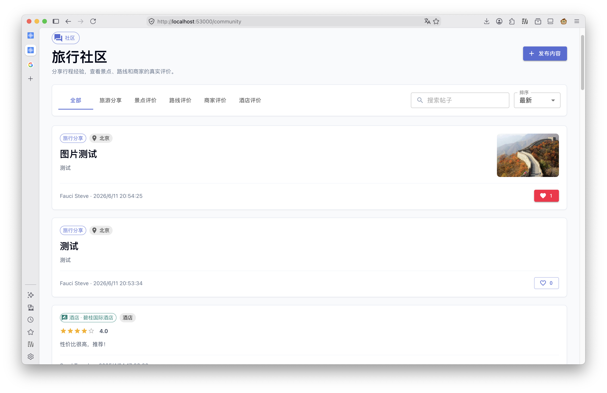

图 11：社区页面

## 10. AI 行程规划

### 10.1 功能说明

AI 行程规划功能支持创建行程会话、输入目的地和偏好、运行规划 agent、查看 Markdown 行程、地图点位和历史快照。该功能依赖 `ai-arrange-service`、`ai-arrange-agent-service`、MongoDB，以及外部模型 API。

### 10.2 创建规划会话

1. 进入 `/ai-planner`。
2. 输入目的地、出行日期、天数、人数和偏好。
3. 点击创建或开始规划。
4. 系统返回规划会话。

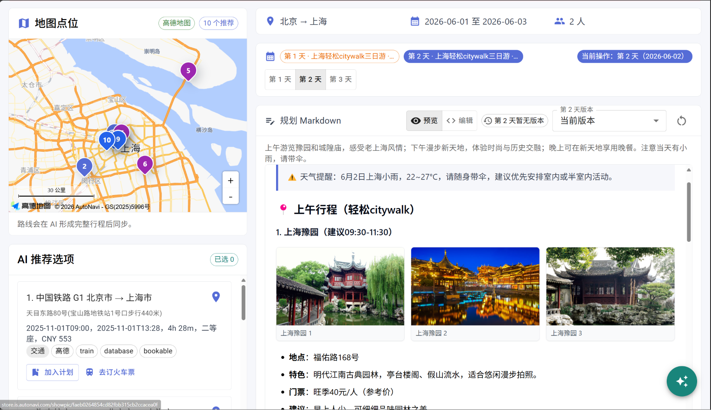

图 12：AI 行程规划会话创建

### 10.3 生成行程

1. 在规划页面补充自然语言需求。
2. 点击运行规划。
3. 等待 AI 返回每日行程。
4. 查看景点、餐饮、交通和住宿建议。

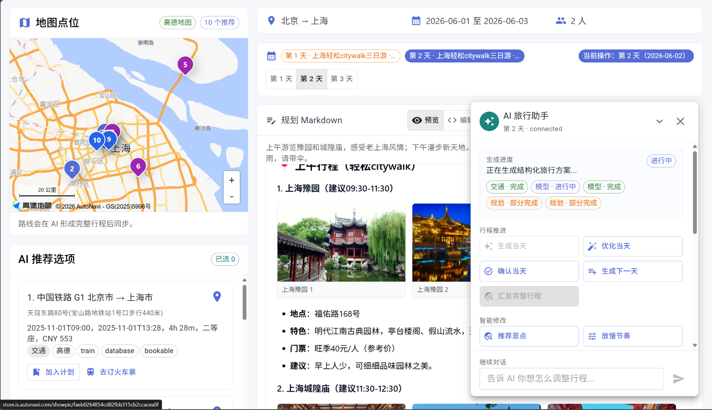

图 13：AI 行程规划结果

### 10.4 使用快照与版本

1. 生成行程后查看历史快照。
2. 对比不同版本。
3. 可回滚到历史版本或恢复某日行程版本。

说明：如果未配置 `DEEPSEEK_API_KEY`，AI 规划可能无法生成真实结果。课程展示时可说明该功能依赖外部模型接口。

## 11. 使用注意事项

1. 订单、社区发布、账户管理等功能建议登录后使用。
2. 前端页面加载失败时，先确认后端 Gateway 是否启动。
3. 查询结果为空时，可更换城市、日期或人数条件。
4. AI 规划需要外部 API Key，未配置时可展示页面和说明依赖。
5. 远程服务器部署时，前端 `.env` 中的 API 地址必须改为服务器公网 IP 或域名并重新构建。
