# TravelOn 软件详细设计说明书

| 项目 | 内容 |
|---|---|
| 系统名称 | TravelOn 综合出行旅游平台 |
| 项目代号 | travel-on-2026NULLptr |
| 文档名称 | 软件详细设计说明书 |
| 文档版本 | V2.0 |
| 修订日期 | 2026-08-25 |
| 适用范围 | 当前 Web 端和微服务实现的开发、测试与课程验收 |
| 编写依据 | 当前仓库代码、`docs/业务场景.md`、`docs/概要设计.md`、`README.md` |

## 目录

- [1. 引言](#1-引言)
  - [1.1 编写目的](#11-编写目的)
  - [1.2 设计基线](#12-设计基线)
  - [1.3 术语与参考资料](#13-术语与参考资料)
- [2. 实现结构](#2-实现结构)
  - [2.1 分层与模块](#21-分层与模块)
  - [2.2 前端对象设计](#22-前端对象设计)
  - [2.3 后端对象设计](#23-后端对象设计)
  - [2.4 网关与通信](#24-网关与通信)
- [3. 领域模型与类图](#3-领域模型与类图)
  - [3.1 账户与预订类图](#31-账户与预订类图)
  - [3.2 社区类图](#32-社区类图)
  - [3.3 AI 规划类图](#33-ai-规划类图)
  - [3.4 状态与数据约束](#34-状态与数据约束)
- [4. 接口与处理设计](#4-接口与处理设计)
  - [4.1 REST 与 WebSocket 接口](#41-rest-与-websocket-接口)
  - [4.2 查询、筛选与下单](#42-查询筛选与下单)
  - [4.3 支付、取消与退款](#43-支付取消与退款)
  - [4.4 社区与 AI 规划](#44-社区与-ai-规划)
- [5. 业务场景对象级图](#5-业务场景对象级图)
  - [5.1 图示约定](#51-图示约定)
  - [5.2 BS-01 账户初始化与出行人维护](#52-bs-01-账户初始化与出行人维护)
  - [5.3 BS-02 酒店查询与住宿预订](#53-bs-02-酒店查询与住宿预订)
  - [5.4 BS-03 机票查询与机票预订](#54-bs-03-机票查询与机票预订)
  - [5.5 BS-04 火车票查询与火车票预订](#55-bs-04-火车票查询与火车票预订)
  - [5.6 BS-05 订单支付与售后处理](#56-bs-05-订单支付与售后处理)
  - [5.7 BS-06 统一订单与旅行时间线管理](#57-bs-06-统一订单与旅行时间线管理)
  - [5.8 BS-07 社区内容分享与互动](#58-bs-07-社区内容分享与互动)
  - [5.9 BS-08 AI 行程规划与版本管理](#59-bs-08-ai-行程规划与版本管理)
- [6. 异常、安全、测试与维护](#6-异常安全测试与维护)

## 1. 引言

### 1.1 编写目的

本文档以当前可运行代码为基线，对 TravelOn 的页面对象、控制器、应用服务、领域实体、持久化对象和服务间通信进行详细说明。文档用于支撑开发联调、缺陷定位、测试设计和课程验收。

本文档替换旧版“详细设计”中混杂的历史目标设计、损坏的伪表格和未闭合 Mermaid 片段。未落地的旧版旅游套餐流程不作为当前核心业务设计。

### 1.2 设计基线

当前系统采用 React 前端、Spring Boot 微服务、API Gateway、Eureka、RabbitMQ、PostgreSQL 和 MongoDB 的组合：

| 范围 | 当前实现口径 |
|---|---|
| 酒店 | 通过 `minRating` 按评分筛选，评分范围为 0 至 5；当前不以星级作为主筛选字段。 |
| 机票与火车票 | 使用 `TicketOfferTemplate` 演示数据查询；查询页默认优先填入“北京 → 上海”。 |
| 火车票 | 页面按车次首字母进行 `G/C`、`D`、`T`、`K`、`Z`、其他类型筛选，并按车次号或片段筛选；同车次的不同席别在页面聚合。 |
| 下单 | 酒店、机票、火车票分别创建统一的 `Reservation`，初始状态为 `PENDING_PAYMENT`。提交成功后页面提供订单详情入口并跳转至支付倒计时位置。 |
| 支付 | 使用模拟银联卡校验；订单服务保存支付流水、更新支付状态，并对超时订单进行状态刷新。 |
| 社区 | 支持帖子、评论、点赞、景点、路线、评价、收藏和图片上传。 |
| AI 规划 | Java 服务保存会话、消息、快照和日计划版本；Python Agent 调用模型与旅行工具并返回规划结果。 |

### 1.3 术语与参考资料

| 术语 | 含义 |
|---|---|
| 页面对象 | React 路由页面及其局部状态，例如 `HotelBooking`、`TicketBooking`。 |
| 应用服务 | 处理用例协调的 Spring `@Service` 对象，例如 `ReservationService`。 |
| 聚合 | 维护领域状态变更的一组对象；预订服务中由 `ReservationAggregate` 处理命令。 |
| 快照 | `PlannerSnapshot`，表示一次可回溯的 AI 行程规划结果。 |
| 资源预订 | 酒店房间或交通座位在下单后由消息流程创建的占用记录。 |

参考资料：

- [业务场景说明](业务场景.md)
- [概要设计说明书](概要设计.md)
- [项目 README](../README.md)
- `travel-ui/src/core/apiConfig.tsx`
- `travel-api/api-gateway/src/main/resources/application.yml`
- `travel-api/*-service/src/main/java`

## 2. 实现结构

### 2.1 分层与模块

| 层次 | 模块/目录 | 主要职责 |
|---|---|---|
| 表现层 | `travel-ui` | React Router 页面、表单校验、页面状态、Axios 调用与 WebSocket 消息处理。 |
| 网关层 | `travel-api/api-gateway` | 将 `/hotels/**`、`/transports/**`、`/reservations/**`、`/community/**`、`/ai-arrange/**` 等请求转发到对应服务。 |
| 用户领域 | `user-service` | 注册、登录、会话令牌、个人资料与常用旅客维护。 |
| 酒店领域 | `hotel-service` | 目的地、酒店搜索、酒店详情、房型与房间预订消息处理。 |
| 交通领域 | `transport-service` | 机票和火车票模板、地点选项、票务搜索和交通资源预订消息处理。 |
| 订单领域 | `reservation-service` | 酒店/票务订单创建、状态维护、支付、取消、退款、支付流水和旅行时间线的基础数据。 |
| 支付领域 | `payment-service` | 模拟银联卡格式和 Luhn 校验，返回支付是否批准。 |
| 社区领域 | `community-service` | 帖子、评论、点赞、评价、景点、路线、收藏与上传文件。 |
| AI 领域 | `ai-arrange-service` | 规划会话、REST、WebSocket、Agent 客户端、快照、版本和地图增强。 |
| AI Agent | `ai-arrange-agent-service` | FastAPI 服务、模型调用、工具注册、旅行工具和 fallback 规划。 |

### 2.2 前端对象设计

| 页面对象 | 路由 | 核心局部状态 | 使用的主要 API |
|---|---|---|---|
| `Account` | `/account` | 当前用户、会话令牌、资料表单、旅客列表和旅客编辑表单 | `/users/auth/*`、`/users/me`、`/users/me/travelers` |
| `HotelBooking` | `/reservations/hotels` | 目的地、日期、人数、名称、价格、最低评分、酒店/房型条件和排序 | `/hotels/destinations`、`/hotels/search`、`/reservations/hotels` |
| `HotelDetails` | `/reservations/hotels/:hotelId` | 酒店详情、房型、入住人、订单确认弹窗和订单编号 | `/hotels/{id}`、`/reservations/hotels` |
| `TicketBooking` | `/reservations/flights`、`/reservations/trains` | 票种、北京到上海默认线路、票价、余票、车站、车次类型、车次号、席别和乘客 | `/transports/tickets/options`、`/transports/tickets`、`/reservations/tickets` |
| `Reservations` | `/reservations` | 用户订单列表、订单状态和再次预订导航状态 | `/reservations/user/{userId}`、`/reservations/{id}/cancel` |
| `ReservationDetails` | `/reservations/:reservationId` | 订单详情、支付卡号、支付/退款流水和倒计时 | `/reservations/{id}`、`/purchase`、`/payments`、`/refunds` |
| `TravelTimeline` | `/reservations/timeline` | 已支付订单、按时间排序的交通/入住节点 | `/reservations/user/{userId}` |
| `Community` 及详情页 | `/community`、`/community/**` | 当前标签、分页列表、发布表单、评论、点赞和收藏状态 | `/community/**` |
| `AiPlanner` | `/ai-planner` | 核心槽位、会话、流式文本、快照、地图点位、日计划版本 | `/ai-arrange/api/conversations/**`、`/ai-arrange/ws/planner` |

前端将公共请求集中在 `ApiRequests`。业务页面只组装参数、展示结果和处理状态，领域规则仍由后端实体、服务和资源预订流程共同约束。

### 2.3 后端对象设计

| 入口对象 | 应用服务/协作对象 | 主要领域对象 | 关键职责 |
|---|---|---|---|
| `UserController` | `UserService`、`TravelerService` | `User`、`Traveler` | 生成/校验会话令牌，维护资料与常用旅客。 |
| `HotelsController` | `HotelsService`、`HotelsCommandService` | `Hotel`、`Location`、`Room`、`RoomReservation` | 查询目的地、评分筛选酒店、加载房型，并处理房间资源预订消息。 |
| `TransportsQueryController` | `TransportsQueryService`、`TransportCommandService` | `TicketOfferTemplate`、`TicketType` | 查询机票/火车票与地点选项，并处理交通资源预订消息。 |
| `ReservationController` | `ReservationService`、`ReservationAggregate`、Saga 对象 | `Reservation`、`BookingPersonSnapshot`、`PaymentTransaction`、`RefundRecord` | 创建订单、支付、取消、退款、订单查询和状态变更。 |
| `PaymentController` | `PaymentService` | `HandlePaymentRequestDto`、`HandlePaymentResponseDto` | 校验卡号长度、银联前缀与 Luhn 校验结果。 |
| `CommunityController` | `CommunityService`、`CommentService`、`FavoriteService`、`FileStorageService` | `CommunityPost`、`CommunityComment`、`Review`、`TravelRoute`、`Attraction` | 维护社区内容与互动关系。 |
| `PlannerConversationController` | `PlannerConversationService`、`PlannerSnapshotService` | `PlannerConversation`、`PlannerMessage`、`PlannerSnapshot` | 创建会话、运行规划、维护快照及版本操作。 |
| `PlannerWebSocketHandler` | `PlannerConversationService`、`PlannerWebSocketSessionRegistry` | `PlannerSocketEnvelope`、`PlannerChatSendPayload` | 校验会话归属，处理规划聊天和地点选择消息。 |

### 2.4 网关与通信

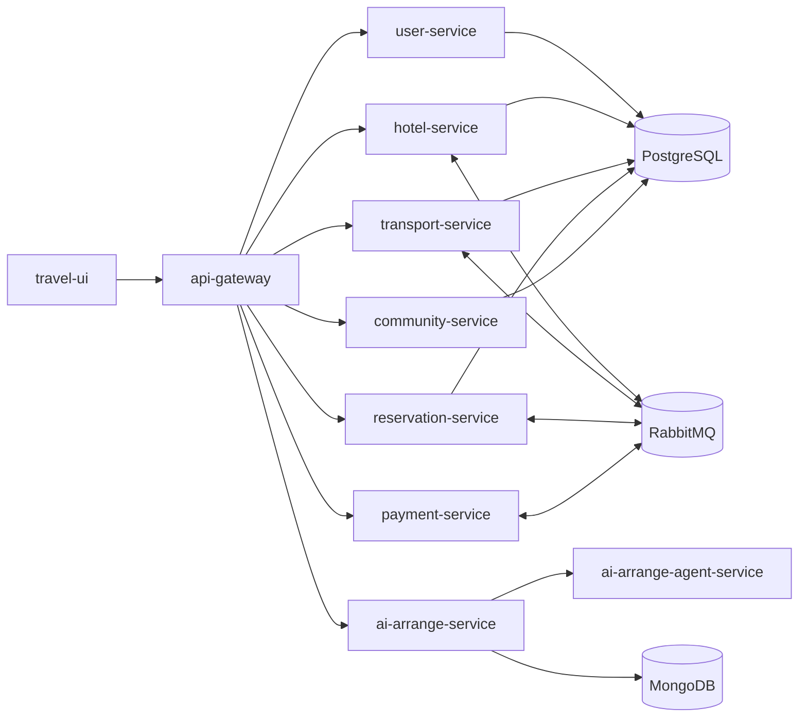

- HTTP REST 用于浏览器请求和 Gateway 转发。
- AI 规划使用 WebSocket 发送 `PLANNER_CHAT_SEND`、`PLANNER_PLACE_SELECTION` 等消息，并接收流式文本和结构化刷新事件。
- RabbitMQ 用于旧套餐兼容编排、酒店/交通资源预订、支付请求和订单状态更新；当前酒店和票务下单均通过订单服务发起资源创建。
- 普通业务数据分服务保存于 PostgreSQL；AI 会话、消息、快照和日计划版本保存于 MongoDB。

## 3. 领域模型与类图

### 3.1 账户与预订类图

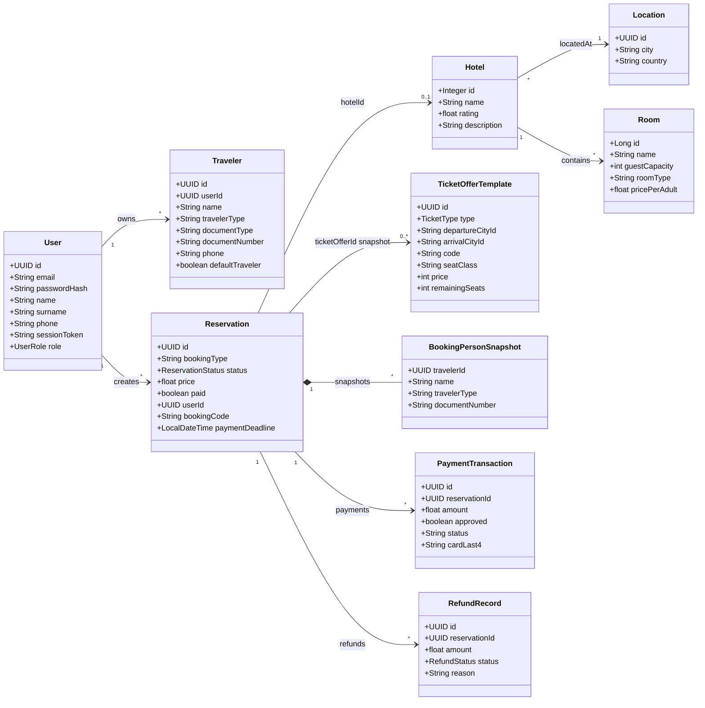

`Reservation` 是酒店、机票和火车票的统一订单实体。订单会复制旅客信息为 `BookingPersonSnapshot`，因此用户后续修改常用旅客不会篡改历史订单。`TicketOfferTemplate` 是可搜索的票务模板；订单仅保存所选票务资源标识、产品标题、车次/航班号和价格快照，而不将模板实体直接跨库关联。

### 3.2 社区类图

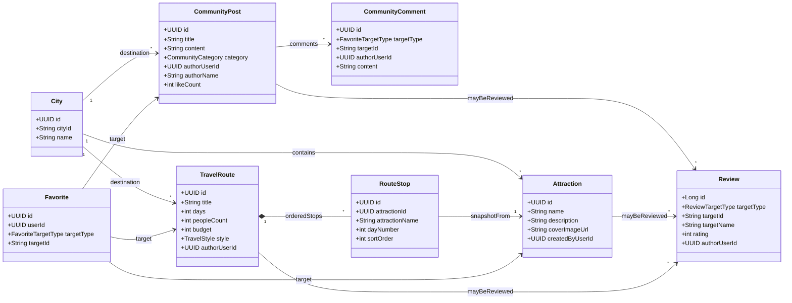

社区对象不直接使用 `User` 的外键实体关系，而是在内容对象中保存 `authorUserId` 和 `authorName`。这样社区服务可独立保存作者快照，并通过用户信息服务在必要时校验或补全资料。

### 3.3 AI 规划类图

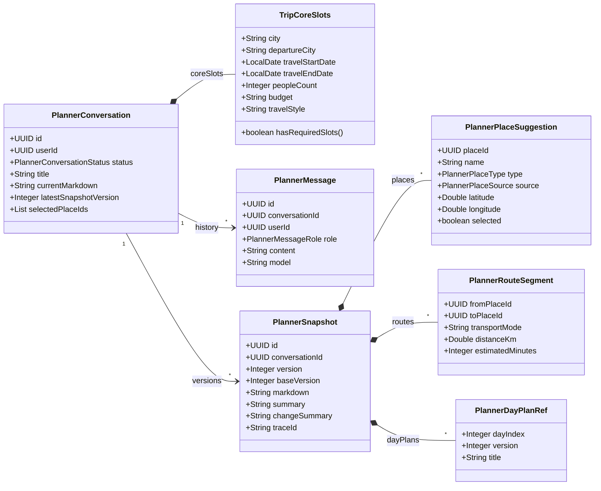

`PlannerConversation` 保存会话当前状态，`PlannerMessage` 记录对话历史，`PlannerSnapshot` 保存版本化结果。快照将地点、路线和日计划引用以内嵌集合形式保存，便于一次读取并在前端刷新 Markdown、地图和版本列表。

### 3.4 状态与数据约束

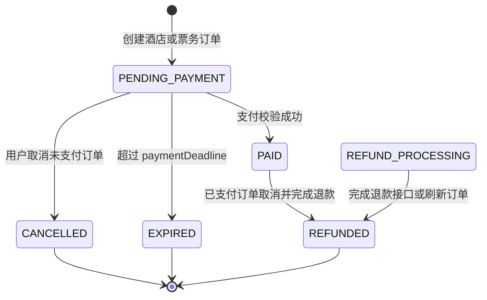

| 规则 | 详细设计约束 |
|---|---|
| 酒店日期 | `dateTo` 必须晚于 `dateFrom`；订单入住时间按 14:00、离店时间按 12:00 生成。 |
| 酒店筛选 | 后端 `searchHotels` 接收 `hotelName`、价格、`minRating`、`hotelType`、`roomType` 与 `sortBy`。 |
| 票务时间 | 到达时间早于出发时间时，订单服务按跨天到达处理。 |
| 票务默认值 | 前端加载地点选项后默认优先匹配北京和上海；用户可手工更改。 |
| 火车筛选 | 车次类型和车次号筛选在 `TicketBooking` 的结果对象集合中执行，再按车次聚合席别。 |
| 支付期限 | `Reservation.prePersist()` 默认将 `paymentDeadline` 设置为创建后 30 分钟；读取或支付时会刷新超时状态。 |
| 支付安全 | 仅保存卡号后四位与批准结果，不保存完整银行卡号。 |
| 退款 | 已支付取消会创建 `RefundRecord` 并将订单推进至退款完成状态；`REFUND_PROCESSING` 兼容完成退款接口。 |

## 4. 接口与处理设计

### 4.1 REST 与 WebSocket 接口

| 领域 | 方法和路径 | 请求对象 | 响应/效果 |
|---|---|---|---|
| 账户 | `POST /users/auth/register` | `RegisterRequest` | 创建 `User` 并返回 `AuthResponse`。 |
| 账户 | `POST /users/auth/login` | `LoginRequest` | 校验密码，返回会话令牌和用户资料。 |
| 账户 | `GET/PUT /users/me` | `X-User-Token`、`UpdateProfileRequest` | 查询或修改当前用户资料。 |
| 旅客 | `GET/POST /users/me/travelers` | `X-User-Token`、`TravelerRequest` | 查询或创建 `Traveler`。 |
| 酒店 | `GET /hotels/search` | 目的地、日期、人数、评分等查询参数 | 返回 `HotelResponseDto` 列表。 |
| 酒店 | `GET /hotels/{hotelId}` | 日期和入住人数参数 | 返回酒店、房型和可用性详情。 |
| 交通 | `GET /transports/tickets/options` | `type=FLIGHT|TRAIN` | 返回城市、车站/机场选项。 |
| 交通 | `GET /transports/tickets` | 票种、城市、日期、价格、余票和排序参数 | 返回 `TicketOfferDto` 列表。 |
| 订单 | `POST /reservations/hotels` | `CreateHotelOnlyReservationRequest` | 创建酒店待支付订单。 |
| 订单 | `POST /reservations/tickets` | `CreateTicketReservationRequest` | 创建机票或火车票待支付订单。 |
| 订单 | `POST /reservations/purchase` | `PurchaseRequestBody` | 执行模拟支付并返回订单确认信息。 |
| 订单 | `GET /reservations/**` | 订单或用户标识 | 返回订单、支付流水或退款记录。 |
| 社区 | `/community/**` | 内容、互动、上传或查询 DTO | 维护帖子、评论、路线、景点、评价和收藏。 |
| AI REST | `/ai-arrange/api/conversations/**` | 会话、核心槽位、快照或版本 DTO | 创建、读取、更新、对比和恢复规划。 |
| AI WebSocket | `/ai-arrange/ws/planner` | `conversationId`、`userId`、`PlannerSocketEnvelope` | 发送聊天/选点消息，接收流式文本与刷新事件。 |

### 4.2 查询、筛选与下单

酒店查询对象由 `HotelBooking` 组装为 `SearchHotelsParams`。`HotelsController.searchHotels()` 将参数传递给 `HotelsService.searchHotels()`；服务读取酒店、位置、房型和房间预订记录，返回符合日期、人数、价格和最低评分条件的酒店结果。

票务查询对象由 `TicketBooking` 组装为 `SearchTicketsParams`。`TransportsQueryService.searchTicketOffers()` 基于票种、城市、日期、价格、学生票、余票和排序条件查询 `TicketOfferTemplate`。火车页面得到原始票务结果后，使用页面状态完成车次类型、车次号和席别聚合，避免将纯展示逻辑混入后端库存对象。

订单创建统一遵循以下步骤：

1. 页面校验用户、旅客、日期和所选资源。
2. `ReservationController` 接收酒店或票务请求。
3. `ReservationService` 生成 `Reservation` 与 `BookingPersonSnapshot`。
4. `ReservationAggregate` 保存 `PENDING_PAYMENT` 订单。
5. `BookHotelsSaga` 或 `BookTransportsSaga` 发送资源预订消息。
6. 超时处理对象安排支付期限检查；前端跳转至 `/reservations/{id}#payment-countdown`。

### 4.3 支付、取消与退款

`ReservationService.purchaseReservation()` 的主要职责如下：

1. 读取 `Reservation`，拒绝非 `PENDING_PAYMENT` 状态和已过期订单。
2. 使用 `RabbitTemplate.convertSendAndReceive()` 向支付服务发送 `PaymentRequestDto`。
3. `PaymentService.verifyTransaction()` 校验卡号长度、银联 `62` 前缀和 Luhn 校验。
4. 支付失败时保存失败 `PaymentTransaction`；旧套餐兼容流程按需执行补偿。
5. 支付成功时保存成功 `PaymentTransaction`，并通过 `ReservationAggregate` 将订单更新为 `PAID`。

取消时，未支付订单更新为 `CANCELLED`；已支付订单创建 `RefundRecord` 并更新为 `REFUNDED`。订单详情页通过订单、支付流水和退款流水接口组合展示状态时间线。

### 4.4 社区与 AI 规划

社区服务中的 `FileStorageService` 保存上传文件，实体只保存图片 URL。`CommunityService`、`CommentService`、`ReviewLikeService` 和 `FavoriteService` 分别处理内容、评论、评价点赞和收藏关系；受限操作由前端携带 `X-User-Token`。

AI 规划遵循“会话先创建、聊天后运行、快照再刷新”的顺序：

1. `PlannerConversationController.create()` 创建 `PlannerConversation` 和 `TripCoreSlots`。
2. `PlannerWebSocketHandler` 在建立连接时校验 `conversationId` 与 `userId` 的归属。
3. 聊天消息经 `PlannerConversationService.handleChatMessage()` 转为 Agent 输入。
4. `PythonPlannerAgentClient` 调用 FastAPI Agent；Agent 可调用模型、地图、住宿、交通、预算和路线工具。
5. 服务保存 `PlannerMessage`、`PlannerSnapshot` 和日计划版本，并通过 `PlannerWebSocketSessionRegistry` 推送 `PLANNER_CHAT_STREAM` 与 `PLANNER_DATA_REFRESH`。

## 5. 业务场景对象级图

### 5.1 图示约定

本章依据 [业务场景说明](业务场景.md) 的 BS-01 至 BS-08 编排，每个业务场景恰好对应一张对象级顺序图。

- 图中的参与者是运行期对象或具名页面/控制器/服务/实体实例，例如 `hotelBooking: HotelBooking`、`reservationService: ReservationService`。
- 控制器负责协议转换，服务负责用例协调，实体或文档对象负责保存状态。
- 为保持图可读性，省略日志、序列化、通用异常拦截器和不影响主成功路径的内部辅助对象。

### 5.2 BS-01 账户初始化与出行人维护

**对象设计说明：** 账户页面通过认证对话框提交注册或登录。用户服务生成会话令牌，后续资料和旅客操作均携带 `X-User-Token`；旅客服务以用户归属作为访问边界。

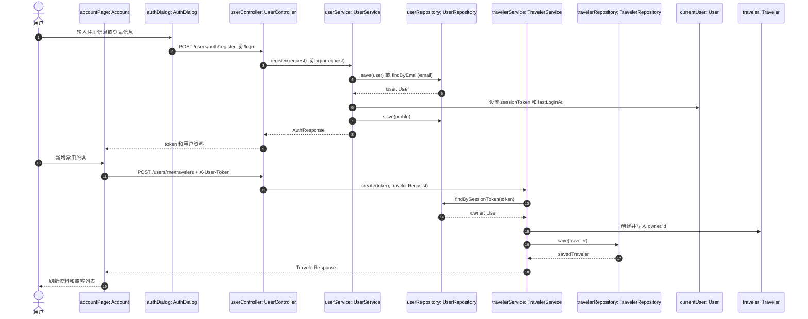

### 5.3 BS-02 酒店查询与住宿预订

**对象设计说明：** 酒店筛选以评分为核心，`minRating` 由页面传入酒店服务。用户在详情页选择房型和入住人后，订单服务生成酒店订单及入住人快照，再调用酒店资源预订 Saga。

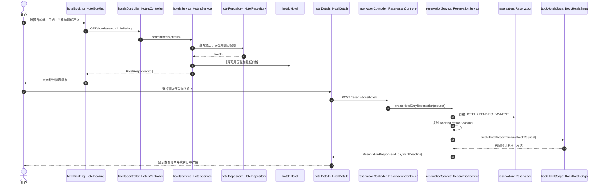

### 5.4 BS-03 机票查询与机票预订

**对象设计说明：** 机票页面在地点选项加载完成后优先选择北京和上海。所选航班以 `TicketOfferTemplate` 的标识、航班号、舱位和价格快照写入订单；交通 Saga 负责后续座位资源创建。

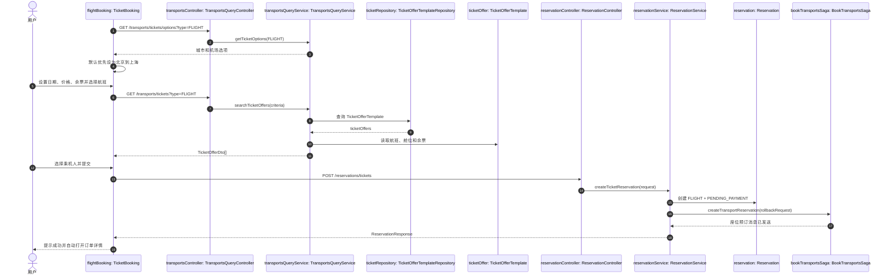

### 5.5 BS-04 火车票查询与火车票预订

**对象设计说明：** 火车票复用 `TicketBooking` 和 `TicketOfferTemplate`。后端返回原始车次与席别对象；页面对象维护 `trainTypeFilters`、`trainNumberKeyword` 和每车次的当前席别选择。

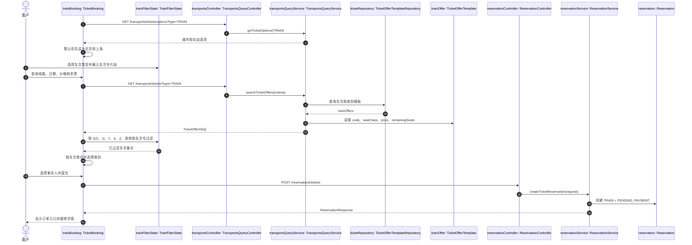

### 5.6 BS-05 订单支付与售后处理

**对象设计说明：** 订单详情页读取订单和流水。支付由订单服务通过 RabbitMQ 请求支付服务，支付成功后写入支付交易并更新订单；取消已支付订单时保存退款记录。

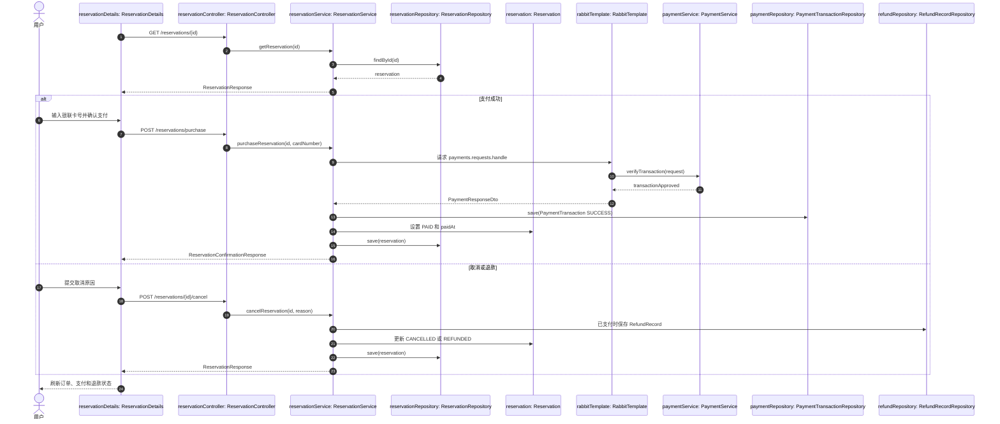

### 5.7 BS-06 统一订单与旅行时间线管理

**对象设计说明：** 订单列表和旅行时间线共享同一批 `ReservationResponse`，但页面对象以不同方式组织数据。时间线只使用已支付、未取消、未退款且行程未开始的有效订单。

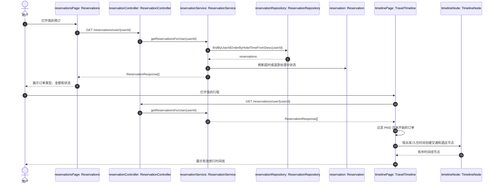

### 5.8 BS-07 社区内容分享与互动

**对象设计说明：** 社区页面可匿名查询；发布、评论、点赞、评价、收藏和上传均需要令牌。图片先由文件存储对象返回 URL，再作为帖子、路线或评价对象的图片字段保存。

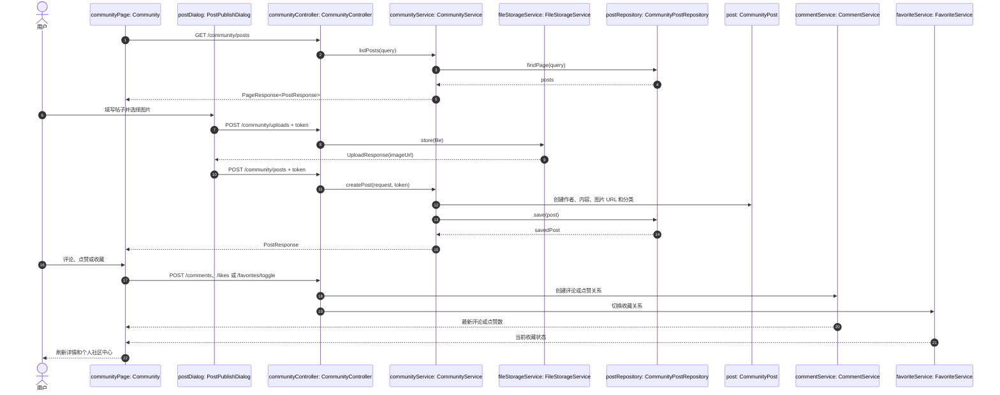

### 5.9 BS-08 AI 行程规划与版本管理

**对象设计说明：** AI 页面先创建会话，再通过 WebSocket 发送规划请求。Java 服务保存对话和快照，`PythonPlannerAgentClient` 调用 FastAPI Agent；地图或模型失败时可返回错误或 fallback，已有快照保持可读。

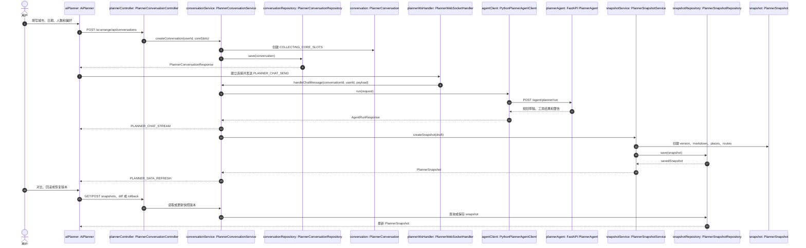

## 6. 异常、安全、测试与维护

### 6.1 异常处理

| 层次 | 典型异常 | 处理策略 |
|---|---|---|
| 前端表单 | 日期非法、未选择旅客、出发地与到达地相同、评分/价格范围非法 | 阻止提交，保留已输入内容并展示中文提示。 |
| 酒店/票务查询 | 无符合条件资源、余票为零、发车/起飞过近 | 返回空结果或不可预订标记；前端提示调整条件。 |
| 订单 | 订单不存在、非待支付状态、支付期限已过 | 返回 404 或 409；服务刷新为 `EXPIRED` 时拒绝支付。 |
| 支付 | 卡号不符合银联长度、前缀或 Luhn 校验 | 记录失败支付流水，订单保持待支付或返回失败。 |
| 社区 | 未登录、图片上传失败、内容越权删除 | 使用令牌校验；表单保留待重试数据；返回明确错误。 |
| AI 规划 | 缺少核心槽位、WebSocket 非法消息、Agent/模型/地图失败、版本冲突 | 发送 `PLANNER_ERROR` 或 REST 错误；保留上一个有效快照并允许重试。 |

### 6.2 安全与数据保护

- 用户密码使用 `passwordHash` 保存，接口不返回密码字段。
- 用户资料和常用旅客接口使用 `X-User-Token` 校验当前会话。
- 支付只保存卡号后四位、批准状态和失败原因，不保存完整卡号。
- 社区上传只保存受控目录中的文件和返回 URL；生产环境应限制文件类型、大小与可访问路径。
- AI 会话 REST 和 WebSocket 均使用 `conversationId` 与 `userId` 校验归属，缺失或不合法参数时关闭连接或返回错误。
- `DEEPSEEK_API_KEY`、地图 Key 和数据库凭据应通过环境变量或部署平台密钥注入，不提交 `.env` 文件。

### 6.3 验证建议

| 验证项 | 重点 |
|---|---|
| Markdown | 标题层级、目录锚点、表格分隔行与 Mermaid 代码块必须成对闭合。 |
| BS-01 | 注册/登录后可维护资料和常用旅客，旅客属于当前用户。 |
| BS-02 | 酒店评分筛选有效，酒店订单成功后跳转订单详情。 |
| BS-03 | 机票默认北京到上海，可创建待支付订单。 |
| BS-04 | 火车车次类型、车次号、席别聚合和默认北京到上海有效。 |
| BS-05 | 支付成功/失败、取消和退款流水与订单状态一致。 |
| BS-06 | 订单列表、详情和有效时间线结果一致。 |
| BS-07 | 帖子、评论、点赞、收藏、评价和图片可按权限操作。 |
| BS-08 | AI 会话、流式结果、快照、版本对比和恢复可用；外部依赖失败时页面可恢复。 |

本详细设计与 [业务场景说明](业务场景.md)、[概要设计说明书](概要设计.md) 共同构成当前 TravelOn 系统的设计基线。
