# 软件需求规格说明书

> 文档版本：V1.1；修改日期：2026-08-25

## 1 范围

### 1.1 标识

- 文档名称：软件需求规格说明书（SRS）
- 系统名称：TravelOn
- 系统代号：TravelOn
- 版本号：V1.1
- 发布日期：2026-08-25
- 适用范围：Web

### 1.2 系统概述

TravelOn 是面向课程演示的一站式旅游 Web 平台。当前版本面向游客和注册用户，提供账户与常用旅客维护、酒店/机票/火车票查询及预订、统一订单与模拟支付、取消退款、旅行时间线、社区互动和 AI 行程规划等能力。

当前系统一般特性：

- 酒店、机票和火车票的查询、筛选、详情查看和待支付订单创建。
- 统一订单列表、订单详情、钱包余额或银联卡模拟支付、取消退款和旅行时间线。
- 社区帖子、路线、景点或酒店评价，以及评论、点赞和收藏互动。
- AI 行程会话、Markdown 行程、地图信息、快照和版本管理；外部模型或地图不可用时可返回错误或降级结果。
- 旅游套餐接口当前仅保留兼容入口，不纳入本版本的独立验收业务场景。

项目相关方：

- 需方：软件工程基础课程的老师和助教。
- 用户方：需要进行旅游查询、预订、订单管理、社区分享或行程规划的用户。
- 开发方：TravelOn 项目组的产品、研发、测试和部署成员。
- 资源提供方：项目内置的模拟酒店和交通数据，以及可选的外部模型与地图服务。

运行现场：系统可在开发人员本机或云服务器部署，通过浏览器访问前端页面。

### 1.3 文档概述

本文档用于明确 TravelOn 的业务、功能、接口、数据、安全和验收要求，是产品设计、开发实现、测试验收和交付评审的依据。

保密要求：文档默认供项目组和课程验收使用，未经授权不得对外传播。

### 1.4 基线

- 课程大作业要求及项目验收要求。
- 当前仓库中的 README、部署文档、用户手册、测试文档和业务场景说明。
- 同类旅游产品的交互与信息展示方式，仅作为体验对标参考。
- 《个人信息保护法》《数据安全法》《网络安全法》等适用法规。

## 2 引用文件

| 编号 | 名称 | 版本/日期 | 说明 |
|---|---|---|---|
| REF-01 | 《个人信息保护法》 | 以官方最新文本为准 | 隐私与数据处理合规依据 |
| REF-02 | 《数据安全法》 | 以官方最新文本为准 | 数据分类分级与安全治理依据 |
| REF-03 | 《网络安全法》 | 以官方最新文本为准 | 网络安全合规依据 |
| REF-04 | [携程官网](https://www.ctrip.com/) | 现行页面 | 竞品对标参考 |
| REF-05 | [同程官网](https://www.ly.com/) | 现行页面 | 竞品对标参考 |
| REF-06 | [去哪儿网官网](https://www.qunar.com/) | 现行页面 | 竞品对标参考 |

## 3 需求
本章定义 TravelOn（以下简称“本平台”）的软件需求，覆盖当前已实现或可验收的酒店、机票、火车票、订单支付、社区和 AI 行程规划能力，并给出可验证、可追踪的验收标准。

### 3.0 需求编号规则

为保证需求、验收标准和追踪矩阵之间可以双向关联，本章为可验证的需求统一分配唯一编号：

| 编号前缀 | 需求类别 |
|---|---|
| `REQ-BIZ` | 业务目标、业务范围和运行方式 |
| `REQ-FUN` | 功能需求 |
| `REQ-IF` | 外部接口需求 |
| `REQ-INT` | 内部接口需求 |
| `REQ-DATA` | 数据需求 |
| `REQ-SEC` | 安全、保密和隐私需求 |
| `REQ-ENV` | 环境、资源和通信需求 |
| `REQ-QUAL` | 软件质量需求 |
| `REQ-CON` | 设计与实现约束 |
| `REQ-OPS` | 操作、故障处理和算法需求 |
| `REQ-DEL` | 人员、培训、后勤、包装和其他交付需求 |

同一类别内按章节顺序递增编号，例如 `REQ-FUN-001`。后续变更不得复用已删除需求的编号。

### 3.1 所需的状态和方式
本平台运行状态定义如下：

| 编号 | 状态/方式 | 描述 | 关键要求 |
|---|---|---|---|
| REQ-BIZ-001 | 正常服务 | 用户数量不大，服务器压力小，全量功能开放 | 所有功能可用 |
| REQ-BIZ-002 | 课程演示 | 单用户或少量并发的课程演示环境 | 不要求实现高并发限流；核心页面和完整业务链路应可正常演示 |
| REQ-BIZ-003 | 服务降级 | 外部模型、地图或模拟数据服务异常 | 返回错误或降级结果，不影响其他独立业务模块使用 |
| REQ-BIZ-004 | 维护模式 | 软件维护、更新或修改现有功能 | 暂停相关功能的访问并展示维护提示 |

### 3.2 需求概述

#### 3.2.1 目标

本平台的目标是让用户在一个 Web 应用中完成出行前的查询、预订和行程规划，以及出行后的订单管理和社区分享。当前版本优先保证可演示的业务闭环，而不以真实供应商接入或高并发交易能力为验收目标。

当前业务范围：

- 账户注册登录、个人资料和常用旅客维护。
- 酒店、机票和火车票的查询、筛选、产品选择与待支付订单创建。
- 统一订单、模拟支付、取消退款和旅行时间线。
- 社区内容浏览、发布、评论、点赞、收藏和评价。
- AI 行程规划、地图增强、Markdown 结果、快照和版本管理。

当前主要业务流程：用户维护账户和出行人信息后，查询酒店、机票或火车票；选择产品和出行人创建待支付订单；完成模拟支付或执行取消退款；在统一订单和旅行时间线查看结果。用户也可以独立使用社区或 AI 行程规划功能。

#### 3.2.2 运行环境

- 客户端：Chrome、Firefox、Edge 等主流现代浏览器。
- 服务端：Linux、macOS 或 Windows 环境，可通过 Docker Compose 容器化部署。
- 数据与中间件：PostgreSQL、MongoDB 和 RabbitMQ。
- 网络：开发环境可使用本地地址；部署环境通过服务器 IP、域名或反向代理地址访问。

#### 3.2.3 用户的特点

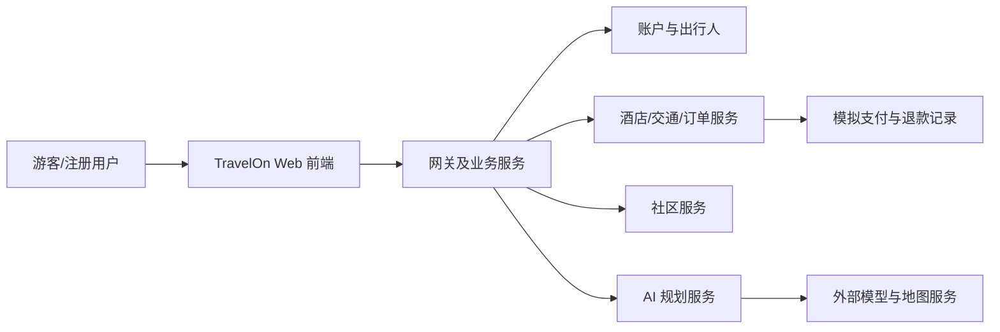

- 游客：可浏览公开内容和查询产品；受限操作需要先登录。
- 注册用户：维护资料和常用旅客，创建订单、支付、取消退款，参与社区和 AI 行程规划。
- 项目组成员：负责部署、测试、演示和故障处理；当前版本不将运营后台作为独立验收场景。

#### 3.2.4 关键点

- 核心功能：酒店、机票和火车票查询与预订；统一订单与模拟支付；社区互动；AI 行程规划与版本管理。
- 关键业务规则：查询条件与出行人校验、余票或房型可用性校验、订单状态流转、支付与退款记录一致性。
- 关键技术：前后端分离、Spring Cloud Gateway、Eureka、PostgreSQL、MongoDB、RabbitMQ 和可选的外部模型与地图服务。

#### 3.2.5 约束条件

- 课程约束：以课程规定的阶段目标、仓库协作和可演示交付为准。
- 接口约束：不直接对接真实的 12306、航司或酒店订票接口，使用项目数据和模拟支付完成演示闭环。
- 资源约束：运行在普通开发设备或低配云服务器，保证单用户或少量并发场景。
- 外部依赖约束：AI 模型或地图 Key 未配置、网络不可用或调用失败时，系统应给出错误提示或降级结果。

### 3.3 需求规格
#### 3.3.1 软件系统总体功能/对象结构

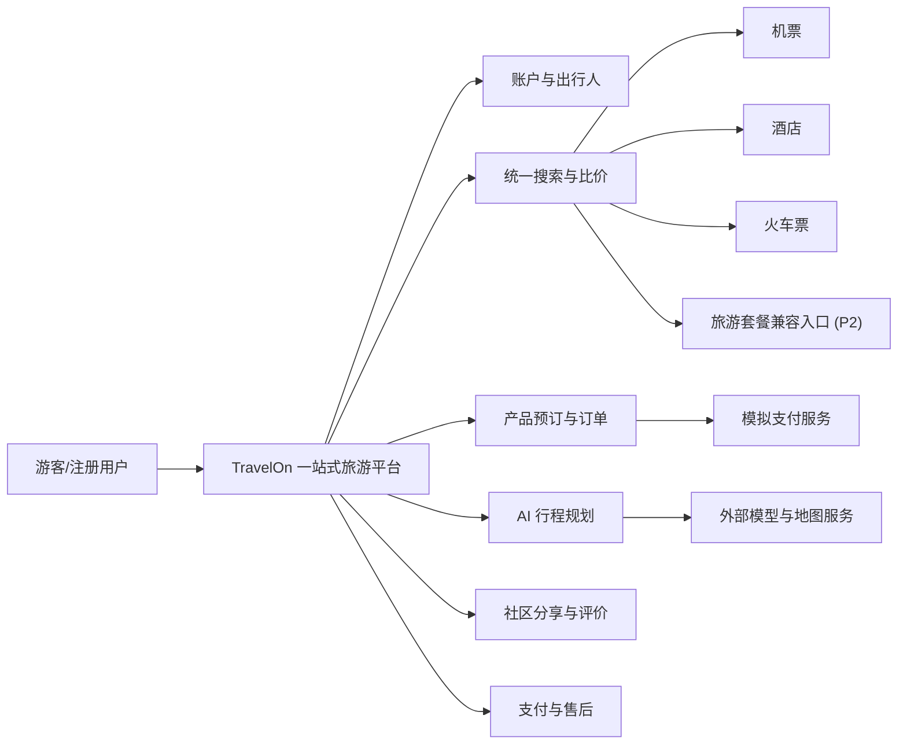

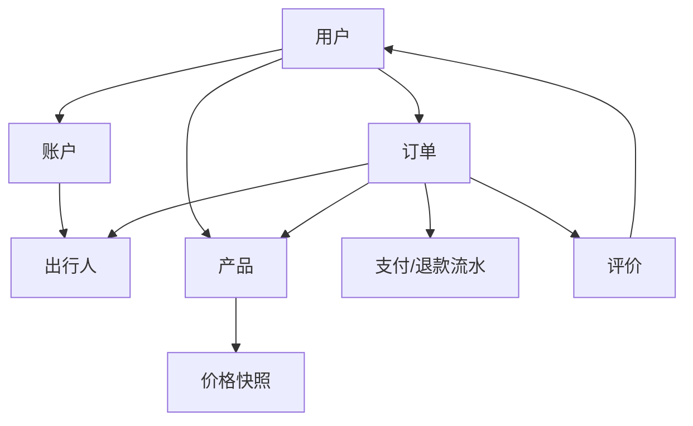

#### 3.3.2 软件子系统功能/对象结构

**机票子系统：**航班搜索、舱位库存、退改规则、值机提醒。

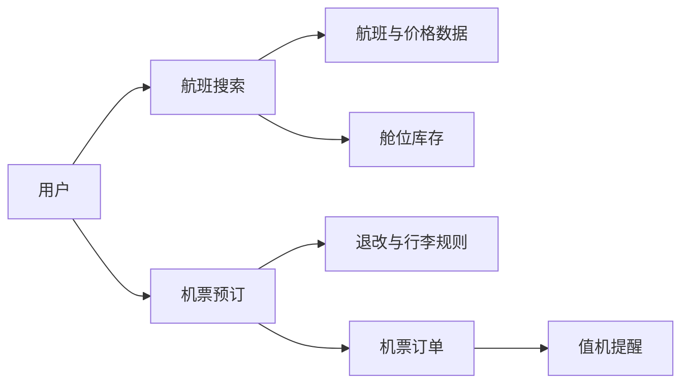

**酒店子系统：**房型搜索、库存日历、取消政策、担保规则。

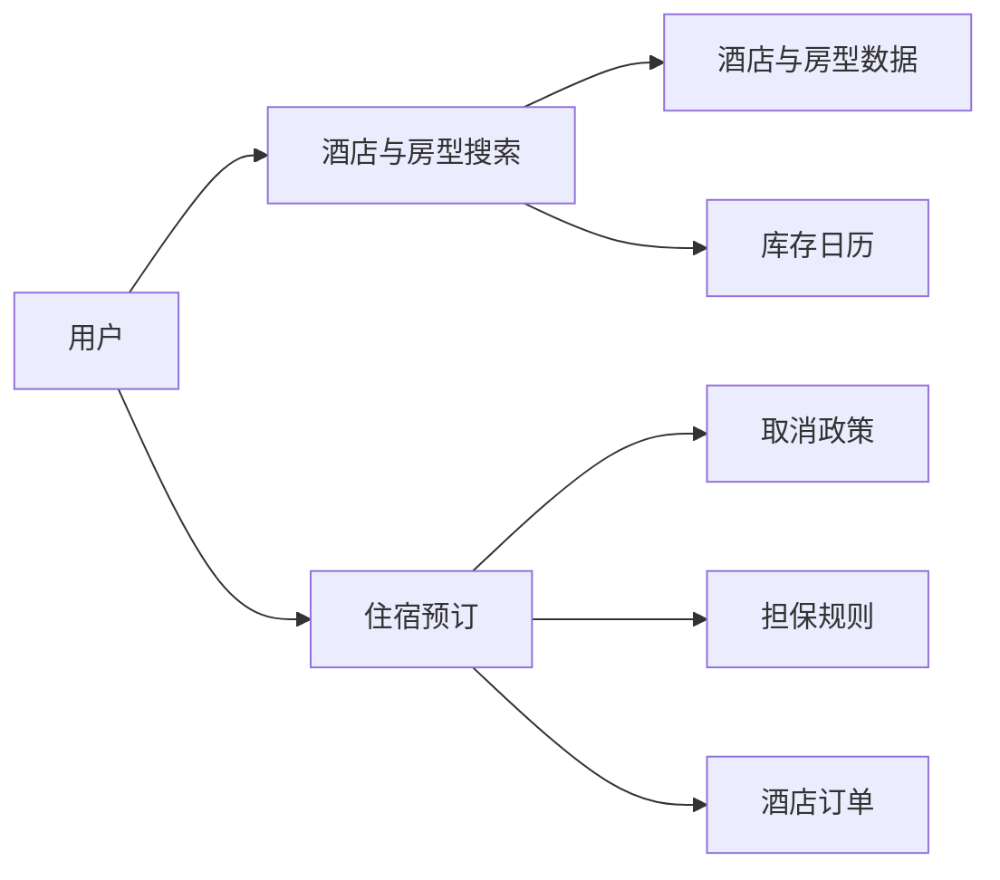

**火车票子系统：**车次查询、席别选择、候补与抢票任务。

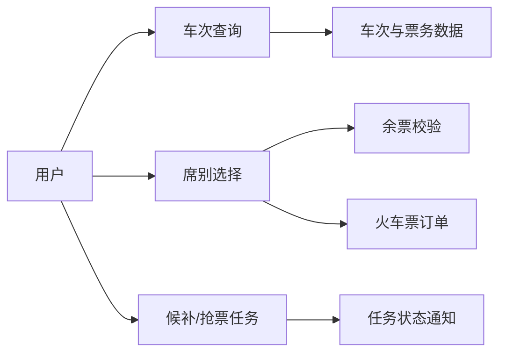

**度假子系统：**线路筛选、套餐组合、出行日历、签约须知。

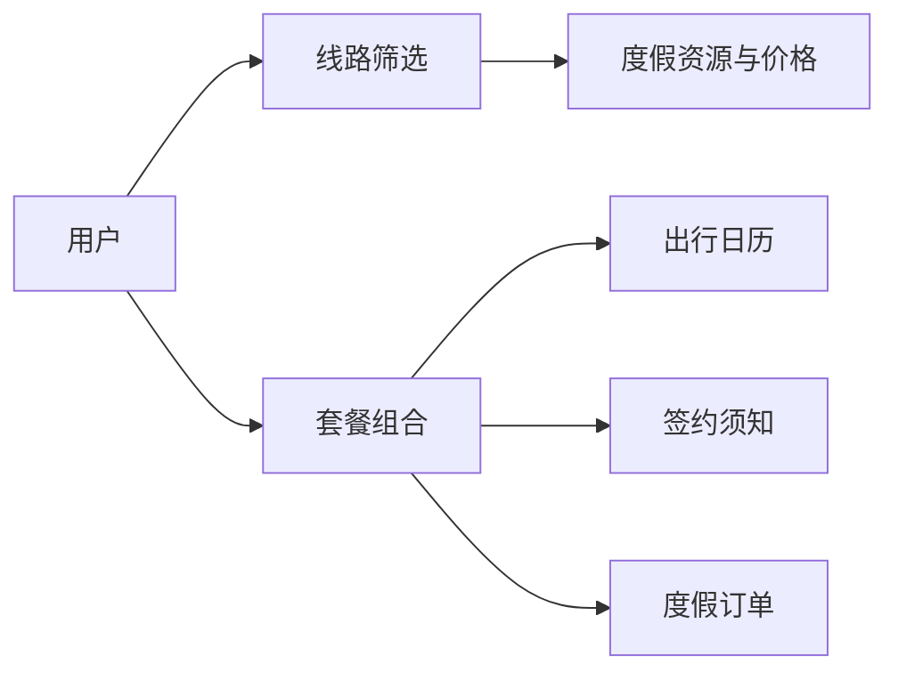

**订单支付：**统一订单状态机、支付路由、退款与对账。

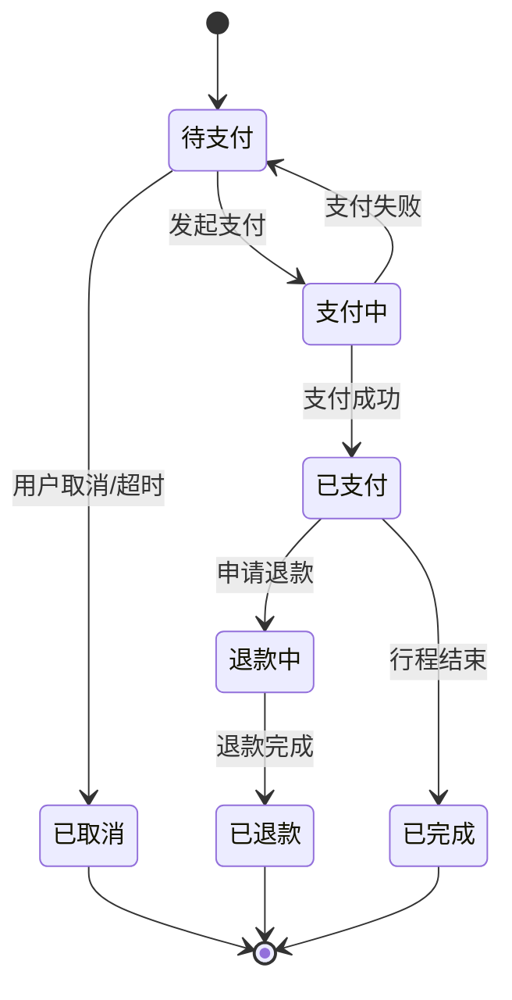

**售后客服：**退改签申请、工单流转、SLA 管理。

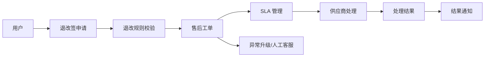

上述模型只表达用户、平台服务和外部服务之间的系统级关系，不规定具体类、数据库表或代码实现。

#### 3.3.3 描述约定
- **货币单位：**人民币（元），保留两位小数。
- **时间标准：**北京时间 UTC+8，24 小时制。
- **优惠后价格计算：**订单应付金额 = 商品总价 - 平台优惠 - 商家优惠 + 税费 + 服务费。

### 3.4 CSCI能力需求
#### 3.4.1 搜索与实时比价能力
- **REQ-FUN-001：**系统应接收出发地、目的地、日期、人数和偏好等条件，聚合多供应商结果并去重排序，输出可预订产品列表。
- **REQ-FUN-002：**机票、酒店和火车票搜索接口的 P95 响应时间应不超过 2.5 秒。
- **REQ-FUN-003：**搜索结果必须展示价格更新时间戳，数据延迟应不超过 60 秒。
- **REQ-FUN-004：**比价页面必须显示基础价、税费、服务费和优惠后价明细。

#### 3.4.2 机票预订能力
- **REQ-FUN-005：**系统应支持按出发地、到达地、日期、价格区间和余票查询机票，并展示航班、舱位、价格和余票。
- **REQ-FUN-006：**下单前必须展示退改签规则与行李规则，用户确认后方可支付。
- **REQ-FUN-007：**机票下单成功后应生成包含航班、舱位、乘机人和金额快照的待支付订单。

#### 3.4.3 酒店预订能力
- **REQ-FUN-008：**系统应支持按目的地、日期、价格、最低评分、酒店类型和房型筛选酒店。
- **REQ-FUN-009：**酒店详情必须展示房型库存、取消政策、生效时限和担保要求。
- **REQ-FUN-010：**酒店订单应根据房型参考单价、入住人数和入住晚数计算金额，并在订单创建后进入待支付状态。

#### 3.4.4 火车票预订能力
- **REQ-FUN-011：**系统应支持按出发地、到达地、日期、价格、余票、车次类型和车次号查询火车票。
- **REQ-FUN-012：**同一车次的不同席别应合并展示，用户可以选择席别和乘车人后创建待支付订单。
- **REQ-FUN-013：**发车时间过近或余票不足的车次不得继续预订，页面应给出明确提示。

#### 3.4.5 旅游度假能力
- **REQ-FUN-014：**旅游套餐接口在当前版本仅保留兼容入口，不纳入当前独立业务场景或核心验收流程。
- **REQ-FUN-015：**后续恢复度假产品预订时，应展示行程日历、费用包含/不含、退订规则和签证提示。
- **REQ-FUN-016：**后续恢复度假产品预订时，应支持图文详情、用户评价与问答。

#### 3.4.6 智能行程规划能力
- **REQ-FUN-017：**系统应支持创建规划会话，收集目的地、日期、天数、人数、预算和偏好等核心槽位。
- **REQ-FUN-018：**系统应生成并展示 Markdown 行程、地图点位和可用的内部预订入口；地图增强失败时保留文字行程。
- **REQ-FUN-019：**系统应保存版本化行程快照，支持查看历史版本、比较版本和恢复规划。

#### 3.4.7 实时优惠提醒能力
- **REQ-FUN-020：**当前版本应展示本次查询返回的价格和更新时间；不将其表述为实时第三方平台价格。
- **REQ-FUN-021：**价格订阅和降价推送为 P2 增强项，不纳入当前验收流程。
- **REQ-FUN-022：**多优惠叠加和自动择优为 P2 增强项，后续实现时应按用户实付最低原则选择方案。

#### 3.4.8 订单、支付与售后能力
- **REQ-FUN-023：**统一订单中心应管理机票、酒店、火车票和度假产品的订单状态。
- **REQ-FUN-024：**当前版本应支持钱包余额和银联卡模拟支付，并保存支付流水。
- **REQ-FUN-025：**系统应支持在线退订、改签和退款申请。
- **REQ-FUN-026：**退款进度必须全程可视，至少支持申请中、审核中、退款中、已完成和失败状态，并在状态变化时通知用户。

#### 3.4.9 行中服务与行后分享能力
- **REQ-FUN-027：**天气、值机、登车和入住提醒为 P2 增强项，不纳入当前验收流程。
- **REQ-FUN-028：**系统应支持帖子、路线、酒店或景点评价的发布、评论、点赞和收藏等社区互动。
- **REQ-FUN-029：**发布、评论、评价、点赞和收藏等受限操作必须要求登录并执行内容或权限校验。

#### 3.4.10 账户与旅行时间线能力
- **REQ-FUN-030：**系统应支持用户注册、登录、资料维护和常用旅客管理；预订前应校验用户登录状态和出行人信息。
- **REQ-FUN-031：**系统应提供统一订单列表、订单详情和旅行时间线；旅行时间线仅汇总已支付且尚未开始的有效订单。

### 3.5 CSCI 外部接口需求
#### 3.5.1 接口标识

| 需求编号 | 接口标识 | 名称 | 类型 | 对接实体 |
|---|---|---|---|---|
| REQ-IF-001 | IF-UI-01 | 用户界面接口 | 用户接口 | Web 浏览器 |
| REQ-IF-002 | IF-HW-01 | 终端硬件接口 | 硬件接口 | 用户设备（GPS、相机） |
| REQ-IF-003 | IF-SW-01 | 供应商数据接口 | 软件接口 | 模拟的航司、酒店、火车票数据接口 |
| REQ-IF-004 | IF-SW-02 | 地图服务接口 | 软件接口 | 高德或百度地图 API |
| REQ-IF-005 | IF-COM-01 | 通信接口 | 通信接口 | HTTP/HTTPS 网络通信 |

#### 3.5.2 接口需求

| 需求编号 | 接口 | 需求项 | 说明 |
|---|---|---|---|
| REQ-IF-006 | IF-UI-01 | 对接实体 | Web 浏览器（Chrome、Firefox、Edge） |
| REQ-IF-007 | IF-UI-01 | 接口类型 | 图形用户界面（GUI） |
| REQ-IF-008 | IF-UI-01 | 界面语言 | 中文简体 |
| REQ-IF-009 | IF-UI-01 | 页面适配 | 支持 PC 端主流分辨率（不低于 1366 x 768） |
| REQ-IF-010 | IF-UI-01 | 关键页面 | 首页、搜索页、产品列表页、订单页和用户中心 |
| REQ-IF-011 | IF-UI-01 | 数据格式 | HTML5、CSS3 和 JavaScript |
| REQ-IF-012 | IF-HW-01 | GPS 定位 | 仅在前端主动触发时调用浏览器 Geolocation API，用于附近酒店或景点推荐 |
| REQ-IF-013 | IF-HW-01 | 相机 | 调用浏览器 Media Capture API，用于用户头像和评价图片上传 |
| REQ-IF-014 | IF-HW-01 | 权限要求 | 定位权限按需申请；用户拒绝后不影响其他功能使用 |
| REQ-IF-015 | IF-SW-01 | 对接实体 | 模拟的供应商数据服务（小组自建或 JSON Server / Mock API） |
| REQ-IF-016 | IF-SW-01 | 接口协议 | HTTP RESTful API，JSON 格式 |
| REQ-IF-017 | IF-SW-01 | 数据内容 | 航班、酒店、火车票和度假产品信息 |
| REQ-IF-018 | IF-SW-01 | 主要操作 | GET 查询（搜索/筛选）和 POST 提交（模拟下单） |
| REQ-IF-019 | IF-SW-01 | 超时设置 | 请求超时 3 秒 |
| REQ-IF-020 | IF-SW-01 | 异常处理 | 超时或失败时返回兜底数据，或提示“暂无数据” |
| REQ-IF-021 | IF-SW-02 | 对接实体 | 高德地图 API 或百度地图 API |
| REQ-IF-022 | IF-SW-02 | 接口协议 | HTTP RESTful API，JSON 格式 |
| REQ-IF-023 | IF-SW-02 | 用途 | 酒店位置展示、景点标注和行程路线可视化 |
| REQ-IF-024 | IF-SW-02 | 调用方式 | 前端 JavaScript SDK 加载地图组件 |
| REQ-IF-025 | IF-SW-02 | 异常处理 | 地图加载失败时展示静态位置信息 |
| REQ-IF-026 | IF-COM-01 | 通信协议 | 开发环境使用 HTTP，生产环境建议使用 HTTPS |
| REQ-IF-027 | IF-COM-01 | 数据格式 | JSON，字符编码 UTF-8 |
| REQ-IF-028 | IF-COM-01 | 请求方式 | GET（查询）、POST（提交）、PUT（修改）、DELETE（取消） |
| REQ-IF-029 | IF-COM-01 | 跨域处理 | 后端配置 CORS，允许前端跨域访问 |

#### 3.5.3 接口数据元素说明

| 接口 | 主要传入数据 | 主要返回数据 |
|---|---|---|
| IF-UI-01 | 用户点击、输入和选择操作 | 页面渲染和交互反馈 |
| IF-HW-01 | GPS 坐标、图片文件 | 定位结果和图片预览 |
| IF-SW-01 | 搜索条件（目的地、日期、人数） | 机票、酒店、火车票和度假产品列表 |
| IF-SW-02 | 经纬度、地址名称 | 地图瓦片、路线规划和 POI 标记 |
| IF-COM-01 | HTTP 请求报文 | HTTP 响应报文 |

### 3.6 CSCI 内部接口需求
本平台采用前后端分离架构，内部接口指前端页面与后端 API 之间、以及后端各功能模块之间
的数据交互接口。具体接口细节留待设计阶段确定，此处仅规定基本需求。

| 需求编号 | 需求项 | 说明 |
|---|---|---|
| REQ-INT-001 | 数据格式 | JSON |
| REQ-INT-002 | 字符编码 | UTF-8 |
| REQ-INT-003 | 统一响应格式 | `{ code: 状态码, data: 数据, message: 提示信息 }` |
| REQ-INT-004 | 鉴权方式 | 登录后使用 Token 或 Session 验证身份 |
| REQ-INT-005 | 版本管理 | URL 路径带版本号，例如 `/api/v1/...`；后续升级新增 `/api/v2/...`，不破坏旧版 |
| REQ-INT-006 | 超时设置 | 前端请求超时默认 8 秒 |
| REQ-INT-007 | 错误处理 | 后端统一返回错误码和中文提示；前端统一拦截并展示提示 |

### 3.7 CSCI 内部数据需求
本平台需要持久化存储的数据围绕出行旅游业务的核心流程展开，涵盖从用户注册、产品搜
索、下单预订到行后评价的完整链路。业务数据由 PostgreSQL 管理，AI 规划会话和快照由
MongoDB 管理；数据库选型及表结构细节留待设计阶段确定，此处仅规定数据实体的基本构成
与约束要求。
平台核心数据实体共六类，具体如下：

| 需求编号 | 数据实体 | 基本构成与约束 |
|---|---|---|
| REQ-DATA-001 | 用户 | 存储用户 ID、用户名、手机号、电子邮箱、加密密码和注册时间；密码必须使用不可逆加密算法存储，禁止保存明文。 |
| REQ-DATA-002 | 旅客 | 存储旅客 ID、姓名、证件类型、证件号码和出生日期；一个用户可以关联多个旅客。 |
| REQ-DATA-003 | 产品 | 统一管理机票、酒店、火车票和度假产品的公共信息；特有属性在详细设计阶段通过扩展字段细化。 |
| REQ-DATA-004 | 价格 | 记录价格 ID、产品 ID、基础价、税费、服务费、总价和价格获取时间戳，用于展示价格与更新时间。 |
| REQ-DATA-005 | 订单 | 记录订单 ID、用户 ID、产品 ID、旅客列表、原始金额、实付金额、订单状态和创建时间；状态至少包括待支付、已支付、已完成和已取消。 |
| REQ-DATA-006 | 评价 | 与已完成订单关联，存储评价 ID、订单 ID、用户 ID、星级评分、文字内容和图片地址；评价发布前应执行内容审核。 |
### 3.8 适应性需求
本平台在设计上需具备一定的灵活性和可配置能力，以适应不同运行环境下的变化需求。具体
包括以下几个方面：

- **REQ-CON-001：**系统当前支持中文和人民币计价，架构上预留多语言和多币种扩展接口，本阶段不要求实现多语言和多币种。
- **REQ-CON-002：**搜索默认排序、每页显示条数、热门搜索词、订单超时阈值和敏感词库应通过配置文件或后台配置管理。
- **REQ-CON-003：**产品与价格数据来源应支持在本地模拟数据和外部 API 之间切换，切换时不应要求大幅改动前端展示和核心业务逻辑。
- **REQ-CON-004：**前端应兼容 PC 端主流分辨率，采用响应式或弹性布局，确保核心操作元素不发生错位或遮挡。

### 3.9 保密性需求
本平台不涉及工业控制类人身安全风险。交易安全要求如下：

- **REQ-SEC-001：**支付、退款和改签等高风险操作必须进行二次校验，例如支付密码或实名信息校验。
- **REQ-SEC-002：**风险订单命中规则后应进入人工复核队列，不得自动放行。

### 3.10 保密性和私密性需求

- **REQ-SEC-003：**生产环境应使用 HTTPS，敏感字段传输时必须加密。
- **REQ-SEC-004：**用户数据采集和处理应遵循目的限定、最小必要原则。
- **REQ-SEC-005：**系统应提供账号登录保护，例如异常登录提醒和风控拦截。
- **REQ-SEC-006：**敏感操作应记录审计日志并支持追溯；用户可在符合法规前提下查看、下载或删除个人信息。

### 3.11 CSCI 环境需求

| 需求编号 | 环境项 | 要求 |
|---|---|---|
| REQ-ENV-001 | 客户端环境 | 用户通过浏览器访问前端页面；支持 Chrome、Firefox 和 Edge 等现代浏览器，客户端无需安装额外插件。 |
| REQ-ENV-002 | 服务端环境 | 后端服务运行于 Docker 容器环境，Java 微服务使用 JDK 21，前端构建使用 Node.js 18 及以上版本。 |
| REQ-ENV-003 | 数据与中间件 | 业务数据库使用 PostgreSQL，AI 会话和快照使用 MongoDB，异步消息使用 RabbitMQ。 |
| REQ-ENV-004 | 开发与测试环境 | 开发人员应在本机完成基本功能验证；测试环境应尽量与部署环境保持一致的运行时和数据库版本。 |
| REQ-ENV-005 | 运行模式 | 小组作业阶段应保证单用户或少量并发用户的正常使用；维护时前端应展示维护提示。 |

### 3.12 计算机资源需求
#### 3.12.1 计算机硬件需求

- **REQ-ENV-006：**开发环境建议具备 16 GB 及以上内存、200 GB 及以上可用磁盘空间，以同时运行编辑器、容器、数据库服务和浏览器。
- **REQ-ENV-007：**部署演示使用云服务器时，建议配置不少于 2 核 CPU、4 GB 内存和 200 GB SSD 磁盘；本地演示可使用开发人员个人计算机。

#### 3.12.2 计算机硬件资源利用需求

- **REQ-ENV-008：**演示期间同时在线用户数为个位数时，系统应在普通开发设备上正常运行；出现内存异常或响应缓慢时应排查资源泄漏和低效查询。

#### 3.12.3 计算机软件需求
本平台开发和运行所需的软件及其版本要求如下表所示。

| 软件类别 | 软件名称 | 版本要求 | 用途 |
|---|---|---|---|
| 操作系统 | Ubuntu 或 Windows | Ubuntu 20.04+ / Windows 10+ | 开发与运行环境 |
| 运行时 | JDK / Node.js | JDK 21 / Node.js 18+ | 后端服务与前端构建 |
| 数据库 | PostgreSQL / MongoDB | PostgreSQL 16 / MongoDB 7 | 业务数据与 AI 会话存储 |
| 消息中间件 | RabbitMQ | 3.13-management | 异步消息与预订编排 |
| 容器编排 | Docker Compose | v2 及以上 | 本地和交付演示部署 |
| 浏览器 | Chrome / Firefox / Edge | 稳定版 | 前端运行与测试 |
| 代码编辑器 | VS Code 或同类 | 稳定版 | 代码开发 |
| 版本管理 | Git | 2.30 及以上 | 代码版本控制 |
| 接口测试 | Postman 或 Apifox | 稳定版 | API 调试与测试 |

以上软件选型按当前 TravelOn 实现确定；部署演示以 Docker Compose 暴露的网关、注册中心和数据服务端口为准。

#### 3.12.4 计算机通信需求

- **REQ-ENV-009：**开发阶段前后端可运行在本地，前端通过 `localhost` 或部署环境映射地址访问后端接口。
- **REQ-ENV-010：**前后端通信数据格式统一为 JSON、字符编码为 UTF-8；前端请求默认超时为 8 秒，超时后展示可重试的错误提示。

### 3.13 软件质量因素
本条定义本平台在软件质量各维度的基本要求与衡量标准，小组作业阶段重点关注功能性、易
用性和可维护性。

- **REQ-QUAL-001（功能性）：**账户、酒店、机票、火车票、订单、社区和 AI 规划等当前核心业务链路必须可走通，页面可打开且交互正确。
- **REQ-QUAL-002（可靠性）：**在数据未更新时，相同搜索条件应返回一致结果；订单应正确记录用户、产品、金额和状态，不得出现数据丢失或错乱。
- **REQ-QUAL-003（可用性）：**演示期间系统应稳定运行，页面加载和接口响应不得长时间无响应。
- **REQ-QUAL-004（易用性）：**主要功能入口应易于发现；表单应提供必要的校验和明确的错误反馈。
- **REQ-QUAL-005（可维护性）：**代码应遵循小组编码规范，关键逻辑、数据库结构和接口定义应有相应文档记录。
- **REQ-QUAL-006（灵活性）：**排序规则和页面展示数量等主要运行参数应由配置管理，调整时无需修改业务代码。
- **REQ-QUAL-007（可测试性）：**订单状态流转、价格计算等关键逻辑应可独立测试；前端组件应能够在不依赖完整后端的情况下进行验证。

### 3.14 设计和实现的约束
本平台在设计与实现过程中需遵循以下约束条件，以确保项目可按时交付、代码可维护、后续
可扩展。

- **REQ-CON-005（架构）：**系统采用前后端分离架构；前端负责页面渲染和交互，后端负责业务逻辑和数据存取，双方通过 HTTP API 或 WebSocket 通信。
- **REQ-CON-006（技术栈）：**前端使用 React、TypeScript、MUI、HTML5 和 CSS3；后端使用 Java 21、Spring Boot、Spring Cloud Gateway、Eureka 和 Maven；数据层使用 PostgreSQL、MongoDB 和 RabbitMQ。
- **REQ-CON-007（编码与文档）：**代码必须遵循小组约定的编码规范；接口文档应包含路径、方法、参数和返回值；提交信息应具有明确含义。
- **REQ-CON-008（数据与接口）：**接口返回 JSON，字符编码 UTF-8；接口升级新增版本路径并同步更新文档；数据库表名和字段名使用小写字母与下划线。
- **REQ-CON-009（交付与演示）：**交付物必须包含可运行的前端和后端服务；演示时应通过浏览器实际操作核心功能，不得以临时编写代码或截图代替实际操作。

### 3.15 数据
本平台的数据需求围绕出行旅游业务的核心流程展开，包括输入数据、输出数据以及数据管理
能力三个方面的基本要求。

- **REQ-DATA-007（输入数据）：**搜索条件、账户与旅客信息、订单操作和社区内容等输入数据必须先由前端校验，再由后端二次验证。
- **REQ-DATA-008（输出数据）：**产品、订单和通知数据应包含业务所需字段；价格保留两位小数并标明人民币单位，时间数据标明时区。
- **REQ-DATA-009（数据管理）：**当前演示数据应覆盖主要产品类型和订单状态；业务数据、AI 会话和快照在服务重启后不得丢失。

### 3.16 操作

- **REQ-OPS-001（常规操作）：**用户应可通过图形化界面完成产品查询、选择出行人、创建订单、支付或取消退款、查看订单和发布社区内容等操作。
- **REQ-OPS-002（特殊操作）：**用户应可修改个人资料、取消符合规则的订单和查看历史订单；高风险操作必须提供明确的确认和错误提示。
- **REQ-OPS-003（初始化操作）：**部署人员应通过仓库中的 Docker Compose、数据库脚本和配置文件完成服务、模拟数据及测试账号初始化。
- **REQ-OPS-004（恢复操作）：**服务异常退出时可重启相应服务恢复；数据损坏或误删时应按备份和部署文档恢复。

### 3.17 故障处理

| 需求编号 | 故障类型 | 用户侧处理 | 维护侧处理 |
|---|---|---|---|
| REQ-OPS-005 | 前端故障 | 页面加载、按钮响应或表单校验异常时，应展示可理解的错误提示并允许用户刷新或重试。 | 在关键交互处记录错误信息，排查前端异常和表单校验逻辑。 |
| REQ-OPS-006 | 后端故障 | 请求超时或返回服务器错误时，应展示“服务器繁忙，请稍后重试”等中文提示。 | 后端记录异常日志，返回统一错误响应；修复后重启对应服务。 |
| REQ-OPS-007 | 数据库故障 | 数据读写失败时，应提示数据服务异常，不暴露数据库细节。 | 检查数据库运行状态和连接配置；数据损坏时按备份恢复。 |
| REQ-OPS-008 | 网络故障 | 网络不通或跨域失败时，应提示检查网络后重试。 | 检查前后端地址、网关路由、CORS 配置和网络连通性。 |

### 3.18 算法说明

- **REQ-OPS-009（搜索排序）：**当前产品列表应支持按价格、评分或页面提供的排序条件展示；排序依据以本次查询返回的模拟数据为准。
- **REQ-OPS-010（订单金额）：**订单应付金额 = 商品总价 - 平台优惠 - 商家优惠 + 税费 + 服务费；当前版本未实现的优惠组合能力按 P2 处理。
- **REQ-OPS-011（AI 规划）：**AI 规划服务应根据用户填写的目的地、日期、人数、预算和偏好生成行程；外部模型或地图不可用时应返回错误或降级结果。

### 3.19 有关人员需求

- **REQ-DEL-001：**普通用户无需专门培训即可通过浏览器完成查询、下单、支付、订单查看和社区互动等常见操作；异常情况下应获得明确的中文提示。
- **REQ-DEL-002：**开发和维护人员应具备 Docker、Git、数据库和日志排查的基本能力，并能够按部署文档完成服务启动、验证与恢复。

### 3.20 有关培训需求

- **REQ-DEL-003：**项目应提供用户手册、部署文档、测试文档和故障处理说明。
- **REQ-DEL-004：**验收前应至少完成一次覆盖账户、酒店或交通预订、支付、订单时间线、社区和 AI 规划的全流程演练。

### 3.21 有关后勤需求

- **REQ-DEL-005：**项目代码、部署脚本和文档应统一托管于 Git 仓库，并随版本变更同步维护。
- **REQ-DEL-006：**演示前应检查部署设备、网络、前端访问地址、网关、数据库和核心业务服务的可用性。

### 3.22 其他需求

- **REQ-DEL-007：**模拟数据应使用规范的价格、日期、航班号和车次号格式，并覆盖主要业务状态。
- **REQ-DEL-008：**演示故障时可使用已记录的测试证据辅助说明，但不得以截图或录屏代替核心功能的实际操作验收。

### 3.23 包装需求

- **REQ-DEL-009：**交付物应包括完整源代码、README、Docker Compose 或等价部署配置、数据库脚本、软件需求规格说明书、接口文档、用户手册、部署文档和测试文档。
- **REQ-DEL-010：**文档版本应与项目当前交付版本保持一致。

### 3.24 需求的优先次序和关键程度

本平台按 P0、P1、P2 划分交付优先级。P0 是当前验收必须完成的业务闭环；P1 是应优先实现的完善能力；P2 是不阻断当前验收的增强项。

| 优先级 | 对应需求编号 | 说明 |
|---|---|---|
| P0 | REQ-FUN-005 至 REQ-FUN-013 | 酒店、机票和火车票查询与创建待支付订单 |
| P0 | REQ-FUN-017 至 REQ-FUN-019 | AI 行程规划、地图或降级结果、快照版本管理 |
| P0 | REQ-FUN-023 至 REQ-FUN-026、REQ-FUN-031 | 统一订单、模拟支付、取消退款与旅行时间线 |
| P0 | REQ-FUN-028 至 REQ-FUN-030 | 社区互动、受限操作校验、账户与常用旅客 |
| P1 | REQ-FUN-001 至 REQ-FUN-004、REQ-FUN-020 | 聚合搜索、响应时间、价格明细及查询价格更新时间展示 |
| P1 | REQ-SEC-001 至 REQ-SEC-006 | 安全、保密和隐私保护 |
| P2 | REQ-FUN-014 至 REQ-FUN-016、REQ-FUN-021、REQ-FUN-022、REQ-FUN-027 | 度假套餐恢复、价格订阅与优惠组合、行中提醒 |

关键需求包括 `REQ-DATA-001`（密码不可逆加密）、`REQ-DATA-005`（订单数据完整性）、`REQ-FUN-023` 至 `REQ-FUN-026`（订单状态和支付退款流转）以及 `REQ-DATA-007`（前端校验与后端二次验证）。

### 3.25 业务场景系统级模型

本节依据《业务场景说明》中的 BS-01 至 BS-08 绘制系统级模型。图中仅描述参与者、前端、网关、业务服务和外部服务之间的交互或状态，不约束具体类、表结构和部署实现。

#### BS-01 账户初始化与出行人维护

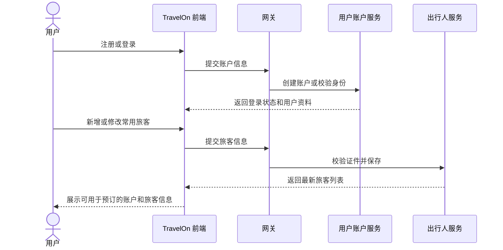

#### BS-02 酒店查询与住宿预订

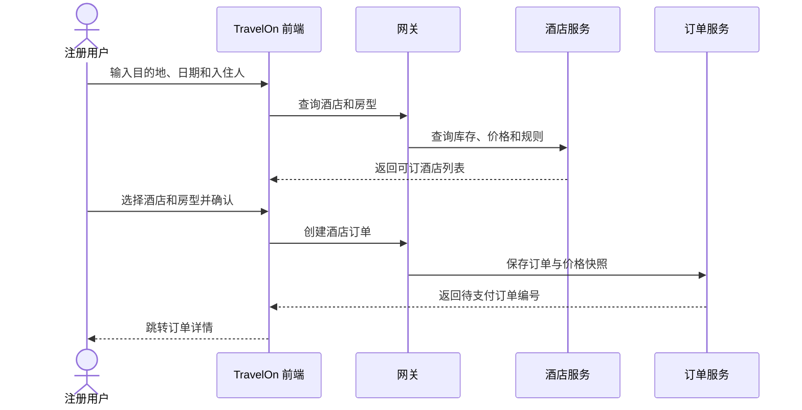

#### BS-03 机票查询与机票预订

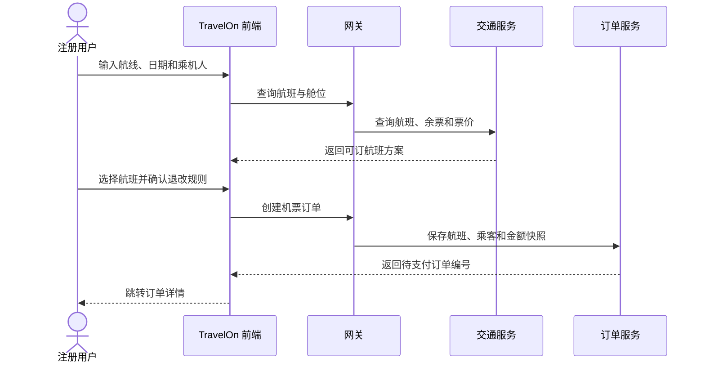

#### BS-04 火车票查询与火车票预订

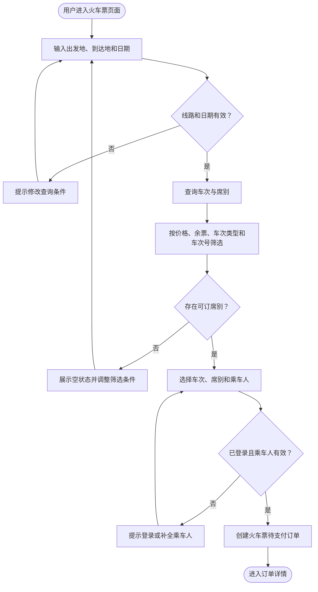

#### BS-05 订单支付与售后处理

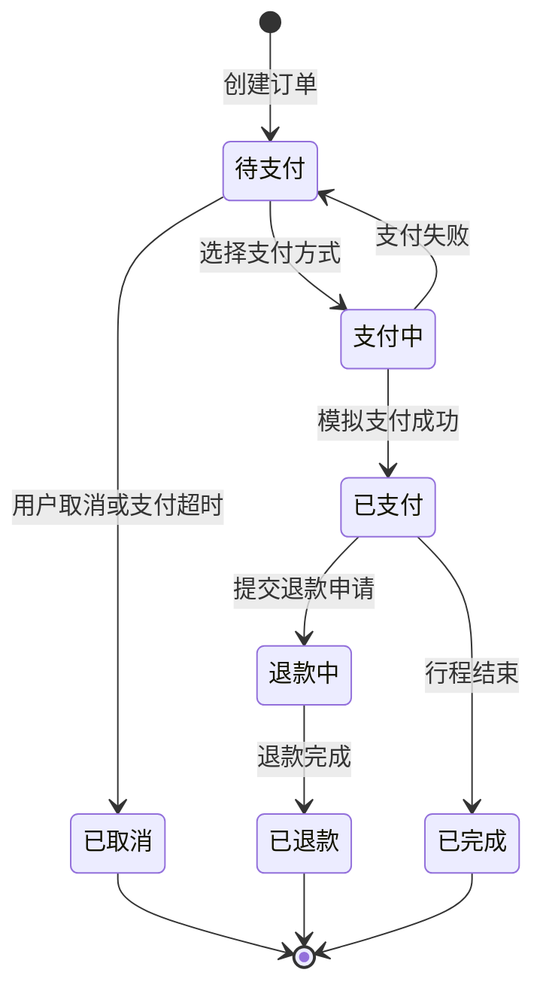

#### BS-06 统一订单与旅行时间线管理

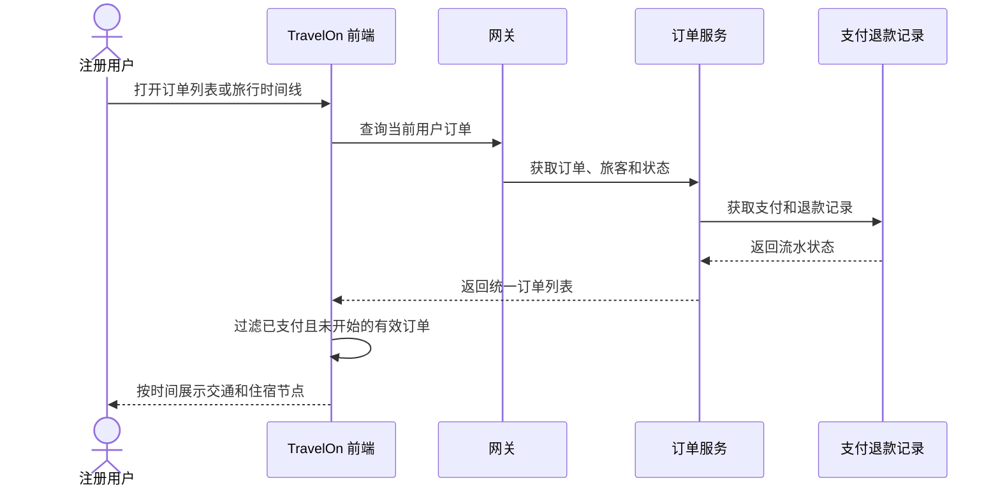

#### BS-07 社区内容分享与互动

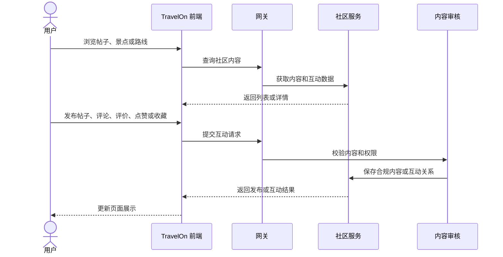

#### BS-08 AI 行程规划与版本管理

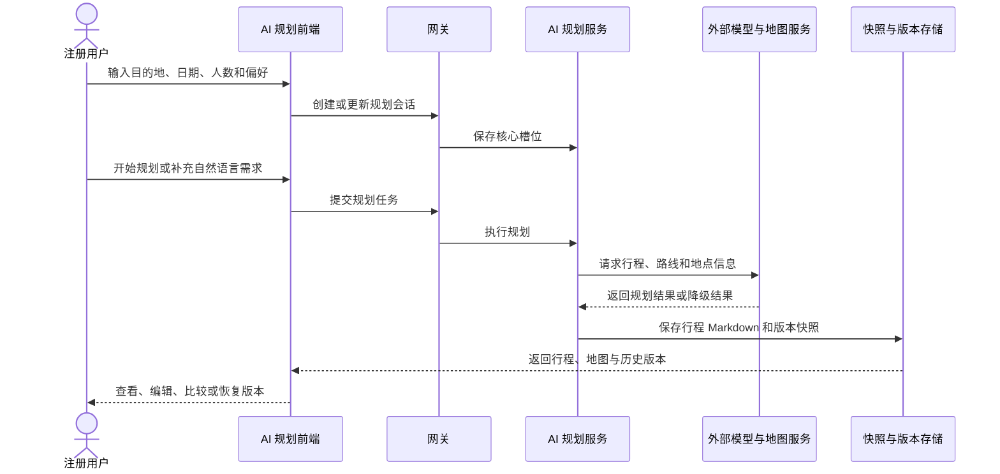

## 4 合格性规定
本章定义第3章各项需求的合格性方法及验收判定标准。合格性方法分为以下四类：演示
（D），指运行系统对应功能，通过前台或后台界面直接观察操作结果，无需专用测试设备或额
外数据分析；测试（T），指通过接口调用、功能测试用例执行等方式采集数据，验证功能行为
和返回结果是否符合预期；分析（A），指对测试结果、日志记录或统计数据进行处理与推断，
验证性能指标或数据一致性；审查（I），指对代码、文档、数据库记录或配置进行可视化检
查，确认是否符合规范要求。

| 序号 | 对应需求编号 | 验收项 | 合格性方法 | 验收判定标准 |
|---|---|---|---|---|
| 1 | REQ-FUN-030 | 账户与常用旅客 | D+T | 可注册或登录，修改资料和新增常用旅客后，账户中心展示最新信息。 |
| 2 | REQ-FUN-008 至 REQ-FUN-010 | 酒店查询与订单创建 | D+T | 按目的地、日期、价格或评分筛选后展示酒店；选择房型与入住人后成功创建待支付订单。 |
| 3 | REQ-FUN-005 至 REQ-FUN-007 | 机票查询与订单创建 | D+T | 输入航线和日期后展示航班、舱位、价格和余票；确认规则后可创建待支付订单。 |
| 4 | REQ-FUN-011 至 REQ-FUN-013 | 火车票查询与订单创建 | D+T | 可按车次类型、车次号和席别筛选；余票不足或临近发车时不可继续预订。 |
| 5 | REQ-FUN-023、REQ-FUN-031 | 统一订单与旅行时间线 | D+T | 订单列表和详情正确展示；时间线仅展示已支付且尚未开始的有效订单。 |
| 6 | REQ-FUN-024 | 模拟支付 | D+T | 使用钱包余额或银联卡完成模拟支付后，订单状态与支付流水一致。 |
| 7 | REQ-FUN-025、REQ-FUN-026 | 取消与退款 | D+T | 未支付订单可取消；已支付订单可进入退款流程，并展示退款记录和状态。 |
| 8 | REQ-FUN-028、REQ-FUN-029 | 社区内容与互动 | D+T | 登录后可发布或互动；未登录、权限不足或内容校验失败时得到明确提示。 |
| 9 | REQ-FUN-017 至 REQ-FUN-019 | AI 行程规划与快照 | D+T | 填写核心槽位后可创建会话并获得行程或降级结果；可查看历史快照或恢复版本。 |
| 10 | REQ-DATA-001、REQ-SEC-001 | 密码与高风险操作安全 | I+D | 密码不以明文存储；支付、退款等高风险操作存在身份或实名信息校验。 |
| 11 | REQ-DATA-007、REQ-INT-007 | 输入与接口校验 | T | 提交非法输入时前端阻止或后端返回错误码与中文提示。 |
| 12 | REQ-OPS-005 至 REQ-OPS-008 | 异常处理 | D+T | 网络、服务或数据服务异常时页面不白屏，并给出可重试的中文提示。 |
| 13 | REQ-CON-004、REQ-IF-009 | 页面适配 | D | 在主流 PC 浏览器和不低于 1366 x 768 分辨率下，核心元素无错位或遮挡。 |
| 14 | REQ-ENV-001 至 REQ-ENV-010、REQ-DEL-009 | 部署与运行环境 | I+D | 按 README、部署文档或 Docker Compose 启动后，前端、网关、数据库和核心服务可访问。 |

## 5 需求可追踪性

本章建立第 3 章 CSCI 需求与系统级需求之间的双向可追踪关系，确保每项系统需求均有对应
的软件需求支撑，每项软件需求均可追溯到其来源的系统需求。

### 5.1 系统需求定义

| 系统需求 ID | 系统需求描述 |
|---|---|
| SYS-01 | 提供账户、常用旅客、酒店、机票和火车票的一站式查询与预订能力。 |
| SYS-02 | 提供清晰的查询结果、价格信息和筛选排序能力。 |
| SYS-03 | 提供统一订单、模拟支付、取消退款和旅行时间线管理能力。 |
| SYS-04 | 提供社区内容分享互动与 AI 行程规划、快照版本管理能力。 |
| SYS-05 | 支持课程演示环境下的部署、运行、异常处理和交付验证。 |
| SYS-06 | 满足账户、订单和个人信息的基本安全与隐私保护要求。 |

### 5.2 正向追踪（CSCI 需求到系统需求）

| CSCI 需求 | 追踪到系统需求 | 说明 |
|---|---|---|
| REQ-FUN-001 至 REQ-FUN-004、REQ-FUN-020 | SYS-02 | 聚合查询、排序、性能目标、价格明细和查询价格更新时间展示。 |
| REQ-FUN-005 至 REQ-FUN-013 | SYS-01、SYS-02 | 酒店、机票和火车票查询、筛选与预订。 |
| REQ-FUN-014 至 REQ-FUN-016、REQ-FUN-021、REQ-FUN-022 | SYS-01、SYS-02 | 旅游套餐和优惠能力的 P2 兼容或后续扩展。 |
| REQ-FUN-030 | SYS-01 | 账户资料和常用旅客支撑后续预订。 |
| REQ-FUN-023 至 REQ-FUN-027、REQ-FUN-031 | SYS-03 | 统一订单、模拟支付、取消退款、行中提醒和时间线。 |
| REQ-FUN-017 至 REQ-FUN-019、REQ-FUN-028、REQ-FUN-029 | SYS-04 | AI 规划、版本管理和社区互动。 |
| REQ-ENV-001 至 REQ-ENV-010、REQ-OPS-001 至 REQ-OPS-008、REQ-DEL-009 | SYS-05 | 部署、运行、异常恢复和交付验证。 |
| REQ-DATA-001、REQ-DATA-005、REQ-DATA-007、REQ-SEC-001 至 REQ-SEC-006 | SYS-06 | 账户、订单与个人信息安全。 |

### 5.3 反向追踪（系统需求到 CSCI 需求）

| 系统需求 ID | 覆盖的 CSCI 需求 |
|---|---|
| SYS-01 | REQ-FUN-005 至 REQ-FUN-016、REQ-FUN-030 |
| SYS-02 | REQ-FUN-001 至 REQ-FUN-005、REQ-FUN-008、REQ-FUN-011、REQ-FUN-020 至 REQ-FUN-022 |
| SYS-03 | REQ-FUN-023 至 REQ-FUN-027、REQ-FUN-031、REQ-DATA-005 |
| SYS-04 | REQ-FUN-017 至 REQ-FUN-019、REQ-FUN-028、REQ-FUN-029 |
| SYS-05 | REQ-ENV-001 至 REQ-ENV-010、REQ-OPS-001 至 REQ-OPS-008、REQ-DEL-001 至 REQ-DEL-010 |
| SYS-06 | REQ-DATA-001、REQ-DATA-005、REQ-DATA-007、REQ-SEC-001 至 REQ-SEC-006 |

### 5.4 追踪维护说明

需求变更时需同步更新本章追踪矩阵。版本发布前应检查所有系统需求是否均有对应的 CSCI
需求覆盖，避免出现遗漏。追踪矩阵由项目组统一维护，确保文档与实际开发内容一致。

## 6 当前遗留与增强问题

以下内容为当前实现中仍有增强价值的条目，不作为 2026-08-25 的核心验收阻断项。

| 编号 | 问题描述 | 影响范围 | 计划解决阶段 |
|---|---|---|---|
| ENH-01 | 订单搜索和筛选能力可继续增强。 | 订单模块 | 后续迭代 |
| ENH-02 | 用户上传图片的大小限制、存储路径和清理策略需在部署环境中固化。 | 社区模块 | 后续迭代 |
| ENH-03 | 跨浏览器和移动端兼容性测试范围可扩展。 | 前端测试 | 后续迭代 |
| ENH-04 | 是否接入真实航司、酒店和铁路接口仍按课程演示范围保留为扩展项。 | 搜索与预订模块 | 后续迭代 |

## 7 注解

### 7.1 术语表

| 术语 | 含义 |
|---|---|
| CSCI | 计算机软件配置项（Computer Software Configuration Item）。 |
| SRS | 软件需求规格说明书（Software Requirements Specification）。 |
| Mermaid | 可由 Markdown 渲染器解析的文本化图表描述语言。 |

## 附录 A 对标系统清单

- [携程](https://www.ctrip.com/)
- [同程](https://www.ly.com/)
- [去哪儿](https://www.qunar.com/)
