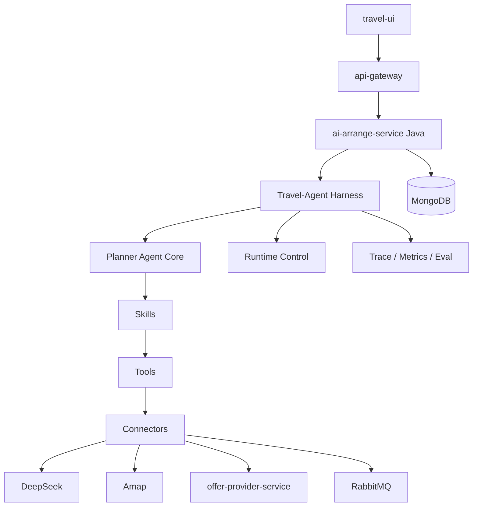

# Travel-Agent Harness 规划

## 1. 目标

当前 `ai-arrange-agent-service` 已经开始具备 Agent 雏形：能接收规划请求、调用模型、高德工具、生成 Markdown 和结构化点位，并在外部 API 缺失时降级。下一步不能只继续堆 Tool，而需要建立一套 Agent Harness，让 Travel-Agent 可以稳定、可控、可观测地运行。

Harness 的目标不是替代 Agent，而是给 Agent 提供运行框架：

- 明确 Agent 会调用哪些能力。
- 明确 Agent 如何连接外部系统。
- 明确 Agent 如何组织推理、工具调用和输出。
- 明确 Agent 如何被监控、限流、重试、回放和评估。
- 明确 Agent 如何在 Java 微服务体系中保持可控边界。

本规划将 Travel-Agent Harness 分为四层：

1. 能力层：Skills / Tools
2. 连接层：API / MCP / 内部服务协议
3. 构建层：Prompt / SDK / 编排逻辑
4. 运行管控层：Runtime / State / Observability / Evaluation

## 2. 总体架构



在代码层面，Harness 可以先作为 `ai-arrange-agent-service` 内部的一组模块存在，不必一开始做成独立服务。推荐初期目录结构：

```text
ai-arrange-agent-service/
  app/
    harness/
      runtime.py
      tool_registry.py
      trace.py
      policy.py
      evaluator.py
    skills/
      itinerary_planning.py
      poi_enrichment.py
      route_optimization.py
      selection_refine.py
    tools/
      amap_tool.py
      route_tool.py
      internal_offer_tool.py
    connectors/
      deepseek_connector.py
      amap_connector.py
      offer_connector.py
```

## 3. 第一层：能力层 Skills / Tools

### 3.1 这一层解决的问题

能力层回答：

```text
Travel-Agent 会干什么？
```

Travel-Agent 的能力不应该只是“调用大模型生成文本”，而应该拆成可组合、可测试、可观测的技能和工具。

### 3.2 Tool 设计

Tool 是最小可执行能力。每个 Tool 必须有：

- 名称
- 输入 schema
- 输出 schema
- 超时时间
- 重试策略
- 错误码
- 是否允许并发
- 是否需要外部密钥
- 是否会访问内部业务数据

第一阶段工具清单：

| Tool | 作用 | 当前状态 |
| --- | --- | --- |
| `deepseek_chat_completion` | 调用 DeepSeek 生成结构化规划 | 已有初版 |
| `amap_poi_search` | 查询真实 POI、经纬度、地址、图片 | 已有初版 |
| `amap_route_plan` | 查询路线、耗时、距离、polyline | 骨架 |
| `internal_hotel_match` | 匹配内部酒店/offer | 骨架 |
| `fallback_plan_builder` | 外部 API 不可用时生成基础规划 | 已有初版 |
| `budget_estimator` | 估算预算 | 待实现 |
| `booking_candidate_detector` | 识别可预订对象 | 待实现 |

建议新增统一 Tool 描述结构：

```python
class ToolSpec:
    name: str
    description: str
    input_schema: type[BaseModel]
    output_schema: type[BaseModel]
    timeout_seconds: float
    retry_count: int
    requires_secret: bool
    side_effect: bool
```

### 3.3 Skill 设计

Skill 是多个 Tool 的组合策略。它不直接代表外部 API，而代表业务能力。

第一阶段技能清单：

| Skill | 作用 |
| --- | --- |
| `intent_recognition_skill` | 判断用户是在新增偏好、重排路线、选点、询问预算还是要求重做 |
| `core_slot_completion_skill` | 判断核心槽是否完整 |
| `city_itinerary_planning_skill` | 生成分日行程 |
| `poi_enrichment_skill` | 将地点名称转为地图点位 |
| `interactive_selection_skill` | 根据用户地图选择调整方案 |
| `failure_recovery_skill` | 降级处理 429、超时、空结果 |

长期可以把 Skill 作为可注册能力：

```text
Skill Registry
  - name
  - description
  - required_tools
  - trigger_condition
  - output_contract
```

## 4. 第二层：连接层 API / MCP / 协议

### 4.1 这一层解决的问题

连接层回答：

```text
Travel-Agent 怎么和外部世界对话？
```

Tool 本身是能力定义，Connector 才是真正连接外部系统的实现。

### 4.2 当前连接对象

| 外部对象 | 连接方式 | 用途 |
| --- | --- | --- |
| DeepSeek | OpenAI-compatible HTTP API | 意图理解、规划生成、结构化输出 |
| 高德地图 | HTTP REST API | POI、经纬度、路线、图片 |
| `offer-provider-service` | 内部 HTTP / 后续 RabbitMQ | 酒店和 offer 匹配 |
| RabbitMQ | AMQP | 第二阶段异步库存和预订联动 |
| Java `ai-arrange-service` | HTTP 内部调用 | Agent 请求入口 |
| MongoDB | 当前不直接连接 | 由 Java 统一落库 |

### 4.3 是否引入 MCP

第一阶段不建议直接引入 MCP，原因：

- 当前工具数量少，HTTP Connector 足够。
- Java 微服务已有稳定接口，MCP 会增加一层协议复杂度。
- 团队需要先验证 Agent 最小闭环和业务价值。

但可以按 MCP 思路设计 Tool Schema，让后续迁移容易：

- 所有工具输入输出结构化。
- 工具说明文档可机器读取。
- 工具执行结果必须包含状态和错误码。
- 工具不直接拼 prompt。

后续如果工具数量增加到十几个以上，或需要接入浏览器、文件、数据库、知识库、外部 SaaS，再考虑 MCP Server。

### 4.4 Connector 设计建议

每个 Connector 应统一返回：

```json
{
  "status": "SUCCESS | PARTIAL_SUCCESS | FAILED | SKIPPED",
  "data": {},
  "warnings": [],
  "latencyMs": 123,
  "retryCount": 1,
  "rawStatusCode": 200
}
```

这样 Agent 不需要理解每个外部服务的异常细节，由 Harness 统一处理。

## 5. 第三层：构建层 Prompt / SDK / 编排逻辑

### 5.1 这一层解决的问题

构建层回答：

```text
Travel-Agent 怎么被搭出来，怎么组织工作？
```

### 5.2 Prompt 策略

Travel-Agent 的系统 Prompt 应分为几类：

| Prompt | 作用 |
| --- | --- |
| `role_prompt` | 定义它是行前旅游规划 Agent |
| `policy_prompt` | 定义安全边界、数据边界、不可做事项 |
| `output_contract_prompt` | 强制输出 JSON 结构 |
| `tool_selection_prompt` | 指导什么时候调用工具 |
| `style_prompt` | 控制面向用户的语言风格 |

目前 DeepSeek 调用里已经有基础 JSON 输出约束，但还需要进一步拆分 prompt，避免一个超长字符串难维护。

### 5.3 Agent Loop

第一阶段不建议做复杂无限循环。推荐有限状态流程：

```text
1. Validate input
2. Recognize intent
3. Select required skills
4. Execute tools with timeout
5. Ask model for structured plan
6. Validate output schema
7. Repair or fallback
8. Return response to Java
```

每一轮最多允许固定次数的模型调用和工具调用，例如：

```text
max_model_calls_per_turn = 1
max_tool_calls_per_turn = 5
max_total_runtime_seconds = 120
```

这样可控性比“让模型自己不断决定下一步”更高，适合当前微服务项目。

### 5.4 是否使用 LangGraph / AutoGen

当前阶段不建议引入复杂框架。原因：

- 当前是单 Agent + 少量工具。
- Java 接入和业务闭环比多 Agent 协作更优先。
- 框架会引入状态机、依赖、调试成本。

建议先自研轻量 Harness，后续满足以下条件再考虑 LangGraph：

- 需要多 Agent 协作。
- 需要复杂分支工作流。
- 需要可视化状态图。
- Tool 超过 15 个并且依赖关系复杂。

## 6. 第四层：运行管控层 Runtime / State / Observability / Evaluation

### 6.1 这一层解决的问题

运行管控层回答：

```text
Travel-Agent 怎么稳定、长期、可控地运转？
```

这一层是 Harness 的核心。

### 6.2 Runtime 执行环境

当前 Python Agent 运行在独立 Docker 容器中。第一阶段应做到：

- Agent 服务独立容器运行。
- 不直接暴露给公网。
- 只允许 Java 服务访问。
- 外部密钥通过 `.env` 注入。
- 所有外部 HTTP 调用设置 timeout。
- 所有模型调用设置 retry 和 backoff。

后续如果引入文件读写、浏览器操作、数据库直连，再考虑更强隔离：

- 沙箱目录
- 只读挂载
- 网络访问白名单
- 工具级权限控制

### 6.3 状态与记忆

当前系统状态由 Java 和 MongoDB 管理，Python Agent 第一阶段不直接持久化状态。

短期状态：

- 当前 `AgentRunRequest`
- `latestSnapshot`
- `history`
- `selectedPlaceIds`
- 本轮 `toolCalls`

长期状态：

- 仍存储在 Java 管理的 MongoDB：
  - `planner_conversations`
  - `planner_messages`
  - `planner_snapshots`

后续可增加用户偏好记忆：

```text
planner_user_preferences
  - userId
  - preferredTravelStyle
  - preferredHotelArea
  - budgetLevel
  - foodPreference
  - avoidKeywords
  - updatedAt
```

是否由 Python 直接维护长期记忆，需要后续讨论。

### 6.4 Hooks / Middleware

Harness 应在关键节点插入 Hook：

| Hook | 触发点 | 用途 |
| --- | --- | --- |
| `before_agent_run` | 每轮开始 | 校验输入、生成 traceId |
| `before_tool_call` | 工具调用前 | 权限检查、限流、参数审计 |
| `after_tool_call` | 工具调用后 | 记录耗时、结果、错误 |
| `before_model_call` | 模型调用前 | token 预算、限流 |
| `after_model_call` | 模型调用后 | 记录状态、检查 JSON |
| `before_response` | 返回 Java 前 | schema 校验、脱敏、降级 |

第一阶段可以先实现 trace 记录和错误包装，不必一次性做完整中间件体系。

### 6.5 可观测性

每轮 Agent 执行应生成结构化轨迹：

```json
{
  "traceId": "uuid",
  "conversationId": "uuid",
  "userId": "uuid",
  "intent": "PLAN_CITY_ITINERARY",
  "model": "deepseek-v4-pro",
  "toolCalls": [
    {
      "tool": "amap_poi_search",
      "status": "SUCCESS",
      "latencyMs": 430,
      "retryCount": 0
    }
  ],
  "warnings": [],
  "startedAt": "2026-05-14T10:00:00Z",
  "finishedAt": "2026-05-14T10:00:03Z"
}
```

初期可直接打印 JSON 日志，后续再接入：

- Prometheus / Grafana
- ELK / OpenSearch
- OpenTelemetry
- MongoDB trace collection

### 6.6 评估优化

Travel-Agent 需要可持续评估，不然 prompt 和 tool 越改越不可控。

第一阶段评估指标：

| 指标 | 说明 |
| --- | --- |
| `schema_valid_rate` | Agent 返回结构是否符合 Java DTO |
| `markdown_non_empty_rate` | Markdown 是否有效 |
| `poi_enrichment_rate` | 点位是否补到经纬度 |
| `fallback_rate` | 降级发生比例 |
| `model_429_rate` | 模型限流比例 |
| `avg_latency_ms` | 单轮平均耗时 |
| `tool_error_rate` | 工具失败比例 |

后续可增加人工评分：

- 行程是否合理
- 点位是否真实
- 路线是否绕路
- 是否符合用户偏好
- 是否可预订联动

## 7. 第一阶段落地范围

第一阶段 Harness 不追求复杂，而追求可控闭环。

建议实现：

- `ToolSpec`
- `ToolRegistry`
- `AgentTrace`
- `RuntimeConfig`
- `before/after tool call` 日志
- 统一 `ToolResult`
- 统一 `warnings`
- 模型调用 retry/backoff 保留
- API 响应 schema 校验保留

暂不实现：

- MCP Server
- LangGraph
- 多 Agent
- 浏览器自动操作
- Python 直连 MongoDB 写状态
- Python 直接面对前端 WebSocket

## 8. 后端实现任务草案

### 8.1 Python Harness 模块

- 新增 `app/harness/tool_spec.py`
- 新增 `app/harness/tool_registry.py`
- 新增 `app/harness/tool_result.py`
- 新增 `app/harness/runtime.py`
- 新增 `app/harness/trace.py`
- 新增 `app/harness/policy.py`
- 将现有 `amap_tool`、`route_tool`、`internal_offer_tool` 接入 ToolRegistry。
- 将 DeepSeek 调用也包装为 Tool 或 Connector。
- 每次 `/agent/planner/run` 生成 `traceId`。
- 响应中增加可选 `traceId` 字段，便于 Java 记录。

### 8.2 Java 接入准备

- Java 调用 Python Agent 时传入 `conversationId`、`userId`。
- Java 保存快照时保存 `traceId`。
- Java WebSocket 错误里带上 `traceId`，方便排查。
- Java 保持 MongoDB 为唯一状态源。

### 8.3 运维与配置

新增配置建议：

```properties
AGENT_MAX_TOOL_CALLS_PER_TURN=5
AGENT_MAX_MODEL_CALLS_PER_TURN=1
AGENT_MAX_RUNTIME_SECONDS=120
AGENT_TRACE_ENABLED=true
AGENT_TOOL_TIMEOUT_SECONDS=10
AGENT_LOG_LEVEL=INFO
```

## 9. 需要继续讨论的问题

以下问题会影响 Harness 的边界：

1. Python Agent 是否允许直接访问内部数据库，还是必须只通过 Java / 内部服务接口？
2. Trace 最终存在日志里即可，还是要落 MongoDB 形成可回放记录？
3. 是否需要为每个工具做权限白名单，例如第一阶段只允许地图和模型工具？
4. 后续是否要接 MCP，还是保持内部 Tool Registry 即可？
5. 是否需要多模型路由，例如规划用 DeepSeek，结构化校验用更便宜模型？
6. 用户长期偏好记忆应归 Java 管理，还是 Agent 服务管理？
7. 是否要在前端展示“AI 调用了哪些工具”，还是只用于后端排查？

## 10. 当前建议

当前最稳妥的路线是：

```text
第一步：轻量 Harness
  ToolRegistry + Trace + RuntimePolicy + 统一 ToolResult

第二步：Java 接入 Python Agent
  保持前端协议不变，Java 统一落库

第三步：工具增强
  高德路线、内部酒店匹配、预算估算

第四步：观测和评估
  traceId、指标、失败样本、人工评分

第五步：再评估是否引入 MCP / LangGraph / 多 Agent
```

因此，短期不建议马上引入重型 Agent 框架。我们应该先把 Harness 的关键骨架做实：工具注册、执行管控、trace、降级和 schema 校验。这些能力会直接提升当前 Travel-Agent 的稳定性，也不会破坏现有 Java 微服务边界。
