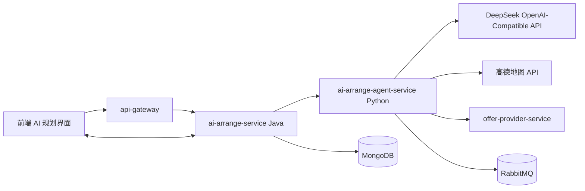

# AI 行前规划 Agent 设计说明书

## 1. 背景与目标

当前 `ai-arrange-service` 已经具备行前规划的基础能力：通过 REST 创建会话，通过 WebSocket 接收用户消息并流式返回 AI 文本，通过 MongoDB 保存会话、消息和版本快照。现有实现本质上仍以“调用模型 API 生成结果”为主，缺少可组合的工具调用、任务拆解、外部数据校验和失败降级能力。

本设计拟新增一个独立的 Python Agent 服务，使 AI 模块从“模型调用层”升级为“可调用工具和技能的规划 Agent”。Java 服务继续作为业务入口，Python 服务负责推理、工具编排和结构化规划生成。

设计目标如下：

- 保持 `ai-arrange-service` 与 Agent 能力解耦。
- 支持高德地图、内部 offer、路线、预算、快照生成等工具调用。
- 支持多轮对话下的意图识别、用户偏好吸收和交互式选点。
- 输出稳定的 Markdown、地图点位 JSON、路线 JSON 和下一步问题。
- 对 DeepSeek 429、超时、工具失败等情况提供可控降级。
- 为第二阶段“一键预订”和第三阶段“AI 伴游”预留接口。

## 2. 总体架构

新增服务名建议为：

```text
ai-arrange-agent-service
```

推荐使用 Python + FastAPI 实现。系统整体关系如下：



职责划分：

| 模块 | 职责 |
| --- | --- |
| `api-gateway` | 对外统一入口，转发 REST 与 WebSocket 请求 |
| `ai-arrange-service` | 会话管理、WebSocket 协议、MongoDB 落库、版本快照、前端推送 |
| `ai-arrange-agent-service` | Agent 推理、工具调用、技能编排、结构化规划生成 |
| DeepSeek | 语言理解、规划生成、结构化总结 |
| 高德地图 | POI 查询、经纬度补全、地址补全、图片补全、路线辅助 |
| `offer-provider-service` | 内部酒店和 offer 匹配，为后续一键预订做准备 |
| RabbitMQ | 第二阶段用于异步库存、价格和预订卡片查询 |
| MongoDB | 仍由 Java 服务统一保存会话、消息、快照 |

## 3. 核心设计原则

1. Java 服务不直接承载复杂 Agent 逻辑，只作为业务状态层和接口层。
2. Python Agent 不直接面向前端，避免前端同时对接两套实时协议。
3. Python Agent 第一阶段不直接写 MongoDB，由 Java 服务统一落库，保证快照版本一致。
4. Agent 工具必须有明确输入、输出、超时和错误结构，不能把异常散落到 prompt 文本中。
5. Agent 输出必须是可解析结构，不能只返回自然语言。
6. 外部 API 限流、超时、空结果必须降级，不能阻断整个规划流程。

## 4. Agent 能力模型

Agent 由三层组成：

| 层级 | 说明 |
| --- | --- |
| Planner | 判断当前用户意图，决定下一步执行哪些工具或技能 |
| Skill | 面向业务目标的能力组合，例如“城市行程规划”“点位补全”“路线优化” |
| Tool | 具体可执行函数，例如高德 POI 查询、内部酒店匹配、预算估算 |

### 4.1 Tool 设计

| Tool 名称 | 功能 | 输入 | 输出 |
| --- | --- | --- | --- |
| `amap_poi_search` | 查询景点、餐厅、商圈、酒店等 POI | `city`、`keywords`、`types` | 名称、地址、经纬度、`amapPoiId`、图片 |
| `amap_route_plan` | 查询两点之间路线 | 起点、终点、交通方式 | 距离、耗时、路线摘要、`polyline` |
| `internal_hotel_match` | 匹配内部酒店或 offer | 城市、酒店名、区域、日期、人数 | `internalOfferId`、价格、库存状态 |
| `budget_estimator` | 估算旅行预算 | 人数、天数、城市、偏好 | 预算区间和分项估算 |
| `itinerary_markdown_writer` | 生成 Markdown 行程 | 行程结构、点位、路线 | Markdown 文本 |
| `snapshot_builder` | 生成结构化快照 | Markdown、点位、路线、选点 | 快照 JSON 草案 |
| `booking_candidate_detector` | 识别可预订对象 | Markdown、点位列表 | 酒店/offer 候选项 |
| `fallback_plan_builder` | 降级生成基础规划 | 核心槽位、用户消息 | 不依赖外部 API 的基础规划 |

### 4.2 Skill 设计

| Skill 名称 | 说明 |
| --- | --- |
| `intent_recognition_skill` | 识别用户是新增偏好、调整路线、选择地点、询问预算还是要求重做 |
| `core_slot_completion_skill` | 检查城市、日期、人数是否完整，并给出下一步问题 |
| `city_itinerary_planning_skill` | 根据城市、日期、人数和偏好生成分日行程 |
| `poi_enrichment_skill` | 将 AI 推荐地点转成真实地图点位 |
| `route_optimization_skill` | 根据经纬度和时间安排优化访问顺序 |
| `interactive_selection_skill` | 根据用户已选地点重排方案 |
| `hotel_booking_link_skill` | 将酒店关键词匹配内部 offer，预留一键预订 |
| `failure_recovery_skill` | 处理 429、超时、无结果、工具异常等情况 |

## 5. 业务流程

### 5.1 首次生成规划

1. 前端收集固定槽位：`city`、`travelStartDate`、`peopleCount`，可选 `travelEndDate`、预算、风格等。
2. 前端调用 `POST /ai-arrange/api/conversations` 创建会话。
3. 前端建立 `/ai-arrange/ws/planner` WebSocket 连接。
4. 用户发送 `PLANNER_CHAT_SEND`。
5. Java 服务读取会话、历史消息、最新快照和选点状态。
6. Java 服务调用 Python Agent 的 `/agent/planner/run`。
7. Python Agent 识别意图并调用工具。
8. Python Agent 返回结构化结果。
9. Java 服务保存 `PlannerMessage` 与 `PlannerSnapshot`。
10. Java 服务通过 WebSocket 推送 `PLANNER_CHAT_STREAM` 和 `PLANNER_DATA_REFRESH`。

### 5.2 用户地图选点后重排

1. 用户在地图上选择或取消地点。
2. 前端发送 `PLANNER_PLACE_SELECTION` 或调用 `PUT /selection`。
3. Java 服务更新 `selectedPlaceIds`。
4. Java 服务将选点状态传给 Python Agent。
5. Agent 使用 `interactive_selection_skill` 与 `route_optimization_skill` 重排方案。
6. Java 服务生成新版本快照并推送 `PLANNER_DATA_REFRESH`。

### 5.3 预订联动预留

第一阶段只生成 `internalOfferId` 候选，不直接下单。第二阶段流程为：

1. Agent 通过 `booking_candidate_detector` 识别酒店或 offer 候选。
2. Agent 通过 `internal_hotel_match` 或 RabbitMQ 查询实时库存和价格。
3. Java 服务将可订卡片作为 `PLANNER_DATA_REFRESH` 的扩展字段推送给前端。
4. 用户点击后跳转现有预订链路。

## 6. Python Agent 服务接口

### 6.1 执行规划接口

```http
POST /agent/planner/run
Content-Type: application/json
```

请求体：

```json
{
  "conversationId": "00000000-0000-0000-0000-000000000010",
  "userId": "00000000-0000-0000-0000-000000000001",
  "coreSlots": {
    "city": "上海",
    "travelStartDate": "2026-06-01",
    "travelEndDate": "2026-06-03",
    "peopleCount": 2,
    "budget": "中等",
    "travelStyle": "轻松",
    "accommodationPreference": "外滩附近",
    "transportPreference": "地铁和步行",
    "notes": "少走路",
    "mustVisitKeywords": ["博物馆", "江景"],
    "avoidKeywords": ["夜市"]
  },
  "userMessage": "我想要轻松一点，喜欢博物馆和江景",
  "selectedPlaceIds": [],
  "latestSnapshot": {
    "version": 1,
    "markdown": "",
    "places": [],
    "routes": []
  },
  "history": []
}
```

响应体：

```json
{
  "status": "SUCCESS",
  "assistantText": "我会按轻松节奏安排上海 3 日行程，并优先选择博物馆、江景和低步行强度路线。",
  "title": "上海三日轻松文化行",
  "summary": "以博物馆、江景、低强度动线为主。",
  "markdown": "# 上海三日轻松文化行\n\n...",
  "nextQuestion": "你更倾向住在外滩附近，还是人民广场附近？",
  "places": [],
  "routes": [],
  "toolCalls": [
    {
      "tool": "amap_poi_search",
      "status": "SUCCESS",
      "latencyMs": 430
    }
  ],
  "warnings": []
}
```

### 6.2 健康检查接口

```http
GET /agent/health
```

响应体：

```json
{
  "status": "UP",
  "modelProvider": "deepseek",
  "amapConfigured": true
}
```

### 6.3 流式接口预留

第一阶段不要求 Python 服务直接对前端流式输出，仍由 Java 服务统一转 WebSocket。后续如需 Agent 原生流式能力，可增加：

```http
POST /agent/planner/stream
Accept: text/event-stream
```

## 7. Java 与 Python 的集成方式

Java 服务新增内部客户端：

```text
PlannerAgentClient
```

职责：

- 构造 Agent 请求。
- 设置超时、重试和降级。
- 调用 Python 服务。
- 将 Agent 响应转换为 `PlannerSnapshotDraft`。
- 将错误转为可推送的 `PLANNER_ERROR` 或本地降级结果。

建议配置项：

```properties
ai.arrange.agent.enabled=${AI_AGENT_ENABLED:true}
ai.arrange.agent.base-url=${AI_AGENT_BASE_URL:http://ai-arrange-agent:8090}
ai.arrange.agent.timeout-seconds=${AI_AGENT_TIMEOUT_SECONDS:120}
ai.arrange.agent.retry-count=${AI_AGENT_RETRY_COUNT:2}
ai.arrange.agent.fallback-enabled=${AI_AGENT_FALLBACK_ENABLED:true}
```

## 8. 错误处理与降级

针对模型或工具异常，Agent 必须返回明确状态，而不是让异常直接冒泡。

| 异常 | 处理方式 |
| --- | --- |
| DeepSeek 429 | 指数退避重试；超过次数后启用本地模板或简化规划 |
| DeepSeek 超时 | 返回不含精细 POI 的基础行程，并给出 `warnings` |
| 高德无结果 | 保留 AI 点位，标记 `source=AI` |
| 高德超时 | 跳过图片和部分坐标补全，不阻断 Markdown 生成 |
| 内部 offer 无匹配 | 不生成 `internalOfferId`，保留泛酒店建议 |
| Python Agent 不可用 | Java 服务使用现有本地规划逻辑或占位回答 |

Agent 响应中的异常建议统一放入：

```json
{
  "warnings": [
    {
      "code": "AMAP_TIMEOUT",
      "message": "部分地点未能完成高德地图补全"
    }
  ]
}
```

## 9. 数据结构

### 9.1 Agent 请求结构

| 字段 | 类型 | 说明 |
| --- | --- | --- |
| `conversationId` | UUID | 会话 ID |
| `userId` | UUID | 用户 ID |
| `coreSlots` | Object | 城市、日期、人数、预算、偏好等 |
| `userMessage` | String | 当前用户输入 |
| `selectedPlaceIds` | UUID[] | 当前选中的地图点位 |
| `latestSnapshot` | Object | 最新快照 |
| `history` | Object[] | 历史消息 |

### 9.2 Agent 响应结构

| 字段 | 类型 | 说明 |
| --- | --- | --- |
| `status` | String | `SUCCESS`、`PARTIAL_SUCCESS`、`FAILED` |
| `assistantText` | String | 面向用户的自然语言回复 |
| `title` | String | 行程标题 |
| `summary` | String | 行程摘要 |
| `markdown` | String | Markdown 行程正文 |
| `nextQuestion` | String | 下一轮引导问题 |
| `places` | Object[] | 地图点位 |
| `routes` | Object[] | 路线片段 |
| `toolCalls` | Object[] | 工具调用记录 |
| `warnings` | Object[] | 可恢复异常 |

### 9.3 点位结构

与 Java 当前 `PlannerPlaceSuggestion` 对齐：

| 字段 | 说明 |
| --- | --- |
| `placeId` | 系统生成的点位 ID |
| `name` | 地点名称 |
| `type` | `SCENIC`、`RESTAURANT`、`HOTEL`、`TRANSPORT`、`SHOPPING`、`ACTIVITY`、`OTHER` |
| `source` | `AI`、`AMAP`、`INTERNAL_OFFER` |
| `internalOfferId` | 内部 offer ID，可为空 |
| `amapPoiId` | 高德 POI ID，可为空 |
| `latitude` | 纬度 |
| `longitude` | 经度 |
| `address` | 地址 |
| `imageUrl` | 图片地址 |
| `description` | 描述 |
| `selected` | 是否被用户选择 |
| `tags` | 标签 |

## 10. 后端实现任务

### 10.1 Python Agent 服务实现任务

- 新建 `ai-arrange-agent-service` 服务目录。
- 使用 FastAPI 搭建基础 HTTP 服务。
- 实现 `/agent/health` 健康检查接口。
- 实现 `/agent/planner/run` 规划执行接口。
- 定义 Pydantic 请求和响应模型。
- 实现 DeepSeek OpenAI-compatible 客户端。
- 实现 429 指数退避、超时控制和错误包装。
- 实现 `amap_poi_search` 工具。
- 实现 `amap_route_plan` 工具的接口骨架，第一阶段可先返回空路线。
- 实现 `internal_hotel_match` 工具骨架，第一阶段可返回未匹配。
- 实现 `itinerary_markdown_writer`。
- 实现 `snapshot_builder`。
- 实现 `failure_recovery_skill`。
- 增加 Python 单元测试，覆盖工具成功、工具失败、429 降级、结构化输出校验。
- 编写 Dockerfile。
- 在 `docker-compose.yml` 中新增 `ai-arrange-agent` 服务。
- 将 `DEEPSEEK_API_KEY`、`AMAP_API_KEY`、`AI_AGENT_*` 环境变量接入容器。

### 10.2 Java `ai-arrange-service` 改造任务

- 新增 `PlannerAgentClient`，调用 Python Agent。
- 新增 Agent 请求/响应 DTO。
- 在 `PlannerConversationService.handleChatMessage` 中接入 Agent 调用。
- 保留现有模型调用逻辑作为 fallback。
- 将 Agent 响应转换为 `PlannerSnapshot`。
- 将 Agent 的 `assistantText` 保存为 `PlannerMessage`。
- 将 Agent 的 `markdown`、`places`、`routes` 保存为快照。
- 继续通过现有 WebSocket 推送 `PLANNER_CHAT_STREAM` 与 `PLANNER_DATA_REFRESH`。
- 增加配置项：`AI_AGENT_ENABLED`、`AI_AGENT_BASE_URL`、`AI_AGENT_TIMEOUT_SECONDS`。
- 增加 Java 单元测试，覆盖 Agent 成功、Agent 不可用、Agent 返回部分成功、选点重排。
- 更新 `ai-arrange-service/README.md` 中的 Agent 集成说明。

### 10.3 网关与部署任务

- 第一阶段 Python Agent 仅供 Java 内部调用，不通过 `api-gateway` 对外暴露。
- 在 `docker-compose.yml` 中配置 Java 服务通过 `http://ai-arrange-agent:8090` 访问 Agent。
- 后续如需要调试，可临时暴露 Agent 端口，但生产环境不建议直接暴露。
- 确保 `.env` 中包含：

```properties
DEEPSEEK_API_KEY=...
AMAP_API_KEY=...
AI_AGENT_ENABLED=true
AI_AGENT_BASE_URL=http://ai-arrange-agent:8090
```

### 10.4 测试与验收任务

- 使用 PowerShell 烟雾脚本创建会话。
- 发送一次 `PLANNER_CHAT_SEND`。
- 验证 Java 服务能成功调用 Python Agent。
- 验证返回 `PLANNER_CHAT_STREAM`。
- 验证返回 `PLANNER_DATA_REFRESH`。
- 验证 MongoDB 中新增 `planner_messages`。
- 验证 MongoDB 中新增 `planner_snapshots`。
- 关闭 DeepSeek Key 后验证 fallback 可用。
- 模拟 429 响应后验证重试与降级。
- 模拟高德超时后验证 Markdown 仍可生成。

## 11. 分阶段落地计划

| 阶段 | 目标 | 产出 |
| --- | --- | --- |
| 阶段一 | Agent 服务最小闭环 | Python 服务、DeepSeek 调用、高德 POI、结构化响应、Java 接入 |
| 阶段二 | 工具增强 | 路线优化、预算估算、内部酒店匹配 |
| 阶段三 | 预订联动 | RabbitMQ 查询库存、生成一键预订卡片 |
| 阶段四 | AI 伴游 | 旅行中实时位置、讲解、提醒和动态调整 |

## 12. 当前结论

本功能可以用 Python 实现，而且适合以独立服务形式实现。推荐后端最终结构为：

```text
前端
 -> api-gateway
 -> ai-arrange-service(Java: REST / WebSocket / MongoDB / 快照)
 -> ai-arrange-agent-service(Python: Agent / Tool / Skill)
 -> DeepSeek + 高德 + 内部服务
```

第一阶段的后端实现重点不是更换前端协议，而是在 Java 服务内部接入 Python Agent，让现有 WebSocket、MongoDB 快照和前端交互保持稳定，同时逐步引入工具调用能力。
