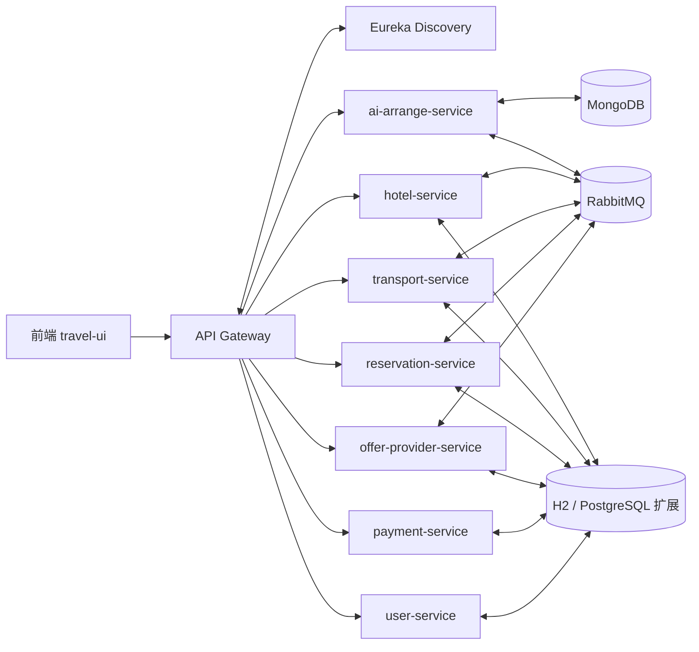

# 软件概要设计说明书

[Toc]

# 1. 引言

## 1.1 编写目的

本文档用于说明智能化出行微服务系统的总体架构、功能划分、接口设计、数据设计、部署方式和测试方式，作为后续开发、联调、验收和维护的依据。预期读者包括项目组开发人员、测试人员、运维人员以及课程验收相关人员。

## 1.2 背景

a．待开发软件系统名称：智能化出行微服务系统。

b．任务提出者：课程实验任务；开发者：26NULLptr 项目组；用户：旅游出行用户、运营维护人员与测试人员；运行计算站：支持 Docker 的开发/测试服务器与本地开发机。

## 1.3 定义

• API Gateway：统一入口，负责路由转发与 WebSocket 代理。
• Eureka：服务注册与发现中心。
• RabbitMQ：服务间异步消息总线。
• CQRS：命令和查询分离。
• Saga：跨服务事务编排模式。
• WebSocket：用于 AI 流式输出与地图数据刷新。
• DeepSeek：兼容 OpenAI 接口的模型提供方，用于规划生成。
• Amap：高德地图接口，用于 POI、经纬度和图片补充。
• Snapshot：规划版本快照，用于历史回溯与前端版本展示。

## 1.4 参考设计

• 仓库 README.md
• ai-arrange-service/README.md
• docker-compose.yml
• api-gateway/src/main/resources/application.yml
• ai-arrange-service/src/main/resources/application.properties
• ai模块参考图片/ 下的交互示意图

# 2. 系统需求概述

2.1 需求规定
输入：用户搜索条件（目的地、日期、人数等）、AI 规划对话内容、地点选择、预订请求、支付结果等。

输出：出行产品列表、预订结果、支付结果、AI 规划 Markdown 行程、地图点位与路线结构化数据、规划快照版本。

功能要求：完成“搜索 - 规划 - 选择 - 预订”的闭环能力，支持常规酒店/交通产品查询、预订编排与支付模拟，并提供行前 AI 规划服务。

性能要求：AI 规划支持流式输出以降低首包等待时间；服务拆分避免单体压力集中；地图点位与快照写入采用分离式设计以避免阻塞主对话。

## 2.2 业务目标

• 提供常规旅游产品查询与详情展示。
• 提供酒店、交通、预订、支付等业务能力。
• 提供行前智能规划服务，支持交互式制定旅行方案。
• 支持地图点位展示、地点选择和版本化行程快照。
• 为后续“规划到预订”联动预留接口。

## 2.3 运行环境

简要说明本系统运行环境：系统基于微服务架构，使用容器化部署并通过服务注册与消息中间件进行协同。

### 2.3.1 设备

• 支持 Docker 运行的通用 x86_64 服务器或开发主机。
• 具备稳定网络连接与足够磁盘用于容器镜像与数据持久化。

### 2.3.2 支持软件

• 操作系统：Windows/Linux/macOS 均可（需支持 Docker）。
• 运行时与构建：JDK 21、Maven。
• 服务发现：Eureka。
• 消息中间件：RabbitMQ。
• 数据库：MongoDB 7；业务库默认 H2，PostgreSQL 为可选扩展。
• 容器编排：Docker Compose。
• 地图与 AI：DeepSeek 兼容接口、高德地图接口。

## 2.4 设计约束

• 后端统一使用 Java 21 + Spring Boot 3.2.x。
• 必须使用 API Gateway 统一对外接口，服务间通过 Eureka 注册发现。
• 跨服务编排采用 Saga，异步解耦使用 RabbitMQ。
• AI 规划服务与预订链路解耦，保证可独立部署与扩展。

## 2.5 功能需求

系统包含以下主要服务与能力：
• api-gateway：统一入口，负责 HTTP 与 WebSocket 路由。
• discovery-service：服务注册与发现。
• hotel-service：酒店、房型、可用性与酒店预订。
• transport-service：交通产品、线路、可用性与交通预订。
• offer-provider-service：酒店 + 交通组合产品聚合。
• reservation-service：预订编排与 Saga 协调。
• payment-service：支付校验与回写（模拟）。
• user-service：用户管理。
• ai-arrange-service：行前 AI 规划、Markdown 与地图点位输出、快照版本管理。

核心处理流程：
• 常规出行闭环：查询 -> 选择 -> 预订 -> 支付 -> 回传结果。
• 行前 AI 规划闭环：固定槽收集 -> 对话规划 -> 地图选点 -> 快照刷新 -> 预订联动预留。

## 2.6 非功能需求

• 性能：流式输出、异步解耦、分离式写入降低阻塞。
• 可扩展性：AI 服务独立部署，模型与地图供应商可配置切换。
• 可用性：网关 + 注册中心统一管理；快照保证前端状态可恢复。
• 安全性：API Key 环境变量注入，生产环境禁止提交 .env。
• 可维护性：服务边界清晰，消息类型与接口约定明确。
• 异常处理：400/404/409/503 等标准化响应，WebSocket 统一错误消息。

## 2.7 系统总体架构

整体架构采用微服务 + 网关 + 注册中心 + 消息总线的方式组织。架构示意如下：

## 3 系统接口设计

### 3.2 接口设计

#### 3.2.1 用户接口

本系统为 Web 形态应用，用户通过浏览器或移动端页面完成全部操作，无专用硬件控制面板。操作设备以键盘、鼠标、触摸屏和地图交互组件为主。

用户可用的主要接口如下：

| 功能             | 语法结构                                                                      | 软件回应                                                                         |
| ---------------- | ----------------------------------------------------------------------------- | -------------------------------------------------------------------------------- |
| 创建行前规划会话 | `POST /ai-arrange/api/conversations`                                          | 返回会话 `id`、`status`、`title`、`nextQuestion`、`latestSnapshotVersion` 等信息 |
| 查询会话列表     | `GET /ai-arrange/api/conversations?userId={uuid}`                             | 返回当前用户的规划会话列表                                                       |
| 查询会话详情     | `GET /ai-arrange/api/conversations/{conversationId}?userId={uuid}`            | 返回会话当前状态、Markdown、选点结果和最新版本号                                 |
| 补充固定槽       | `PUT /ai-arrange/api/conversations/{conversationId}/core-slots`               | 更新城市、日期、人数等核心信息，并返回新的会话状态                               |
| 更新地点选择     | `PUT /ai-arrange/api/conversations/{conversationId}/selection`                | 更新用户在地图上选中的点位，并触发新快照                                         |
| 查询历史快照     | `GET /ai-arrange/api/conversations/{conversationId}/snapshots?userId={uuid}`  | 返回版本化的行程快照列表                                                         |
| 建立对话连接     | `ws(s)://<gateway>/ai-arrange/ws/planner?conversationId={uuid}&userId={uuid}` | 建立流式对话通道                                                                 |

WebSocket 消息命令如下：

- `PLANNER_CHAT_SEND`：用户发送自然语言需求，格式包含 `message` 和可选 `selectedPlaceIds`
- `PLANNER_CHAT_STREAM`：服务端逐步返回 AI 文本流
- `PLANNER_DATA_REFRESH`：服务端推送结构化数据，包括 `markdown`、`places`、`routes`、`snapshotVersion`
- `PLANNER_PLACE_SELECTION`：用户选择或取消地图点位
- `PLANNER_ERROR`：校验失败或服务异常

#### 3.2.2 与其他软件、硬件接口

本系统同外界的软件接口如下：

| 接口对象                 | 方式             | 说明                                                                           |
| ------------------------ | ---------------- | ------------------------------------------------------------------------------ |
| API Gateway              | HTTP / WebSocket | 统一入口，转发 `/ai-arrange/**` 与 `/ai-arrange/ws/**` 到 `ai-arrange-service` |
| Eureka                   | 服务注册发现     | 各微服务通过注册中心完成发现与路由                                             |
| DeepSeek 兼容模型服务    | HTTP REST        | 采用 OpenAI 兼容格式进行流式生成，支持 `deepseek-v4-pro`                       |
| 高德地图 Amap            | HTTP REST        | 用于景点、餐厅等泛点位的 POI 查询、经纬度补全与基础图片获取                    |
| MongoDB                  | 数据持久化       | 保存会话、消息、快照等规划数据                                                 |
| RabbitMQ                 | 异步消息         | 第一阶段预留，第二阶段用于与 `offer-provider-service` 做预订联动               |
| `offer-provider-service` | 内部业务接口     | 精准酒店点位优先匹配内部 `offerId`，为后续一键预订预留                         |
| `user-service`           | 内部业务接口     | 当前版本以 `userId` 传参完成归属校验，后续接入登录态                           |

硬件接口方面，本系统不依赖专用硬件设备，仅要求通用网络环境、浏览器终端及地图显示设备即可运行。

---

### 3.3 系统数据结构设计

#### 3.3.1 逻辑结构设计要点

系统主要数据结构如下：

| 数据结构 | 标识符                   | 主要字段                                                                                                                                                          | 类型与长度                                                   | 说明                             |
| -------- | ------------------------ | ----------------------------------------------------------------------------------------------------------------------------------------------------------------- | ------------------------------------------------------------ | -------------------------------- |
| 核心槽位 | `TripCoreSlots`          | `city`、`travelStartDate`、`travelEndDate`、`peopleCount`、`budget`、`travelStyle` 等                                                                             | `String`、`LocalDate`、`Integer`、`List<String>`，均为可变长 | 行前规划的输入基础               |
| 会话主表 | `PlannerConversation`    | `id`、`userId`、`status`、`coreSlots`、`title`、`currentMarkdown`、`nextQuestion`、`latestSnapshotVersion`、`selectedPlaceIds`                                    | `UUID`、`Enum`、`String`、`Text`、`List<UUID>`               | 表示一次规划会话的当前状态       |
| 消息记录 | `PlannerMessage`         | `id`、`conversationId`、`userId`、`role`、`content`、`model`、`metadata`、`createdAt`                                                                             | `UUID`、`String`、`Map`、`Instant`                           | 记录用户与 AI 的对话历史         |
| 快照记录 | `PlannerSnapshot`        | `id`、`conversationId`、`userId`、`version`、`title`、`summary`、`markdown`、`nextQuestion`、`assistantText`、`places`、`routes`、`selectedPlaceIds`、`createdAt` | `UUID`、`Integer`、`Text`、`List<...>`                       | 保存每一版规划结果               |
| 点位建议 | `PlannerPlaceSuggestion` | `placeId`、`name`、`type`、`source`、`internalOfferId`、`amapPoiId`、`latitude`、`longitude`、`address`、`imageUrl`、`description`、`selected`、`tags`            | `UUID`、`String`、`Double`、`List<String>`                   | 地图上的景点、餐厅、酒店等候选点 |
| 路线片段 | `PlannerRouteSegment`    | `fromPlaceId`、`toPlaceId`、`transportMode`、`distanceKm`、`estimatedMinutes`、`polyline`、`summary`                                                              | `UUID`、`String`、`Double`、`Integer`、`Text`                | 描述点位之间的移动关系           |
| 请求封装 | `PlannerSocketEnvelope`  | `type`、`conversationId`、`userId`、`payload`                                                                                                                     | `Enum`、`UUID`、`JsonNode`                                   | WebSocket 消息统一封装           |

数据之间的层次关系为：

- 一个 `PlannerConversation` 对应多条 `PlannerMessage`
- 一个 `PlannerConversation` 对应多份 `PlannerSnapshot`
- 一个 `PlannerSnapshot` 内嵌多条 `PlannerPlaceSuggestion` 和 `PlannerRouteSegment`
- `selectedPlaceIds` 贯穿会话和快照，用于表示用户最终确认的点位集合

#### 3.3.2 物理结构设计要点

本系统采用 MongoDB 进行物理存储，主要集合如下：

| 集合名                  | 存储对象   | 访问方式                                    | 设计考虑                         |
| ----------------------- | ---------- | ------------------------------------------- | -------------------------------- |
| `planner_conversations` | 会话主记录 | 按 `id`、`userId` 查询；按 `updatedAt` 排序 | 支持会话列表、会话详情与归属校验 |
| `planner_messages`      | 对话历史   | 按 `conversationId`、`createdAt` 查询       | 支持上下文拼接与流式对话回放     |
| `planner_snapshots`     | 版本快照   | 按 `conversationId`、`version` 查询         | 支持历史版本回溯与前端版本展示   |

物理存储特征如下：

- 存储单位为 MongoDB 文档，主键使用 `UUID`
- 文本类字段采用可变长字符串或长文本存储
- `places`、`routes`、`selectedPlaceIds` 采用数组嵌入方式，减少读取时的联表开销
- 建议对 `userId`、`conversationId`、`version` 建立检索索引，以支撑高频查询
- LLM 密钥、高德密钥等敏感信息通过环境变量注入，不落库
- 数据访问以会话归属校验为边界，避免越权读取

#### 3.3.3 数据结构与程序关系

数据结构与程序模块的对应关系如下：

| 程序模块                          | 使用的数据结构                                                                                                                      | 作用                               |
| --------------------------------- | ----------------------------------------------------------------------------------------------------------------------------------- | ---------------------------------- |
| `PlannerConversationController`   | `CreatePlannerConversationRequest`、`UpdatePlannerCoreSlotsRequest`、`UpdatePlannerSelectionRequest`、`PlannerConversationResponse` | 提供 REST 接口输入输出             |
| `PlannerWebSocketHandler`         | `PlannerSocketEnvelope`、`PlannerChatSendPayload`、`PlannerPlaceSelectionPayload`                                                   | 处理 WebSocket 收发消息            |
| `PlannerConversationService`      | `PlannerConversation`、`PlannerMessage`、`PlannerSnapshot`、`TripCoreSlots`                                                         | 组织会话生命周期与业务流程         |
| `PlannerPromptFactory`            | `PlannerConversation`、`PlannerSnapshot`、`PlannerMessage`                                                                          | 组装模型提示词与上下文             |
| `PlannerSnapshotService`          | `PlannerSnapshotDraft`、`PlannerSnapshot`、`PlannerPlaceSuggestion`、`PlannerRouteSegment`                                          | 生成版本快照并持久化               |
| `PlannerMarkdownBuilder`          | `PlannerSnapshotDraft`                                                                                                              | 将规划结果转换为 Markdown          |
| `PlannerWebSocketSessionRegistry` | 会话标识与消息载荷                                                                                                                  | 向前端推送流式文本和结构化刷新数据 |
| Repository 层                     | `PlannerConversation`、`PlannerMessage`、`PlannerSnapshot`                                                                          | 完成 MongoDB 持久化与查询          |

如果你要，我可以继续按同一风格把第 4 章和第 5 章也接着补齐。

# 4. 系统数据库设计

## 4.1 数据存储概览

| 服务                   | 数据存储                | 说明                         |
| ---------------------- | ----------------------- | ---------------------------- |
| hotel-service          | H2                      | 酒店、房型、可用性、事件数据 |
| transport-service      | H2                      | 交通、线路、可用性、事件数据 |
| offer-provider-service | H2                      | offer 聚合与查询数据         |
| reservation-service    | H2                      | 预订聚合、命令、事件         |
| payment-service        | H2                      | 支付记录与状态               |
| user-service           | H2（可扩展 PostgreSQL） | 用户数据                     |
| ai-arrange-service     | MongoDB                 | 会话、消息、版本快照         |

## 4.2 MongoDB 主要集合

• planner_conversations：id、userId、status、coreSlots、title、currentMarkdown、latestSnapshotVersion、selectedPlaceIds、createdAt、updatedAt。
• planner_messages：id、conversationId、userId、role、content、model、metadata、createdAt。
• planner_snapshots：id、conversationId、userId、version、title、summary、markdown、places、routes、selectedPlaceIds、createdAt。

# 5. 运行设计

## 5.1 运行模块组合

Docker Compose 统一编排：API Gateway、Eureka、RabbitMQ、MongoDB、各业务微服务（hotel、transport、offer、reservation、payment、user）以及 ai-arrange-service。

## 5.2 运行控制

• 启动流程由 docker compose up 统一拉起；服务启动后自动注册到 Eureka。
• 网关统一处理 REST 与 WebSocket 的路由与转发。
• RabbitMQ 负责库存同步与预订编排消息投递。
• ai-arrange-service 通过 WebSocket 推送流式文本与结构化数据。

## 5.3 运行时间

系统面向交互式场景，强调实时响应：AI 规划采用流式输出，库存与预订编排通过异步消息提升响应速度并降低耦合。
